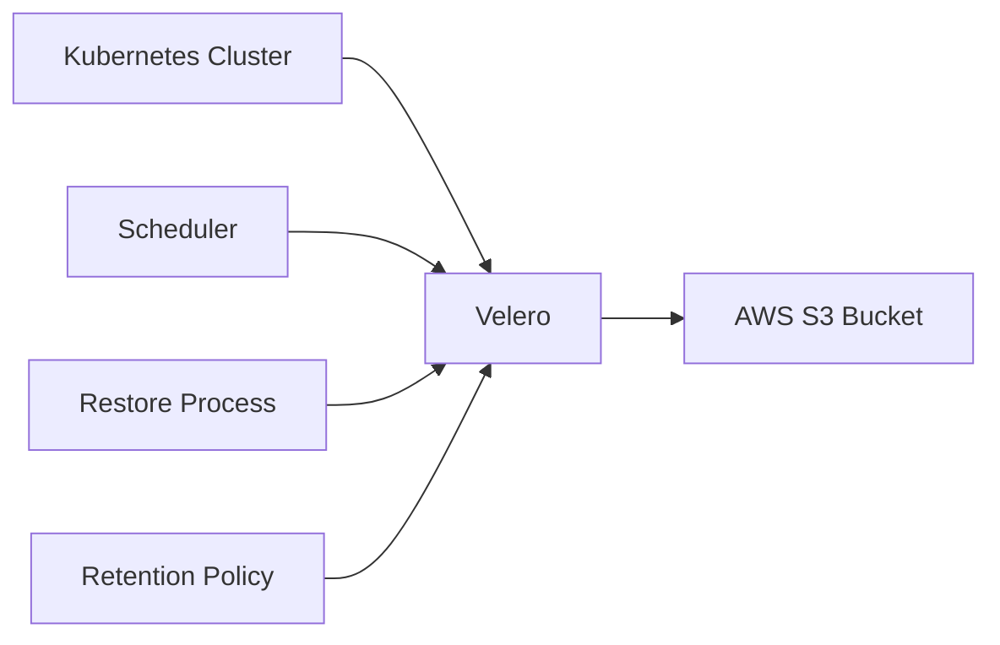

## Automated Backup and Restore System in Kubernetes

### Importance of Automated Backups

One of the critical aspects of maintaining a secure and resilient Kubernetes cluster is having an automated backup and restore system in place. This system ensures that your data and cluster configurations are regularly backed up and stored securely. In the event of a disaster, such as a hardware failure, malicious attacks, or accidental deletions, you can quickly restore your cluster to its previous state.

#### Why Automated Backups Matter

Automated backups are essential because manual backups are prone to human error and inconsistency. An automated system ensures that backups occur at regular intervals, reducing the risk of data loss. Additionally, storing backups securely helps protect against unauthorized access and potential data breaches.

#### How Automated Backups Work

An automated backup system typically involves the following steps:

1. **Backup Schedule**: Define a schedule for when backups should occur. This could be daily, weekly, or based on specific events.
2. **Backup Execution**: Use tools like Velero, Stash, or built-in Kubernetes features to execute the backup process.
3. **Storage Location**: Store the backups in a secure location, such as an encrypted S3 bucket or a dedicated backup server.
4. **Retention Policy**: Implement a retention policy to manage how long backups are kept and when old backups are deleted.

#### Example: Using Velero for Backups

Velero is a popular open-source tool for backing up and restoring Kubernetes clusters. Here’s how you can set up Velero:

```yaml
# velero-install.yaml
apiVersion: v1
kind: Namespace
metadata:
  name: velero

---
apiVersion: v1
kind: ServiceAccount
metadata:
  name: velero
  namespace: velero

---
apiVersion: rbac.authorization.k8s.io/v1
kind: ClusterRoleBinding
metadata:
  name: velero
roleRef:
  apiGroup: rbac.authorization.k8s.io
  kind: ClusterRole
  name: velero
subjects:
- kind: ServiceAccount
  name: velero
  namespace: velero

---
apiVersion: apps/v1
kind: Deployment
metadata:
  name: velero
  namespace: velero
spec:
  replicas: 1
  selector:
    matchLabels:
      app: velero
  template:
    metadata:
      labels:
        app: velero
    spec:
      serviceAccountName: velero
      containers:
      - name: velero
        image: velero/velero:v1.7.0
        args:
        - server
        - --v=4
        - --use-restic
```

To install Velero, apply the above manifest:

```bash
kubectl apply -f velero-install.yaml
```

Next, configure Velero to use your preferred storage backend, such as AWS S3:

```yaml
# velero-config.yaml
apiVersion: velero.io/v1
kind: BackupStorageLocation
metadata:
  name: aws
spec:
  provider: aws
  bucket: my-backup-bucket
  region: us-west-2
```

Apply the configuration:

```bash
velero create secret generic cloud-credentials \
  --from-literal=access-key=<your-access-key> \
  --from-literal=secret-key=<your-secret-key>

velero create bsl aws --provider aws --bucket my-backup-bucket --region us-west-2
```

Finally, create a backup:

```bash
velero backup create my-backup --include-namespaces default
```

### Network Topology Diagram

A network topology diagram can help visualize the components involved in an automated backup system:



### Common Pitfalls and How to Prevent Them

#### Pitfall: Inconsistent Backup Schedules

**Problem**: If backup schedules are inconsistent, important data might be lost between backups.

**Prevention**: Use a consistent scheduling mechanism, such as a cron job, to ensure backups occur at regular intervals.

#### Pitfall: Insufficient Storage Security

**Problem**: Storing backups in an insecure location can lead to unauthorized access and data breaches.

**Prevention**: Encrypt backups and store them in a secure, encrypted location. Use IAM roles and permissions to restrict access to the storage location.

### Real-World Example: Recent Breach

In 2021, a major cloud provider experienced a breach where unauthorized users gained access to customer data stored in S3 buckets. This highlights the importance of securing backup locations and ensuring proper access controls.

### How to Detect and Prevent Backup Issues

#### Detection

Use monitoring tools to track backup success rates and alert on failures. Regularly audit backup locations to ensure they are secure and accessible only to authorized personnel.

#### Prevention

Implement strict access controls and encryption for backup storage. Regularly test backup restoration processes to ensure they work as expected.

---
<!-- nav -->
[[12-Introduction to Kubernetes Security|Introduction to Kubernetes Security]] | [[DevSecOps/DevSecOps Bootcamp/01-DevSecOps Introduction/08-Introduction to Kubernetes Security/Kubernetes Security Best Practices/00-Overview|Overview]] | [[14-Ensuring Developer Compliance with Security Policies|Ensuring Developer Compliance with Security Policies]]
