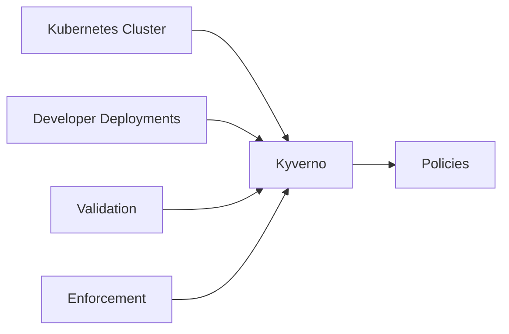

## Ensuring Developer Compliance with Security Policies

### The Challenge of Developer Compliance

Even if a Kubernetes administrator implements all the necessary security measures, the cluster is often used by developer teams who deploy their applications and services. These developers might lack the necessary security knowledge, leading to insecure configurations. Manually checking every deployment is impractical, so administrators need a way to enforce security policies across the entire cluster.

### What Are Security Policies?

Security policies in Kubernetes are rules that govern how pods, containers, and other resources can be configured and deployed. These policies can enforce various security best practices, such as:

- **Privileged Containers**: Preventing the deployment of containers with elevated privileges.
- **Root User**: Restricting the use of the root user within containers.
- **Network Policies**: Enforcing network isolation between pods.
- **Resource Limits**: Setting limits on CPU and memory usage to prevent resource exhaustion.

### Implementation of Security Policies

Security policies are typically implemented using third-party tools like Open Policy Agent (OPA) or Kyverno. These tools allow administrators to define and enforce security policies across the cluster.

#### Example: Using Kyverno for Security Policies

Kyverno is an open-source policy controller for Kubernetes that allows you to define and enforce policies declaratively. Here’s how you can use Kyverno to enforce a policy that prevents the deployment of privileged containers:

```yaml
apiVersion: kyverno.io/v1
kind: ClusterPolicy
metadata:
  name: disallow-privileged-containers
spec:
  validationFailureAction: enforce
  background: false
  rules:
  - name: disallow-privileged
    match:
      resources:
        kinds:
        - Pod
    validate:
      message: "Pods with privileged containers are not allowed."
      deny:
        conditions:
        - key: spec.containers[*].securityContext.privileged
          operator: Exists
```

To apply this policy, save the above YAML to a file (e.g., `disallow-privileged-containers.yaml`) and apply it to your cluster:

```bash
kubectl apply -f disallow--privileged-containers.yaml
```

### Network Topology Diagram

A network topology diagram can help visualize the components involved in enforcing security policies:



### Common Pitfalls and How to Prevent Them

#### Pitfall: Overly Permissive Policies

**Problem**: If policies are too permissive, developers can still deploy insecure configurations.

**Prevention**: Define strict policies that enforce best practices and regularly review and update them to address new security threats.

#### Pitfall: Lack of Monitoring

**Problem**: Without monitoring, it’s difficult to detect when policies are being violated.

**Prevention**: Use monitoring tools to track policy compliance and alert on violations. Regularly audit deployments to ensure they adhere to security policies.

### Real-World Example: Recent CVE

In 2022, a Kubernetes cluster was compromised due to the deployment of a container with elevated privileges. This highlights the importance of enforcing strict security policies to prevent such vulnerabilities.

### How to Detect and Prevent Policy Violations

#### Detection

Use monitoring tools to track policy compliance and alert on violations. Regularly audit deployments to ensure they adhere to security policies.

#### Prevention

Define strict policies that enforce best practices and regularly review and update them to address new security threats. Use monitoring tools to track policy compliance and alert on violations.

### Practice Labs

For hands-on experience with Kubernetes security, consider the following labs:

- **Kubernetes Goat**: A security-focused Kubernetes environment designed to teach security concepts.
- **OWASP WrongSecrets**: A series of challenges focused on Kubernetes security.
- **kube-hunter**: A tool for discovering and exploiting misconfigurations in Kubernetes clusters.

By implementing automated backups and enforcing strict security policies, you can significantly enhance the security and resilience of your Kubernetes cluster.

---
<!-- nav -->
[[13-Automated Backup and Restore System in Kubernetes|Automated Backup and Restore System in Kubernetes]] | [[DevSecOps/DevSecOps Bootcamp/01-DevSecOps Introduction/08-Introduction to Kubernetes Security/Kubernetes Security Best Practices/00-Overview|Overview]] | [[15-Managing Users and Permissions in Kubernetes|Managing Users and Permissions in Kubernetes]]
