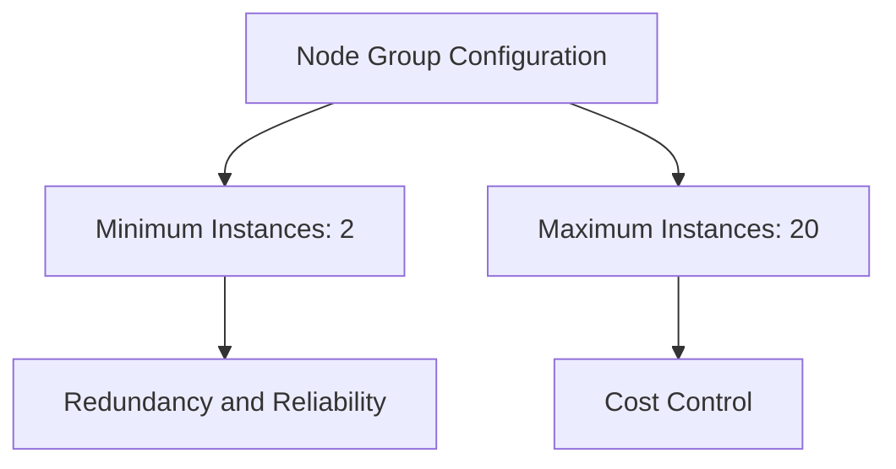
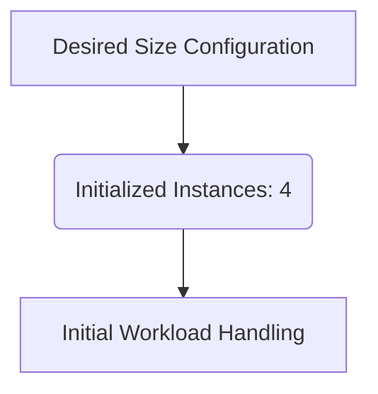
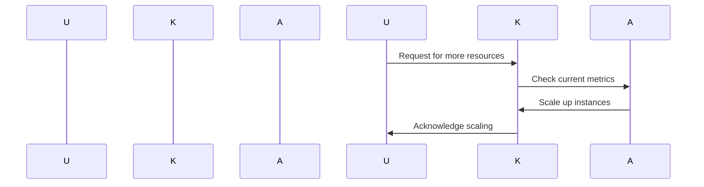
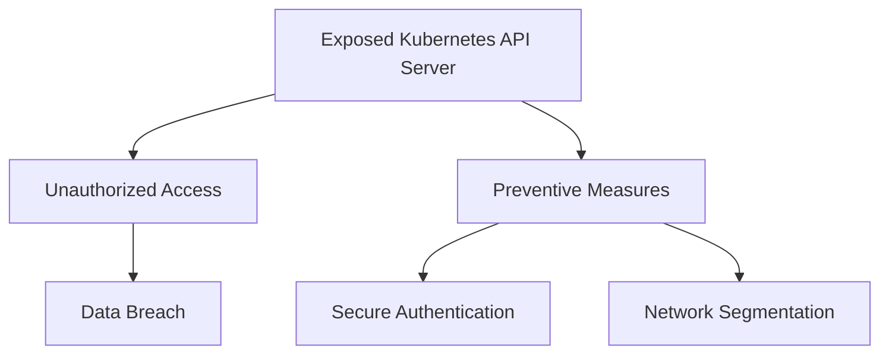

## Introduction to Kubernetes Security: Provisioning an AWS EKS Cluster

### Overview of Kubernetes Nodes and Node Groups

In Kubernetes, the nodes are the servers where the actual application workloads run. These nodes are typically virtual machines or physical servers that form the foundation of the Kubernetes cluster. A node group is a collection of these nodes, which can be managed together as a unit. This allows for easier scaling and management of the cluster.

When provisioning an AWS EKS (Elastic Kubernetes Service) cluster, one of the key decisions is how to configure the node groups. Each node group can contain multiple EC2 instances, and the number of instances can be dynamically scaled based on the workload requirements.

### Configuring Node Group Size

The configuration of the node group involves specifying the minimum and maximum number of instances within the group. In the provided transcript, the minimum number of instances is set to 2, and the maximum is set to 20. This configuration allows the cluster to scale up when needed, but also limits the potential cost by capping the number of instances.

#### Minimum and Maximum Instances

- **Minimum Instances**: Setting the minimum to 2 ensures that there are always at least two instances available to handle the workload. This provides redundancy and helps ensure that the cluster remains operational even if one instance fails.
  
- **Maximum Instances**: The maximum is set to 20 to prevent excessive scaling, which could lead to high costs. This is particularly important in a production environment where unexpected spikes in traffic could cause the cluster to scale out uncontrollably.



### Desired Size and Auto-Scaling

The desired size of the node group is set to 4, meaning that when the cluster starts, it will initially launch four instances. This initial size can be adjusted based on the expected workload and the need for immediate availability.

Auto-scaling is a feature that allows the node group to automatically adjust the number of instances based on the current workload. This is configured separately, but the initial settings provide the baseline for how the cluster will behave.

#### Desired Size

- **Desired Size**: Setting the desired size to 4 ensures that the cluster starts with a reasonable number of instances to handle the initial workload. This can be adjusted based on the expected traffic and the need for immediate availability.



### Auto-Scaling Mechanism

Auto-scaling is a critical feature for managing the scalability of the Kubernetes cluster. It allows the node group to dynamically adjust the number of instances based on the current workload. This is achieved through the use of metrics such as CPU utilization, memory usage, and custom metrics.

#### Metrics-Based Scaling

- **CPU Utilization**: The cluster can be configured to scale based on CPU usage. If the CPU usage exceeds a certain threshold, additional instances can be launched to handle the increased workload.
  
- **Memory Usage**: Similarly, the cluster can scale based on memory usage. If the memory usage exceeds a certain threshold, additional instances can be launched to distribute the load.

- **Custom Metrics**: Custom metrics can be defined to trigger scaling events. This allows for more fine-grained control over the scaling behavior based on specific application requirements.



### Real-World Examples and Recent Breaches

Recent breaches and vulnerabilities in Kubernetes clusters highlight the importance of proper configuration and security practices. One notable example is the Kubernetes API server being exposed to the internet without proper authentication, leading to unauthorized access and data breaches.

#### Example: Exposed Kubernetes API Server

- **CVE-2021-25741**: This vulnerability allowed attackers to bypass authentication and gain unauthorized access to the Kubernetes API server. This highlights the importance of securing the API server and ensuring that it is not exposed to the internet without proper authentication mechanisms.



### How to Prevent / Defend

To prevent such vulnerabilities, several measures can be taken:

1. **Secure Authentication**: Ensure that the Kubernetes API server is properly authenticated using TLS certificates and RBAC (Role-Based Access Control).

2. **Network Segmentation**: Use network policies to segment the Kubernetes cluster and restrict access to the API server.

3. **Monitoring and Logging**: Implement monitoring and logging to detect any unauthorized access attempts and respond promptly.

#### Secure Authentication Example

Here is an example of how to configure secure authentication using TLS certificates and RBAC:

```yaml
apiVersion: v1
kind: Secret
metadata:
  name: tls-secret
  namespace: default
type: kubernetes.io/tls
data:
  tls.crt: <base64 encoded certificate>
  tls.key: <base64 encoded key>

---
apiVersion: rbac.authorization.k8s.io/v1
kind: ClusterRoleBinding
metadata:
  name: admin-role-binding
subjects:
- kind: Group
  name: system:masters
roleRef:
  apiGroup: rbac.authorization.k8s.io
  kind: ClusterRole
  name: cluster-admin
```

#### Network Segmentation Example

Here is an example of how to implement network segmentation using network policies:

```yaml
apiVersion: networking.k8s.io/v1
kind: NetworkPolicy
metadata:
  name: deny-all-ingress
spec:
  podSelector: {}
  policyTypes:
  - Ingress
  ingress: []
```

### Complete Example: Full HTTP Request and Response

Here is a complete example of a full HTTP request and response for configuring the node group:

```http
POST /eks/create-node-group HTTP/1.1
Host: eks.amazonaws.com
Content-Type: application/json

{
  "clusterName": "my-cluster",
  "nodegroupName": "my-node-group",
  "scalingConfig": {
    "minSize": 2,
    "maxSize": 20,
    "desiredSize": 4
  }
}

HTTP/1.1 200 OK
Content-Type: application/json

{
  "nodegroup": {
    "nodegroupName": "my-node-group",
    "scalingConfig": {
      "minSize": 2,
      "maxSize": 20,
      "desiredSize": 4
    },
    "status": "CREATING"
  }
}
```

### Hands-On Labs

For hands-on practice with Kubernetes security, consider the following labs:

- **PortSwigger Web Security Academy**: Offers a variety of labs focused on web application security, including some that touch on Kubernetes security.
- **OWASP Juice Shop**: A deliberately insecure web application for security training, which includes some Kubernetes-related challenges.
- **Kubernetes Goat**: A hands-on lab specifically designed to teach Kubernetes security concepts and best practices.

By thoroughly understanding and implementing these configurations and security measures, you can ensure that your Kubernetes cluster is both scalable and secure.

---
<!-- nav -->
[[02-Introduction to Kubernetes Security Provisioning an AWS EKS Cluster Part 1|Introduction to Kubernetes Security Provisioning an AWS EKS Cluster Part 1]] | [[DevSecOps/DevSecOps Bootcamp/01-DevSecOps Introduction/08-Introduction to Kubernetes Security/Provision AWS EKS Cluster/00-Overview|Overview]] | [[04-Introduction to Kubernetes Security Provisioning an AWS EKS Cluster Part 3|Introduction to Kubernetes Security Provisioning an AWS EKS Cluster Part 3]]
