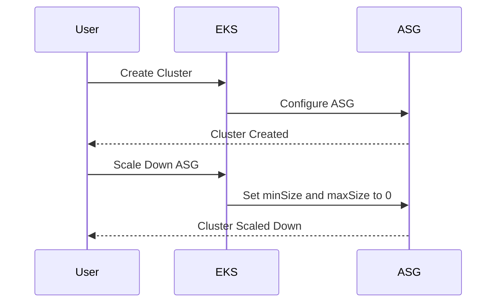
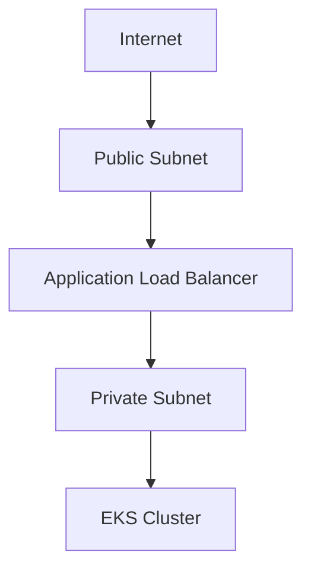

## Introduction to Kubernetes Security: Provisioning an AWS EKS Cluster

### Background Theory

Kubernetes (often abbreviated as K8s) is an open-source system for automating deployment, scaling, and management of containerized applications. It was originally designed by Google and is now maintained by the Cloud Native Computing Foundation. Kubernetes provides a platform for automating deployment and management of application containers across clusters of hosts, providing a framework to run distributed systems resiliently.

Amazon Elastic Kubernetes Service (EKS) is a managed Kubernetes service that makes it easy to run Kubernetes on AWS without needing expertise in Kubernetes operations. With EKS, you can use Kubernetes to run your containerized applications on AWS without needing to install and operate your own Kubernetes control plane.

### Cost Considerations

One of the first considerations when setting up an EKS cluster is the associated cost. EKS charges are based on the number of nodes (worker nodes) in your cluster and the amount of time those nodes are running. Additionally, there are costs associated with the underlying AWS infrastructure such as EC2 instances, EBS volumes, and VPC components.

#### Cost Management Strategies

- **Scaling Down Worker Nodes**: You can reduce the number of worker nodes to minimize costs. This can be done by adjusting the `minSize` and `maxSize` parameters in the Auto Scaling Group (ASG) settings.
- **Shutting Down the Cluster**: When you are not actively using the cluster, it is advisable to shut it down to avoid unnecessary costs. This can be achieved by deleting the cluster or scaling down the ASG to zero nodes.



### Setting Up the EKS Cluster with Terraform

Terraform is an infrastructure as code (IaC) tool that allows you to define and provision your infrastructure using declarative configuration files. In this section, we will walk through the process of setting up an EKS cluster using Terraform.

#### Prerequisites

Before you begin, ensure you have the following:

- An AWS account with appropriate permissions.
- Terraform installed on your local machine.
- Access to the AWS CLI and configured with your credentials.

#### Step-by-Step Configuration

1. **Initialize Terraform**:
   - Create a new directory for your project.
   - Initialize Terraform by running `terraform init`.

2. **Define Variables**:
   - Define variables in a `variables.tf` file to manage configuration parameters.
   - Example variables include `cluster_name`, `region`, `vpc_id`, `subnet_ids`, etc.

```hcl
variable "cluster_name" {
  description = "The name of the EKS cluster"
  type        = string
  default     = "my-cluster"
}

variable "region" {
  description = "The AWS region to deploy the cluster"
  type        = string
  default     = "us-west-2"
}

variable "vpc_id" {
  description = "The ID of the VPC to use for the cluster"
  type        = string
}

variable "subnet_ids" {
  description = "A list of subnet IDs to use for the cluster"
  type        = list(string)
}
```

3. **Create the EKS Cluster**:
   - Use the `aws_eks_cluster` resource to create the EKS cluster.
   - Specify the necessary parameters such as `name`, `role_arn`, `version`, etc.

```hcl
resource "aws_eks_cluster" "example" {
  name     = var.cluster_name
  role_arn = aws_iam_role.example.arn
  version  = "1.21"

  vpc_config {
    subnet_ids = var.subnet_ids
  }
}
```

4. **Configure Node Groups**:
   - Use the `aws_eks_node_group` resource to configure node groups.
   - Specify the necessary parameters such as `node_group_name`, `instance_types`, `scaling_config`, etc.

```hcl
resource "aws_eks_node_group" "example" {
  cluster_name    = aws_eks_cluster.example.name
  node_group_name = "${var.cluster_name}-ng"
  node_role_arn   = aws_iam_role.example.arn
  subnet_ids      = var.subnet_ids

  scaling_config {
    desired_size = 2
    max_size     = 2
    min_size     = 1
  }

  instance_types = ["t3.medium"]
}
```

5. **Apply the Configuration**:
   - Run `terraform apply` to create the EKS cluster and node groups.
   - Review the plan and confirm the changes.

```bash
terraform apply
```

### Managing Costs with Terraform

To manage costs effectively, you can automate the scaling down of the cluster using Terraform scripts. This can be done by modifying the `scaling_config` parameters to scale down the node group to zero nodes when not in use.

```hcl
resource "aws_eks_node_group" "example" {
  cluster_name    = aws_eks_cluster.example.name
  node_group_name = "${var.cluster_name}-ng"
  node_role_arn   = aws_iam_role.example.arn
  subnet_ids      = var.subnet_ids

  scaling_config {
    desired_size = 0
    max_size     = 0
    min_size     = 0
  }

  instance_types = ["t3.medium"]
}
```

### Security Considerations

Security is a critical aspect of managing an EKS cluster. Here are some key security considerations and best practices:

#### Identity and Access Management (IAM)

- **IAM Roles**: Ensure that IAM roles are properly configured for the EKS cluster and node groups.
- **Least Privilege Principle**: Assign the minimum necessary permissions to IAM roles.

```hcl
resource "aws_iam_role" "example" {
  name = "${var.cluster_name}-role"

  assume_role_policy = jsonencode({
    Version = "2012-10-17"
    Statement = [
      {
        Action = "sts:AssumeRole"
        Effect = "Allow"
        Principal = {
          Service = "ec2.amazonaws.com"
        }
      },
    ]
  })
}
```

#### Network Security

- **VPC Configuration**: Ensure that the VPC is properly configured with security groups and network ACLs.
- **Private Subnets**: Use private subnets for the EKS cluster to enhance security.



#### Pod Security Policies

- **Pod Security Policies (PSP)**: Implement Pod Security Policies to enforce security controls at the pod level.
- **RBAC**: Use Role-Based Access Control (RBAC) to manage access to resources within the cluster.

```yaml
apiVersion: policy/v1beta1
kind: PodSecurityPolicy
metadata:
  name: restricted
spec:
  privileged: false
  allowPrivilegeEscalation: false
  requiredDropCapabilities:
  - ALL
  seLinux:
    rule: RunAsAny
  supplementalGroups:
    rule: MustRunAs
    ranges:
    - min: 1
      max: 65535
  runAsUser:
    rule: MustRunAs
    ranges:
    - min: 1
      max: 65535
  fsGroup:
    rule: MustRunAs
    ranges:
    - min: 1
      max: 65535
  readOnlyRootFilesystem: true
```

### Real-World Examples and CVEs

Several real-world examples and CVEs highlight the importance of securing Kubernetes clusters:

- **CVE-2021-25741**: This vulnerability in Kubernetes allowed attackers to bypass authentication and gain unauthorized access to the cluster.
- **CVE-2020-8558**: This vulnerability in the Kubernetes API server allowed attackers to escalate privileges and execute arbitrary code.

These vulnerabilities underscore the need for robust security measures, including regular updates, proper configuration, and strict access controls.

### How to Prevent / Defend

#### Detection

- **Logging and Monitoring**: Enable logging and monitoring for the EKS cluster to detect any suspicious activity.
- **Audit Logs**: Enable audit logs to track API calls and user actions within the cluster.

```hcl
resource "aws_cloudwatch_log_group" "example" {
  name              = "/aws/eks/${var.cluster_name}/audit"
  retention_in_days = 30
}
```

#### Prevention

- **Regular Updates**: Keep the Kubernetes version and all components up to date to mitigate known vulnerabilities.
- **Secure Configuration**: Follow best practices for configuring the cluster, including network security, IAM roles, and RBAC.

#### Secure Coding Fixes

Compare the insecure and secure versions of a configuration file:

**Insecure Configuration**

```yaml
apiVersion: v1
kind: Pod
metadata:
  name: my-pod
spec:
  containers:
  - name: my-container
    image: my-image
    securityContext:
      privileged: true
```

**Secure Configuration**

```yaml
apiVersion: v1
kind: Pod
metadata:
  name: my-pod
spec:
  containers:
  - name: my-container
    image: my-image
    securityContext:
      privileged: false
      allowPrivilegeEscalation: false
```

### Hands-On Labs

For hands-on practice with Kubernetes security, consider the following labs:

- **Kubernetes Goat**: A hands-on lab for learning Kubernetes security.
- **OWASP WrongSecrets**: A series of challenges to learn about Kubernetes security.
- **kube-hunter**: A tool for hunting security issues in Kubernetes clusters.

By following these steps and best practices, you can effectively set up and secure an AWS EKS cluster using Terraform.

---
<!-- nav -->
[[03-Introduction to Kubernetes Security Provisioning an AWS EKS Cluster Part 2|Introduction to Kubernetes Security Provisioning an AWS EKS Cluster Part 2]] | [[DevSecOps/DevSecOps Bootcamp/01-DevSecOps Introduction/08-Introduction to Kubernetes Security/Provision AWS EKS Cluster/00-Overview|Overview]] | [[05-Introduction to Kubernetes Security Provisioning an AWS EKS Cluster Part 4|Introduction to Kubernetes Security Provisioning an AWS EKS Cluster Part 4]]
