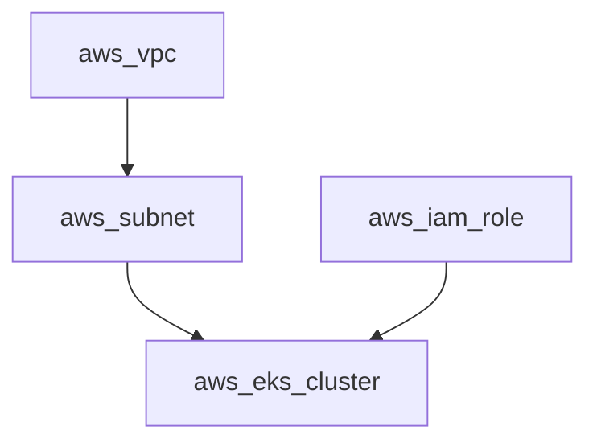
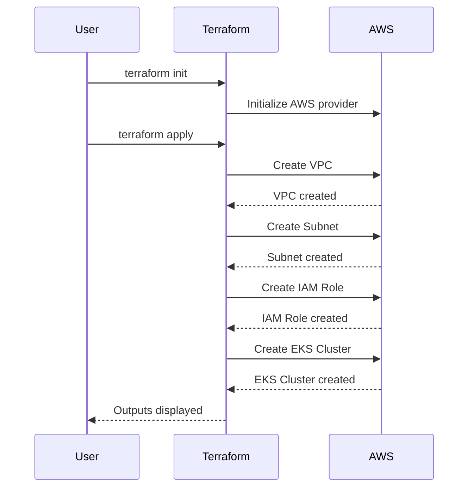

## Introduction to Kubernetes Security: Provisioning an AWS EKS Cluster

### Background Theory

Kubernetes (often abbreviated as K8s) is an open-source system for automating deployment, scaling, and management of containerized applications. One of the most popular ways to deploy Kubernetes is via managed services such as Amazon Elastic Kubernetes Service (EKS). EKS simplifies the process of deploying and managing Kubernetes clusters in the AWS cloud environment.

### Setting Up the AWS Provider Configuration

To provision an EKS cluster using Terraform, we first need to configure the AWS provider. The AWS provider configuration specifies the version of the provider and the source of the provider. Here is an example of how to set up the AWS provider in a `provider.tf` file:

```terraform
provider "aws" {
  version = "~> 3.0"
  region  = "eu-central-1"
}
```

#### Explanation

- **Provider Version**: The `version` attribute specifies the version of the AWS provider to use. Using a version constraint ensures compatibility with the latest features and bug fixes.
- **Region**: The `region` attribute specifies the AWS region where the resources will be created. In this case, we are using `eu-central-1`.

### Output File Configuration

The output file (`outputs.tf`) is used to display useful information after the cluster creation. This can include commands to connect to the cluster or display cluster details. Here is an example of how to set up the output file:

```terraform
output "eks_cluster_name" {
  value = aws_eks_cluster.example.name
}

output "kubeconfig" {
  value = data.aws_eks_cluster_auth.example.kubeconfig
}
```

#### Explanation

- **Cluster Name**: The `eks_cluster_name` output displays the name of the EKS cluster.
- **Kubeconfig**: The `kubeconfig` output provides the configuration needed to connect to the cluster using `kubectl`.

### Creating the Terraform Variables File

Terraform variables are stored in a `.tfvars` file. This file contains sensitive data such as access keys and should not be committed to the Git repository. Here is an example of how to set up the `terraform.tfvars` file:

```terraform
access_key_id     = "YOUR_ACCESS_KEY_ID"
secret_access_key = "YOUR_SECRET_ACCESS_KEY"
region            = "eu-central-1"
```

#### Explanation

- **Access Key ID**: The `access_key_id` variable stores the AWS access key ID.
- **Secret Access Key**: The `secret_access_key` variable stores the AWS secret access key.
- **Region**: The `region` variable specifies the AWS region.

### How to Prevent / Defend

#### Secure Handling of Sensitive Data

Sensitive data such as access keys should be handled securely. Here are some best practices:

1. **Use IAM Roles**: Instead of using access keys, use IAM roles to grant permissions to the EKS cluster.
2. **Environment Variables**: Store sensitive data in environment variables instead of hardcoding them in the `.tfvars` file.
3. **Vault Integration**: Use a secrets management solution like HashiCorp Vault to manage and rotate sensitive data.

#### Example of Secure Handling

Here is an example of how to use environment variables to store sensitive data:

```bash
export AWS_ACCESS_KEY_ID="YOUR_ACCESS_KEY_ID"
export AWS_SECRET_ACCESS_KEY="YOUR_SECRET_ACCESS_KEY"
```

And then reference these environment variables in the `provider.tf` file:

```terraform
provider "aws" {
  version = "~> 3.0"
  region  = "eu-central-1"
  access_key = var.AWS_ACCESS_KEY_ID
  secret_key = var.AWS_SECRET_ACCESS_KEY
}
```

### Complete Terraform Project Example

Here is a complete example of a Terraform project to create an EKS cluster:

#### `main.tf`

```terraform
resource "aws_eks_cluster" "example" {
  name     = "example-cluster"
  role_arn = aws_iam_role.example.arn
  vpc_config {
    subnet_ids = [aws_subnet.example.id]
  }
}

resource "aws_iam_role" "example" {
  name = "example-role"

  assume_role_policy = jsonencode({
    Version = "2012-10-17"
    Statement = [
      {
        Action = "sts:AssumeRole"
        Effect = "Allow"
        Principal = {
          Service = "eks.amazonaws.com"
        }
      },
    ]
  })
}

resource "aws_iam_role_policy_attachment" "example" {
  policy_arn = "arn:aws:iam::aws:policy/AmazonEKSClusterPolicy"
  role_arn   = aws_iam_role.example.arn
}

resource "aws_subnet" "example" {
  vpc_id     = aws_vpc.example.id
  cidr_block = "10.0.1.0/24"
  availability_zone = "eu-central-1a"
}

resource "aws_vpc" "example" {
  cidr_block = "10.0.0.0/16"
}
```

#### `outputs.tf`

```terraform
output "eks_cluster_name" {
  value = aws_eks_cluster.example.name
}

output "kubeconfig" {
  value = data.aws_eks_cluster_auth.example.kubeconfig
}
```

#### `provider.tf`

```terraform
provider "aws" {
  version = "~> 3.0"
  region  = "eu-central-1"
}
```

#### `terraform.tfvars`

```terraform
access_key_id     = "YOUR_ACCESS_KEY_ID"
secret_access_key = "YOUR_SECRET_ACCESS_KEY"
region            = "eu-central-1"
```

### Running the Terraform Project

To run the Terraform project, execute the following commands:

```bash
terraform init
terraform apply
```

### Expected Result

After running the Terraform project, the EKS cluster will be created, and the outputs will be displayed:

```bash
Apply complete! Resources: 5 added, 0 changed, 0 destroyed.

Outputs:

eks_cluster_name = example-cluster
kubeconfig = <kubeconfig contents>
```

### Mermaid Diagrams

#### Network Topology



#### Sequence Diagram



### Real-World Examples

#### Recent CVEs and Breaches

One notable breach involving Kubernetes was the compromise of a Kubernetes cluster due to misconfigured IAM roles. This allowed attackers to gain unauthorized access to the cluster and steal sensitive data. To prevent such incidents, it is crucial to follow best practices for securing Kubernetes clusters.

### Hands-On Labs

For hands-on practice with Kubernetes security, consider the following labs:

- **Kubernetes Goat**: A hands-on lab designed to teach Kubernetes security concepts.
- **OWASP WrongSecrets**: A series of challenges to learn about Kubernetes security vulnerabilities.
- **kube-hunter**: A tool to discover and report potential security issues in Kubernetes clusters.

By following these steps and best practices, you can ensure that your EKS cluster is securely provisioned and managed.

---
<!-- nav -->
[[04-Introduction to Kubernetes Security Provisioning an AWS EKS Cluster Part 3|Introduction to Kubernetes Security Provisioning an AWS EKS Cluster Part 3]] | [[DevSecOps/DevSecOps Bootcamp/01-DevSecOps Introduction/08-Introduction to Kubernetes Security/Provision AWS EKS Cluster/00-Overview|Overview]] | [[06-Introduction to Kubernetes Security Provisioning an AWS EKS Cluster Part 5|Introduction to Kubernetes Security Provisioning an AWS EKS Cluster Part 5]]
