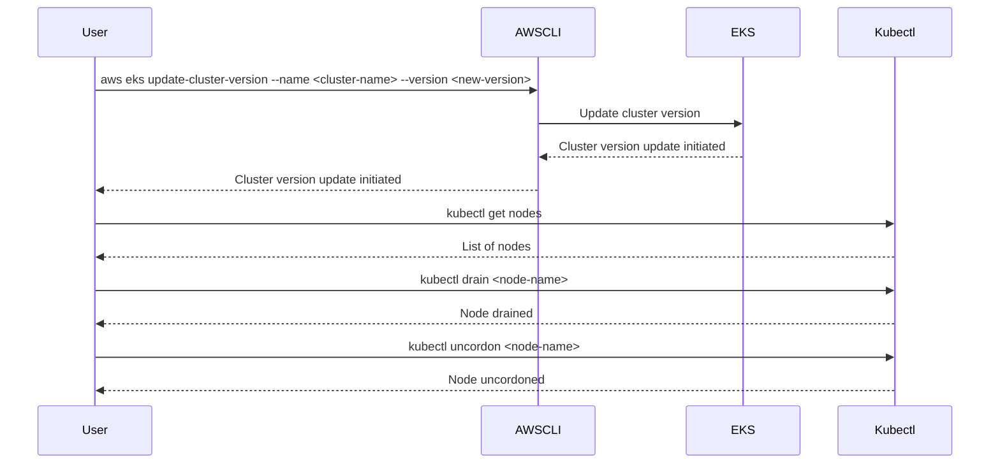

## Introduction to Kubernetes Security: Provisioning an AWS EKS Cluster

### Overview of Kubernetes Security

Kubernetes is an open-source system for automating deployment, scaling, and management of containerized applications. While Kubernetes provides powerful capabilities for managing containerized workloads, it also introduces several security challenges. One of the key principles of DevSecOps is to integrate security practices into the entire lifecycle of application development and deployment. This includes ensuring that the underlying infrastructure, such as the Kubernetes cluster, is secure.

### Importance of Using the Latest Versions

One of the fundamental security best practices is to always use the latest versions of the technologies and to upgrade them when a new version becomes available. This principle applies to Kubernetes clusters as well. Let's delve deeper into why this is important.

#### Background Theory

Software vulnerabilities are often discovered after a product is released. These vulnerabilities can range from minor bugs to critical security issues that can be exploited by attackers. Software vendors typically release updates and patches to address these vulnerabilities. By keeping your software up-to-date, you ensure that you have the latest security fixes.

#### Real-World Examples

Consider the following recent vulnerabilities:

- **CVE-2021-25741**: This vulnerability affects Kubernetes versions prior to 1.21. It allows an attacker to escalate privileges by manipulating the `kubelet` API. This vulnerability was fixed in Kubernetes 1.21, highlighting the importance of staying updated.

- **CVE-2021-25742**: Another critical vulnerability affecting Kubernetes versions prior to 1.21. This vulnerability allows an attacker to bypass authentication mechanisms and gain unauthorized access to the cluster. Again, this was fixed in the latest version.

These examples illustrate the importance of keeping your Kubernetes cluster up-to-date to mitigate known vulnerabilities.

### Challenges of Upgrading

While upgrading to the latest version is crucial, it is not always straightforward. There are several challenges associated with upgrading existing tools and technologies:

#### Breaking Changes

Newer versions of software can introduce breaking changes. These changes might affect the functionality of your applications or configurations. Therefore, it is essential to thoroughly test your applications after an upgrade to ensure that everything continues to work as expected.

#### Example Upgrade Process

Let's consider an example of upgrading an AWS EKS (Elastic Kubernetes Service) cluster from an older version to the latest version.



In this example, the user initiates the upgrade process using the AWS CLI. The AWS CLI communicates with the EKS service to start the upgrade. After initiating the upgrade, the user should verify the status of the nodes and perform a rolling update by draining and uncordoning each node.

### How to Prevent / Defend

To ensure that your Kubernetes cluster remains secure, follow these best practices:

#### Regular Updates

- **Automate Updates**: Set up automated processes to check for and apply updates regularly. This can be done using tools like `eksctl` or custom scripts.
  
- **Monitor Vulnerabilities**: Use tools like `Trivy` or `Kube-bench` to monitor for known vulnerabilities in your cluster.

#### Secure Configuration

- **Use Secure Configurations**: Ensure that your Kubernetes configurations are secure. For example, avoid using default credentials and enable encryption at rest.

- **Role-Based Access Control (RBAC)**: Implement RBAC to restrict access to resources within the cluster. This helps prevent unauthorized access and reduces the attack surface.

#### Example Secure Configuration

Here is an example of a secure Kubernetes configuration:

```yaml
apiVersion: v1
kind: Pod
metadata:
  name: my-pod
spec:
  containers:
  - name: my-container
    image: my-image:latest
    securityContext:
      runAsNonRoot: true
      allowPrivilegeEscalation: false
```

In this example, the `securityContext` ensures that the container runs as a non-root user and does not allow privilege escalation.

### Conclusion

Keeping your Kubernetes cluster up-to-date is a critical aspect of maintaining its security. By following best practices and using the latest versions of the technologies, you can reduce the risk of security vulnerabilities. Additionally, thorough testing and secure configurations are essential to ensure that your cluster remains robust against potential attacks.

### Practice Labs

For hands-on experience with Kubernetes security, consider the following labs:

- **PortSwigger Web Security Academy**: Offers interactive labs to understand and mitigate common security vulnerabilities.
- **OWASP Juice Shop**: A deliberately insecure web application for learning about web security.
- **Kubernetes Goat**: A vulnerable Kubernetes cluster for practicing security assessments and mitigation techniques.

By engaging with these labs, you can gain practical experience in securing Kubernetes clusters and applying the best practices discussed in this chapter.

---
<!-- nav -->
[[06-Introduction to Kubernetes Security Provisioning an AWS EKS Cluster Part 5|Introduction to Kubernetes Security Provisioning an AWS EKS Cluster Part 5]] | [[DevSecOps/DevSecOps Bootcamp/01-DevSecOps Introduction/08-Introduction to Kubernetes Security/Provision AWS EKS Cluster/00-Overview|Overview]] | [[08-Introduction to Kubernetes Security Provisioning an AWS EKS Cluster|Introduction to Kubernetes Security Provisioning an AWS EKS Cluster]]
