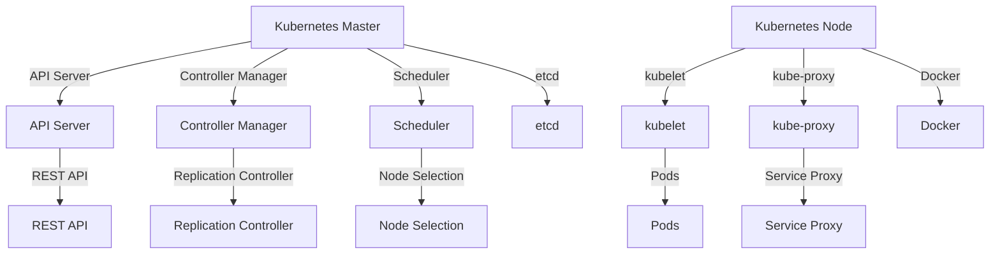
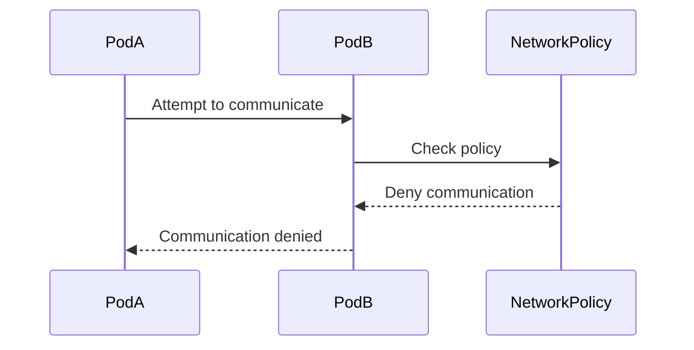

## Introduction to Kubernetes Security and Provisioning an AWS EKS Cluster

### Background Theory

Kubernetes is an open-source container orchestration system designed to automate the deployment, scaling, and management of containerized applications. It was originally designed by Google and is now maintained by the Cloud Native Computing Foundation. Kubernetes provides a robust framework for managing containerized applications at scale, ensuring high availability, performance, and scalability.

#### Why Kubernetes?

When deploying larger applications or complex microservices, traditional methods such as using individual EC2 instances become cumbersome and inefficient. Kubernetes offers several advantages:

- **High Availability**: Kubernetes can automatically manage and balance the load across multiple nodes, ensuring that your application remains available even if some nodes fail.
- **Scalability**: Kubernetes allows you to scale your application dynamically based on demand. You can easily add or remove nodes as needed.
- **Resource Management**: Kubernetes efficiently manages resources, ensuring that your application runs smoothly without wasting resources.

### Moving from Simple Server to Kubernetes

In this section, we will transition from using a simple EC2 virtual server to a Kubernetes cluster. This shift is motivated by the need to deploy larger and more complex microservices applications, which require high availability, performance, and scalability.

#### Project Structure

We will be working with two repositories:

1. **Infrastructure Automation Project**: This is the existing project that we created in the previous section. We will leave this project as is and not make any changes to it.
2. **Infrastructure Automation for EKS**: This is a new repository specifically created for provisioning an AWS EKS (Elastic Kubernetes Service) cluster.

### Setting Up the EKS Cluster

The goal is to provision an EKS cluster with all the necessary services installed, including Helm charts and Kubernetes add-ons, as well as access management controls. All configurations and deployments will be automated using Terraform.

#### Base Configuration

The base configuration consists of a single `main` branch. We will start from this simple state and build out the project step by step.

### Step-by-Step Configuration

#### 1. Initialize Terraform

First, initialize Terraform to download and install the necessary providers and modules.

```bash
terraform init
```

This command sets up the Terraform environment and prepares it for further configuration.

#### 2. Define the EKS Cluster

Create a Terraform configuration file (`eks-cluster.tf`) to define the EKS cluster.

```hcl
provider "aws" {
  region = "us-west-2"
}

resource "aws_eks_cluster" "example" {
  name     = "example-cluster"
  role_arn = aws_iam_role.example.arn

  vpc_config {
    subnet_ids = [aws_subnet.example.id]
  }
}

resource "aws_iam_role" "example" {
  name = "example-role"

  assume_role_policy = jsonencode({
    Version = "2012-10-17"
    Statement = [
      {
        Action = "sts:AssumeRole"
        Effect = "Allow"
        Principal = {
          Service = "eks.amazonaws.com"
        }
      },
    ]
  })
}
```

This configuration defines an EKS cluster named `example-cluster` and an associated IAM role.

#### 3. Create Subnets and VPC

Define the VPC and subnets required for the EKS cluster.

```hcl
resource "aws_vpc" "example" {
  cidr_block = "10.0.0.0/16"
}

resource "aws_subnet" "example" {
  vpc_id            = aws_vpc.example.id
  cidr_block        = "10.0.1.0/24"
  availability_zone = "us-west-2a"
}
```

These resources create a VPC and a subnet within the specified availability zone.

#### 4. Apply the Configuration

Apply the Terraform configuration to create the EKS cluster and associated resources.

```bash
terraform apply
```

This command will prompt you to confirm the changes. Once confirmed, Terraform will create the EKS cluster and associated resources.

### Access Management Controls

Access management is crucial for securing the Kubernetes cluster. We will configure role-based access control (RBAC) to ensure that only authorized users have access to specific resources.

#### 1. Define RBAC Roles

Create RBAC roles and bindings to control access to resources.

```yaml
apiVersion: rbac.authorization.k8s.io/v1
kind: Role
metadata:
  namespace: default
  name: pod-reader
rules:
- apiGroups: [""] # "" indicates the core API group
  resources: ["pods"]
  verbs: ["get", "watch", "list"]
---
apiVersion: rbac.authorization.k8s.io/v1
kind: RoleBinding
metadata:
  name: read-pods
  namespace: default
subjects:
- kind: User
  name: johndoe # Name is case sensitive
  apiGroup: rbac.authorization.k8s.io
roleRef:
  kind: Role
  name: pod-reader
  apiGroup: rbac.authorization.k8s.io
```

This configuration defines a role `pod-reader` that allows users to read pods and binds this role to a user `johndoe`.

#### 2. Apply RBAC Configuration

Apply the RBAC configuration to the Kubernetes cluster.

```bash
kubectl apply -f rbac-config.yaml
```

This command applies the RBAC configuration to the cluster.

### Helm Charts and Add-Ons

Helm is a package manager for Kubernetes that simplifies the deployment and management of applications. We will use Helm to install and manage add-ons and other services.

#### 1. Install Helm

Install Helm on your local machine.

```bash
curl https://raw.githubusercontent.com/helm/helm/main/scripts/get-helm-3 | bash
```

This command installs Helm version 3.

#### 2. Add Helm Repositories

Add repositories to Helm to access various charts.

```bash
helm repo add stable https://charts.helm.sh/stable
helm repo update
```

This command adds the `stable` repository and updates the list of available charts.

#### 3. Install Add-Ons

Install add-ons using Helm.

```bash
helm install my-release stable/nginx-ingress
```

This command installs the `nginx-ingress` chart from the `stable` repository.

### Security Considerations

#### 1. Network Policies

Network policies allow you to control traffic between pods within the cluster. Define network policies to restrict communication.

```yaml
apiVersion: networking.k8s.io/v1
kind: NetworkPolicy
metadata:
  name: deny-all
spec:
  podSelector: {}
  policyTypes:
  - Ingress
  - Egress
```

This policy denies all ingress and egress traffic.

#### 2. Pod Security Policies

Pod security policies enforce constraints on pod creation. Define pod security policies to restrict pod capabilities.

```yaml
apiVersion: policy/v1beta1
kind: PodSecurityPolicy
metadata:
  name: restricted
spec:
  privileged: false
  allowPrivilegeEscalation: false
  readOnlyRootFilesystem: true
  seLinux:
    rule: RunAsAny
  runAsUser:
    rule: MustRunAs
    ranges:
    - min: 1000
      max: 65535
  supplementalGroups:
    rule: MustRunAs
    ranges:
    - min: 1000
      max: 65535
  fsGroup:
    rule: MustRunAs
    ranges:
    - min: 1000
      max: 65535
```

This policy restricts pod privileges and ensures that pods run with non-root user IDs.

#### 3. Secrets Management

Manage secrets securely using Kubernetes secrets.

```yaml
apiVersion: v1
kind: Secret
metadata:
  name: my-secret
type: Opaque
data:
  username: dXNlcm5hbWU=
  password: cGFzc3dvcmQ=
```

This secret stores base64-encoded credentials.

### Real-World Examples and Recent CVEs

#### Example: CVE-2021-25741

CVE-2021-25741 is a critical vulnerability in Kubernetes that allows an attacker to escalate their privileges and gain full control of the cluster. This vulnerability affects versions of Kubernetes prior to 1.21.1.

**Impact**: An attacker can exploit this vulnerability to execute arbitrary code with root privileges.

**Mitigation**: Ensure that your Kubernetes cluster is updated to the latest version. Regularly patch and update your cluster to mitigate vulnerabilities.

#### Example: CVE-2020-8558

CVE-2020-8558 is a vulnerability in the Kubernetes API server that allows an attacker to bypass authentication and authorization checks. This vulnerability affects versions of Kubernetes prior to 1.18.9.

**Impact**: An attacker can exploit this vulnerability to gain unauthorized access to the cluster.

**Mitigation**: Ensure that your Kubernetes cluster is configured with proper authentication and authorization mechanisms. Regularly review and update your security policies.

### How to Prevent / Defend

#### Detection

Regularly scan your Kubernetes cluster for vulnerabilities using tools like Trivy or Kube-bench.

```bash
trivy image <image-name>
```

This command scans the specified Docker image for vulnerabilities.

#### Prevention

1. **Keep Your Cluster Updated**: Regularly update your Kubernetes cluster to the latest version.
2. **Enable Network Policies**: Use network policies to restrict traffic between pods.
3. **Use Pod Security Policies**: Enforce pod security policies to restrict pod capabilities.
4. **Secure Secrets Management**: Use Kubernetes secrets to store sensitive information securely.
5. **Regular Audits**: Conduct regular security audits and penetration testing to identify and mitigate vulnerabilities.

#### Secure Coding Fixes

Compare the vulnerable and secure versions of a configuration file.

**Vulnerable Version**:
```yaml
apiVersion: v1
kind: Pod
metadata:
  name: my-pod
spec:
  containers:
  - name: my-container
    image: my-image
    securityContext:
      privileged: true
```

**Secure Version**:
```yaml
apiVersion: v1
kind: Pod
metadata:
  name: my-pod
spec:
  containers:
  - name: my-container
    image: my-image
    securityContext:
      privileged: false
```

### Complete Example

#### Full HTTP Request and Response

Here is an example of a full HTTP request and response for creating a pod.

**Request**:
```http
POST /api/v1/namespaces/default/pods HTTP/1.1
Host: localhost:8080
Content-Type: application/json
Authorization: Bearer <token>

{
  "apiVersion": "v1",
  "kind": "Pod",
  "metadata": {
    "name": "my-pod"
  },
  "spec": {
    "containers": [
      {
        "name": "my-container",
        "image": "my-image"
      }
    ]
  }
}
```

**Response**:
```http
HTTP/1.1 201 Created
Content-Type: application/json
Date: Mon, 01 Jan 2024 00:00:00 GMT
Content-Length: 1024

{
  "kind": "Pod",
  "apiVersion": "v1",
  "metadata": {
    "name": "my-pod",
    "namespace": "default",
    "selfLink": "/api/v1/namespaces/default/pods/my-pod",
    "uid": "12345678-1234-1234-1234-123456789abc",
    "resourceVersion": "12345678",
    "creationTimestamp": "2024-01-01T00:00:00Z"
  },
  "spec": {
    "containers": [
      {
        "name": "my-container",
        "image": "my-image"
      }
    ]
  },
  "status": {
    "phase": "Pending",
    "conditions": [
      {
        "type": "Initialized",
        "status": "True",
        "lastProbeTime": null,
        "lastTransitionTime": "2024-01-01T00:00:00Z"
      }
    ],
    "containerStatuses": [
      {
        "name": "my-container",
        "state": {
          "waiting": {
            "reason": "ContainerCreating"
          }
        },
        "lastState": {},
        "ready": false,
        "restartCount": 0,
        "image": "my-image",
        "imageID": "",
        "containerID": ""
      }
    ],
    "qosClass": "Guaranteed"
  }
}
```

### Mermaid Diagrams

#### Kubernetes Architecture



#### Network Policy Flow



### Practice Labs

For hands-on practice with Kubernetes security, consider the following labs:

- **PortSwigger Web Security Academy**: Offers a comprehensive set of labs covering various aspects of web security, including Kubernetes.
- **OWASP Juice Shop**: A deliberately insecure web application for security training.
- **Kubernetes Goat**: A vulnerable Kubernetes cluster for learning and practicing security.

These labs provide practical experience in securing Kubernetes clusters and identifying vulnerabilities.

By following these steps and best practices, you can effectively provision and secure an AWS EKS cluster, ensuring high availability, performance, and security for your applications.

---
<!-- nav -->
[[08-Introduction to Kubernetes Security Provisioning an AWS EKS Cluster|Introduction to Kubernetes Security Provisioning an AWS EKS Cluster]] | [[DevSecOps/DevSecOps Bootcamp/01-DevSecOps Introduction/08-Introduction to Kubernetes Security/Provision AWS EKS Cluster/00-Overview|Overview]] | [[10-Introduction to Kubernetes Security in AWS EKS Clusters Part 1|Introduction to Kubernetes Security in AWS EKS Clusters Part 1]]
