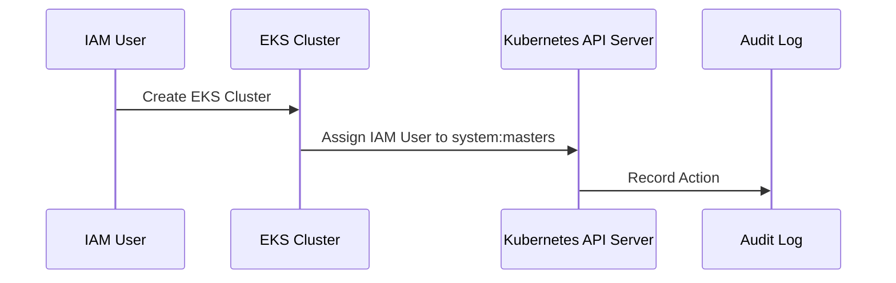

## Introduction to Kubernetes Security in AWS EKS Clusters

### Background Theory

Kubernetes is an open-source system for automating deployment, scaling, and management of containerized applications. It was designed to provide a portable way to run and manage containerized applications across different environments. In the context of AWS, Elastic Kubernetes Service (EKS) provides a managed service to run Kubernetes clusters in the cloud.

When you provision an EKS cluster, AWS automatically assigns the IAM user who created the cluster to the `system:masters` group in Kubernetes. This group consists of users who have access to control plane processes and are essentially the root users of the cluster. This means that the user who created the EKS cluster has full administrative privileges over the cluster.

### Understanding the `system:masters` Group

The `system:masters` group is a special group in Kubernetes that grants users full administrative access to the cluster. This includes the ability to perform any operation within the cluster, such as creating, modifying, or deleting resources, as well as managing the control plane components.

#### Why It Matters

Having full administrative access to a Kubernetes cluster is powerful but also risky. If an unauthorized user gains access to the credentials of a member of the `system:masters` group, they could potentially compromise the entire cluster. Therefore, it is crucial to manage access carefully and limit the number of users with such high-level permissions.

#### How It Works Under the Hood

In Kubernetes, the `system:masters` group is defined in the API server's configuration. When a user is assigned to this group, they are granted the `cluster-admin` role, which allows them to perform any action within the cluster. This is achieved through Role-Based Access Control (RBAC), which is a method of regulating access to resources based on roles.

#### Common Mistakes and Pitfalls

One common mistake is granting `system:masters` access to too many users. This increases the risk of a security breach. Another pitfall is not regularly reviewing and revoking access for users who no longer require it.

### Real-World Examples

Recent breaches involving Kubernetes clusters often involve unauthorized access to the `system:masters` group. For example, in the case of the **CVE-2021-25741**, a misconfiguration in the Kubernetes API server allowed unauthorized users to gain elevated privileges, including access to the `system:masters` group. This led to a significant security vulnerability.

### How to Prevent / Defend

#### Detection

To detect unauthorized access to the `system:masters` group, you should regularly monitor your cluster's audit logs. These logs record all actions performed within the cluster, including those by members of the `system:masters` group. You can use tools like AWS CloudTrail to monitor these logs.



#### Prevention

To prevent unauthorized access, you should:

1. **Limit the Number of Users**: Only grant `system:masters` access to users who absolutely need it.
2. **Use RBAC**: Implement Role-Based Access Control to restrict access based on roles.
3. **Regularly Review Access**: Periodically review and revoke access for users who no longer require it.

#### Secure Coding Fixes

Here is an example of how to configure RBAC to limit access:

**Vulnerable Configuration:**

```yaml
apiVersion: rbac.authorization.k8s.io/v1
kind: ClusterRoleBinding
metadata:
  name: admin-cluster-binding
subjects:
- kind: User
  name: my-user
roleRef:
  kind: ClusterRole
  name: cluster-admin
  apiGroup: rbac.authorization.k8s.io
```

**Secure Configuration:**

```yaml
apiVersion: rbac.authorization.k8s.io/v1
kind: ClusterRoleBinding
metadata:
  name: limited-access-binding
subjects:
- kind: User
  name: my-user
roleRef:
  kind: ClusterRole
  name: view
  apiGroup: rbac.authorization.k8s.io
```

### Configuring Access Management

After provisioning an EKS cluster, the next step is to configure proper access management. This involves setting up RBAC rules to control who can access what within the cluster.

#### Step-by-Step Mechanics

1. **Create Roles and RoleBindings**: Define roles and role bindings to control access.
2. **Assign Roles to Users**: Assign roles to specific users or groups.
3. **Monitor and Audit**: Regularly monitor and audit access to ensure compliance.

#### Example Configuration

Here is an example of how to create a role and role binding:

```yaml
# Define a role
apiVersion: rbac.authorization.k8s.io/v1
kind: Role
metadata:
  namespace: default
  name: pod-reader
rules:
- apiGroups: [""]
  resources: ["pods"]
  verbs: ["get", "watch", "list"]

# Bind the role to a user
apiVersion: rbac.authorization.k8s.io/v1
kind: RoleBinding
metadata:
  name: read-pods
  namespace: default
subjects:
- kind: User
  name: jdoe
  apiGroup: rbac.authorization.k8s.io
roleRef:
  kind: Role
  name: pod-reader
  apiGroup: rbac.authorization.k8s.io
```

### Updating Kubernetes Version

Another important aspect of securing an EKS cluster is ensuring that it runs the latest version of Kubernetes. As of the current date, the latest version is 1.29.

#### Why It Matters

Running the latest version ensures that you have the latest security patches and improvements. Older versions may contain vulnerabilities that have been fixed in newer releases.

#### How It Works Under the Hood

Updating the Kubernetes version involves upgrading the control plane components and worker nodes. AWS EKS provides tools to facilitate this process, such as the `eksctl` command-line tool.

#### Common Mistakes and Pitfalls

One common mistake is neglecting to update the Kubernetes version regularly. This can leave your cluster vulnerable to known exploits.

### Real-World Examples

In the past, older versions of Kubernetes were vulnerable to various attacks, such as **CVE-2021-25741** mentioned earlier. Ensuring that you are running the latest version helps mitigate these risks.

### How to Prevent / Defend

#### Detection

To detect outdated versions, you can use tools like `eksctl` to check the current version of your EKS cluster.

```bash
eksctl get cluster --region us-west-2
```

#### Prevention

To prevent using outdated versions, you should:

1. **Regularly Check for Updates**: Use tools like `eksctl` to check the current version.
2. **Automate Updates**: Set up automated processes to update the cluster regularly.

#### Secure Coding Fixes

Here is an example of how to update the Kubernetes version using `eksctl`:

```bash
eksctl upgrade cluster --name my-cluster --region us-west-2 --version 1.29
```

### Conclusion

Provisioning an AWS EKS cluster involves several steps to ensure security. Understanding the `system:masters` group and configuring proper access management are critical. Additionally, keeping the Kubernetes version up-to-date is essential to mitigate known vulnerabilities.

### Practice Labs

For hands-on practice with Kubernetes security in AWS EKS, consider the following labs:

- **PortSwigger Web Security Academy**: Offers modules on Kubernetes security.
- **OWASP Juice Shop**: Provides a vulnerable application to practice security techniques.
- **CloudGoat**: A set of labs for practicing cloud security, including AWS EKS.

These labs will help you apply the concepts learned in this chapter to real-world scenarios.

---
<!-- nav -->
[[09-Introduction to Kubernetes Security and Provisioning an AWS EKS Cluster|Introduction to Kubernetes Security and Provisioning an AWS EKS Cluster]] | [[DevSecOps/DevSecOps Bootcamp/01-DevSecOps Introduction/08-Introduction to Kubernetes Security/Provision AWS EKS Cluster/00-Overview|Overview]] | [[11-Introduction to Kubernetes Security in AWS EKS Clusters|Introduction to Kubernetes Security in AWS EKS Clusters]]
