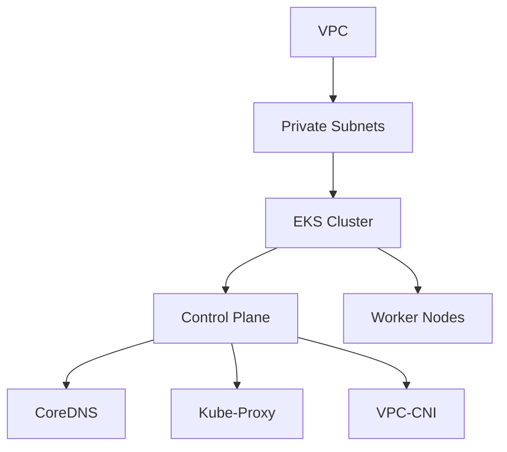

## Introduction to Kubernetes Security in AWS EKS Clusters

### Background Theory

Kubernetes is an open-source system for automating deployment, scaling, and management of containerized applications. It was originally designed by Google and is now maintained by the Cloud Native Computing Foundation. Kubernetes provides a platform for automating deployment and scaling of containerized applications, and it manages the infrastructure on which those applications run.

In the context of DevSecOps, Kubernetes security is crucial because it ensures that the applications deployed on Kubernetes clusters are secure and resilient against various types of attacks. One popular way to deploy Kubernetes is through Amazon Elastic Kubernetes Service (EKS), which is a managed service that makes it easy to run Kubernetes on AWS without needing to stand up or maintain your own Kubernetes control plane.

### Setting Up an AWS EKS Cluster Using Terraform

To set up an AWS EKS cluster using Terraform, we need to define several key components:

1. **VPC**: A Virtual Private Cloud (VPC) is a virtual network dedicated to your AWS account. It allows you to launch AWS resources in a logically isolated virtual network.
2. **EKS Cluster**: The EKS cluster is the Kubernetes cluster that will run your containerized applications.
3. **Modules**: Terraform modules are reusable configurations that encapsulate the details of a particular resource or group of resources.

#### Step-by-Step Configuration

Let's break down the configuration process step-by-step.

##### 1. Define Variables

We start by defining the necessary variables in a `variables.tf` file. These variables will be used to configure the VPC and EKS cluster.

```hcl
variable "cluster_name" {
  description = "The name of the EKS cluster"
  type        = string
}

variable "kubernetes_version" {
  description = "The version of Kubernetes to use"
  type        = string
}

variable "vpc_cidr_block" {
  description = "The CIDR block for the VPC"
  type        = string
}

variable "private_subnet_ids" {
  description = "List of private subnet IDs"
  type        = list(string)
}
```

##### 2. Create VPC

Next, we create the VPC using the `aws_vpc` resource.

```hcl
resource "aws_vpc" "main" {
  cidr_block = var.vpc_cidr_block
  tags = {
    Name = "main-vpc"
  }
}
```

##### 3. Create Subnets

We then create the private subnets within the VPC.

```hcl
resource "aws_subnet" "private" {
  count         = length(var.private_subnet_ids)
  vpc_id        = aws_vpc.main.id
  cidr_block    = element(var.private_subnet_ids, count.index)
  availability_zone = data.aws_availability_zones.available.names[count.index]
  tags = {
    Name = "private-subnet-${count.index}"
  }
}
```

##### 4. Configure EKS Cluster

Now, we configure the EKS cluster using the `aws_eks_cluster` resource.

```hcl
resource "aws_eks_cluster" "main" {
  name     = var.cluster_name
  version  = var.kubernetes_version
  role_arn = aws_iam_role.eks_cluster_role.arn

  vpc_config {
    subnet_ids = [for s in aws_subnet.private : s.id]
  }

  depends_on = [aws_iam_role_policy_attachment.ecs_service_role]
}
```

##### 5. Install Add-Ons

Finally, we install the default add-ons for the EKS cluster.

```hcl
resource "aws_eks_addon" "coredns" {
  cluster_name = aws_eks_cluster.main.name
  addon_name   = "coredns"
  resolve_conflicts = "OVERWRITE"
}

resource "aws_eks_addon" "kube-proxy" {
  cluster_name = aws_eks_cluster.main.name
  addon_name   = "kube-proxy"
  resolve_conflicts = "OVERWRITE"
}

resource "aws_ eks_addon" "vpc-cni" {
  cluster_name = aws_eks_cluster.main.name
  addon_name   = "vpc-cni"
  resolve_conflicts = "OVERWRITE"
}
```

### Mermaid Diagrams

To visualize the architecture, we can use a mermaid diagram.



### Pitfalls and Common Mistakes

1. **Incorrect Subnet Configuration**: Ensure that the subnets are correctly configured and that the correct subnets are being used for the EKS cluster.
2. **Security Groups**: Make sure that the security groups are properly configured to allow traffic between the nodes and the control plane.
3. **IAM Roles**: Ensure that the IAM roles and policies are correctly set up to allow the EKS cluster to function properly.

### How to Prevent / Defend

#### Detection

1. **Logging and Monitoring**: Enable logging and monitoring for the EKS cluster using tools like AWS CloudTrail and Amazon CloudWatch.
2. **Network Policies**: Implement network policies to restrict traffic between pods and services.

#### Prevention

1. **IAM Role Hardening**: Ensure that the IAM roles used by the EKS cluster have the minimum necessary permissions.
2. **Node Security**: Harden the security of the worker nodes by disabling unnecessary services and ensuring that the nodes are up-to-date with the latest security patches.

#### Secure Coding Fixes

Here is an example of a vulnerable configuration and the corresponding secure configuration.

**Vulnerable Configuration**

```hcl
resource "aws_eks_cluster" "main" {
  name     = var.cluster_name
  version  = var.kubernetes_version
  role_arn = aws_iam_role.eks_cluster_role.arn

  vpc_config {
    subnet_ids = [for s in aws_subnet.private : s.id]
  }

  depends_on = [aws_iam_role_policy_attachment.ecs_service_role]
}
```

**Secure Configuration**

```hcl
resource "aws_eks_cluster" "main" {
  name     = var.cluster_name
  version  = var.kubernetes_version
  role_arn = aws_iam_role.eks_cluster_role.arn

  vpc_config {
    subnet_ids = [for s in aws_subnet.private : s.id]
  }

  depends_on = [aws_iam_role_policy_attachment.ecs_service_role]

  # Additional security measures
  encryption_config {
    provider {
      key_arn = aws_kms_key.main.arn
    }
  }

  iam_role {
    attach_policy_arns = [
      "arn:aws:iam::aws:policy/AmazonEKSClusterPolicy",
      "arn:aws:iam::aws:policy/AmazonEKSServicePolicy"
    ]
  }
}
```

### Real-World Examples

One recent example of a Kubernetes security breach is the CVE-2021-25741, which affected the Kubernetes API server. This vulnerability allowed attackers to bypass authentication and gain unauthorized access to the cluster. To mitigate such vulnerabilities, it is essential to keep the Kubernetes components up-to-date and to implement proper security measures.

### Practice Labs

For hands-on practice, consider the following labs:

- **PortSwigger Web Security Academy**: Offers a variety of labs related to Kubernetes security.
- **OWASP Juice Shop**: Provides a vulnerable application that can be deployed on Kubernetes for testing and learning purposes.
- **Kubernetes Goat**: A security-focused Kubernetes environment for practicing and learning about Kubernetes security.

By following these steps and implementing the necessary security measures, you can ensure that your AWS EKS cluster is secure and resilient against various types of attacks.

---
<!-- nav -->
[[10-Introduction to Kubernetes Security in AWS EKS Clusters Part 1|Introduction to Kubernetes Security in AWS EKS Clusters Part 1]] | [[DevSecOps/DevSecOps Bootcamp/01-DevSecOps Introduction/08-Introduction to Kubernetes Security/Provision AWS EKS Cluster/00-Overview|Overview]] | [[12-Introduction to Kubernetes Security Part 1|Introduction to Kubernetes Security Part 1]]
