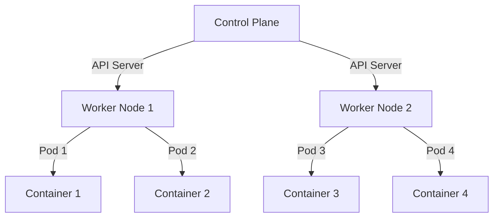
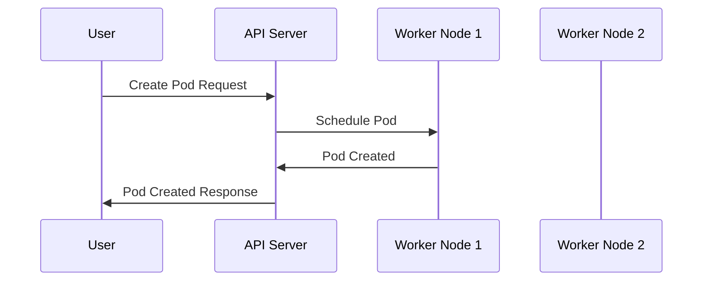

## Introduction to Kubernetes Security

### Background Theory

Kubernetes is an open-source system for automating deployment, scaling, and management of containerized applications. It was designed to provide a platform for automating deployment and scaling of containerized applications. Kubernetes clusters consist of a control plane and worker nodes. The control plane manages the cluster, while worker nodes host the application workloads.

Security in Kubernetes is crucial because it ensures that the applications running within the cluster are protected against various threats. This includes securing the control plane, worker nodes, and the communication between them. A secure Kubernetes environment helps prevent unauthorized access, data breaches, and other security vulnerabilities.

### Provisioning an AWS EKS Cluster

#### Step-by-Step Process

To provision an AWS EKS (Elastic Kubernetes Service) cluster, follow these steps:

1. **Destroy the Existing Cluster**: Before making any changes, it's essential to destroy the existing cluster. This ensures that the new cluster is deployed with the desired configurations.

2. **Redeploy the Cluster**: After destroying the existing cluster, redeploy it with the new configuration.

3. **Upgrade the Cluster**: Ensure that the cluster is running the latest supported version of Kubernetes.

#### Code Example

Here’s how you can destroy and redeploy an EKS cluster using the AWS CLI:

```bash
# Destroy the existing EKS cluster
aws eks delete-cluster --name <cluster-name>

# Wait for the cluster to be deleted
aws eks wait cluster-deleted --name <cluster-name>

# Redeploy the cluster with the new configuration
aws eks create-cluster \
    --name <cluster-name> \
    --role-arn <eks-cluster-role-arn> \
    --resources-vpc-config subnetIds=<subnet-id>,securityGroupIds=<security-group-id> \
    --version <kubernetes-version>
```

### Security Improvements

#### Upgrading the Cluster

Upgrading the Kubernetes version is one of the first steps in improving the security of your cluster. Newer versions often contain security patches and improvements that help protect against known vulnerabilities.

##### Latest Supported Version

While the latest version of Kubernetes might not be immediately available through EKS, it's important to use the most recent version that EKS supports. This ensures that you benefit from the latest security enhancements.

##### Code Example

Here’s how you can specify the Kubernetes version when creating a new EKS cluster:

```bash
# Create a new EKS cluster with the latest supported version
aws eks create-cluster \
    --name <cluster-name> \
    --role-arn <eks-cluster-role-arn> \
    --resources-vpc-config subnetIds=<subnet-id>,securityGroupIds=<security-group-id> \
    --version <latest-supported-kubernetes-version>
```

### Access Management

Proper access management is critical for securing a Kubernetes cluster. This involves controlling who can access the cluster and what actions they can perform.

#### Role-Based Access Control (RBAC)

RBAC is a method of regulating access to resources based on the roles of individual users within the organization. In Kubernetes, RBAC allows you to define permissions for different users and groups.

##### Code Example

Here’s an example of defining an RBAC role and binding it to a user:

```yaml
# Define a role
apiVersion: rbac.authorization.k8s.io/v1
kind: Role
metadata:
  namespace: default
  name: pod-reader
rules:
- apiGroups: [""]
  resources: ["pods"]
  verbs: ["get", "watch", "list"]

# Bind the role to a user
apiVersion: rbac.authorization.k8s.io/v1
kind: RoleBinding
metadata:
  name: read-pods
  namespace: default
subjects:
- kind: User
  name: johndoe
  apiGroup: rbac.authorization.k8s.io
roleRef:
  kind: Role
  name: pod-reader
  apiGroup: rbac.authorization.k8s.io
```

### Real-World Examples

#### Recent CVEs and Breaches

Recent vulnerabilities and breaches highlight the importance of maintaining a secure Kubernetes environment. For example, the CVE-2021-25742 vulnerability in Kubernetes allowed attackers to bypass RBAC restrictions and gain elevated privileges.

##### How to Prevent / Defend

1. **Regularly Update**: Keep your Kubernetes version up-to-date to ensure you have the latest security patches.
2. **Enable RBAC**: Always enable RBAC to enforce strict access controls.
3. **Audit Logs**: Enable audit logs to monitor and detect unauthorized access attempts.
4. **Network Policies**: Implement network policies to restrict traffic between pods and external networks.

##### Code Example

Here’s how you can enable audit logging in Kubernetes:

```yaml
apiVersion: audit.k8s.io/v1
kind: Policy
rules:
- level: Metadata
  users: ["system:serviceaccount:kube-system:default"]
- level: Request
  verbs: ["create", "update", "delete"]
- level: None
  users: ["system:apiserver"]
```

### Mermaid Diagrams

#### Network Topology

A network topology diagram can help visualize the architecture of your Kubernetes cluster and the communication between components.



#### Sequence Diagram

A sequence diagram can illustrate the flow of requests and responses in a Kubernetes cluster.



### Common Pitfalls

#### Misconfigured RBAC

One common pitfall is misconfiguring RBAC, which can lead to unauthorized access. Always ensure that RBAC roles and bindings are correctly defined and that unnecessary permissions are minimized.

#### Outdated Kubernetes Version

Running an outdated version of Kubernetes can expose your cluster to known vulnerabilities. Regularly updating to the latest supported version is crucial.

### Detection and Prevention

#### Detection

Use tools like `kube-bench` to audit your Kubernetes cluster for compliance with CIS benchmarks. This helps identify potential security issues.

##### Code Example

Here’s how you can run `kube-bench`:

```bash
kubectl apply -f https://raw.githubusercontent.com/aquasecurity/kube-bench/master/job.yaml
kubectl logs -l app=kube-bench
```

#### Prevention

Implement security best practices such as:

1. **Least Privilege Principle**: Grant users and services the minimum permissions necessary to perform their tasks.
2. **Network Segmentation**: Use network policies to segment your cluster and restrict unnecessary traffic.
3. **Regular Audits**: Conduct regular security audits to identify and address potential vulnerabilities.

### Secure Coding Fixes

#### Vulnerable Code Example

Here’s an example of a vulnerable RBAC configuration:

```yaml
apiVersion: rbac.authorization.k8s.io/v1
kind: Role
metadata:
  namespace: default
  name: admin
rules:
- apiGroups: ["*"]
  resources: ["*"]
  verbs: ["*"]
```

#### Secure Code Example

Here’s the corrected secure version:

```yaml
apiVersion: rbac.authorization.k8s.io/v1
kind: Role
metadata:
  namespace: default
  name: pod-reader
rules:
- apiGroups: [""]
  resources: ["pods"]
  verbs: ["get", "watch", "list"]
```

### Configuration Hardening

#### IAM Policies

Ensure that IAM policies are properly configured to limit access to your EKS cluster.

##### Code Example

Here’s an example of an IAM policy:

```json
{
    "Version": "2012-10-17",
    "Statement": [
        {
            "Effect": "Allow",
            "Action": [
                "eks:DescribeCluster",
                "eks:ListClusters"
            ],
            "Resource": "*"
        }
    ]
}
```

### Conclusion

Securing a Kubernetes cluster involves multiple layers of protection, including upgrading to the latest supported version, implementing proper access management, and regularly auditing your cluster for vulnerabilities. By following these best practices, you can significantly enhance the security of your Kubernetes environment.

### Practice Labs

For hands-on practice, consider the following labs:

- **Kubernetes Goat**: A hands-on lab for learning Kubernetes security.
- **OWASP WrongSecrets**: A project for learning about secrets management in Kubernetes.
- **kube-hunter**: A tool for identifying security issues in Kubernetes clusters.

These labs provide practical experience in securing Kubernetes environments and help reinforce the concepts covered in this chapter.

---
<!-- nav -->
[[11-Introduction to Kubernetes Security in AWS EKS Clusters|Introduction to Kubernetes Security in AWS EKS Clusters]] | [[DevSecOps/DevSecOps Bootcamp/01-DevSecOps Introduction/08-Introduction to Kubernetes Security/Provision AWS EKS Cluster/00-Overview|Overview]] | [[13-Introduction to Kubernetes Security|Introduction to Kubernetes Security]]
