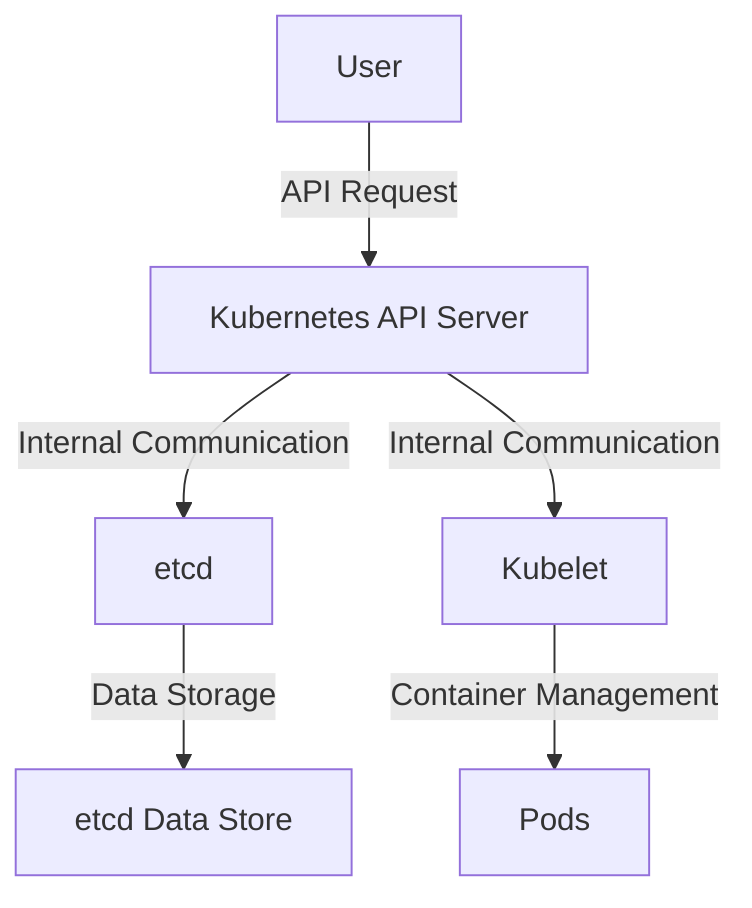
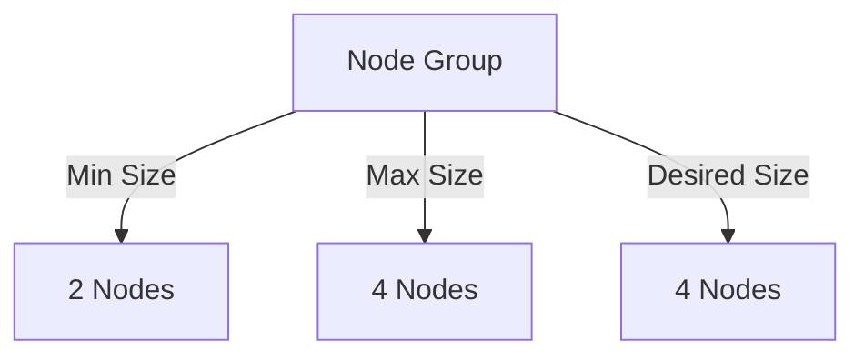

## Introduction to Kubernetes Security

### Provisioning an AWS EKS Cluster

In this section, we will delve into the process of provisioning an Amazon Web Services (AWS) Elastic Kubernetes Service (EKS) cluster. This involves setting up the necessary infrastructure to host and manage containerized applications using Kubernetes. We will cover the steps involved in creating the cluster, configuring the `kubeconfig` file, and connecting to the cluster using the `kubectl` command-line interface (CLI).

#### Background Theory

Kubernetes is an open-source platform designed to automate deploying, scaling, and operating application containers. It provides a framework for managing containerized applications at scale, offering a robust set of features for deployment, maintenance, and scaling of containerized applications.

Amazon EKS is a managed service that makes it easy to run Kubernetes on AWS without needing expertise in Kubernetes cluster setup and management. EKS handles the availability and scalability of the Kubernetes control plane, allowing users to focus on deploying and managing their applications.

#### Creating the EKS Cluster

To create an EKS cluster, you typically use the AWS Management Console, AWS Command Line Interface (CLI), or Infrastructure as Code (IaC) tools like AWS CloudFormation or Terraform. Here, we will focus on the AWS CLI approach.

##### Step-by-Step Process

1. **Create the EKS Cluster**:
    - Use the `aws eks create-cluster` command to create the cluster.
    - Specify the cluster name, role ARN, and other parameters.

```bash
aws eks create-cluster \
    --name my-cluster \
    --role-arn arn:aws:iam::123456789012:role/eksClusterRole \
    --resources-vpc-config subnetIds=subnet-12345678,subnet-abcdefgh \
    --region eu-central-1
```

2. **Wait for the Cluster to be Created**:
    - Monitor the creation status using the `aws eks describe-cluster` command.

```bash
aws eks describe-cluster --name my-cluster --region eu-central-1
```

3. **Configure `kubeconfig`**:
    - Once the cluster is created, AWS provides a command to update your local `kubeconfig` file to include the new cluster.

```bash
aws eks update-kubeconfig --name my-cluster --region eu-central-1
```

4. **Verify Connection**:
    - Use `kubectl` to verify that you can connect to the cluster.

```bash
kubectl get nodes
```

#### Output Information

When the cluster creation process completes, AWS outputs several pieces of information:

- **Cluster Endpoint**: The URL to access the Kubernetes API server.
- **Cluster Name**: The name of the cluster.
- **Active Status**: Indicates whether the cluster is active.
- **Command to Update `kubeconfig`**: A command to configure `kubeconfig` for connecting to the cluster.

For example:

```plaintext
Cluster endpoint: https://<endpoint>.com
Cluster name: my-cluster
Status: ACTIVE
Command to update kubeconfig: aws eks update-kubeconfig --name my-cluster --region eu-central-1
```

#### Connecting to the Cluster

After updating the `kubeconfig`, you can use `kubectl` to interact with the cluster. For instance, to list the nodes in the cluster:

```bash
kubectl get nodes
```

This command should return the list of nodes in the cluster, confirming successful connection.

### Node Group Configuration

The node group defines the worker nodes in the cluster. These nodes run the containerized applications. In the provided example, the node group is configured to have four instances initially, but it can scale down to two instances based on resource requirements.

#### Scaling Mechanism

Kubernetes supports dynamic scaling of nodes based on the workload. This is achieved through the use of auto-scaling groups in AWS. The node group configuration specifies the minimum and maximum number of nodes, and Kubernetes automatically scales the number of nodes within this range based on the current workload.

For example, the node group might be configured as follows:

```yaml
nodeGroup:
  minSize: 2
  maxSize: 4
  desiredSize: 4
```

This configuration ensures that the cluster starts with four nodes but can scale down to two nodes if the workload decreases.

### Monitoring the Cluster

You can monitor the cluster and its nodes using the AWS Management Console or the `kubectl` command-line tool. For instance, to view the Kubernetes version and node group details:

```bash
kubectl version
kubectl get nodes
```

These commands provide detailed information about the cluster and its nodes.

### Real-World Examples and Recent Breaches

Recent breaches involving Kubernetes clusters highlight the importance of securing these environments. For example, the 2021 breach of a Kubernetes cluster used by a major cryptocurrency exchange resulted in significant financial losses. The breach occurred due to misconfigured access controls and exposed API endpoints.

To prevent such breaches, it is crucial to implement robust security measures, including:

- **Network Policies**: Restrict traffic between pods and external networks.
- **RBAC (Role-Based Access Control)**: Limit access to Kubernetes resources based on roles.
- **Pod Security Policies**: Enforce security constraints on pod creation.
- **Encryption**: Encrypt sensitive data both at rest and in transit.

### How to Prevent / Defend

#### Detection

- **Monitoring Tools**: Use tools like Prometheus and Grafana for monitoring Kubernetes metrics.
- **Security Scanners**: Regularly scan the cluster using tools like Trivy or kube-bench.

#### Prevention

- **Secure Configurations**: Ensure that all configurations follow best practices and are regularly audited.
- **Access Controls**: Implement strict RBAC policies and limit access to sensitive resources.
- **Encryption**: Enable encryption for data at rest and in transit.

#### Secure Coding Fixes

Here is an example of a vulnerable configuration and its secure counterpart:

**Vulnerable Configuration**:
```yaml
apiVersion: v1
kind: Pod
metadata:
  name: my-pod
spec:
  containers:
  - name: my-container
    image: my-image
    ports:
    - containerPort: 80
```

**Secure Configuration**:
```yaml
apiVersion: v1
kind: Pod
metadata:
  name: my-pod
spec:
  containers:
  - name: my-container
    image: my-image
    ports:
    - containerPort: 80
  securityContext:
    runAsUser: 1000
    runAsNonRoot: true
```

### Complete Example

Here is a complete example of creating an EKS cluster, configuring `kubeconfig`, and connecting to the cluster:

#### Create the Cluster

```bash
aws eks create-cluster \
    --name my-cluster \
    --role-arn arn:aws:iam::123456789012:role/eksClusterRole \
    --resources-vpc-config subnetIds=subnet-12345678,subnet-abcdefgh \
    --region eu-central-1
```

#### Wait for Completion

```bash
aws eks describe-cluster --name my-cluster --region eu-central-1
```

#### Configure `kubeconfig`

```bash
aws eks update-kubeconfig --name my-cluster --region eu-central-1
```

#### Connect to the Cluster

```bash
kubectl get nodes
```

### Mermaid Diagrams

#### Cluster Architecture



#### Node Group Configuration



### Practice Labs

For hands-on practice with Kubernetes security on AWS, consider the following labs:

- **PortSwigger Web Security Academy**: Offers exercises related to web application security, including Kubernetes-specific challenges.
- **OWASP Juice Shop**: A deliberately insecure web application for practicing web security skills.
- **Kubernetes Goat**: A vulnerable Kubernetes environment for learning and testing security practices.

By following these steps and implementing robust security measures, you can ensure that your Kubernetes cluster on AWS is secure and reliable.

---
<!-- nav -->
[[12-Introduction to Kubernetes Security Part 1|Introduction to Kubernetes Security Part 1]] | [[DevSecOps/DevSecOps Bootcamp/01-DevSecOps Introduction/08-Introduction to Kubernetes Security/Provision AWS EKS Cluster/00-Overview|Overview]] | [[DevSecOps/DevSecOps Bootcamp/01-DevSecOps Introduction/08-Introduction to Kubernetes Security/Provision AWS EKS Cluster/14-Practice Questions & Answers|Practice Questions & Answers]]
