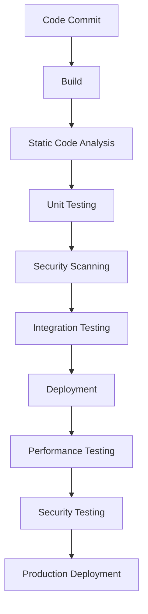
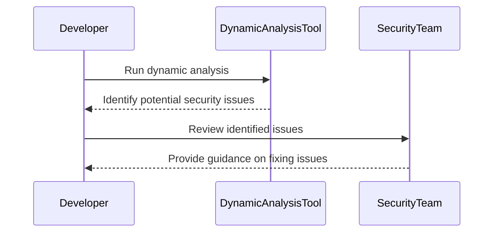
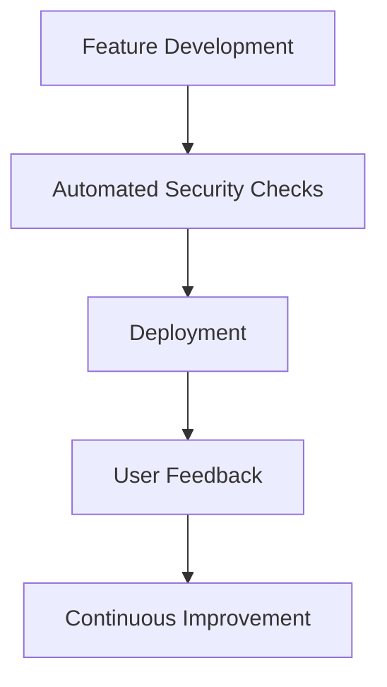

## Understanding DevSecOps Concepts

### Introduction to DevSecOps

DevSecOps is a methodology that integrates security practices into the DevOps lifecycle. This approach aims to ensure that security is not an afterthought but is embedded throughout the development, testing, and deployment phases. Before diving into the specifics, let's establish a foundational understanding of what DevSecOps entails.

#### What is DevSecOps?

In its simplest form, DevSecOps is the practice of incorporating security within Agile and DevOps methodologies. Traditionally, security was often treated as a separate phase, typically occurring late in the development cycle. However, with the increasing complexity and pace of modern software development, this approach has proven to be insufficient. DevSecOps seeks to address this by embedding security practices into the entire development lifecycle, ensuring that security is considered at every stage.

#### Why is DevSecOps Important?

The importance of DevSecOps lies in its ability to enhance the security posture of organizations while maintaining agility and speed. By integrating security into the development process, teams can identify and mitigate vulnerabilities earlier, reducing the likelihood of security breaches. This proactive approach not only helps in preventing security incidents but also ensures that security does not become a bottleneck in the development process.

### Historical Context and Growth of DevSecOps

To better understand the significance of DevSecOps, it is essential to look at its historical context and growth. According to Google Trends data, there has been a marked increase in searches for the term "DevSecOps" over the past three years. This indicates a growing interest and recognition of the importance of integrating security into DevOps practices.

#### Real-World Examples of DevSecOps Adoption

Several high-profile breaches have highlighted the need for robust security practices. For instance, the Capital One breach in 2019 exposed sensitive data of over 100 million customers. This incident underscored the critical importance of embedding security into the development process. Organizations like Capital One could have benefited from adopting DevSecOps principles, which would have helped in identifying and mitigating such vulnerabilities earlier.

### Core Principles of DevSecOps

Shannon Litz, a prominent figure in the DevSecOps community, provides a succinct yet insightful definition of DevSecOps:

"The purpose and intent of DevSecOps is to build on the mindset that everyone is responsible for security, with the goal of safely distributing security decisions at speed and scale to those who hold the highest level of context without sacrificing the safety required."

This quote encapsulates the core principles of DevSecOps:

1. **Shared Responsibility**: Everyone in the team, from developers to operations staff, shares responsibility for security.
2. **Context-Based Decisions**: Security decisions should be made by individuals who have the most context about the system.
3. **Speed and Scale**: Security should not impede the speed and scale of development.
4. **Safety**: While enabling speed and scale, the safety of the system must not be compromised.

### Embedding Security in Agile Processes

One of the primary goals of DevSecOps is to embed security within already agile processes. This means integrating security practices into the continuous integration and continuous delivery (CI/CD) pipeline. Let's explore how this can be achieved.

#### Continuous Integration and Continuous Delivery (CI/CD)

CI/CD pipelines are central to modern software development. These pipelines automate the building, testing, and deployment of applications. Integrating security into these pipelines ensures that security checks are performed automatically and consistently.

##### Example of a CI/CD Pipeline with Security Checks

Consider a typical CI/CD pipeline for a web application. The pipeline might include the following steps:

1. **Code Commit**: Developers commit their changes to the version control system.
2. **Build**: The code is compiled and built into a deployable artifact.
3. **Static Code Analysis**: Tools like SonarQube perform static code analysis to identify potential security vulnerabilities.
4. **Unit Testing**: Automated unit tests are run to ensure the code functions as expected.
5. **Security Scanning**: Tools like OWASP ZAP or Burp Suite perform security scans on the application.
6. **Integration Testing**: Automated integration tests are run to ensure the components work together correctly.
7. **Deployment**: The application is deployed to a staging environment.
8. **Performance Testing**: Performance tests are run to ensure the application meets performance requirements.
9. **Security Testing**: Security tests are run to ensure the application is secure.
10. **Production Deployment**: The application is deployed to the production environment.



### Context-Based Security Decisions

Another key principle of DevSecOps is making security decisions based on context. This means that security decisions should be made by individuals who have the most context about the system. This approach ensures that security measures are tailored to the specific needs of the application.

#### Example of Context-Based Security Decisions

Consider a scenario where a developer is working on a feature that requires access to sensitive data. Instead of having a security team review every change, the developer can use tools like dynamic analysis to identify potential security issues. This allows the developer to make informed decisions about security based on the context of the feature being developed.



### Speed and Scale Without Sacrificing Safety

DevSecOps aims to enable speed and scale without compromising safety. This means that security measures should not slow down the development process. Instead, they should be integrated seamlessly into the development workflow.

#### Example of Enabling Speed and Scale

Consider a scenario where a company is deploying a new feature to a large number of users. Traditional security practices might involve extensive manual reviews and testing, which can significantly slow down the deployment process. With DevSecOps, automated security checks can be integrated into the deployment pipeline, allowing the feature to be deployed quickly and securely.



### How to Prevent / Defend Against Security Risks

While DevSecOps aims to proactively integrate security into the development process, it is also crucial to have robust detection and prevention mechanisms in place. Let's explore some common security risks and how to defend against them.

#### Common Security Risks

1. **Injection Attacks**: Injection attacks occur when untrusted data is sent as part of a command or query. This can lead to unauthorized access or data manipulation.
2. **Broken Authentication**: Weak authentication mechanisms can allow attackers to gain unauthorized access to systems.
3. **Sensitive Data Exposure**: Exposing sensitive data, such as passwords or personal information, can lead to data breaches.
4. **Cross-Site Scripting (XSS)**: XSS attacks occur when an attacker injects malicious scripts into a trusted website, leading to unauthorized actions.

#### Detection and Prevention Mechanisms

1. **Static Code Analysis**: Tools like SonarQube can identify potential security vulnerabilities in the code.
2. **Dynamic Analysis**: Tools like OWASP ZAP or Burp Suite can perform security scans on the application.
3. **Penetration Testing**: Regular penetration testing can help identify and mitigate security vulnerabilities.
4. **Secure Coding Practices**: Following secure coding practices, such as input validation and parameterized queries, can help prevent injection attacks.

#### Secure Coding Fix Example

Consider a scenario where a developer is using a SQL query to retrieve user data. Without proper input validation, this query can be vulnerable to SQL injection attacks.

**Vulnerable Code:**

```sql
SELECT * FROM users WHERE username = '$username';
```

**Fixed Code:**

```sql
PreparedStatement stmt = connection.prepareStatement("SELECT * FROM users WHERE username = ?");
stmt.setString(1, username);
ResultSet rs = stmt.executeQuery();
```

By using a prepared statement, the query is parameterized, preventing SQL injection attacks.

### Conclusion

DevSecOps is a critical methodology for integrating security into the DevOps lifecycle. By embedding security practices into the development process, organizations can enhance their security posture while maintaining agility and speed. The core principles of DevSecOps—shared responsibility, context-based decisions, speed and scale without sacrificing safety—are essential for achieving this goal. By following these principles and implementing robust detection and prevention mechanisms, organizations can effectively defend against security risks.

### Hands-On Labs

For hands-on experience with DevSecOps concepts, consider the following labs:

- **PortSwigger Web Security Academy**: Offers interactive labs to practice web security techniques.
- **OWASP Juice Shop**: A deliberately insecure web application for practicing security testing.
- **DVWA (Damn Vulnerable Web Application)**: Another intentionally vulnerable web application for learning security testing.
- **WebGoat**: An interactive training application for learning about web application security.

These labs provide practical experience in applying DevSecOps principles and techniques.

---

This expanded chapter provides a comprehensive understanding of DevSecOps concepts, including historical context, core principles, real-world examples, and practical implementation strategies. By following these guidelines, readers can gain a deep understanding of how to effectively integrate security into their DevOps practices.

---
<!-- nav -->
[[DevSecOps/DevSecOps Bootcamp/01-DevSecOps Introduction/09-Understanding DevSecOps Concepts/01-The DevSecOps Concept/00-Overview|Overview]] | [[DevSecOps/DevSecOps Bootcamp/01-DevSecOps Introduction/09-Understanding DevSecOps Concepts/01-The DevSecOps Concept/02-Practice Questions & Answers|Practice Questions & Answers]]
