## Continuous Integration and Delivery (CI/CD) Pipelines

### Introduction to CI/CD Pipelines

Continuous Integration and Continuous Delivery (CI/CD) pipelines are fundamental components of modern software development practices, particularly within the DevSecOps framework. These pipelines automate the process of integrating code changes from multiple contributors into a shared repository and deploying those changes to production environments. The term "pipeline" is used because these processes are typically a sequence of steps that occur in a specific order, often highly automated.

#### Components of a CI/CD Pipeline

A typical CI/CD pipeline consists of several key components:

1. **Source Code Management**: This is where all the code is stored and managed. Common tools include Git, SVN, and others. Developers commit their changes to this repository, and the pipeline pulls the latest code from here.
2. **Build**: This step compiles the source code into executable artifacts. This could involve compiling Java code, building Docker images, or other similar tasks.
3. **Unit Testing**: Automated tests that verify the correctness of individual units of code.
4. **Integration Testing**: Tests that ensure different parts of the application work together correctly.
5. **Deployment**: The process of moving the compiled and tested code to various environments such as development, staging, and production.
6. **Environments**: Different stages where the software lives and operates. Common environments include development, test, staging, and production.

### Detailed Breakdown of Each Component

#### Source Code Management

**What**: Source code management (SCM) is the practice of managing changes to the source code of a project. It allows multiple developers to work on the same project simultaneously without conflicts.

**Why**: SCM is crucial because it provides a history of changes, allows for collaboration among team members, and enables rollbacks to previous versions if necessary.

**How**: Tools like Git, SVN, and Bitbucket are commonly used for SCM. Developers commit their changes to the repository, and the pipeline pulls the latest code from here.

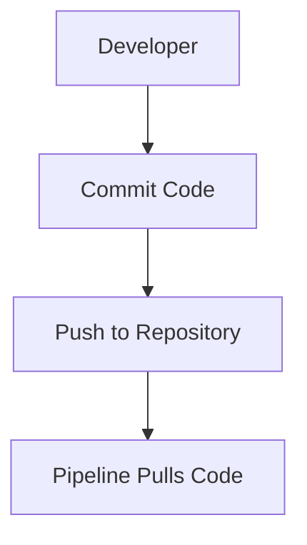

#### Build

**What**: The build step compiles the source code into executable artifacts. This could involve compiling Java code, building Docker images, or other similar tasks.

**Why**: Building ensures that the code is syntactically correct and can be executed. It also allows for the creation of artifacts that can be deployed to different environments.

**How**: Tools like Maven, Gradle, and Docker are commonly used for building. The pipeline runs these tools to compile the code and create the necessary artifacts.

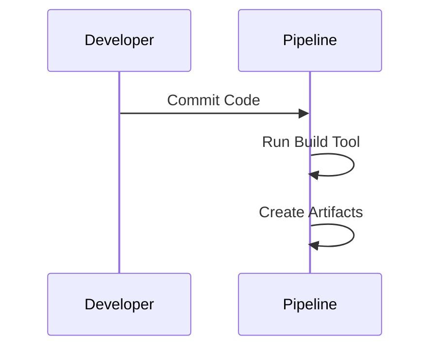

#### Unit Testing

**What**: Unit testing is the process of verifying the correctness of individual units of code. These tests are typically automated and run as part of the pipeline.

**Why**: Unit testing helps catch bugs early in the development cycle, ensuring that individual pieces of code work as expected.

**How**: Tools like JUnit, PyTest, and Mocha are commonly used for unit testing. The pipeline runs these tests after the build step.

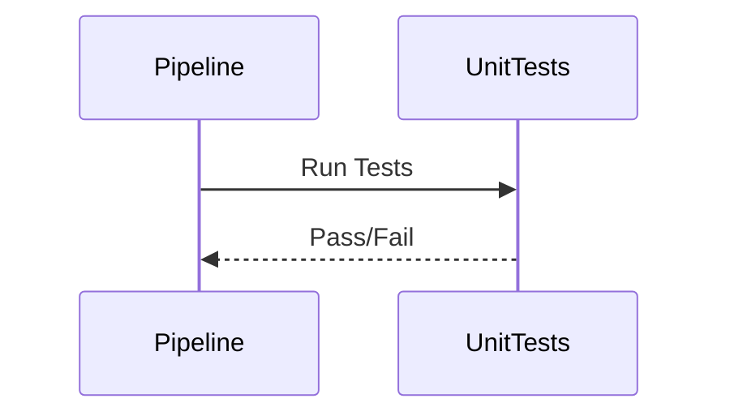

#### Integration Testing

**What**: Integration testing verifies that different parts of the application work together correctly. This includes testing interactions between different modules, services, and databases.

**Why**: Integration testing ensures that the system as a whole functions correctly, catching issues that might not be apparent during unit testing.

**How**: Tools like Selenium, Postman, and Gatling are commonly used for integration testing. The pipeline runs these tests after the unit testing step.

```mer
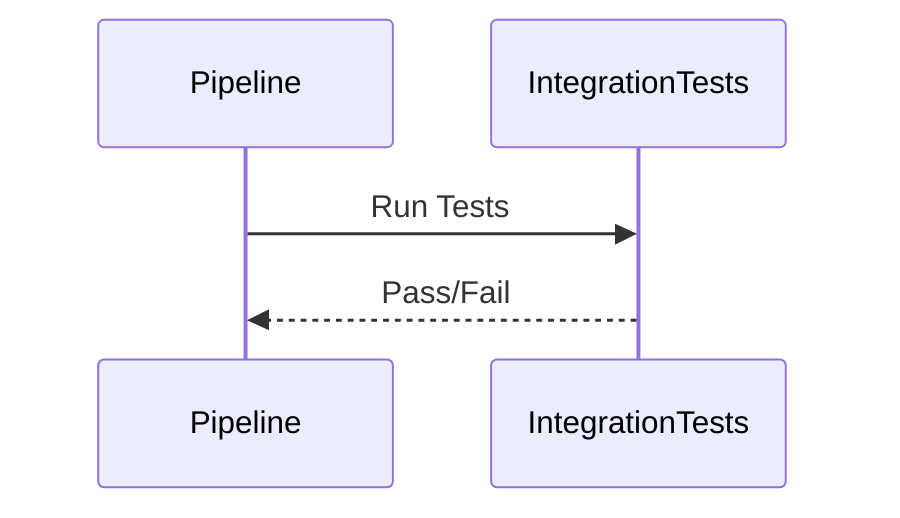

#### Deployment

**What**: Deployment is the process of moving the compiled and tested code to various environments such as development, staging, and production.

**Why**: Deployment ensures that the latest changes are available in the appropriate environments, allowing for testing and eventual release to end-users.

**How**: Tools like Jenkins, GitLab CI/CD, and CircleCI are commonly used for deployment. The pipeline uses these tools to push the code to the desired environments.

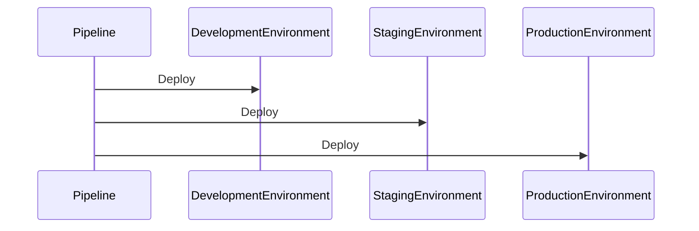

### Environments

**What**: Different environments where the software lives and operates. Common environments include development, test, staging, and production.

**Why**: Having multiple environments allows for testing at different levels of maturity before releasing to end-users. This reduces the risk of introducing bugs into production.

**How**: Each environment is typically isolated and configured differently. For example, the development environment might have more relaxed security settings, while the production environment has strict security measures.

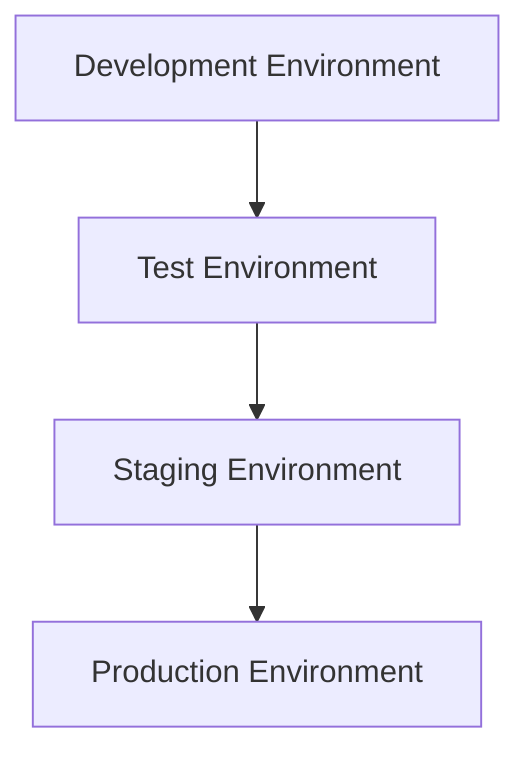

### Integrating Security into CI/CD Pipelines

Security is a critical aspect of modern software development, and integrating it into CI/CD pipelines is essential for ensuring the security of the final product. This section covers how to integrate security into each stage of the pipeline.

#### Security Design Before Code Writing

**What**: Security design involves identifying potential security risks and designing the system to mitigate them before any code is written.

**Why**: By addressing security concerns early in the development process, you can avoid costly and time-consuming fixes later on.

**How**: Techniques such as threat modeling and security architecture reviews are used to identify and mitigate potential security risks.

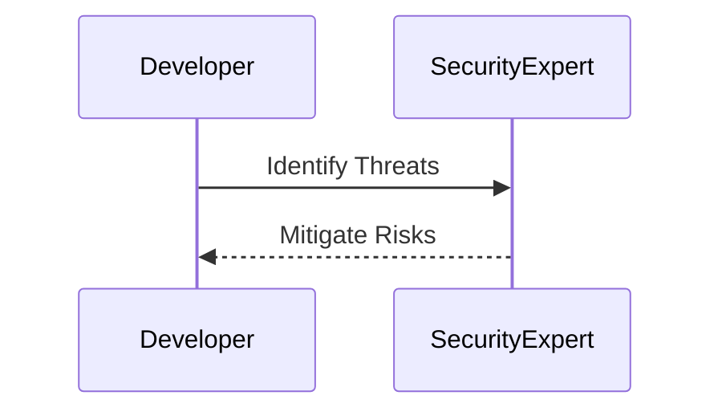

#### Automated Security Review

**What**: An automated security review is a process where tools automatically scan the code for security vulnerabilities.

**Why**: Automated security reviews help catch security issues early in the development cycle, reducing the risk of vulnerabilities making it to production.

**How**: Tools like SonarQube, Fortify, and Veracode are commonly used for automated security reviews. The pipeline integrates these tools to scan the code during the build step.

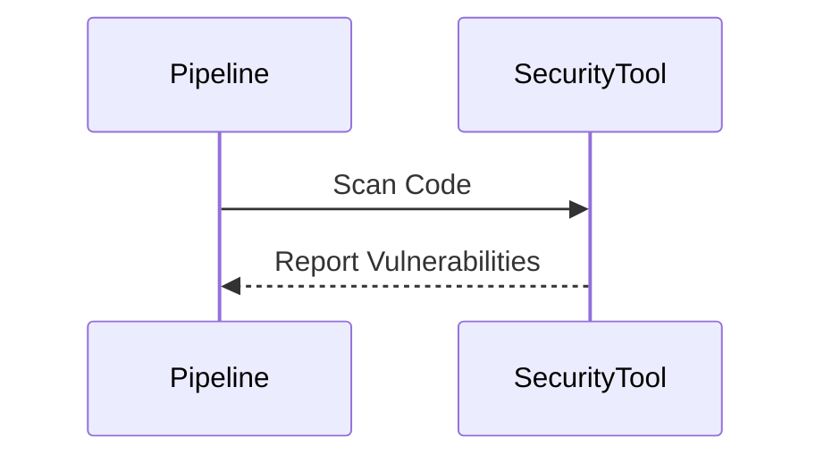

#### Security Testing in the CI Pipeline

**What**: Security testing involves verifying that the application is secure against various types of attacks.

**Why**: Security testing ensures that the application is robust and can withstand attacks, protecting both the application and its users.

**How**: Tools like OWASP ZAP, Burp Suite, and Nessus are commonly used for security testing. The pipeline integrates these tools to perform security tests during the testing phase.

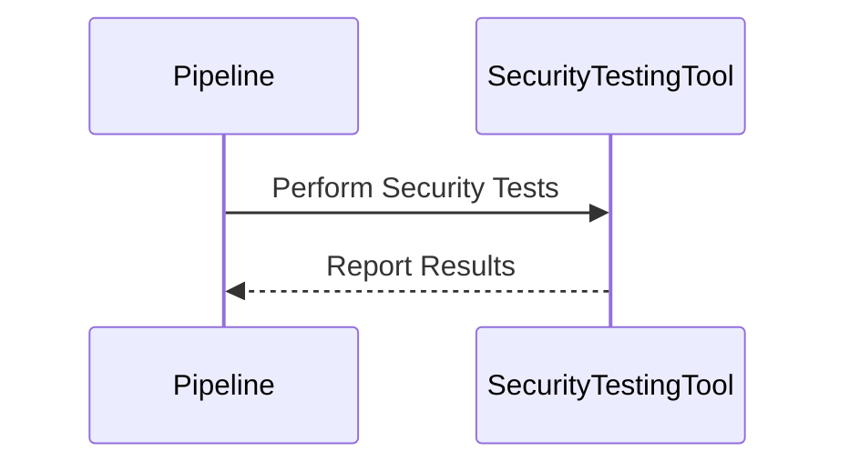

### Real-World Examples and Recent Breaches

#### Example 1: Equifax Data Breach (CVE-2017-5638)

In 2017, Equifax suffered a massive data breach due to a vulnerability in Apache Struts. This breach exposed sensitive information of millions of customers. The lack of proper security testing and patch management in their CI/CD pipeline contributed to this breach.

**How to Prevent / Defend**:

1. **Automated Security Scanning**: Integrate tools like SonarQube and Fortify to scan for known vulnerabilities.
2. **Patch Management**: Ensure that all dependencies are up-to-date and patched regularly.
3. **Secure Coding Practices**: Follow secure coding guidelines and conduct regular code reviews.

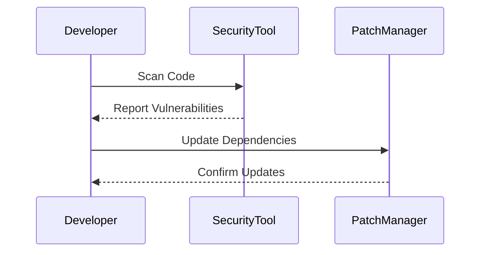

#### Example 2: Capital One Data Breach (CVE-2019-11510)

In 2019, Capital One suffered a data breach due to a misconfiguration in their web application firewall. This breach exposed sensitive information of millions of customers. The lack of proper security testing and configuration management in their CI/CD pipeline contributed to this breach.

**How to Prevent / Defend**:

1. **Configuration Management**: Use tools like Ansible and Terraform to manage configurations and ensure consistency.
2. **Regular Security Audits**: Conduct regular security audits to identify and fix misconfigurations.
3. **Secure Configuration Guidelines**: Follow secure configuration guidelines and conduct regular configuration reviews.

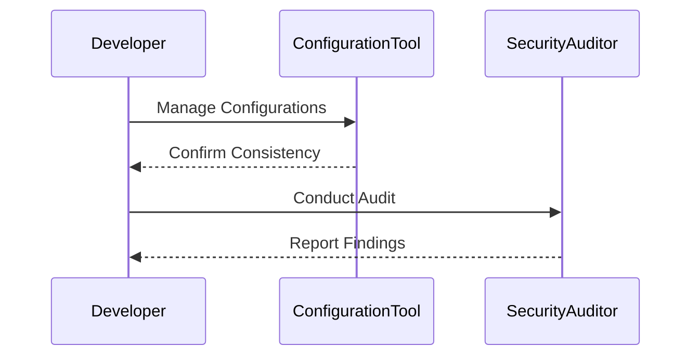

### Complete Example of a CI/CD Pipeline with Security

#### Full Example of a CI/CD Pipeline

Consider a simple web application built using Node.js and deployed using Docker. The following is a complete example of a CI/CD pipeline with security integrated.

```yaml
# .github/workflows/ci-cd.yml
name: CI/CD Pipeline

on:
  push:
    branches:
      - main

jobs:
  build:
    runs-on: ubuntu-latest

    steps:
    - name: Checkout Code
      uses: actions/checkout@v2

    - name: Install Dependencies
      run: npm install

    - name: Build Application
      run: npm run build

    - name: Run Unit Tests
      run: npm test

    - name: Run Integration Tests
      run: npm run integration-tests

    - name: Run Security Tests
      run: npm run security-tests

    - name: Build Docker Image
      run: docker build -t myapp .

    - name: Push Docker Image
      run: docker push myapp

  deploy:
    needs: build
    runs-on: ubuntu-latest

    steps:
    - name: Deploy to Staging
      run: kubectl apply -f staging-deployment.yaml

    - name: Deploy to Production
      run: kubectl apply -f production-deployment.yaml
```

#### Full Example of a CI/CD Pipeline with Security

Consider a simple web application built using Node.js and deployed using Docker. The following is a complete example of a CI/CD pipeline with security integrated.

```yaml
# .github/workflows/ci-cd.yml
name: CI/CD Pipeline

on:
  push:
    branches:
      - main

jobs:
  build:
    runs-on: ubuntu-latest

    steps:
    - name: Checkout Code
      uses: actions/checkout@v2

    - name: Install Dependencies
      run: npm install

    - name: Build Application
      run: npm run build

    - name: Run Unit Tests
      run: npm test

    - name: Run Integration Tests
      run: npm run integration-tests

    - name: Run Security Tests
      run: npm run security-tests

    - name: Build Docker Image
      run: docker build -t myapp .

    - name: Push Docker Image
      run: docker push myapp

  deploy:
    needs: build
    runs-on: ubuntu-latest

    steps:
    - name: Deploy to Staging
      run: kubectl apply -f staging-deployment.yaml

    - name: Deploy to Production
      run: kubectl apply -
```

### How to Prevent / Defend

#### Detection

1. **Automated Security Scanning**: Use tools like SonarQube and Fortify to scan for known vulnerabilities.
2. **Regular Security Audits**: Conduct regular security audits to identify and fix misconfigurations.
3. **Secure Configuration Guidelines**: Follow secure configuration guidelines and conduct regular configuration reviews.

#### Prevention

1. **Automated Security Scanning**: Integrate tools like SonarQube and Fortify to scan for known vulnerabilities.
2. **Patch Management**: Ensure that all dependencies are up-to-date and patched regularly.
3. **Secure Coding Practices**: Follow secure coding guidelines and conduct regular code reviews.

#### Secure-Coding Fixes

**Vulnerable Code**

```javascript
// Vulnerable Code
const express = require('express');
const app = express();

app.get('/api/data', (req, res) => {
  const userId = req.query.userId;
  // Vulnerable to SQL Injection
  const sqlQuery = `SELECT * FROM users WHERE id = ${userId}`;
  db.query(sqlQuery, (err, result) => {
    if (err) throw err;
    res.json(result);
  });
});

app.listen(3000, () => console.log('Server started on port 3000'));
```

**Fixed Code**

```javascript
// Fixed Code
const express = require('express');
const app = express();
const { query } = require('express-validator');

app.get('/api/data', [
  query('userId').isInt(),
], (req, res) => {
  const userId = req.query.userId;
  // Safe from SQL Injection
  const sqlQuery = `SELECT * FROM users WHERE id = ?`;
  db.query(sqlQuery, [userId], (err, result) => {
    if (err) throw err;
    res.json(result);
  });
});

app.listen(3000, () => console.log('Server started on port 3000'));
```

### Conclusion

Integrating security into CI/CD pipelines is essential for ensuring the security of the final product. By addressing security concerns early in the development process, you can reduce the risk of vulnerabilities making it to production. Tools like SonarQube, Fortify, and OWASP ZAP can help automate the process of identifying and fixing security issues. Regular security audits and secure coding practices are also crucial for maintaining the security of the application.

### Practice Labs

For hands-on experience with CI/CD pipelines and security, consider the following labs:

- **PortSwigger Web Security Academy**: Offers interactive labs for learning web security concepts.
- **OWASP Juice Shop**: A deliberately insecure web application for practicing web security skills.
- **DVWA (Damn Vulnerable Web Application)**: Another deliberately insecure web application for practicing web security skills.
- **WebGoat**: An interactive training application for learning about web application security.

These labs provide practical experience with integrating security into CI/CD pipelines and can help you develop the skills needed to ensure the security of your applications.

---
<!-- nav -->
[[01-Understanding DevSecOps Concepts CICD Pipeline Assurance|Understanding DevSecOps Concepts CICD Pipeline Assurance]] | [[DevSecOps/DevSecOps Bootcamp/01-DevSecOps Introduction/09-Understanding DevSecOps Concepts/02-CI CD Pipeline Assurance/00-Overview|Overview]] | [[DevSecOps/DevSecOps Bootcamp/01-DevSecOps Introduction/09-Understanding DevSecOps Concepts/02-CI CD Pipeline Assurance/03-Practice Questions & Answers|Practice Questions & Answers]]
