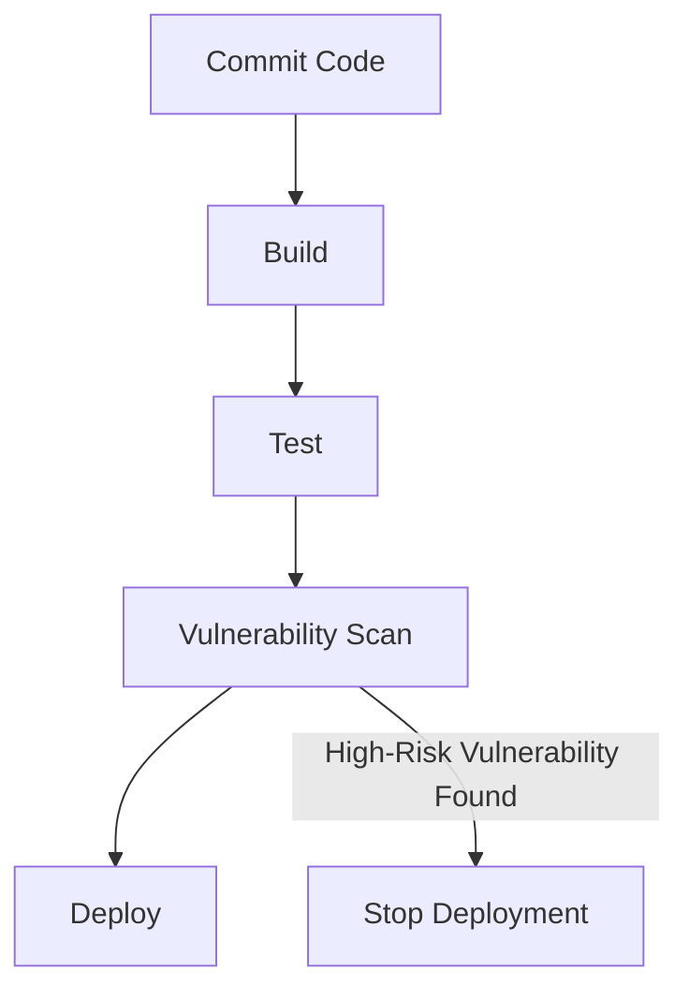

## Understanding DevSecOps Concepts

### Introduction to DevSecOps

DevSecOps is an approach that integrates security practices into the DevOps lifecycle. Traditionally, security was often treated as an afterthought, with security teams conducting audits and penetration testing after the software was developed and deployed. However, in today’s fast-paced development environments, this approach is no longer sufficient. DevSecOps aims to embed security throughout the entire software development lifecycle (SDLC), ensuring that security is a shared responsibility among all team members.

### PCI DSS Standard Overview

One of the key standards that highlight the importance of integrating security into the development process is the Payment Card Industry Data Security Standard (PCI DSS). PCI DSS is a set of security standards designed to ensure that all companies that accept, process, store, or transmit credit card information maintain a secure environment. The latest version of PCI DSS is 3.2.1, which includes several requirements aimed at securing payment card data.

#### Requirement 11.2: Network Vulnerability Scans

Under Requirement 11.2 of PCI DSS 3.2.1, organizations are required to perform both internal and external network vulnerability scans at least quarterly and after any significant changes in the network. This requirement ensures that potential vulnerabilities are identified and addressed regularly, reducing the risk of security breaches.

### Traditional Approach to PCI DSS Compliance

Traditionally, compliance with PCI DSS Requirement 11.2 involved the following steps:

1. **Initiate Vulnerability Scan**: A vulnerability scan is initiated once every quarter.
2. **Human Review**: The results of the scan are reviewed by a human analyst to identify high-risk vulnerabilities.
3. **Remediation**: High-risk vulnerabilities are addressed and remediated.
4. **Retesting**: The system is retested to ensure that the vulnerabilities have been properly addressed.

This approach has several limitations:

- **Frequency**: Quarterly scans are not frequent enough to catch vulnerabilities that might arise between scans.
- **Manual Review**: Human review introduces delays and potential oversight.
- **Delayed Remediation**: Issues identified during quarterly scans may take time to address, leaving systems vulnerable for extended periods.

### Shifting Left in DevSecOps

Shifting left in DevSecOps refers to the practice of moving security activities earlier in the software development lifecycle. Instead of waiting until the end of the development cycle to conduct security tests, security is integrated into every stage of the SDLC, from planning and design to coding, testing, and deployment.

#### Integrating Security into the Release Pipeline

In the context of PCI DSS Requirement 11.2, shifting left means incorporating vulnerability scanning into the continuous integration/continuous deployment (CI/CD) pipeline. This allows for more frequent and automated scanning, ensuring that vulnerabilities are caught and addressed as soon as possible.

##### Example: Automated Vulnerability Scanning in CI/CD

Consider a scenario where a company uses a CI/CD pipeline to deploy new versions of their application. By integrating automated vulnerability scanning tools into this pipeline, the company can perform scans at every stage of the deployment process.



In this example, the pipeline includes a step for vulnerability scanning (`D`). If a high-risk vulnerability is found, the deployment is halted (`F`), preventing the insecure code from being released.

### Real-World Examples and Recent Breaches

Several recent breaches highlight the importance of integrating security into the development process:

- **Equifax Breach (2017)**: Equifax suffered a massive data breach that exposed sensitive information of millions of consumers. One of the contributing factors was the lack of proper security controls and regular vulnerability assessments.
- **Capital One Breach (2019)**: Capital One experienced a data breach that exposed the personal information of over 100 million customers. The breach occurred due to a misconfigured web application firewall, highlighting the need for continuous monitoring and security testing.

These breaches underscore the necessity of embedding security practices throughout the development lifecycle.

### How to Prevent / Defend

To effectively integrate security into the DevSecOps process, organizations should adopt the following strategies:

#### Detection

1. **Automated Scanning Tools**: Use tools like OWASP ZAP, Nessus, or Qualys to perform automated vulnerability scans.
2. **Continuous Monitoring**: Implement continuous monitoring solutions to detect and respond to security incidents in real-time.

#### Prevention

1. **Secure Coding Practices**: Train developers in secure coding practices to reduce the likelihood of introducing vulnerabilities.
2. **Code Reviews**: Conduct regular code reviews to identify and address security issues early in the development process.

#### Secure-Coding Fixes

Here is an example of a vulnerable code snippet and its secure counterpart:

**Vulnerable Code:**
```python
import os
import subprocess

def execute_command(command):
    subprocess.run(command, shell=True)
```

**Secure Code:**
```python
import subprocess

def execute_command(command):
    subprocess.run(command.split(), check=True)
```

In the secure version, `shell=True` is removed to prevent command injection attacks. Additionally, `check=True` ensures that exceptions are raised if the command fails.

#### Configuration Hardening

Hardening configurations can significantly improve security. For example, in an Apache server, the following configuration can be used to enhance security:

**Vulnerable Configuration:**
```apache
<Directory "/var/www/html">
    AllowOverride All
</Directory>
```

**Secure Configuration:**
```apache
<Directory "/var/www/html">
    AllowOverride None
</Directory>
```

By setting `AllowOverride` to `None`, the server prevents `.htaccess` files from overriding server settings, reducing the risk of unauthorized access.

### Conclusion

Integrating security into the DevOps lifecycle through DevSecOps is crucial for maintaining robust security in modern software development environments. By shifting left and incorporating security practices into every stage of the SDLC, organizations can significantly reduce the risk of security breaches and ensure compliance with standards such as PCI DSS. Regular vulnerability assessments, automated scanning, and continuous monitoring are essential components of a comprehensive DevSecOps strategy.

### Practice Labs

For hands-on experience with DevSecOps concepts, consider the following labs:

- **PortSwigger Web Security Academy**: Offers interactive labs to learn about web security and DevSecOps practices.
- **OWASP Juice Shop**: A deliberately insecure web application for learning about web security.
- **DVWA (Damn Vulnerable Web Application)**: A PHP/MySQL web application that is riddled with vulnerabilities for educational purposes.
- **WebGoat**: An interactive, gamified training application to teach web security.

These labs provide practical experience in applying DevSecOps principles and techniques to real-world scenarios.

---
<!-- nav -->
[[DevSecOps/DevSecOps Bootcamp/01-DevSecOps Introduction/09-Understanding DevSecOps Concepts/03-DevOps Plus Security/00-Overview|Overview]] | [[DevSecOps/DevSecOps Bootcamp/01-DevSecOps Introduction/09-Understanding DevSecOps Concepts/03-DevOps Plus Security/02-Practice Questions & Answers|Practice Questions & Answers]]
