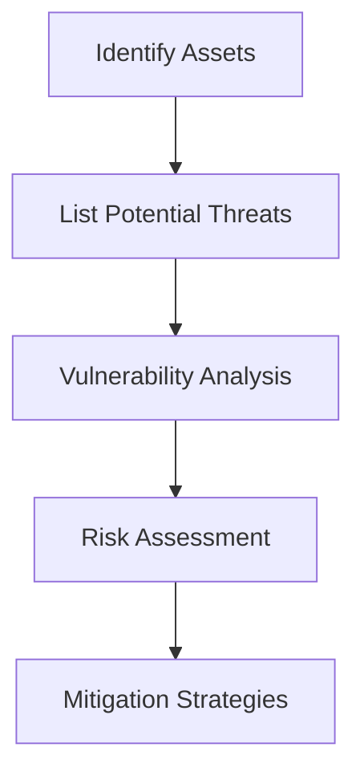

## Understanding DevSecOps Concepts: Security as Code

### Introduction to Security as Code

Security as Code is an approach that integrates security practices into the software development lifecycle (SDLC) through automation and code. This means that security policies, configurations, and compliance checks are defined in code, making them repeatable, testable, and version-controlled. By treating security like any other piece of code, organizations can ensure that security measures are consistently applied across different environments and stages of the SDLC.

#### Why Security as Code Matters

Traditionally, security was often treated as an afterthought, with security teams reviewing applications post-deployment. This reactive approach led to numerous vulnerabilities being discovered late in the process, resulting in costly remediation efforts and potential security breaches. Security as Code shifts the focus to proactive measures, allowing security to be integrated at the earliest stages of development.

### Threat Modeling as Part of Design

Threat modeling is a structured approach to identifying, quantifying, and addressing potential threats to a system. By incorporating threat modeling into the design phase, developers can anticipate and mitigate risks before they become issues.

#### What is Threat Modeling?

Threat modeling involves analyzing a system to identify potential security threats and vulnerabilities. This process typically includes:

1. **Asset Identification**: Identifying critical assets and data within the system.
2. **Threat Identification**: Listing potential threats and attackers.
3. **Vulnerability Analysis**: Assessing the system's weaknesses that could be exploited.
4. **Risk Assessment**: Evaluating the likelihood and impact of identified threats.
5. **Mitigation Strategies**: Developing strategies to address identified risks.

#### How Threat Modeling Works

Let's consider a simple web application as an example. We will perform threat modeling to identify potential security issues.



1. **Identify Assets**:
   - User data (e.g., usernames, passwords)
   - Financial data (e.g., credit card information)
   - System access points (e.g., API endpoints)

2. **List Potential Threats**:
   - SQL Injection attacks
   - Cross-Site Scripting (XSS)
   - Unauthorized access to sensitive data

3. **Vulnerability Analysis**:
   - Identify input validation issues
   - Check for proper encryption of sensitive data
   - Ensure proper authentication mechanisms

4. **Risk Assessment**:
   - Evaluate the likelihood of each threat occurring
   - Determine the potential impact of each threat

5. **Mitigation Strategies**:
   - Implement input validation and sanitization
   - Use parameterized queries to prevent SQL injection
   - Employ Content Security Policy (CSP) to mitigate XSS

#### Real-World Example: CVE-2021-21972

CVE-2021-21972 is a vulnerability in the Apache Log4j library that allows remote code execution (RCE). This vulnerability highlights the importance of threat modeling and proactive security measures. By identifying and mitigating such vulnerabilities during the design phase, organizations can avoid catastrophic breaches.

### Automating Threat Modeling with Tools

While threat modeling is not a fully automated practice, several tools can assist in automating parts of the process. These tools help with identifying and prioritizing threats, making the process more efficient.

#### Popular Threat Modeling Tools

1. **Microsoft Threat Modeling Tool (TMT)**:
   - A free tool provided by Microsoft that helps in creating threat models.
   - Supports various threat modeling methodologies, including STRIDE (Spoofing, Tampering, Repudiation, Information Disclosure, Denial of Service, Elevation of Privilege).

2. **OWASP Threat Dragon**:
   - An open-source tool that supports multiple threat modeling methodologies.
   - Provides a visual interface for creating and managing threat models.

3. **ThreatMapper**:
   - A commercial tool that integrates with CI/CD pipelines to automate threat modeling.
   - Provides detailed reports and recommendations based on identified threats.

#### Example: Using Microsoft Threat Modeling Tool

Here’s a step-by-step guide to using the Microsoft Threat Modeling Tool:

1. **Install the Tool**:
   - Download and install the Microsoft Threat Modeling Tool from the official website.

2. **Create a New Model**:
   - Open the tool and create a new model.
   - Define the components of your system (e.g., web server, database, user interface).

3. **Add Threats**:
   - Identify potential threats for each component.
   - Use the STRIDE methodology to categorize threats.

4. **Generate Reports**:
   - Generate detailed reports that outline identified threats and recommended mitigation strategies.

### Shifting Left with Security as Code

Shifting left refers to the practice of integrating security into the earliest stages of the SDLC. This approach ensures that security is not an afterthought but a core part of the development process.

#### Benefits of Shifting Left

1. **Early Detection of Vulnerabilities**:
   - Identifying and fixing security issues early in the development cycle reduces the cost and complexity of remediation.

2. **Improved Developer Awareness**:
   - Developers become more aware of security best practices, leading to better coding habits.

3. **Consistent Security Practices**:
   - Security policies and configurations are defined in code, ensuring consistency across different environments.

#### Example: Integrating Security Checks in CI/CD Pipelines

To illustrate how security as code can be integrated into CI/CD pipelines, let’s consider a simple example using a pipeline that includes static code analysis and vulnerability scanning.

```yaml
# .github/workflows/ci.yml
name: CI/CD Pipeline

on:
  push:
    branches:
      - main
  pull_request:
    branches:
      - main

jobs:
  build:
    runs-on: ubuntu-latest

    steps:
    - name: Checkout code
      uses: actions/checkout@v2

    - name: Install dependencies
      run: |
        npm install

    - name: Run static code analysis
      run: |
        npm run lint

    - name: Run vulnerability scan
      run: |
        npm audit

    - name: Build application
      run: |
        npm run build

    - name: Deploy application
      if: github.event_name == 'push'
      run: |
        npm run deploy
```

In this example, the CI/CD pipeline includes steps for static code analysis (`npm run lint`) and vulnerability scanning (`npm audit`). These steps ensure that security checks are performed early in the development process.

### Common Pitfalls and How to Avoid Them

While integrating security as code offers numerous benefits, there are also common pitfalls to be aware of.

#### Common Pitfalls

1. **Over-reliance on Automation**:
   - While automation is beneficial, it should not replace human judgment. Manual reviews and threat modeling are still essential.

2. **Ignoring Compliance Requirements**:
   - Security as code should not overlook compliance requirements. Ensure that security policies align with relevant regulations and standards.

3. **Neglecting Continuous Monitoring**:
   - Security is not a one-time task. Continuous monitoring and regular updates are necessary to stay ahead of emerging threats.

#### How to Prevent / Defend

To effectively integrate security as code and avoid common pitfalls, follow these best practices:

1. **Implement Comprehensive Threat Modeling**:
   - Use tools like Microsoft Threat Modeling Tool or OWASP Threat Dragon to create detailed threat models.
   - Regularly review and update threat models as the system evolves.

2. **Integrate Security Checks in CI/CD Pipelines**:
   - Include static code analysis, vulnerability scanning, and other security checks in your CI/CD pipelines.
   - Ensure that these checks are automated and run consistently.

3. **Maintain Compliance and Regulatory Alignment**:
   - Regularly review security policies to ensure they comply with relevant regulations and standards.
   - Document and maintain evidence of compliance for audits and inspections.

4. **Continuous Monitoring and Updates**:
   - Implement continuous monitoring to detect and respond to security incidents promptly.
   - Keep security tools and configurations up-to-date to address emerging threats.

### Real-World Examples and Case Studies

#### Example: Capital One Data Breach (CVE-2019-11510)

The Capital One data breach in 2019 exposed sensitive customer data due to a misconfigured web application firewall (WAF). This breach highlights the importance of proper configuration management and continuous monitoring.

- **Vulnerable Configuration**:
  ```yaml
  # Misconfigured WAF rules
  waf_rules:
    - rule_id: 12345
      action: allow
      conditions:
        - variable: request.method
          operator: equals
          value: GET
  ```

- **Secure Configuration**:
  ```yaml
  # Secure WAF rules
  waf_rules:
    - rule_id: 12345
      action: deny
      conditions:
        - variable: request.method
          operator: equals
          value: GET
  ```

By implementing proper configuration management and continuous monitoring, such breaches can be prevented.

#### Example: Equifax Data Breach (CVE-2017-5638)

The Equifax data breach in 2017 exposed personal data of millions of customers due to a vulnerability in the Apache Struts framework. This breach underscores the importance of timely patch management and vulnerability scanning.

- **Vulnerable Code**:
  ```java
  // Vulnerable Struts code
  public class UserController {
      @Action(value = "/user")
      public String getUser() {
          return "success";
      }
  }
  ```

- **Secure Code**:
  ```java
  // Secure Struts code
  public class UserController {
      @Action(value = "/user", method = "GET")
      public String getUser() {
          return "success";
      }
  }
  ```

By implementing timely patch management and vulnerability scanning, such breaches can be prevented.

### Hands-On Labs and Practice

To gain practical experience with Security as Code, consider the following hands-on labs:

1. **PortSwigger Web Security Academy**:
   - Offers interactive labs to learn about various web security concepts, including threat modeling and secure coding practices.

2. **OWASP Juice Shop**:
   - A deliberately insecure web application for practicing web security skills. It includes challenges related to threat modeling and secure coding.

3. **CloudGoat**:
   - A set of labs designed to teach cloud security concepts, including secure infrastructure as code and continuous monitoring.

By engaging in these hands-on labs, you can apply the theoretical knowledge gained from this chapter to real-world scenarios.

### Conclusion

Security as Code is a crucial aspect of modern DevSecOps practices. By integrating security into the earliest stages of the SDLC, organizations can proactively address potential threats and vulnerabilities. Threat modeling, automation tools, and continuous monitoring are key components of this approach. By following best practices and learning from real-world examples, you can effectively implement Security as Code in your organization.

---

This comprehensive chapter covers the core concepts of Security as Code, providing deep insights into threat modeling, automation tools, and practical examples. It also includes detailed explanations, code snippets, and mermaid diagrams to enhance understanding and application of the material.

---
<!-- nav -->
[[DevSecOps/DevSecOps Bootcamp/01-DevSecOps Introduction/09-Understanding DevSecOps Concepts/04-Security as Code/00-Overview|Overview]] | [[02-Security as Code in DevSecOps|Security as Code in DevSecOps]]
