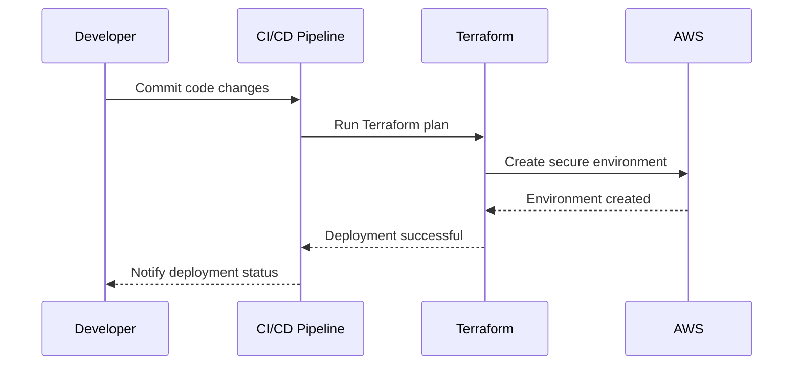

## Security as Code in DevSecOps

### Introduction to Security as Code

Security as Code is a fundamental principle within the DevSecOps paradigm, which integrates security practices into the continuous integration and continuous delivery (CI/CD) pipeline. This approach ensures that security is not treated as an afterthought but is embedded throughout the software development lifecycle (SDLC).

#### Benefits of Security as Code

The primary benefits of Security as Code include:

1. **Automation**: Traditional security practices often involve manual activities, which can be time-consuming and error-prone. By automating these processes, we can ensure consistency and reliability.
   
2. **Early Detection**: Automating security checks at various stages of the SDLC allows for early detection of vulnerabilities. This reduces the overall security and development costs by catching issues before they become more complex and expensive to fix.

3. **Continuous Improvement**: Automated security practices enable continuous improvement through regular updates and enhancements. This ensures that the security posture remains robust against emerging threats.

### Code Reviews as Code Previews

One of the key areas where Security as Code can be applied is in code reviews. Traditionally, code reviews are conducted manually, which can be slow and prone to human error. By converting these reviews into automated code previews, we can significantly improve the efficiency and effectiveness of the process.

#### Automated Code Checkers

Automated code checkers are tools that analyze code for potential security vulnerabilities and coding standards violations. These tools can be integrated into the CI/CD pipeline to automatically check code at the commit stage. This ensures that code adheres to security best practices before it is merged into the main branch.

##### Example: SonarQube Integration

SonarQube is a popular static code analysis tool that can be integrated into the CI/CD pipeline. Below is an example of how SonarQube can be configured to run during the build process:

```yaml
# Jenkinsfile
pipeline {
    agent any
    stages {
        stage('Build') {
            steps {
                sh 'mvn clean package'
            }
        }
        stage('SonarQube Analysis') {
            steps {
                withSonarQubeEnv('SonarQube') {
                    sh 'mvn sonar:sonar'
                }
            }
        }
    }
}
```

In this example, the `withSonarQubeEnv` step sets up the necessary environment variables for SonarQube, and the `sh 'mvn sonar:sonar'` command runs the analysis.

#### Early Detection of Coding Errors

By integrating automated code checkers into the CI/CD pipeline, we can catch coding errors early in the development process. This reduces the likelihood of these errors making their way into the production environment, thereby reducing the overall security and development costs.

##### Real-World Example: Heartbleed Bug

The Heartbleed bug (CVE-2014-0160) is a classic example of a vulnerability that could have been detected earlier with proper automated code checking. This OpenSSL vulnerability allowed attackers to steal sensitive information from servers and clients. If automated code checkers had been in place, this vulnerability might have been caught during the development phase.

### Automation of Environment Building

Another critical area where Security as Code can be applied is in the automation of environment building. Traditionally, environments are patched regularly to ensure they remain secure. However, this approach can be cumbersome and may not always be timely.

#### Automated Environment Building

By automating the building of environments, we can ensure that all environments come pre-patched with the latest security updates. This eliminates the need for manual patching and ensures that environments are always up-to-date.

##### Example: Terraform for Infrastructure as Code

Terraform is a popular tool for infrastructure as code (IaC), which can be used to automate the building of environments. Below is an example of how Terraform can be used to create a secure environment:

```hcl
# main.tf
provider "aws" {
  region = "us-west-2"
}

resource "aws_instance" "example" {
  ami           = "ami-0c55b159cbfafe1f0"
  instance_type = "t2.micro"

  tags = {
    Name = "secure-instance"
  }

  user_data = <<-EOF
              #!/bin/bash
              yum update -y
              EOF
}
```

In this example, the `user_data` script ensures that the instance is updated with the latest security patches upon creation.

#### Mermaid Diagram: Automated Environment Building

A mermaid diagram can help visualize the process of automated environment building:



### How to Prevent / Defend

To ensure that Security as Code is implemented effectively, it is crucial to follow best practices and implement robust defenses.

#### Secure Coding Practices

Secure coding practices should be integrated into the development process. This includes using static code analysis tools, conducting regular code reviews, and following established security guidelines.

##### Vulnerable vs. Secure Code Example

Consider the following example of a SQL injection vulnerability:

**Vulnerable Code:**

```python
# Vulnerable code
import sqlite3

def get_user(username):
    conn = sqlite3.connect('database.db')
    cursor = conn.cursor()
    query = f"SELECT * FROM users WHERE username = '{username}'"
    cursor.execute(query)
    result = cursor.fetchone()
    conn.close()
    return result
```

**Secure Code:**

```python
# Secure code
import sqlite3

def get_user(username):
    conn = sqlite3.connect('database.db')
    cursor = conn.cursor()
    query = "SELECT * FROM users WHERE username = ?"
    cursor.execute(query, (username,))
    result = cursor.fetchone()
    conn.close()
    return result
```

In the secure code, parameterized queries are used to prevent SQL injection attacks.

#### Configuration Hardening

Configuration hardening involves securing the configuration settings of applications and infrastructure. This includes disabling unnecessary services, setting strong passwords, and configuring security policies.

##### Example: Nginx Configuration Hardening

Below is an example of how to harden an Nginx configuration:

**Vulnerable Configuration:**

```nginx
server {
    listen 80;
    server_name example.com;

    location / {
        root /var/www/html;
        index index.html;
    }
}
```

**Hardened Configuration:**

```nginx
server {
    listen 80 default_server;
    server_name example.com;

    location / {
        root /var/www/html;
        index index.html;
        try_files $uri $uri/ =404;
    }

    location ~ /\.ht {
        deny all;
    }

    location ~* \.(js|css|png|jpg|jpeg|gif|ico)$ {
        expires max;
        log_not_found off;
    }
}
```

In the hardened configuration, unnecessary files are denied access, and caching is enabled for static assets.

### Conclusion

Security as Code is a powerful approach within the DevSecOps paradigm that ensures security is integrated throughout the software development lifecycle. By automating security practices and embedding them into the CI/CD pipeline, we can significantly improve the security posture of applications and infrastructure.

### Practice Labs

For hands-on experience with Security as Code, consider the following labs:

- **PortSwigger Web Security Academy**: Offers interactive labs to learn about various security concepts and practices.
- **OWASP Juice Shop**: A deliberately insecure web application for practicing security testing and ethical hacking.
- **DVWA (Damn Vulnerable Web Application)**: A PHP/MySQL web application that is riddled with vulnerabilities for educational purposes.
- **WebGoat**: An interactive, gamified training application for learning about web application security.

These labs provide practical experience in implementing Security as Code principles and can help solidify your understanding of the concepts discussed in this chapter.

---
<!-- nav -->
[[01-Understanding DevSecOps Concepts Security as Code|Understanding DevSecOps Concepts Security as Code]] | [[DevSecOps/DevSecOps Bootcamp/01-DevSecOps Introduction/09-Understanding DevSecOps Concepts/04-Security as Code/00-Overview|Overview]] | [[DevSecOps/DevSecOps Bootcamp/01-DevSecOps Introduction/09-Understanding DevSecOps Concepts/04-Security as Code/03-Practice Questions & Answers|Practice Questions & Answers]]
