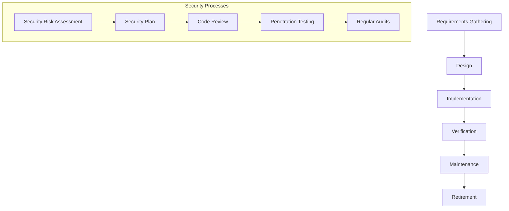

## Introduction to DevSecOps Concepts

### The Traditional Security Problem

In the realm of software development, traditional security practices often lag behind the rapid pace of modern development methodologies. The waterfall model, which is a sequential design process used in software development, has historically been the standard approach for managing project lifecycles. However, this model introduces significant friction when applied to information security processes. Let's delve into the details of how this friction manifests and why it poses a challenge to modern software development.

#### Waterfall Methodology and Security Processes

The waterfall methodology is characterized by a linear progression through several phases: requirements gathering, design, implementation, verification, maintenance, and retirement. In the context of information security, this translates to a series of steps that must be completed sequentially:

1. **Security Risk Assessment**: Identifying potential vulnerabilities and threats.
2. **Security Plan**: Developing a strategy to mitigate identified risks.
3. **Code Review**: Analyzing the codebase for security flaws.
4. **Penetration Testing**: Simulating attacks to test the system’s defenses.
5. **Regular Audits**: Periodic reviews to ensure compliance and identify new vulnerabilities.

Each of these steps has prerequisites that must be met before proceeding to the next phase. This sequential nature means that any delay in one phase can significantly impact the entire project timeline.



### Friction Points in Traditional Security Processes

The primary friction points in traditional security processes include:

1. **Security as an Afterthought**: Security is often considered only after the initial development phases are complete. This leads to a reactive rather than proactive approach to security.
2. **Security Sign-Off Delays Projects**: The necessity for security sign-off can delay project timelines, especially when issues are identified late in the development cycle.
3. **Once-Off Point-in-Time Assessments**: Security assessments are typically conducted at specific points in the project lifecycle, leading to a lack of continuous security monitoring.

#### Security as an Afterthought

When security is treated as an afterthought, it can result in significant vulnerabilities that are only discovered during later stages of the project. This reactive approach often leads to rushed fixes, which may not be thoroughly tested, thereby introducing additional risks.

**Example**: Consider a scenario where a web application is developed using a traditional waterfall methodology. The initial development phases focus on functionality, and security is only addressed towards the end of the project. During the final security assessment, critical vulnerabilities such as SQL injection or cross-site scripting (XSS) are identified. The team then scrambles to patch these issues, but due to the tight deadline, thorough testing is not performed, leading to potential residual vulnerabilities.

#### Security Sign-Off Delays Projects

Security sign-off is a crucial step in ensuring that a project meets the necessary security standards. However, this process can introduce delays if issues are identified late in the development cycle. This delay can be particularly problematic when project timelines are already tight.

**Example**: A software development team is working on a new financial application. The project is nearing its deadline, and the security team identifies several critical vulnerabilities during the final security assessment. The team must now spend additional time fixing these issues, which delays the project and potentially impacts the release date.

#### Once-Off Point-in-Time Assessments

Traditional security processes often involve periodic assessments rather than continuous monitoring. This approach can lead to a false sense of security, as vulnerabilities may arise between assessments and go undetected until the next scheduled review.

**Example**: A company conducts annual security assessments for its web applications. During one such assessment, a critical vulnerability is identified and patched. However, due to the lack of continuous monitoring, a new vulnerability arises shortly after the assessment. This vulnerability remains undetected until the next scheduled assessment, potentially exposing the application to attacks.

### Real-World Examples

Recent real-world examples highlight the challenges posed by traditional security processes:

1. **Equifax Data Breach (CVE-2017-5638)**: In 2017, Equifax suffered a massive data breach that exposed sensitive personal information of millions of customers. The breach was caused by a vulnerability in Apache Struts, which was not promptly patched due to delayed security assessments.
   
   ```mermaid
sequenceDiagram
       participant Developer
       participant SecurityTeam
       participant VulnerabilityScanner
       participant PatchManager
       
       Developer->>VulnerabilityScanner: Code pushed to repository
       VulnerabilityScanner-->>Developer: Vulnerability detected
       Developer->>SecurityTeam: Report vulnerability
       SecurityTeam-->>PatchManager: Issue patch
       PatchManager-->>Developer: Apply patch
       Developer-->>VulnerabilityScanner: Re-test
```

2. **Capital One Data Breach (CVE-2019-11510)**: In 2019, Capital One experienced a data breach that exposed the personal information of over 100 million customers. The breach was attributed to a misconfigured web application firewall (WAF) that allowed unauthorized access to sensitive data.

   ```mermaid
sequenceDiagram
       participant Developer
       participant SecurityTeam
       participant WAF
       participant Database
       
       Developer->>WAF: Misconfigure WAF rules
       WAF-->>Database: Unauthorized access
       Database-->>SecurityTeam: Alert triggered
       SecurityTeam-->>Developer: Fix misconfiguration
       Developer-->>WAF: Reconfigure WAF
```

### How to Prevent / Defend

To address the challenges posed by traditional security processes, organizations can adopt a more proactive and continuous approach to security. This involves integrating security practices into the entire development lifecycle, rather than treating it as an afterthought.

#### Secure Coding Practices

Secure coding practices are essential for preventing vulnerabilities from being introduced into the codebase. This includes:

1. **Input Validation**: Ensuring that user inputs are validated to prevent injection attacks.
2. **Output Encoding**: Properly encoding outputs to prevent XSS attacks.
3. **Least Privilege Principle**: Limiting permissions to the minimum required for a task.

**Example**: Consider a web application that accepts user input for a search query. To prevent SQL injection, the application should validate the input and use parameterized queries.

```python
# Vulnerable code
query = f"SELECT * FROM users WHERE username = '{username}'"

# Secure code
import sqlite3

conn = sqlite3.connect('database.db')
cursor = conn.cursor()
cursor.execute("SELECT * FROM users WHERE username = ?", (username,))
results = cursor.fetchall()
```

#### Continuous Integration and Continuous Deployment (CI/CD)

CI/CD pipelines can be integrated with security tools to provide continuous monitoring and automated testing. This ensures that security checks are performed throughout the development process, rather than at specific points.

**Example**: A CI/CD pipeline can be configured to run static code analysis tools, such as SonarQube, to identify potential security vulnerabilities.

```yaml
# Example CI/CD pipeline configuration
jobs:
  build:
    script:
      - echo "Building the application"
      - ./build.sh
  test:
    script:
      - echo "Running unit tests"
      - ./test.sh
  security:
    script:
      - echo "Running static code analysis"
      - sonar-scanner
```

#### Regular Security Training and Awareness

Regular training and awareness programs can help developers understand the importance of security and the best practices to follow. This includes:

1. **Security Workshops**: Conducting regular workshops to educate developers on security best practices.
2. **Security Policies**: Establishing clear security policies and guidelines for developers to follow.

**Example**: A company can conduct regular security workshops to educate developers on common vulnerabilities and how to prevent them.

### Conclusion

Traditional security processes, based on the waterfall methodology, introduce significant friction in modern software development. By adopting a more proactive and continuous approach to security, organizations can mitigate these challenges and ensure that security is integrated throughout the entire development lifecycle. This involves secure coding practices, continuous integration and deployment, and regular security training and awareness programs.

### Practice Labs

For hands-on experience with DevSecOps concepts, consider the following practice labs:

- **PortSwigger Web Security Academy**: Offers interactive labs to learn about web application security.
- **OWASP Juice Shop**: A deliberately insecure web application for practicing security testing.
- **DVWA (Damn Vulnerable Web Application)**: A PHP/MySQL web application that demonstrates web application vulnerabilities.

These labs provide practical experience in identifying and mitigating security vulnerabilities, reinforcing the theoretical concepts covered in this chapter.

---
<!-- nav -->
[[DevSecOps/DevSecOps Bootcamp/01-DevSecOps Introduction/09-Understanding DevSecOps Concepts/06-The Security Problem DevSecOps Addresses/00-Overview|Overview]] | [[DevSecOps/DevSecOps Bootcamp/01-DevSecOps Introduction/09-Understanding DevSecOps Concepts/06-The Security Problem DevSecOps Addresses/02-Understanding DevSecOps Concepts|Understanding DevSecOps Concepts]]
