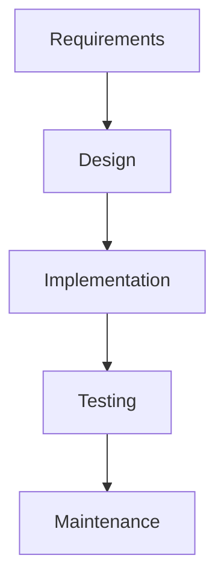
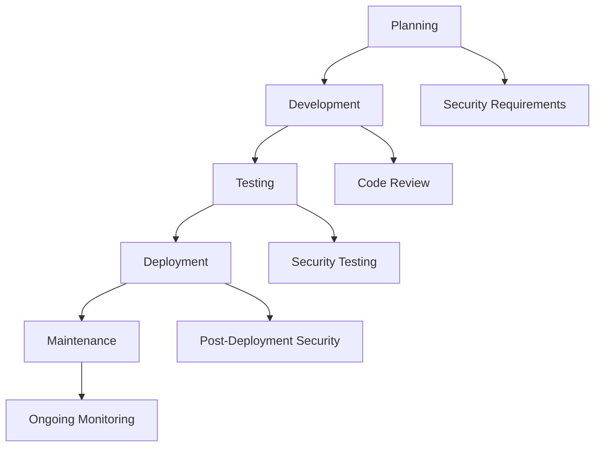

## Understanding DevSecOps Concepts

### Introduction to DevSecOps

DevSecOps is a modern approach to software development that integrates security practices throughout the entire software development lifecycle (SDLC). This method aims to address the inherent security challenges faced by traditional software development methodologies, particularly those that separate security concerns from the development process. To understand why DevSecOps is so powerful and why many organizations are adopting it, we need to delve into the evolution of software development methodologies.

### Traditional Waterfall Methodology

The traditional waterfall methodology is a linear sequential model where each phase must be completed before moving on to the next. This methodology includes several distinct phases:

1. **Requirements Gathering**: Collecting and documenting the functional and non-functional requirements of the system.
2. **Design**: Creating detailed specifications for the system architecture and components.
3. **Implementation (Coding)**: Writing the actual code based on the design specifications.
4. **Testing**: Conducting various types of testing (unit, integration, system) to ensure the code meets the requirements.
5. **Maintenance**: Fixing bugs and making enhancements after the system is deployed.

#### Mermaid Diagram: Waterfall Methodology



#### Pitfalls of Waterfall Methodology

- **Long Development Cycles**: The waterfall model often results in lengthy development cycles, delaying the return on investment (ROI).
- **Limited Flexibility**: Once a phase is completed, it is difficult to go back and make changes, leading to inflexibility in responding to new requirements or issues.
- **Delayed Feedback**: Issues discovered during testing may require significant rework, as they were not identified earlier in the process.

### Agile Methodology

In contrast to the waterfall methodology, agile methodologies emphasize iterative and incremental development. Agile teams work in short sprints, typically lasting one to four weeks, and deliver working software at the end of each sprint. This approach allows for continuous feedback and adaptation to changing requirements.

#### Key Components of Agile Methodology

1. **Iterative Sprint Planning**: Teams plan and prioritize tasks for each sprint.
2. **Daily Scrum Meetings**: Short daily meetings where team members discuss progress and any impediments.
3. **Incremental Delivery**: Delivering small, usable portions of the software at regular intervals.
4. **Continuous Integration and Deployment**: Integrating and deploying code changes frequently to ensure the system remains stable and functional.

#### Mermaid Diagram: Agile Methodology

```mermermaid
graph TD
    A[Sprint Planning] --> B[Development]
    B --> C[Testing]
    C --> D[Review & Retrospective]
    D --> E[Next Sprint]
```

#### Benefits of Agile Methodology

- **Faster ROI**: Agile allows for quicker delivery of value, providing a faster return on investment.
- **Flexibility**: Teams can adapt to changing requirements and feedback more easily.
- **Continuous Improvement**: Regular reviews and retrospectives help identify areas for improvement.

### Transition from Waterfall to Agile

The transition from the waterfall methodology to agile methodologies has been driven by the need for faster development cycles and greater flexibility. However, this transition also brings new challenges, particularly in terms of security.

#### Security Challenges in Agile Methodology

- **Security as an Afterthought**: In agile environments, security is often treated as an afterthought, leading to vulnerabilities being introduced in the code.
- **Rapid Development Cycles**: The fast-paced nature of agile development can lead to rushed decisions and insufficient security testing.
- **Fragmented Responsibility**: Without clear ownership of security responsibilities, security can fall through the cracks.

### Introduction to DevSecOps

DevSecOps addresses these challenges by integrating security practices into the agile development process. This approach ensures that security is considered at every stage of the SDLC, from planning to deployment and maintenance.

#### Key Principles of DevSecOps

1. **Shift Left on Security**: Incorporate security practices early in the development process to catch and fix vulnerabilities as soon as possible.
2. **Continuous Security Testing**: Integrate automated security testing tools into the CI/CD pipeline to ensure that security checks are performed continuously.
3. **Collaboration and Communication**: Foster collaboration between developers, security professionals, and operations teams to ensure that security is everyone's responsibility.
4. **Automated Security Policies**: Implement automated security policies and controls to enforce security best practices across the organization.

#### Mermaid Diagram: DevSecOps Process



### Real-World Examples of DevSecOps

#### Recent CVEs and Breaches

- **CVE-2021-44228 (Log4Shell)**: This critical vulnerability in Apache Log4j allowed attackers to execute arbitrary code on affected systems. Organizations using DevSecOps practices were able to quickly identify and patch this vulnerability, minimizing the impact.
- **SolarWinds Supply Chain Attack (2020)**: This sophisticated supply chain attack compromised numerous organizations. DevSecOps practices, including continuous monitoring and automated security testing, could have helped detect and mitigate such attacks.

### Implementation of DevSecOps

#### Step-by-Step Mechanics

1. **Define Security Requirements**: Clearly define security requirements and integrate them into the planning phase.
2. **Implement Code Reviews**: Conduct regular code reviews to identify and fix security vulnerabilities.
3. **Integrate Automated Security Tools**: Use tools like static application security testing (SAST) and dynamic application security testing (DAST) to automate security testing.
4. **Enforce Security Policies**: Implement automated security policies and controls to enforce security best practices.

#### Example: Secure Coding Practices

Consider a simple example where a developer writes a function to handle user input. Without proper validation, this function could be vulnerable to SQL injection attacks.

**Vulnerable Code**

```python
def get_user_data(user_id):
    conn = sqlite3.connect('database.db')
    cursor = conn.cursor()
    query = f"SELECT * FROM users WHERE id = {user_id}"
    cursor.execute(query)
    result = cursor.fetchone()
    conn.close()
    return result
```

**Secure Code**

```python
def get_user_data(user_id):
    conn = sqlite3.connect('database.db')
    cursor = conn.cursor()
    query = "SELECT * FROM users WHERE id = ?"
    cursor.execute(query, (user_id,))
    result = cursor.fetchone()
    conn.close()
    return result
```

#### How to Prevent / Defend

- **Detection**: Use automated security testing tools to detect vulnerabilities in the code.
- **Prevention**: Implement secure coding practices and conduct regular code reviews.
- **Secure-Coding Fixes**: Show the vulnerable pattern and the corrected secure version side by side.
- **Configuration Hardening**: Ensure that security configurations are hardened and regularly reviewed.

### Hands-On Labs

For practical experience with DevSecOps concepts, consider the following labs:

- **PortSwigger Web Security Academy**: Offers interactive labs to practice web security techniques.
- **OWASP Juice Shop**: A deliberately insecure web application for practicing security testing.
- **DVWA (Damn Vulnerable Web Application)**: Another intentionally vulnerable web application for learning security testing.

By integrating security practices into the agile development process, DevSecOps helps organizations deliver secure software more efficiently and effectively.

---
<!-- nav -->
[[DevSecOps/DevSecOps Bootcamp/01-DevSecOps Introduction/09-Understanding DevSecOps Concepts/06-The Security Problem DevSecOps Addresses/01-Introduction to DevSecOps Concepts|Introduction to DevSecOps Concepts]] | [[DevSecOps/DevSecOps Bootcamp/01-DevSecOps Introduction/09-Understanding DevSecOps Concepts/06-The Security Problem DevSecOps Addresses/00-Overview|Overview]] | [[03-The Security Problem DevSecOps Addresses|The Security Problem DevSecOps Addresses]]
