## The Security Problem DevSecOps Addresses

### Introduction to DevSecOps

DevSecOps is an approach to software development that integrates security practices throughout the entire software development lifecycle (SDLC). This methodology aims to address the significant challenges faced by traditional security processes, which often result in delays, increased costs, and reduced agility in delivering products to market. By embedding security into the DevOps pipeline, organizations can achieve faster, more secure software delivery.

### The Cost of Retesting

One of the primary issues in traditional software development is the high cost associated with retesting. When security testing is performed late in the development cycle, it often uncovers vulnerabilities that require extensive rework. This rework can be time-consuming and expensive, leading to delays in product releases. Additionally, the perception that security testing slows down the development process can create friction between security and development teams.

#### Example: High Cost of Retesting

Consider a scenario where a large financial institution is developing a new mobile banking application. The initial development phase is completed, and the application is ready for release. However, during the final security testing phase, several critical vulnerabilities are discovered. These vulnerabilities require significant changes to the codebase, leading to a delay in the release schedule and additional costs for retesting and revalidation.

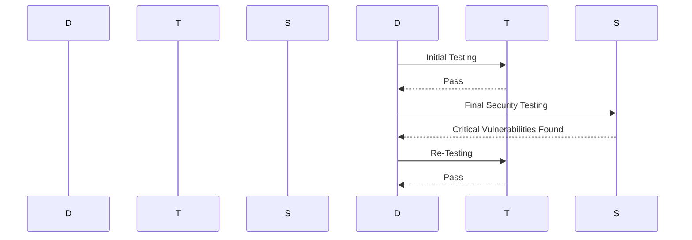

### Security Expert Shortage

Another significant challenge is the shortage of skilled security professionals. Security experts are in high demand but short supply, leading to a significant gap in the ability to secure software development activities. The ratio of security experts to development experts is extremely low, exacerbating the problem.

#### Example: Security Expert Shortage

A mid-sized tech company is developing a new cloud-based service. They have a team of developers but lack dedicated security personnel. As a result, security considerations are often overlooked, leading to potential vulnerabilities in the software. This situation highlights the need for a more integrated approach to security within the development process.

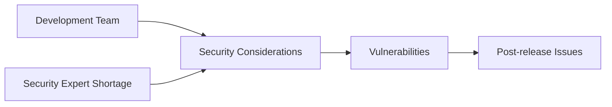

### DevOps Thinking Applied to Security

To address these challenges, the principles of DevOps can be applied to security, giving rise to DevSecOps. DevOps focuses on collaboration between development and operations teams to streamline the software development and deployment process. Similarly, DevSecOps aims to integrate security practices into the DevOps pipeline, ensuring that security is considered at every stage of the SDLC.

#### Example: DevSecOps Integration

In a DevSecOps environment, security is embedded into the continuous integration and continuous deployment (CI/CD) pipeline. Automated security checks are performed alongside other automated tests, ensuring that security vulnerabilities are identified and addressed early in the development process.

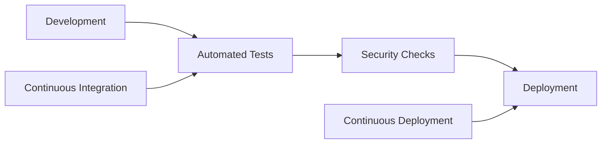

### Removing Friction Between Teams

In a true DevSecOps environment, the friction between development, operations, and security teams is minimized by integrating their activities into a single lifecycle. This integration ensures that security is not seen as a separate, siloed function but as an integral part of the development process.

#### Example: Removing Friction

Consider a scenario where a startup is developing a new social media platform. By adopting DevSecOps principles, the startup can ensure that security is considered from the beginning of the development process. This approach allows the team to identify and address security issues early, reducing the likelihood of costly rework and delays.

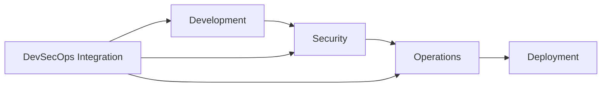

### Real-World Examples and Case Studies

To better understand the impact of DevSecOps, let's examine some real-world examples and case studies.

#### Example: Equifax Data Breach (CVE-2017-5638)

In 2017, Equifax suffered a massive data breach that exposed sensitive information of millions of customers. The breach was caused by a vulnerability in Apache Struts, which was not patched in a timely manner. This incident highlights the importance of integrating security into the development process to ensure that vulnerabilities are identified and addressed promptly.

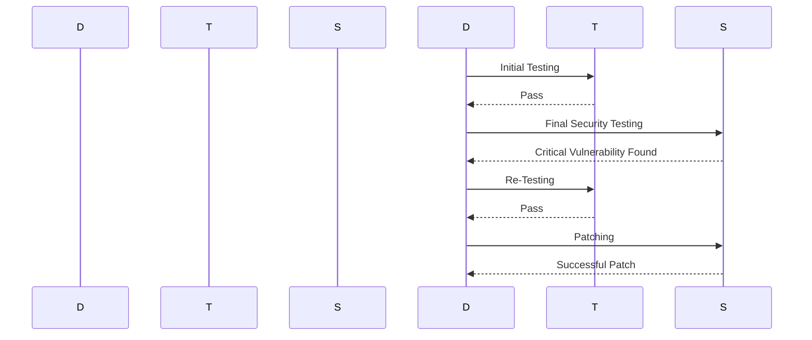

#### Example: Capital One Data Breach (CVE-2019-11510)

In 2019, Capital One experienced a data breach that exposed sensitive information of approximately 100 million customers. The breach was caused by a misconfiguration in a web application firewall (WAF), which allowed unauthorized access to customer data. This incident underscores the importance of integrating security into the development process to ensure that configurations are correct and secure.

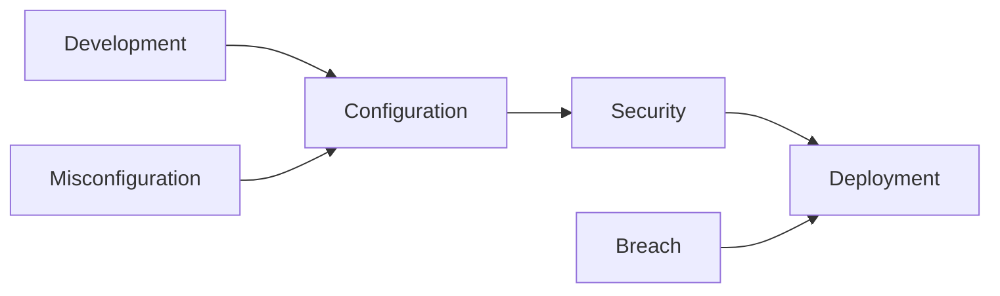

### How to Prevent / Defend

To effectively implement DevSecOps, organizations need to adopt several best practices and tools to ensure that security is integrated into the development process.

#### Secure Coding Practices

Secure coding practices involve writing code that is free from vulnerabilities and adheres to security best practices. This includes using secure coding guidelines, performing code reviews, and conducting static code analysis.

##### Example: Secure Coding Guidelines

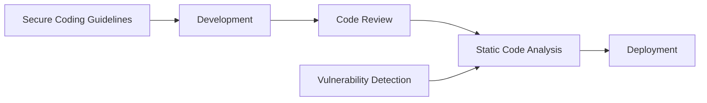

##### Example: Code Review

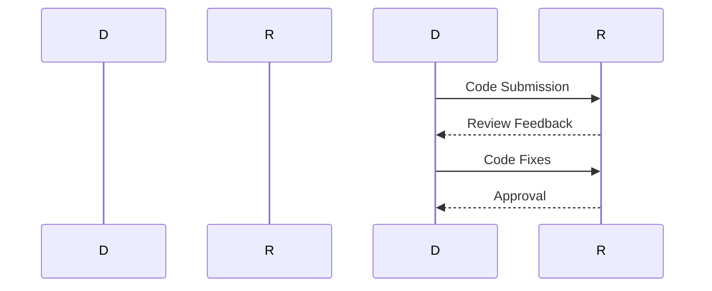

##### Example: Static Code Analysis

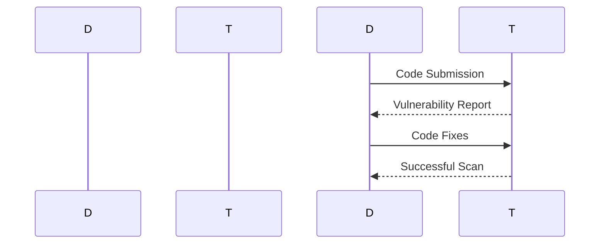

#### Continuous Integration and Continuous Deployment (CI/CD)

CI/CD pipelines automate the build, test, and deployment processes, ensuring that security checks are performed automatically and consistently. This helps to identify and address vulnerabilities early in the development process.

##### Example: CI/CD Pipeline

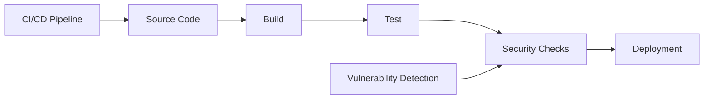

##### Example: Jenkins CI/CD Pipeline

```yaml
pipeline {
    agent any
    stages {
        stage('Build') {
            steps {
                sh 'mvn clean package'
            }
        }
        stage('Test') {
            steps {
                sh 'mvn test'
            }
        }
        stage('Security Checks') {
            steps {
                sh 'dependency-check --project MyProject --scan target'
            }
        }
        stage('Deploy') {
            steps {
                sh 'scp target/myapp.jar user@server:/opt/myapp/'
            }
        }
    }
}
```

#### Security Tools and Technologies

Organizations should leverage various security tools and technologies to enhance their DevSecOps capabilities. These include:

- **Static Application Security Testing (SAST)**: Tools like SonarQube and Fortify help identify vulnerabilities in the code.
- **Dynamic Application Security Testing (DAST)**: Tools like Burp Suite and OWASP ZAP help identify vulnerabilities in the running application.
- **Dependency Check**: Tools like OWASP Dependency-Check help identify vulnerabilities in third-party libraries.
- **Container Security**: Tools like Clair and Trivy help identify vulnerabilities in container images.

##### Example: SonarQube SAST


##### Example: OWASP ZAP DAST


##### Example: OWASP Dependency-Check

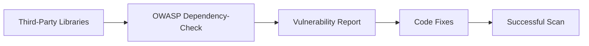

##### Example: Clair Container Security

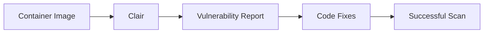

### Hands-On Labs

To gain practical experience with DevSecOps concepts, consider the following hands-on labs:

- **PortSwigger Web Security Academy**: Offers interactive labs to learn about web application security.
- **OWASP Juice Shop**: A deliberately insecure web application for practicing web security.
- **DVWA (Damn Vulnerable Web Application)**: A PHP/MySQL web application that is riddled with vulnerabilities.
- **WebGoat**: An interactive, gamified training application for learning about web application security.

These labs provide a safe environment to practice and reinforce the concepts learned in this chapter.

### Conclusion

DevSecOps addresses the significant challenges faced by traditional security processes, such as the high cost of retesting and the shortage of skilled security professionals. By integrating security practices into the DevOps pipeline, organizations can achieve faster, more secure software delivery. Adopting DevSecOps principles and best practices can help organizations identify and address vulnerabilities early in the development process, reducing the likelihood of costly rework and delays.

By following the guidance provided in this chapter, organizations can successfully implement DevSecOps and ensure that security is an integral part of their software development process.

---
<!-- nav -->
[[DevSecOps/DevSecOps Bootcamp/01-DevSecOps Introduction/09-Understanding DevSecOps Concepts/06-The Security Problem DevSecOps Addresses/02-Understanding DevSecOps Concepts|Understanding DevSecOps Concepts]] | [[DevSecOps/DevSecOps Bootcamp/01-DevSecOps Introduction/09-Understanding DevSecOps Concepts/06-The Security Problem DevSecOps Addresses/00-Overview|Overview]] | [[DevSecOps/DevSecOps Bootcamp/01-DevSecOps Introduction/09-Understanding DevSecOps Concepts/06-The Security Problem DevSecOps Addresses/04-Practice Questions & Answers|Practice Questions & Answers]]
