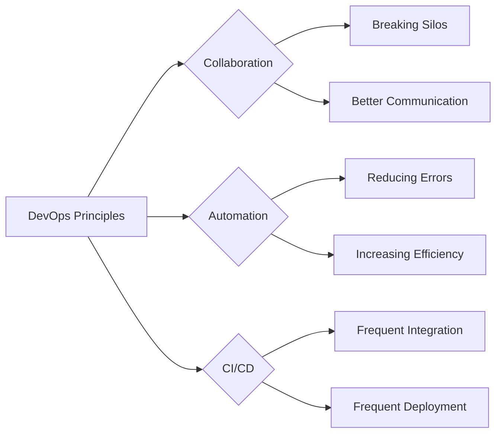
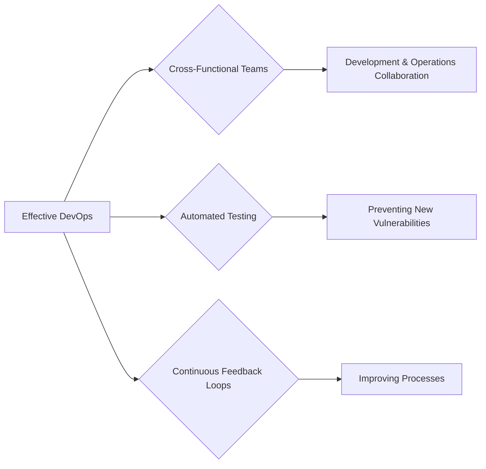

## DevOps and Its Impact on Security

### Background Theory

DevOps is a set of practices that emphasizes collaboration and communication between development and operations teams to improve the speed and quality of software releases. The core principles of DevOps include:

1. **Collaboration**: Breaking down silos between development and operations teams to foster better communication and collaboration.
2. **Automation**: Automating repetitive tasks to increase efficiency and reduce errors.
3. **Continuous Integration/Continuous Deployment (CI/CD)**: Integrating and deploying code changes frequently and automatically to ensure that the software is always in a deployable state.

### Resolving Issues Between Development and Operations Teams

One of the key challenges in traditional software development was the lack of coordination between development and operations teams. This often led to delays, miscommunications, and conflicts. DevOps addresses these issues by promoting a culture of collaboration and shared responsibility.

### Real-World Example: Netflix Chaos Monkey

Netflix’s Chaos Monkey is a tool that randomly terminates instances in their production environment to test the resilience of their systems. This tool exemplifies the DevOps principle of automation and continuous improvement. By simulating failures, Netflix ensures that their systems can handle unexpected events without causing downtime.

### How to Prevent / Defend

To implement DevOps effectively, organizations should focus on:

1. **Cross-Functional Teams**: Form teams that include members from both development and operations to ensure that both perspectives are considered.
2. **Automated Testing**: Implement automated testing to ensure that code changes do not introduce new vulnerabilities.
3. **Continuous Feedback Loops**: Establish feedback loops to continuously improve the development and deployment processes.

---
<!-- nav -->
[[DevSecOps/DevSecOps Bootcamp/01-DevSecOps Introduction/09-Understanding DevSecOps Concepts/Module Summary/00-Overview|Overview]] | [[DevSecOps/DevSecOps Bootcamp/01-DevSecOps Introduction/09-Understanding DevSecOps Concepts/Module Summary/02-Embedding Security in the Software Development Lifecycle (SDLC)|Embedding Security in the Software Development Lifecycle (SDLC)]]
