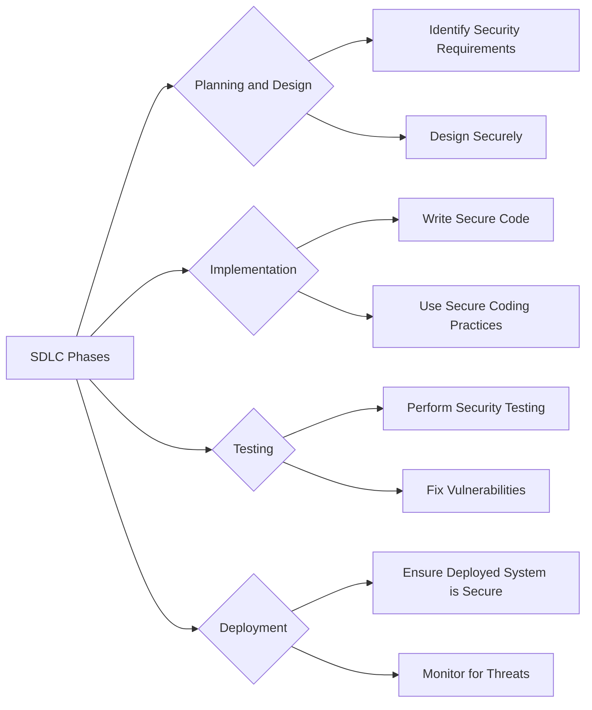
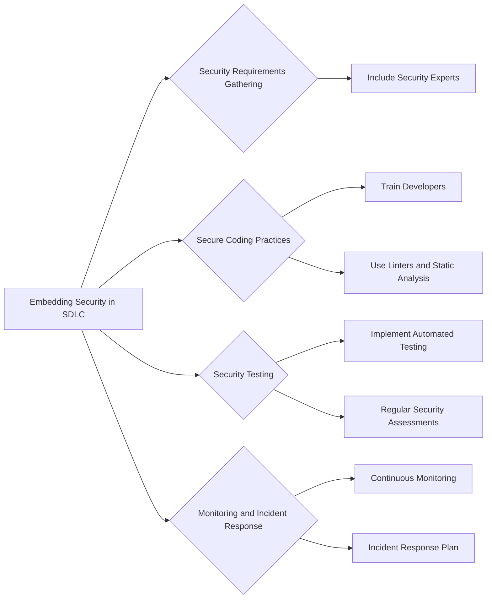

## Embedding Security in the Software Development Lifecycle (SDLC)

### Background Theory

Embedding security in the SDLC means integrating security practices throughout the entire software development process, from planning and design to implementation, testing, and deployment. This approach ensures that security is not an afterthought but a fundamental aspect of the development process.

### Key Phases of the SDLC

1. **Planning and Design**: Identify security requirements and design the system with security in mind.
2. **Implementation**: Write secure code and use secure coding practices.
3. **Testing**: Perform security testing to identify and fix vulnerabilities.
4. **Deployment**: Ensure that the deployed system is secure and monitor it for ongoing threats.

### Real-World Example: Capital One Breach (CVE-2019-11510)

The Capital One breach in 2019 was caused by a misconfigured web application firewall (WAF) that allowed unauthorized access to customer data. This breach highlights the importance of embedding security throughout the SDLC. Had the WAF been properly configured and tested, the breach might have been prevented.

### How to Prevent / Defend

To embed security in the SDLC, organizations should:

1. **Security Requirements Gathering**: Include security experts in the planning phase to identify security requirements.
2. **Secure Coding Practices**: Train developers in secure coding practices and use tools like linters and static analysis tools to enforce these practices.
3. **Security Testing**: Implement automated security testing tools and perform regular security assessments.
4. **Monitoring and Incident Response**: Continuously monitor the deployed system for security threats and have an incident response plan in place.

---
<!-- nav -->
[[DevSecOps/DevSecOps Bootcamp/01-DevSecOps Introduction/09-Understanding DevSecOps Concepts/Module Summary/01-DevOps and Its Impact on Security|DevOps and Its Impact on Security]] | [[DevSecOps/DevSecOps Bootcamp/01-DevSecOps Introduction/09-Understanding DevSecOps Concepts/Module Summary/00-Overview|Overview]] | [[DevSecOps/DevSecOps Bootcamp/01-DevSecOps Introduction/09-Understanding DevSecOps Concepts/Module Summary/03-Traditional Security Approaches in Software Development|Traditional Security Approaches in Software Development]]
