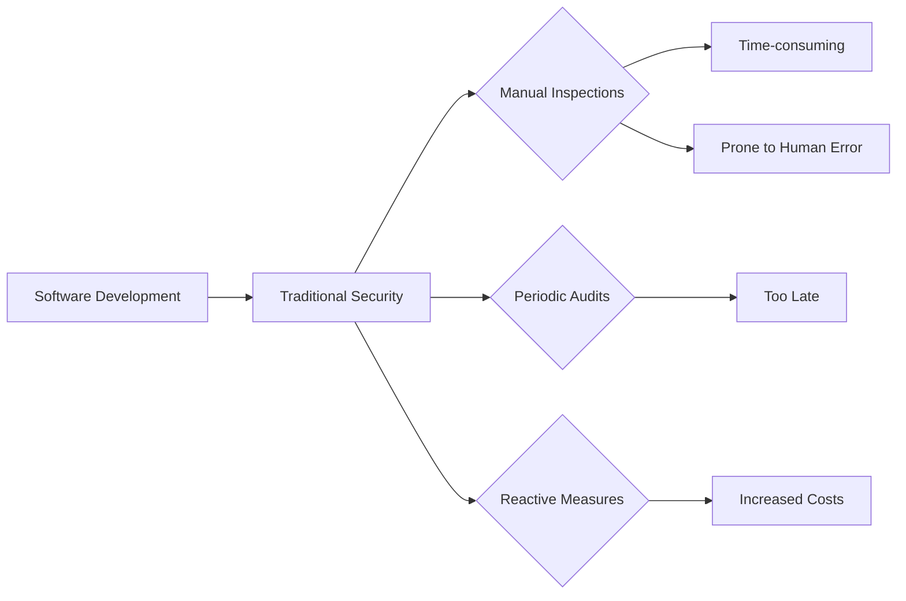
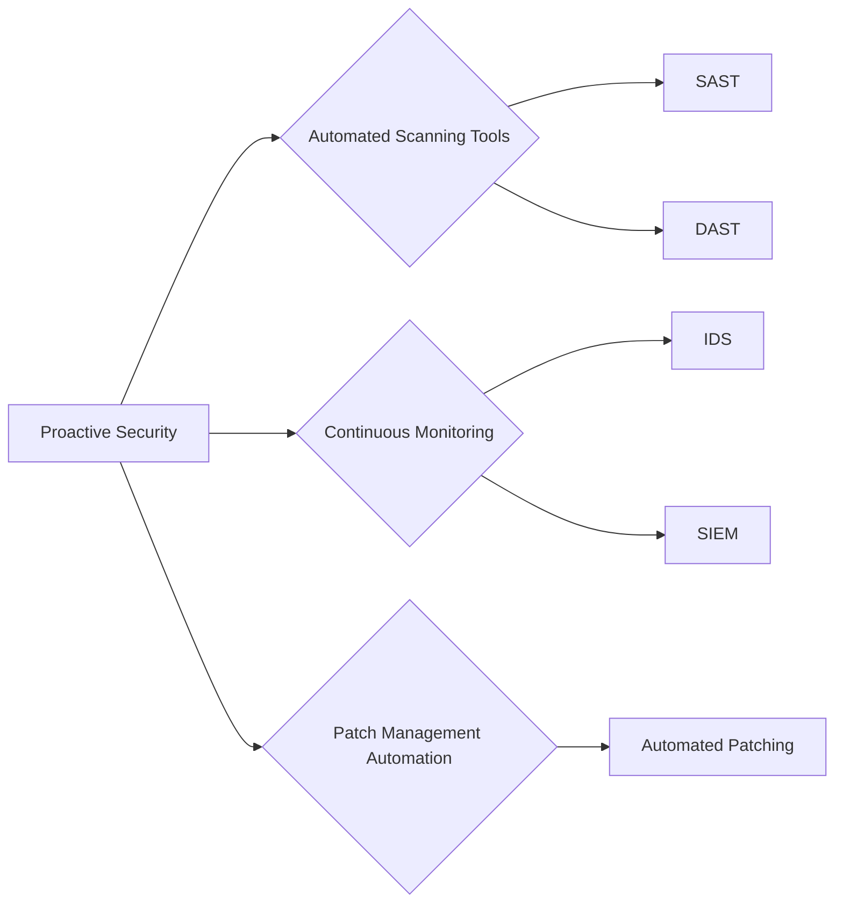

## Traditional Security Approaches in Software Development

### Background Theory

Traditional security approaches in software development typically involve manual inspections, periodic audits, and reactive measures. These methods were designed for environments where software releases were infrequent and changes were carefully planned and executed. However, modern software development environments, particularly those adopting agile methodologies and continuous integration/continuous deployment (CI/CD) pipelines, require a more dynamic and proactive approach to security.

### Friction Points in Traditional Security

The primary friction points in applying traditional security to fast-moving software development environments include:

1. **Manual Inspections**: Manual reviews and audits are time-consuming and prone to human error. They cannot keep up with the rapid pace of modern software development.
2. **Periodic Audits**: Periodic security assessments are often too late to catch vulnerabilities that could have been detected earlier in the development cycle.
3. **Reactive Measures**: Traditional security is often reactive, addressing issues only after they have been discovered, which can lead to significant delays and increased costs.

### Real-World Example: Equifax Breach (CVE-2017-5638)

The Equifax breach in 2017 is a prime example of the shortcomings of traditional security approaches. The breach was caused by a vulnerability in Apache Struts, which was not patched in a timely manner due to the company’s slow and manual patch management process. This resulted in the exposure of sensitive data of over 143 million consumers.

### How to Prevent / Defend

To prevent such breaches, organizations should adopt a proactive and automated approach to security. This includes:

1. **Automated Scanning Tools**: Implement tools like static application security testing (SAST) and dynamic application security testing (DAST) to automatically scan code for vulnerabilities.
2. **Continuous Monitoring**: Use tools like intrusion detection systems (IDS) and security information and event management (SIEM) to continuously monitor for security threats.
3. **Patch Management Automation**: Automate the process of identifying and applying security patches to ensure that vulnerabilities are addressed promptly.

---
<!-- nav -->
[[DevSecOps/DevSecOps Bootcamp/01-DevSecOps Introduction/09-Understanding DevSecOps Concepts/Module Summary/02-Embedding Security in the Software Development Lifecycle (SDLC)|Embedding Security in the Software Development Lifecycle (SDLC)]] | [[DevSecOps/DevSecOps Bootcamp/01-DevSecOps Introduction/09-Understanding DevSecOps Concepts/Module Summary/00-Overview|Overview]] | [[DevSecOps/DevSecOps Bootcamp/01-DevSecOps Introduction/09-Understanding DevSecOps Concepts/Module Summary/04-Transitioning to DevSecOps|Transitioning to DevSecOps]]
