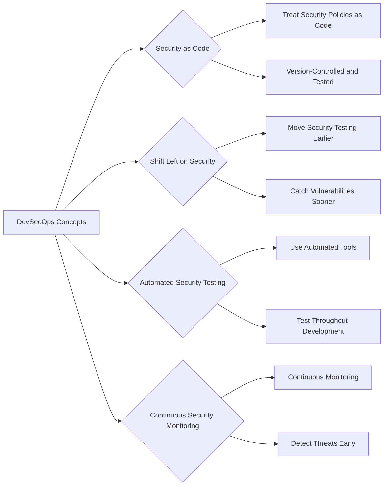
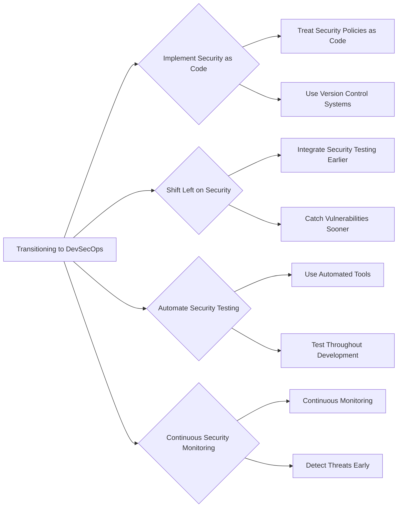

## Transitioning to DevSecOps

### Background Theory

DevSecOps is an extension of DevOps that integrates security practices into the entire software development lifecycle. The goal of DevSecOps is to ensure that security is not an afterthought but a fundamental part of the development process. This approach aims to reduce the friction that traditional security approaches create in fast-moving software development environments.

### Key Concepts of DevSecOps

1. **Security as Code**: Treat security policies and configurations as code that can be version-controlled, tested, and deployed automatically.
2. **Shift Left on Security**: Move security testing and validation earlier in the development process to catch vulnerabilities sooner.
3. **Automated Security Testing**: Use automated tools to perform security testing and validation throughout the development process.
4. **Continuous Security Monitoring**: Continuously monitor the deployed system for security threats and vulnerabilities.

### Real-World Example: Docker Hub Breach (CVE-2020-15250)

The Docker Hub breach in 2020 was caused by a vulnerability in the authentication system that allowed unauthorized access to user accounts. This breach highlights the importance of shift-left security practices. Had the authentication system been thoroughly tested earlier in the development process, the vulnerability might have been caught and fixed before it became a major issue.

### How to Prevent / Defend

To transition to DevSecOps, organizations should:

1. **Implement Security as Code**: Treat security policies and configurations as code and use version control systems to manage them.
2. **Shift Left on Security**: Integrate security testing and validation earlier in the development process to catch vulnerabilities sooner.
3. **Automate Security Testing**: Use automated tools to perform security testing and validation throughout the development process.
4. **Continuous Security Monitoring**: Continuously monitor the deployed system for security threats and vulnerabilities.

---
<!-- nav -->
[[DevSecOps/DevSecOps Bootcamp/01-DevSecOps Introduction/09-Understanding DevSecOps Concepts/Module Summary/03-Traditional Security Approaches in Software Development|Traditional Security Approaches in Software Development]] | [[DevSecOps/DevSecOps Bootcamp/01-DevSecOps Introduction/09-Understanding DevSecOps Concepts/Module Summary/00-Overview|Overview]] | [[DevSecOps/DevSecOps Bootcamp/01-DevSecOps Introduction/09-Understanding DevSecOps Concepts/Module Summary/05-Conclusion|Conclusion]]
