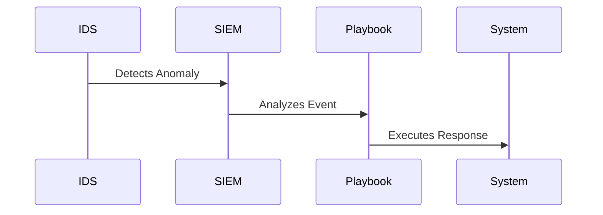

## Understanding the Need for Action in Incident Response: Benefits of Automated Response

### Introduction to Incident Response

Incident response is a critical component of cybersecurity that involves identifying, analyzing, and responding to security incidents. The goal is to minimize damage, restore normal operations, and prevent future incidents. In today’s fast-paced digital environment, the ability to respond quickly and effectively to security threats is paramount. This chapter delves into the benefits of automated incident response, comparing it with manual and hybrid approaches, and explores the underlying mechanisms and practical applications.

### Efficiency of Automated Response

#### What is Efficiency?

Efficiency in incident response refers to the speed and effectiveness with which an organization can detect, analyze, and mitigate security incidents. Automated response systems leverage predefined rules and algorithms to streamline the process, reducing the time required to respond to threats.

#### Why Does Efficiency Matter?

Efficiency is crucial because the longer it takes to respond to a security incident, the greater the potential damage. Automated systems can detect and respond to threats much faster than human operators, minimizing the window of opportunity for attackers.

#### How Does Automation Work?

Automated incident response systems typically involve the following components:

- **Detection**: Real-time monitoring tools like intrusion detection systems (IDS) and security information and event management (SIEM) systems identify potential threats.
- **Analysis**: Automated systems use machine learning and rule-based engines to analyze the detected events and determine the likelihood of a true threat.
- **Response**: Predefined playbooks and scripts are executed to contain and mitigate the threat.



#### Recent Real-World Example

In the 2021 SolarWinds supply chain attack, automated response systems could have significantly reduced the impact. The attack involved the compromise of SolarWinds’ software update servers, allowing attackers to inject malicious code into updates. An automated system could have detected unusual activity and initiated containment measures more quickly than a manual response.

### Consistency of Automated Response

#### What is Consistency?

Consistency in incident response means that the same procedures are followed every time an incident occurs. Automated systems ensure that predefined playbooks are executed consistently, reducing the risk of human error.

#### Why Does Consistency Matter?

Human operators may miss steps or make mistakes due to fatigue or inexperience. Automated systems eliminate these risks, ensuring that the same high-quality response is applied to every incident.

#### How Does Automation Ensure Consistency?

Automated systems use predefined playbooks that are executed in a consistent manner. These playbooks can be tested and validated to ensure they work correctly in various scenarios.


#### Recent Real-World Example

The 2017 WannaCry ransomware attack affected hundreds of thousands of computers worldwide. An automated response system could have detected the unusual network traffic patterns associated with the attack and initiated containment measures, reducing the spread of the malware.

### Scalability of Automated Response

#### What is Scalability?

Scalability refers to the ability of an automated incident response system to handle an increasing number of incidents without degradation in performance. As the volume of security incidents grows, automated systems can scale to meet the demand.

#### Why Does Scalability Matter?

Organizations face a growing number of security threats, and the ability to handle these threats efficiently is crucial. Automated systems can scale to manage large volumes of incidents, whereas manual systems are limited by the number of human operators available.

#### How Does Automation Enable Scalability?

Automated systems use distributed architectures and parallel processing to handle multiple incidents simultaneously. They can also leverage cloud resources to scale up as needed.


#### Recent Real-World Example

During the 2020 SolarWinds supply chain attack, the sheer volume of affected organizations made it challenging to respond manually. An automated system could have scaled up to handle the increased number of incidents, ensuring that each organization received a timely and effective response.

### Repeatability of Automated Response

#### What is Repeatability?

Repeatability refers to the ability to reuse playbooks and response strategies across different systems and environments. Automated systems can apply the same playbooks to various scenarios, ensuring consistent and high-quality responses.

#### Why Does Repeatability Matter?

Repeatability allows organizations to leverage existing knowledge and experience to respond to new incidents. This reduces the time and effort required to develop new response strategies and ensures that best practices are consistently applied.

#### How Does Automation Enable Repeatability?

Automated systems store and reuse playbooks, which can be adapted to different scenarios. This enables organizations to apply proven response strategies to new incidents, ensuring consistency and effectiveness.


#### Recent Real-World Example

The 2021 Microsoft Exchange Server vulnerabilities (CVE-2021-26855, CVE-2021-26857, CVE-2021-26858, CVE-2021-27065) affected numerous organizations globally. An automated system could have reused existing playbooks to patch the vulnerabilities and mitigate the risk of exploitation.

### Cost Reduction with Automated Response

#### What is Cost Reduction?

Cost reduction refers to the financial benefits of using automated incident response systems. These systems can reduce the overall cost of incident response by minimizing the time and resources required to respond to threats.

#### Why Does Cost Reduction Matter?

Organizations face significant costs associated with security incidents, including lost productivity, reputational damage, and regulatory fines. Automated systems can reduce these costs by enabling faster and more efficient response.

#### How Does Automation Reduce Costs?

Automated systems reduce costs by:

- **Reducing Time to Response**: Faster response times minimize the impact of security incidents.
- **Minimizing Human Error**: Automated systems reduce the risk of human error, which can lead to additional costs.
- **Optimizing Resource Utilization**: Automated systems can handle multiple incidents simultaneously, optimizing resource utilization.


#### Recent Real-World Example

The 2017 Equifax breach resulted in significant financial losses, including regulatory fines and legal settlements. An automated response system could have detected and contained the breach more quickly, potentially reducing the overall cost to the organization.

### Strategic and Technical Benefits

#### What are Strategic and Technical Benefits?

Strategic benefits refer to the broader organizational advantages of using automated incident response systems, such as improved security posture and compliance. Technical benefits relate to the specific capabilities of automated systems, such as scalability and consistency.

#### Why Are Strategic and Technical Benefits Important?

Strategic benefits help organizations achieve their overall security goals, while technical benefits enable them to implement effective incident response strategies.

#### How Do Automation Systems Provide Strategic and Technical Benefits?

Automation systems provide strategic and technical benefits by:

- **Improving Security Posture**: Automated systems enhance an organization’s overall security posture by enabling faster and more consistent response to threats.
- **Ensuring Compliance**: Automated systems can help organizations comply with regulatory requirements by ensuring consistent and effective response to security incidents.
- **Addressing Cyber Skills Shortage**: Automated systems can address the shortage of skilled cybersecurity professionals by automating routine tasks and enabling more efficient use of available resources.


#### Recent Real-World Example

The 2021 Colonial Pipeline ransomware attack highlighted the importance of automated incident response systems. An automated system could have detected and contained the attack more quickly, potentially preventing the widespread disruption caused by the incident.

### How to Prevent / Defend Against Inadequate Incident Response

#### Detection

To detect inadequate incident response, organizations should:

- **Monitor Incident Response Times**: Track the time taken to detect and respond to security incidents.
- **Analyze Response Consistency**: Evaluate the consistency of incident response across different scenarios.
- **Review Playbook Effectiveness**: Assess the effectiveness of existing playbooks and identify areas for improvement.


#### Prevention

To prevent inadequate incident response, organizations should:

- **Implement Automated Systems**: Deploy automated incident response systems to ensure faster and more consistent response.
- **Train Staff**: Train staff on incident response procedures to ensure they are prepared to handle security incidents.
- **Regularly Test Playbooks**: Regularly test and validate playbooks to ensure they work correctly in various scenarios.


#### Secure Coding Fixes

To demonstrate secure coding fixes, consider the following example:

**Vulnerable Code:**
```python
def handle_incident(incident):
    if incident.type == "malware":
        print("Malware detected")
    elif incident.type == "phishing":
        print("Phishing attempt detected")
```

**Secure Code:**
```python
def handle_incident(incident):
    if incident.type == "malware":
        print("Malware detected")
        # Additional steps to contain and mitigate the threat
        incident.contain()
        incident.mitigate()
    elif incident.type == "phishing":
        print("Phishing attempt detected")
        # Additional steps to contain and mitigate the threat
        incident.contain()
        incident.mitigate()
```

#### Configuration Hardening

To harden configurations, consider the following example:

**Vulnerable Configuration:**
```json
{
  "incident_response": {
    "playbooks": [
      {
        "name": "malware_detection",
        "steps": [
          "print('Malware detected')"
        ]
      }
    ]
  }
}
```

**Hardened Configuration:**
```json
{
  "incident_response": {
    "playbooks": [
      {
        "name": "malware_detection",
        "steps": [
          "print('Malware detected')",
          "contain_threat()",
          "mitigate_threat()"
        ]
      }
    ]
  }
}
```

### Hands-On Labs

For hands-on practice with automated incident response, consider the following labs:

- **PortSwigger Web Security Academy**: Offers interactive labs on web application security, including incident response scenarios.
- **OWASP Juice Shop**: Provides a vulnerable web application for practicing incident response and security testing.
- **DVWA (Damn Vulnerable Web Application)**: Allows users to practice incident response in a controlled environment.
- **WebGoat**: Offers a series of lessons on web application security, including incident response exercises.

These labs provide practical experience in implementing and testing automated incident response systems, helping to reinforce the concepts covered in this chapter.

### Conclusion

Automated incident response systems offer significant benefits in terms of efficiency, consistency, scalability, repeatability, and cost reduction. By leveraging these systems, organizations can improve their overall security posture and comply with regulatory requirements. However, it is essential to implement proper detection, prevention, and secure coding practices to ensure effective incident response. Hands-on labs provide valuable practice in applying these concepts in real-world scenarios.

---
<!-- nav -->
[[DevSecOps/DevSecOps Bootcamp/01-DevSecOps Introduction/10-Understanding the Need for Action in Incident Response/01-Benefits of Automated Response/00-Overview|Overview]] | [[02-Understanding the Need for Action in Incident Response|Understanding the Need for Action in Incident Response]]
