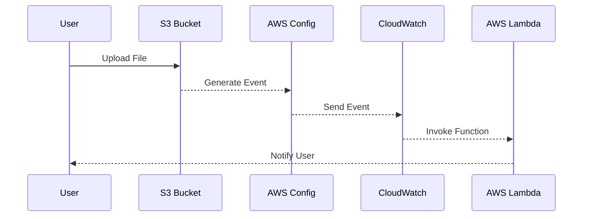

## Understanding the Need for Action in Incident Response

### Reputation Management Through Automated Response

In the realm of DevSecOps, one of the most critical aspects of incident response is maintaining the organization's reputation. When an incident occurs, the speed and effectiveness of the response can significantly influence how stakeholders perceive the organization. Automated response systems play a pivotal role in minimizing the risk and damage associated with security incidents, thereby helping to preserve or mitigate damage to the organization's reputation.

#### Why Reputation Matters

Reputation is a critical asset for any organization, especially in today’s interconnected digital landscape. A strong reputation can lead to increased customer trust, better market positioning, and higher valuations. Conversely, a damaged reputation can result in significant financial losses, loss of customers, and even legal repercussions. In the context of security incidents, the ability to quickly and effectively respond can make the difference between a minor setback and a catastrophic failure.

#### Real-World Example: Equifax Data Breach

One of the most notable examples of reputational damage due to a security breach is the Equifax data breach in 2017. This breach exposed sensitive personal information of approximately 147 million individuals. The slow and ineffective response to the breach led to a significant decline in the company's stock price and a loss of consumer trust. This incident underscores the importance of having robust automated response mechanisms in place to minimize the impact of such breaches.

### Market Share and Valuation Impact

Security incidents can have a profound impact on an organization's market share and valuation. Major data breaches often lead to a loss of customer trust, which can result in a decline in sales and market share. For publicly traded companies, this can translate into a significant drop in stock prices and overall company valuation.

#### Recent Example: Capital One Data Breach

The Capital One data breach in 2019 is another example of how security incidents can affect market share and valuation. The breach exposed sensitive information of over 100 million customers. Following the breach, the company faced regulatory scrutiny and a decline in stock price. This incident highlights the importance of proactive measures to protect against and respond to security incidents.

### Legal Ramifications and Risk Reduction

Automated response systems can help reduce the risk of legal ramifications associated with security incidents. By minimizing the time it takes to detect and respond to incidents, organizations can demonstrate a commitment to security and compliance, potentially reducing the likelihood of legal action.

#### Example: GDPR Compliance

Under the General Data Protection Regulation (GDPR), organizations are required to report data breaches within 72 hours. Failure to comply can result in substantial fines. Automated response systems can help ensure that incidents are detected and reported in a timely manner, thereby reducing the risk of non-compliance penalties.

### Case Study: Automated Incident Response Workflow

To understand the benefits of automated response, let's revisit the case study involving the continuous monitoring of an S3 bucket. In this scenario, we integrated continuous monitoring to detect misconfigurations and send email alerts. This approach allowed us to log and monitor security incidents effectively.

#### Expanding into Response Element

Now, let's expand this scenario to include the response element. Instead of relying solely on email alerts, we can introduce a more flexible service like Amazon CloudWatch to handle the response.



### Using CloudWatch for Automated Response

CloudWatch is a powerful service that can monitor various AWS resources and services, including AWS Config. By integrating CloudWatch with AWS Config, we can create a more dynamic and flexible incident response system.

#### Setting Up CloudWatch Monitoring

To set up CloudWatch monitoring for AWS Config, we first need to configure the necessary rules and alarms. Here is an example of how to set up a CloudWatch alarm:

```yaml
Resources:
  MyAlarm:
    Type: AWS::CloudWatch::Alarm
    Properties:
      AlarmName: S3BucketMisconfigurationAlarm
      ComparisonOperator: GreaterThanThreshold
      EvaluationPeriods: 1
      MetricName: MisconfiguredS3Buckets
      Namespace: AWS/S3
      Period: 300
      Statistic: Sum
      Threshold: 1
      ActionsEnabled: true
      AlarmActions:
        - !Ref MyLambdaFunction
```

This CloudFormation template sets up an alarm that triggers when the number of misconfigured S3 buckets exceeds the threshold. When the alarm is triggered, it invokes a Lambda function.

#### Lambda Function for Automated Response

The Lambda function can perform various actions, such as sending notifications, updating configurations, or even remediating the issue automatically. Here is an example of a Lambda function that sends an email notification:

```python
import boto3

def lambda_handler(event, context):
    sns = boto3.client('sns')
    topic_arn = 'arn:aws:sns:us-east-1:123456789012:S3BucketAlerts'
    
    message = f"S3 bucket misconfiguration detected: {event['detail']['resourceId']}"
    sns.publish(TopicArn=topic_arn, Message=message)
```

### Full HTTP Request and Response Example

Let's consider a scenario where a misconfiguration is detected, and an HTTP request is sent to trigger the Lambda function. Here is an example of the full HTTP request and response:

```http
POST /prod/lambda-function-name HTTP/1.1
Host: lambda.amazonaws.com
Content-Type: application/json
Authorization: Bearer <access_token>

{
  "detail": {
    "resourceId": "my-s3-bucket",
    "misconfigurationType": "public-access"
  }
}
```

```http
HTTP/1.1 200 OK
Date: Mon, 20 Mar 2023 12:00:00 GMT
Content-Type: application/json
Content-Length: 24

{
  "message": "Notification sent"
}
```

### Common Pitfalls and How to Avoid Them

While automated response systems offer numerous benefits, there are several common pitfalls to be aware of:

1. **Over-reliance on Automation**: While automation is beneficial, it should not replace human oversight entirely. Ensure that there are mechanisms in place for human intervention when necessary.
2. **False Positives/Negatives**: Automated systems can sometimes generate false positives or negatives. Regularly review and fine-tune the detection rules to minimize these occurrences.
3. **Complexity**: Overly complex automated systems can be difficult to manage and maintain. Keep the system simple and modular to facilitate easier management and troubleshooting.

### How to Prevent / Defend

#### Detection

To effectively detect security incidents, implement continuous monitoring and logging across all systems. Use tools like AWS Config, CloudWatch, and SIEM solutions to aggregate and analyze logs.

#### Prevention

Preventive measures include implementing strict access controls, regularly auditing configurations, and conducting regular security assessments. Use tools like AWS Security Hub to centralize security findings and recommendations.

#### Secure Coding Fixes

Here is an example of a vulnerable configuration and its secure counterpart:

**Vulnerable Configuration:**
```json
{
  "Version": "2012-10-17",
  "Statement": [
    {
      "Sid": "PublicReadGetObject",
      "Effect": "Allow",
      "Principal": "*",
      "Action": "s3:GetObject",
      "Resource": "arn:aws:s3:::my-bucket/*"
    }
  ]
}
```

**Secure Configuration:**
```json
{
  "Version": "2012-10-17",
  "Statement": [
    {
      "Sid": "SpecificUserAccess",
      "Effect": "Allow",
      "Principal": {
        "AWS": "arn:aws:iam::123456789012:user/specific-user"
      },
      "Action": "s3:GetObject",
      "Resource": "arn:aws:s3:::my-bucket/*"
    }
  ]
}
```

#### Configuration Hardening

Hardening configurations involves tightening security settings to minimize vulnerabilities. For example, disable public access to S3 buckets and enable server-side encryption.

### Hands-On Labs

For practical experience with automated incident response, consider the following labs:

- **PortSwigger Web Security Academy**: Offers modules on incident response and automated response systems.
- **OWASP Juice Shop**: Provides a vulnerable web application for practicing incident response scenarios.
- **DVWA (Damn Vulnerable Web Application)**: Useful for simulating and responding to various security incidents.

By thoroughly understanding and implementing automated response systems, organizations can significantly enhance their ability to respond to security incidents, thereby protecting their reputation, market share, and legal standing.

---
<!-- nav -->
[[01-Understanding the Need for Action in Incident Response Benefits of Automated Response|Understanding the Need for Action in Incident Response Benefits of Automated Response]] | [[DevSecOps/DevSecOps Bootcamp/01-DevSecOps Introduction/10-Understanding the Need for Action in Incident Response/01-Benefits of Automated Response/00-Overview|Overview]] | [[DevSecOps/DevSecOps Bootcamp/01-DevSecOps Introduction/10-Understanding the Need for Action in Incident Response/01-Benefits of Automated Response/03-Practice Questions & Answers|Practice Questions & Answers]]
