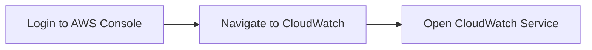
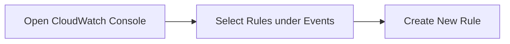
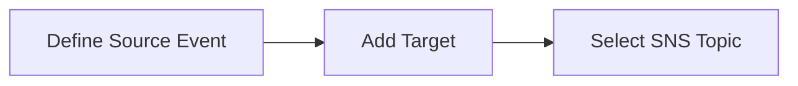
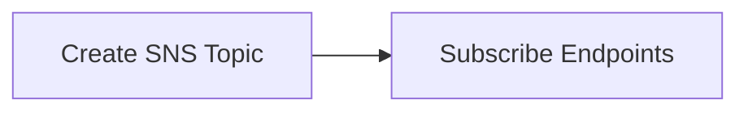
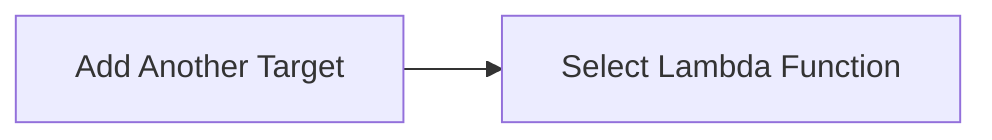

## Understanding the Need for Action in Incident Response

### Introduction to Incident Response in DevSecOps

Incident response is a critical component of DevSecOps, ensuring that organizations can quickly identify, respond to, and mitigate security incidents. In the context of cloud environments like AWS, tools such as CloudWatch play a pivotal role in automating and streamlining these processes. This chapter delves into the specifics of using CloudWatch for automated incident response, focusing on the creation and management of event rules and their associated actions.

### What is CloudWatch?

CloudWatch is a monitoring service provided by Amazon Web Services (AWS) that collects and tracks metrics, generates alarms, and provides data visualization. It allows users to monitor AWS resources, applications, and custom metrics. CloudWatch can also collect and track log files from EC2 instances, RDS databases, and other AWS services.

#### Why Use CloudWatch for Incident Response?

CloudWatch is particularly useful for incident response because it can automatically detect anomalies and trigger predefined actions. This automation is crucial in today’s fast-paced environment, where manual intervention can lead to delays and increased risk.

### Setting Up CloudWatch for Automated Incident Response

To understand how CloudWatch can be used for automated incident response, let's walk through the process of setting up an event rule that triggers actions based on specific conditions.

#### Accessing CloudWatch

1. **Log in to your AWS Management Console**.
2. **Navigate to the CloudWatch service** by clicking on the CloudWatch icon in the AWS Management Console.



#### Exploring CloudWatch Options

Once you are in the CloudWatch console, you will see various options on the left-hand side. These include:

- **Logs**: For viewing and querying log data.
- **Metrics**: For tracking system performance and operational health.
- **Alarms**: For creating alerts based on metric thresholds.
- **Events**: For managing event rules and targets.

For our purposes, we will focus on **Events**.

#### Creating an Event Rule

An event rule in CloudWatch is a set of conditions that define when an action should be taken. These rules can be triggered by various sources, including AWS Config, CloudTrail, and custom events.

1. **Click on Rules** under the Events section.
2. **Create a new rule** by clicking on the "Create rule" button.



#### Defining the Source Event

The left-hand side of the Event Rule Editor defines the source event that will trigger the rule. This could be an AWS Config finding, a CloudTrail event, or a custom event.

For our example, we will use an AWS Config finding related to an S3 bucket being publicly accessible.

1. **Choose the event source**: Select "Event Pattern".
2. **Define the event pattern**: Specify the conditions under which the rule should be triggered. For instance, if an S3 bucket is found to be publicly accessible, the rule should be triggered.

```json
{
  "source": ["aws.config"],
  "detail-type": ["Config Rules Compliance Change"],
  "detail": {
    "configRuleName": ["plural-site-course"],
    "complianceType": ["NON_COMPLIANT"]
  }
}
```

#### Defining the Target Actions

The right-hand side of the Event Rule Editor defines the actions that will be taken when the rule is triggered. These actions can include sending notifications, invoking Lambda functions, or executing other AWS services.

1. **Add a target**: Click on the "Add target" button.
2. **Select the target type**: For our example, we will select an SNS topic.



#### Configuring the SNS Topic

An SNS (Simple Notification Service) topic can be used to send notifications to subscribers when the event rule is triggered.

1. **Create an SNS topic** if you haven’t already done so.
2. **Subscribe to the SNS topic**: Add email addresses, phone numbers, or other endpoints that should receive notifications.



#### Adding Multiple Targets

You can add multiple targets to the event rule, allowing for a more comprehensive response to the incident.

1. **Add another target**: Click on the "Add target" button again.
2. **Select a Lambda function**: This function can be configured to perform additional actions, such as invoking APIs or executing scripts.



### Example Scenario: Publicly Accessible S3 Bucket

Let's consider a scenario where an S3 bucket is found to be publicly accessible. This is a common security issue that can lead to data exposure and unauthorized access.

#### Vulnerable Configuration

Suppose we have an S3 bucket named `my-public-bucket` that is configured to allow public access. This can be detected by AWS Config, which monitors compliance with security policies.

```json
{
  "Version": "2012-10-17",
  "Statement": [
    {
      "Sid": "PublicReadGetObject",
      "Effect": "Allow",
      "Principal": "*",
      "Action": "s3:GetObject",
      "Resource": "arn:aws:s3:::my-public-bucket/*"
    }
  ]
}
```

#### Secure Configuration

To secure the S3 bucket, we need to remove the public access policy and ensure that the bucket is only accessible to authorized users.

```json
{
  "Version": "2012-10-17",
  "Statement": [
    {
      "Sid": "DenyPublicAccess",
      "Effect": "Deny",
      "Principal": "*",
      "Action": "s3:*",
      "Resource": [
        "arn:aws:s3:::my-public-bucket",
        "arn:aws:s3:::my-public-bucket/*"
      ],
      "Condition": {
        "StringNotEquals": {
          "aws:PrincipalArn": [
            "arn:aws:iam::123456789012:user/authorized-user",
            "arn:aws:iam::123456789012:role/authorized-role"
          ]
        }
      }
    }
  ]
}
```

### How to Prevent / Defend

#### Detection

To detect publicly accessible S3 buckets, you can use AWS Config to monitor compliance with security policies. Additionally, you can use AWS Trusted Advisor to get recommendations on securing your S3 buckets.

#### Prevention

1. **Use IAM Policies**: Ensure that IAM policies are properly configured to restrict access to S3 buckets.
2. **Enable S3 Block Public Access**: Use the S3 Block Public Access feature to prevent public access to S3 buckets.
3. **Regular Audits**: Perform regular audits of your S3 buckets to ensure compliance with security policies.

#### Secure Coding Practices

When configuring S3 buckets, follow secure coding practices to avoid accidental public exposure.

```json
{
  "Version": "2012-10-17",
  "Statement": [
    {
      "Sid": "DenyPublicAccess",
      "Effect": "Deny",
      "Principal": "*",
      "Action": "s3:*",
      "Resource": [
        "arn:aws:s3:::my-public-bucket",
        "arn:aws:s3:::my-public-bucket/*"
      ],
      "Condition": {
        "StringNotEquals": {
          "aws:PrincipalArn": [
            "arn:aws:iam::123456789012:user/authorized-user",
            "arn:aws:iam::123456789012:role/authorized-role"
          ]
        }
      }
    }
  ]
}
```

### Real-World Examples

#### Recent Breaches

In 2021, several high-profile breaches were caused by misconfigured S3 buckets. For example, a breach at a major financial institution exposed sensitive customer data due to a publicly accessible S3 bucket.

#### CVEs

CVE-2021-38642: This CVE highlights the risks associated with misconfigured S3 buckets. Organizations should ensure that their S3 buckets are properly secured to prevent similar vulnerabilities.

### Hands-On Labs

For hands-on practice with CloudWatch and automated incident response, consider the following labs:

- **PortSwigger Web Security Academy**: Offers modules on cloud security and incident response.
- **OWASP Juice Shop**: Provides a web application with various security vulnerabilities, including cloud-related issues.
- **CloudGoat**: A series of labs designed to teach cloud security concepts, including incident response.

### Conclusion

Automated incident response using CloudWatch is a powerful tool for ensuring the security and reliability of cloud environments. By understanding how to create and manage event rules, you can proactively detect and respond to security incidents, reducing the risk of data breaches and other security issues.

By following the steps outlined in this chapter, you can effectively use CloudWatch to automate your incident response processes, ensuring that your organization remains secure and compliant.

---
<!-- nav -->
[[DevSecOps/DevSecOps Bootcamp/01-DevSecOps Introduction/10-Understanding the Need for Action in Incident Response/02-Demo AWS CloudWatch/00-Overview|Overview]] | [[DevSecOps/DevSecOps Bootcamp/01-DevSecOps Introduction/10-Understanding the Need for Action in Incident Response/02-Demo AWS CloudWatch/02-Practice Questions & Answers|Practice Questions & Answers]]
