## Understanding the Need for Action in Incident Response

### Introduction to Incident Response

Incident response is a critical component of any organization’s cybersecurity strategy. It involves the processes and tools used to identify, contain, eradicate, and recover from cyber incidents. The goal is to minimize damage, reduce recovery time, and prevent future attacks. In the context of DevSecOps, incident response is integrated into the continuous development and deployment cycle, ensuring that security measures are proactive rather than reactive.

### Manual vs. Automated Incident Response

#### Manual Incident Response

Manual incident response involves human intervention to identify and respond to security incidents. This method can be time-consuming and prone to human error. However, it allows for nuanced decision-making based on the specific circumstances of each incident.

**Example:**
Consider a scenario where a company detects unusual activity on one of its servers. A security analyst manually investigates the logs, identifies the source of the activity, and takes steps to isolate the server and notify relevant stakeholders.

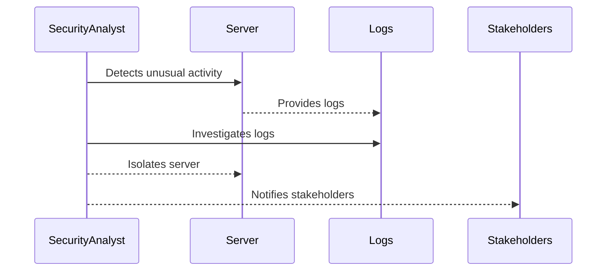

#### Automated Incident Response

Automated incident response leverages technology to automatically detect, analyze, and respond to security incidents. This approach significantly reduces the time required to handle incidents and minimizes the risk of human error.

**Example:**
A company uses a Security Information and Event Management (SIEM) system to monitor network traffic and system logs. When the SIEM detects a potential threat, it automatically triggers a series of predefined actions, such as isolating the affected system and notifying the security team.

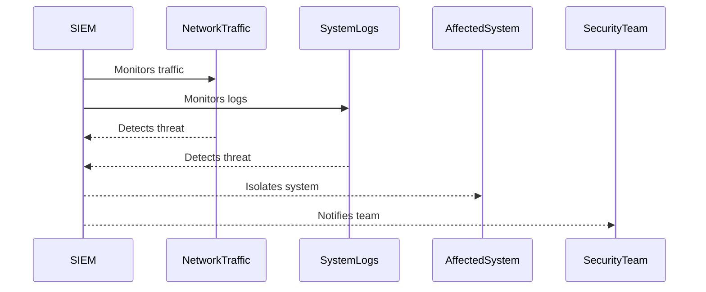

### Benefits of Automated Incident Response

#### Speed and Efficiency

Automated incident response systems can detect and respond to threats much faster than manual methods. This speed is crucial in minimizing the impact of an attack.

**Example:**
In the 2017 Equifax breach, the company failed to patch a known vulnerability in a timely manner, leading to the exposure of sensitive data. An automated incident response system could have detected the vulnerability and applied the necessary patches more quickly.

#### Consistency and Reliability

Automated systems ensure consistent and reliable responses to incidents. They follow predefined protocols, reducing the risk of human error.

**Example:**
The 2019 Capital One breach involved unauthorized access to customer data due to misconfigured firewall rules. An automated system could have detected the misconfiguration and alerted the security team immediately.

### Case Study: Expanding from Monitoring to Taking Action

#### Monitoring and Alerting

Monitoring and alerting involve continuously watching for signs of security incidents and notifying the appropriate personnel when suspicious activity is detected. While this is a crucial first step, it does not address the need to take immediate action to mitigate the threat.

**Example:**
A company uses a SIEM system to monitor network traffic and system logs. When the SIEM detects a potential threat, it sends an alert to the security team. However, the team must then manually investigate and respond to the alert.

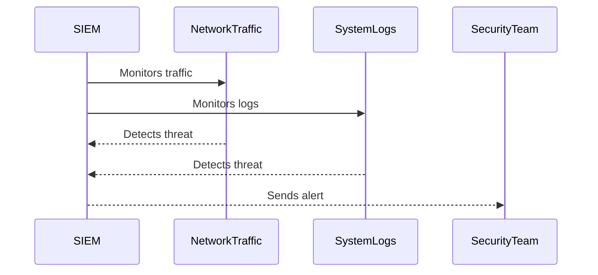

#### Taking Action

Taking action involves not only detecting and alerting but also automatically responding to the threat. This includes isolating affected systems, blocking malicious IP addresses, and initiating recovery procedures.

**Example:**
A company uses a SIEM system to monitor network traffic and system logs. When the SIEM detects a potential threat, it automatically isolates the affected system, blocks the malicious IP address, and notifies the security team.

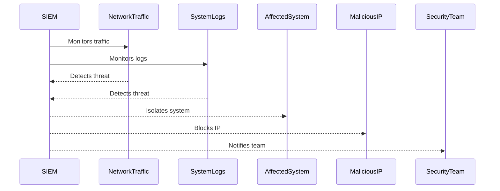

### Creating Your Own Automated Incident Response Procedures

#### Step-by-Step Guide

1. **Define Incident Types**: Identify the types of incidents your organization might face, such as malware infections, unauthorized access, or data breaches.
2. **Develop Response Playbooks**: Create detailed playbooks for each incident type, outlining the steps to be taken in response.
3. **Integrate with Existing Tools**: Integrate your incident response procedures with existing security tools, such as SIEM, IDS/IPS, and firewalls.
4. **Test and Validate**: Regularly test and validate your incident response procedures to ensure they work as intended.

**Example:**

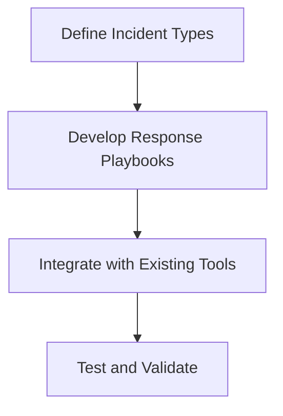

#### Example Playbook: Malware Infection

1. **Detection**: Use antivirus software to detect malware.
2. **Isolation**: Automatically isolate the infected system from the network.
3. **Containment**: Block the IP address associated with the malware.
4. **Analysis**: Analyze the malware to understand its behavior and origin.
5. **Recovery**: Restore the system from a clean backup.
6. **Notification**: Notify the security team and relevant stakeholders.

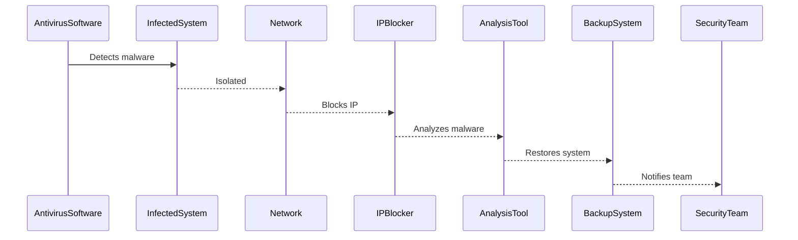

### Improving Incident Response Capability

#### Identifying Key Performance Indicators (KPIs)

Key performance indicators (KPIs) are metrics used to measure the effectiveness of incident response. Common KPIs include:

- **Mean Time to Detection (MTTD)**: The average time it takes to detect an incident.
- **Mean Time to Containment (MTTC)**: The average time it takes to contain an incident.
- **Mean Time to Recovery (MTTR)**: The average time it takes to recover from an incident.

**Example:**

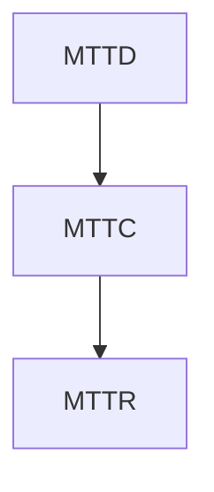

#### Metrics for Continuous Improvement

Metrics help organizations track their progress and identify areas for improvement. By regularly analyzing these metrics, organizations can refine their incident response procedures and enhance their overall security posture.

**Example:**

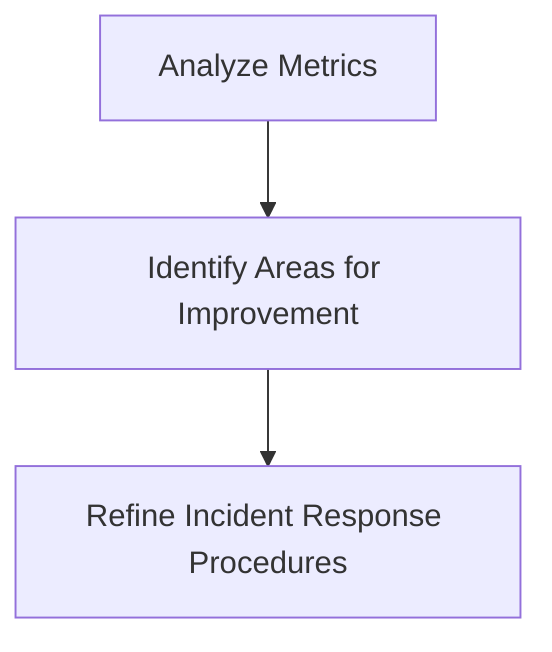

### Real-World Examples and Breaches

#### Equifax Breach (2017)

The Equifax breach involved the exposure of sensitive personal information due to a failure to patch a known vulnerability. An automated incident response system could have detected the vulnerability and applied the necessary patches more quickly.

**Example:**

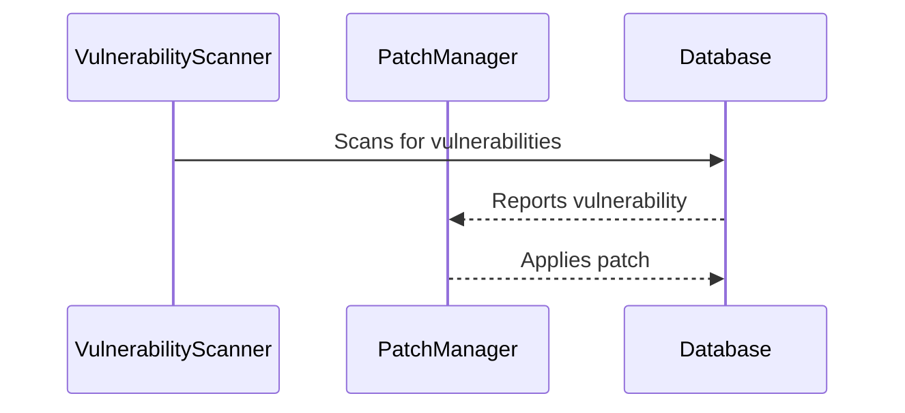

#### Capital One Breach (2019)

The Capital One breach involved unauthorized access to customer data due to misconfigured firewall rules. An automated system could have detected the misconfiguration and alerted the security team immediately.

**Example:**

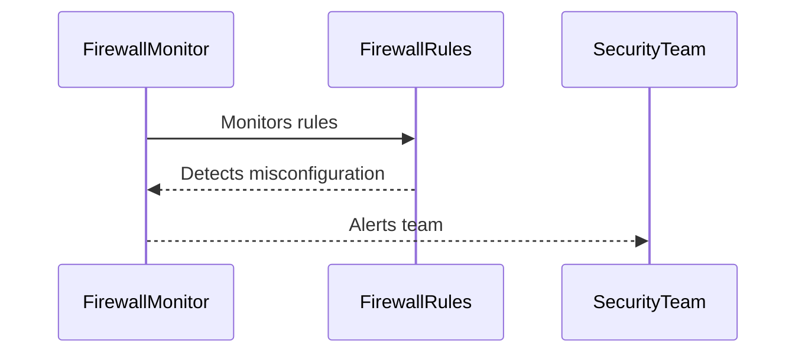

### How to Prevent / Defend

#### Detection

Implement robust monitoring and alerting mechanisms to detect potential security incidents. Use tools like SIEM, IDS/IPS, and antivirus software to continuously monitor your environment.

**Example:**

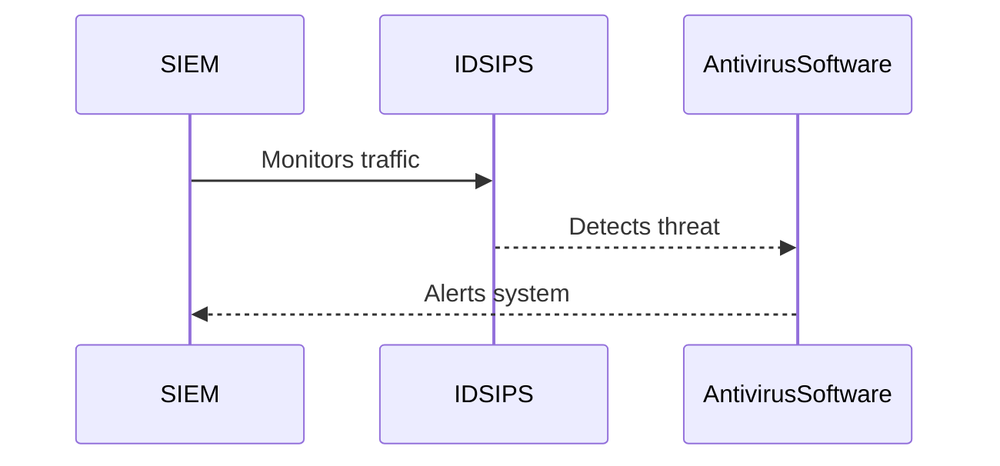

#### Prevention

Prevent security incidents by implementing strong security controls and policies. This includes regular patch management, secure coding practices, and network segmentation.

**Example:**

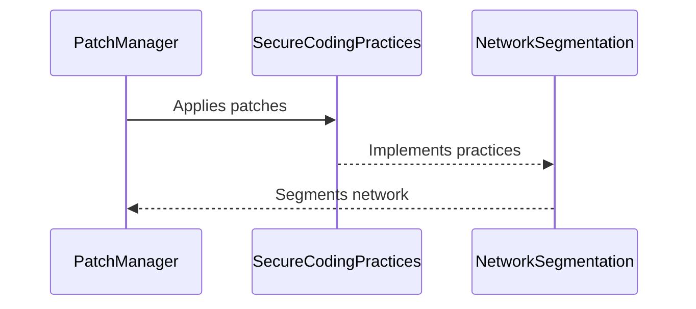

#### Secure Coding Fixes

Show the vulnerable pattern and the corrected secure version side by side.

**Vulnerable Code:**

```python
def login(username, password):
    if username == "admin" and password == "password":
        return True
    else:
        return False
```

**Secure Code:**

```python
import hashlib

def login(username, password):
    hashed_password = hashlib.sha256(password.encode()).hexdigest()
    if username == "admin" and hashed_password == "hashed_password":
        return True
    else:
        return False
```

#### Configuration Hardening

Harden your configurations to prevent unauthorized access and ensure that only necessary services are exposed.

**Example:**

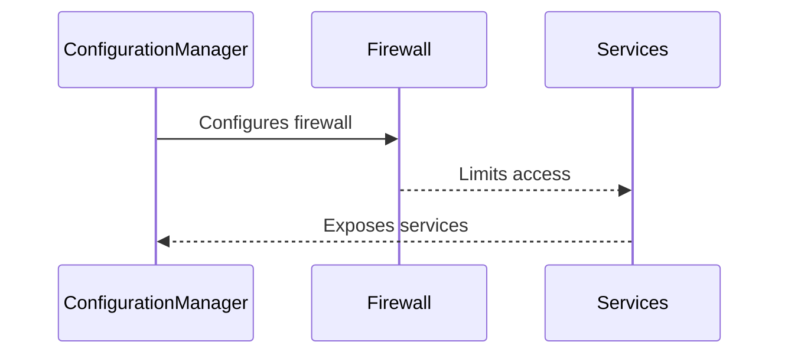

### Practice Labs

For hands-on practice in incident response, consider the following well-known labs:

- **PortSwigger Web Security Academy**: Offers interactive labs to learn about web application security.
- **OWASP Juice Shop**: A deliberately insecure web application for practicing web security skills.
- **DVWA (Damn Vulnerable Web Application)**: A PHP/MySQL web application that demonstrates web application vulnerabilities.
- **WebGoat**: An interactive, gamified training application for learning about web application security.

These labs provide practical experience in identifying and responding to security incidents, helping to reinforce the concepts learned in this module.

### Conclusion

Understanding the need for action in incident response is crucial for maintaining a strong cybersecurity posture. By integrating automated incident response into your DevSecOps pipeline, you can significantly reduce the time and effort required to handle security incidents. Regularly testing and validating your incident response procedures, along with implementing strong security controls and policies, will help ensure that your organization is prepared to respond effectively to any security threat.

---
<!-- nav -->
[[DevSecOps/DevSecOps Bootcamp/01-DevSecOps Introduction/10-Understanding the Need for Action in Incident Response/04-Module Summary/00-Overview|Overview]] | [[DevSecOps/DevSecOps Bootcamp/01-DevSecOps Introduction/10-Understanding the Need for Action in Incident Response/04-Module Summary/02-Practice Questions & Answers|Practice Questions & Answers]]
