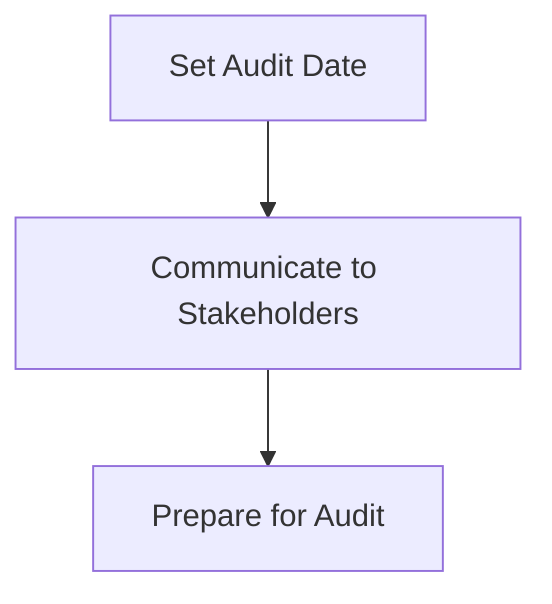
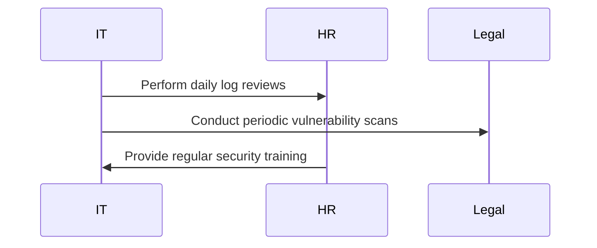
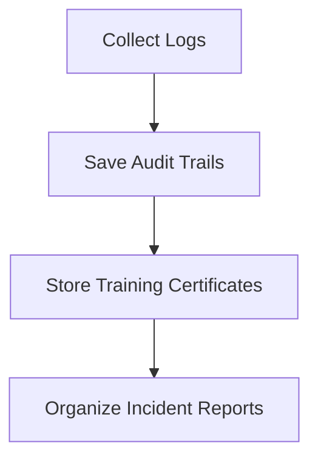
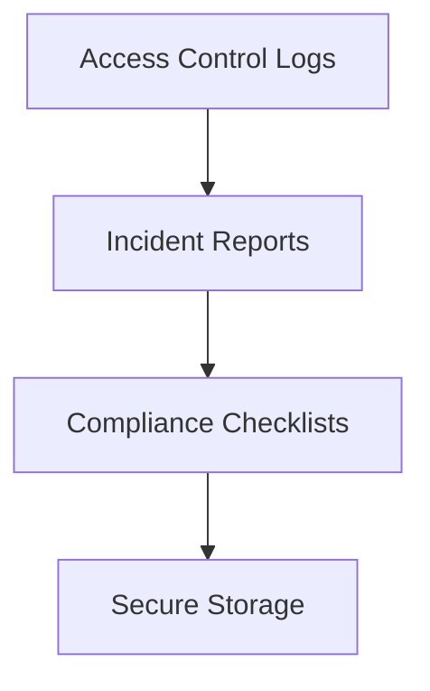
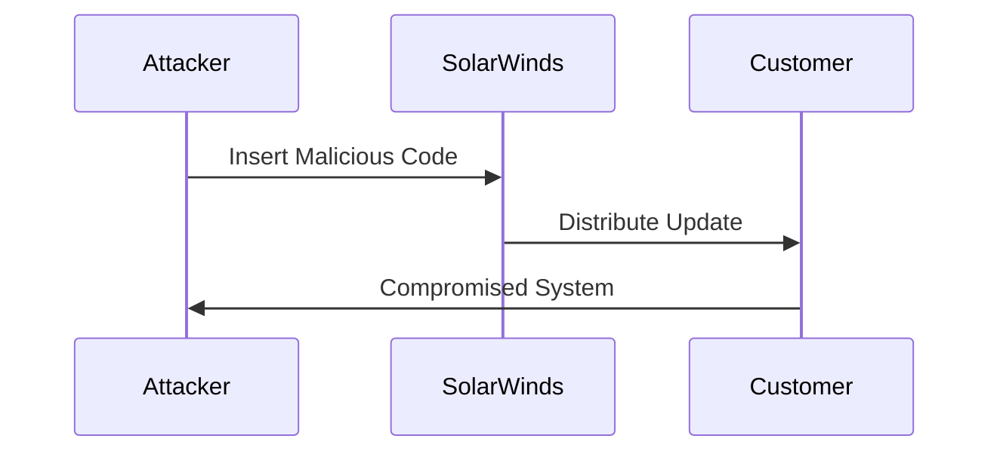
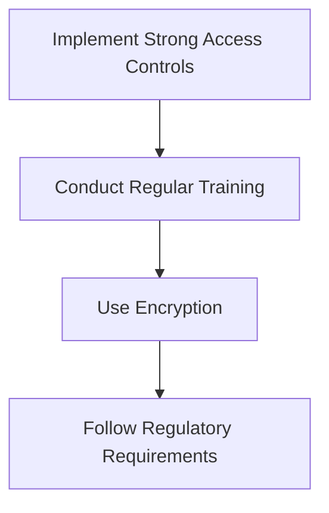
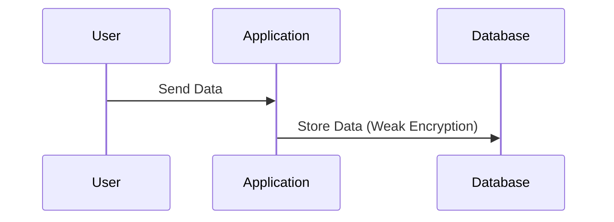
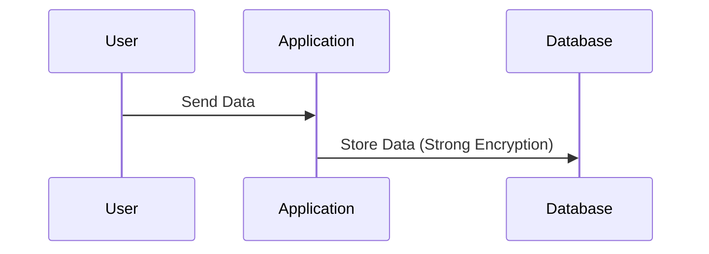
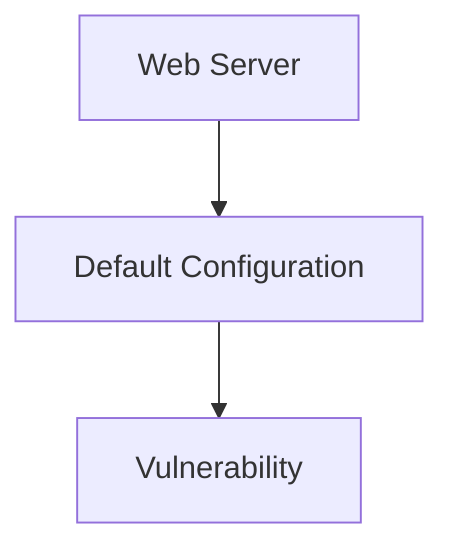
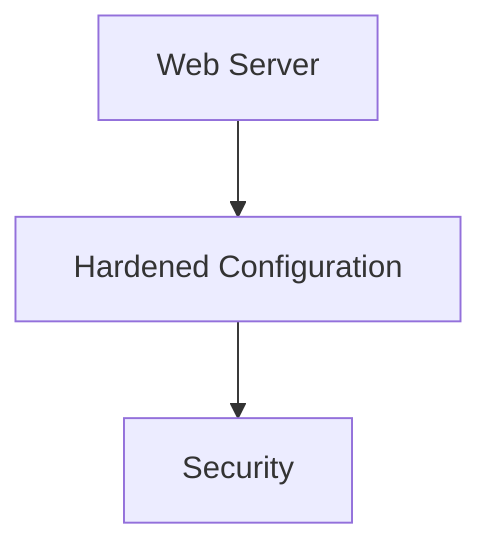

## Understanding the Need for Security Compliance

### Introduction to Security Audits

Security audits are a critical component of ensuring that an organization adheres to established security standards and regulations. These audits serve as a formal process to evaluate the effectiveness of an organization’s security measures and compliance with regulatory requirements. The relevance of security audits to security compliance cannot be overstated, as they provide a structured approach to verifying that all necessary security controls are in place and functioning correctly.

#### Why Security Audits Matter

Security audits are essential because they help organizations identify gaps in their security posture and ensure that they meet legal and regulatory requirements. By conducting regular audits, organizations can:

- **Identify Vulnerabilities:** Detect potential weaknesses in their systems and processes.
- **Ensure Compliance:** Verify adherence to industry-specific regulations and standards.
- **Improve Security Posture:** Implement corrective actions based on audit findings to enhance overall security.

### Preparation Playbook for Security Audits

To effectively prepare for a security audit, it is crucial to have a comprehensive plan in place. This playbook outlines the steps necessary to ensure that all required evidence is collected and organized, making the audit process smoother and more efficient.

#### Step-by-Step Preparation Process

1. **Determine the Audit Date**
   - Security audits are typically scheduled well in advance, often several months before the actual audit date. This allows ample time for preparation.
   - Example: An audit might be scheduled for June 1st, but the preparation process could start as early as January 1st.

2. **Ensure Day-to-Day Compliance Activities**
   - Regularly perform all activities that support security compliance.
   - Document these activities meticulously to provide evidence of compliance.
   - Example: Daily log reviews, periodic vulnerability scans, and regular security training sessions.

3. **Capture Relevant Evidence**
   - Collect and organize all evidence that demonstrates compliance with security standards.
   - Evidence can take various forms, including documentation, records, and other written records.
   - Example: Log files, audit trails, and training certificates.

4. **Maintain Mandatory Security Records**
   - Ensure that all mandatory security records are kept accurate and stored securely.
   - These records may be requested during the audit and should be readily available.
   - Example: Access control logs, incident reports, and compliance checklists.

### Detailed Explanation of Each Step

#### Determining the Audit Date

The audit date is typically determined by the organization’s internal audit schedule or by external regulatory bodies. Once the date is set, it is important to communicate this information to all relevant stakeholders within the organization.



**Example Scenario:**

Suppose an organization has scheduled an audit for June 1st. The first step would be to inform all relevant departments, such as IT, HR, and Legal, about the upcoming audit. This ensures that everyone is aware of the timeline and can begin preparing accordingly.

#### Ensuring Day-to-Day Compliance Activities

Regular compliance activities are essential to maintaining a strong security posture. These activities should be performed consistently and documented thoroughly.



**Example Scenario:**

An IT department might perform daily log reviews to monitor for any unusual activity. These logs should be saved and documented. Additionally, the HR department might conduct regular security training sessions for employees, which should also be recorded and documented.

#### Capturing Relevant Evidence

Evidence is crucial in demonstrating compliance during an audit. This evidence can include various types of documentation and records.



**Example Scenario:**

An organization might collect system logs, save audit trails from access control systems, store training certificates from security training sessions, and organize incident reports from any security incidents. All of these documents should be organized and easily accessible.

#### Maintaining Mandatory Security Records

Mandatory security records are essential for demonstrating compliance. These records should be kept accurate and stored securely.



**Example Scenario:**

An organization might maintain access control logs to track who accessed sensitive systems, keep detailed incident reports for any security breaches, and use compliance checklists to ensure all necessary controls are in place. All of these records should be stored securely, perhaps using encrypted storage solutions.

### Real-World Examples and Recent Breaches

Recent breaches and vulnerabilities highlight the importance of security audits and compliance. For instance, the SolarWinds breach in 2020 demonstrated the need for robust security controls and regular audits.

#### SolarWinds Breach (CVE-2020-1014)

The SolarWinds breach involved a supply chain attack where attackers inserted malicious code into SolarWinds software updates. This breach affected numerous organizations, including government agencies and private companies.



**Impact:**

This breach highlighted the importance of supply chain security and the need for regular security audits to detect and mitigate such threats.

### How to Prevent / Defend Against Security Risks

#### Detection

Detecting security risks requires a combination of proactive monitoring and regular audits. Tools like intrusion detection systems (IDS) and security information and event management (SIEM) systems can help in identifying potential threats.

```mermaid
graph TD
    A[Intrusion Detection Systems (IDS)] --> B[Security Information and Event Management (SIEM)]
    B --> C[Regular Audits]
```

**Example Scenario:**

An organization might deploy IDS to monitor network traffic for suspicious activity and use SIEM to correlate events across different systems. Regular audits can then verify that these tools are functioning correctly and that all necessary controls are in place.

#### Prevention

Preventing security risks involves implementing robust security controls and ensuring compliance with regulatory requirements.



**Example Scenario:**

An organization might implement strong access controls, such as multi-factor authentication (MFA), conduct regular security training for employees, use encryption to protect sensitive data, and follow all relevant regulatory requirements.

### Secure Coding Fixes

#### Vulnerable Code Example

Consider a scenario where an application uses weak encryption methods, leading to potential data exposure.



**Vulnerable Code:**

```python
# Vulnerable Code
import hashlib

def encrypt_data(data):
    return hashlib.md5(data.encode()).hexdigest()
```

#### Secure Code Example

To address this vulnerability, the application should use stronger encryption methods, such as AES.



**Secure Code:**

```python
# Secure Code
from Crypto.Cipher import AES
from Crypto.Util.Padding import pad

def encrypt_data(data, key):
    cipher = AES.new(key, AES.MODE_CBC)
    ct_bytes = cipher.encrypt(pad(data.encode(), AES.block_size))
    return (ct_bytes, cipher.iv)
```

### Configuration Hardening

Configuration hardening involves securing system configurations to minimize vulnerabilities.

#### Vulnerable Configuration Example

Consider a scenario where a web server is configured with default settings, leaving it vulnerable to attacks.



**Vulnerable Configuration:**

```nginx
server {
    listen 80;
    server_name example.com;

    location / {
        root /var/www/html;
        index index.html;
    }
}
```

#### Secure Configuration Example

To secure the web server, the configuration should be hardened by disabling unnecessary services and enabling security features.



**Secure Configuration:**

```nginx
server {
    listen 80;
    server_name example.com;

    location / {
        root /var/www/html;
        index index.html;
    }

    # Disable directory listing
    autoindex off;

    # Enable security headers
    add_header Content-Security-Policy "default-src 'self'";
    add_header X-Content-Type-Options nosniff;
    add_header X-Frame-Options DENY;
    add_header X-XSS-Protection "1; mode=block";
}
```

### Hands-On Labs

For hands-on practice in DevSecOps and security compliance, consider the following well-known labs:

- **PortSwigger Web Security Academy:** Focuses on web application security and includes modules on security audits and compliance.
- **OWASP Juice Shop:** A deliberately insecure web application for practicing security testing and compliance.
- **DVWA (Damn Vulnerable Web Application):** Another intentionally vulnerable web application for learning security concepts.
- **WebGoat:** An interactive training application for learning web security principles.

These labs provide practical experience in identifying and mitigating security risks, ensuring compliance with regulatory requirements, and improving overall security posture.

### Conclusion

Security audits are a vital component of ensuring compliance with security standards and regulations. By following a comprehensive preparation playbook, organizations can effectively prepare for audits, gather necessary evidence, and maintain a strong security posture. Regular audits and proactive security measures are essential in today’s threat landscape, helping organizations stay ahead of potential vulnerabilities and breaches.

---
<!-- nav -->
[[DevSecOps/DevSecOps Bootcamp/01-DevSecOps Introduction/11-Understanding the Need for Security Compliance/01-Compliance Audit Runbook/00-Overview|Overview]] | [[DevSecOps/DevSecOps Bootcamp/01-DevSecOps Introduction/11-Understanding the Need for Security Compliance/01-Compliance Audit Runbook/02-Practice Questions & Answers|Practice Questions & Answers]]
