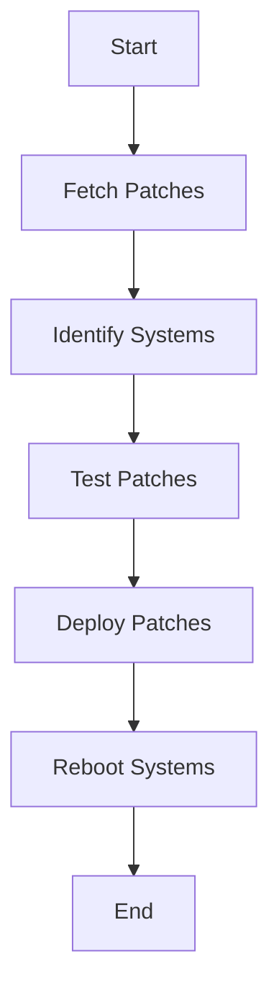

## Understanding the Need for Security Compliance

### Introduction to Security Compliance

Security compliance refers to the adherence to a set of standards, regulations, and policies designed to protect information assets and ensure the integrity, confidentiality, and availability of data. In the context of DevSecOps, security compliance is integrated into the development lifecycle to ensure that security measures are implemented consistently and automatically throughout the software development process.

#### Why Security Compliance Matters

Security compliance is crucial because it helps organizations mitigate risks associated with data breaches, regulatory non-compliance, and operational disruptions. By adhering to established security standards and policies, organizations can:

- **Protect sensitive data**: Ensure that confidential information is safeguarded against unauthorized access.
- **Maintain regulatory compliance**: Avoid penalties and reputational damage by meeting legal and industry-specific requirements.
- **Enhance trust**: Build confidence among customers, partners, and stakeholders by demonstrating a commitment to security best practices.

### Traditional Approach to Patch Management

Before diving into the modern automated approach, let's first understand the traditional method of managing operating system patches.

#### Step-by-Step Manual Process

1. **Download Patches from Vendor Site**:
   - **What**: Organizations must visit the vendor's website to download the latest security patches.
   - **Why**: Vendors release security patches to address vulnerabilities discovered in their software.
   - **How**: Typically, this involves navigating to the vendor’s support portal, locating the relevant patches, and downloading them to a local server.

2. **Identify Systems Requiring Patching**:
   - **What**: Determine which systems need to be patched based on the installed operating system and applications.
   - **Why**: Not all systems may require the same patches, so identifying the correct systems ensures efficient resource utilization.
   - **How**: This can be done using inventory management tools or manually checking system configurations.

3. **Install Patches on Test Systems**:
   - **What**: Apply the downloaded patches to a subset of systems designated as test environments.
   - **Why**: Testing ensures that the patches do not cause any adverse effects on the systems.
   - **How**: This involves deploying the patches and monitoring the systems for any issues over a specified period, typically 7 days.

4. **Deploy Patches to Production Systems**:
   - **What**: After successful testing, deploy the patches to production systems.
   - **Why**: Ensures that all systems are protected against the vulnerabilities addressed by the patches.
   - **How**: This often requires scheduling maintenance windows to minimize disruption to business operations.

#### Pitfalls of the Traditional Approach

The traditional approach to patch management is fraught with challenges:

- **Manual Errors**: Human intervention increases the likelihood of errors, such as missing critical patches or applying incorrect versions.
- **Time-Consuming**: The process is labor-intensive and time-consuming, delaying the application of critical security updates.
- **Inconsistent Application**: Without proper oversight, patches may not be applied uniformly across all systems, leaving some systems vulnerable.

### Modern Automated Approach to Patch Management

To overcome the limitations of the traditional approach, modern DevSecOps practices leverage automation to streamline the patch management process.

#### Automating Patch Management

1. **Automated Patch Download**:
   - **What**: Use automated tools to download patches from vendor sites.
   - **Why**: Reduces the risk of human error and ensures timely access to the latest security updates.
   - **How**: Tools like Ansible, Puppet, or Chef can be configured to automatically fetch patches from vendor repositories.

2. **Automated System Identification**:
   - **What**: Utilize inventory management tools to identify systems requiring patches.
   - **Why**: Ensures that only relevant systems receive the necessary updates, optimizing resource usage.
   - **How**: Inventory management tools like SCCM (System Center Configuration Manager) or Ansible can scan the environment and generate a list of systems needing patches.

3. **Automated Patch Testing**:
   - **What**: Implement automated testing frameworks to apply patches to test systems.
   - **Why**: Minimizes the risk of adverse effects by validating patches in a controlled environment.
   - **How**: Continuous Integration/Continuous Deployment (CI/CD) pipelines can be configured to automatically deploy patches to test environments and run predefined tests.

4. **Automated Patch Deployment**:
   - **What**: Use orchestration tools to deploy patches to production systems.
   - **Why**: Ensures consistent and timely application of patches across all systems.
   - **How**: Orchestration tools like Ansible, SaltStack, or Kubernetes can be used to automate the deployment process, including scheduling maintenance windows and rolling out patches in a controlled manner.

#### Example of Automated Compliance

Let's walk through a detailed example of how an organization might implement an automated patch management solution using Ansible.

```yaml
# ansible-playbook.yml
---
- name: Apply OS patches
  hosts: all
  become: yes
  tasks:
    - name: Update package lists
      apt:
        update_cache: yes

    - name: Install security updates
      apt:
        upgrade: dist
        security: yes

    - name: Reboot if required
      reboot:
        msg: "System will reboot after applying security updates"
        reboot_timeout: 300
```

This playbook automates the process of updating package lists, installing security updates, and rebooting systems if necessary. The `become: yes` directive ensures that the tasks are executed with elevated privileges.

#### Mermaid Diagram: Automated Patch Management Workflow



### Real-World Examples and Recent Breaches

#### Example: Equifax Data Breach (CVE-2017-5638)

In 2017, Equifax suffered a massive data breach due to an unpatched Apache Struts vulnerability (CVE-2017-5638). The attackers exploited this vulnerability to gain unauthorized access to sensitive customer data. This incident highlights the importance of timely patch management and the potential consequences of failing to apply critical security updates.

#### Example: SolarWinds Supply Chain Attack (CVE-2020-1014)

In 2020, a sophisticated supply chain attack targeted SolarWinds, a widely used IT management software provider. The attackers compromised SolarWinds’ build environment and injected malicious code into the Orion software, leading to widespread infections across various organizations. This attack underscores the need for robust security compliance and the importance of maintaining up-to-date security measures.

### How to Prevent / Defend Against Compliance Risks

#### Detection

- **Patch Management Tools**: Use tools like Ansible, Puppet, or Chef to monitor and manage patch levels across systems.
- **Inventory Management**: Maintain an accurate inventory of all systems and their current patch status.
- **Vulnerability Scanning**: Regularly scan systems for known vulnerabilities using tools like Nessus or Qualys.

#### Prevention

- **Automate Patch Management**: Implement automated workflows to ensure timely and consistent application of security updates.
- **Regular Audits**: Conduct regular audits to verify compliance with internal and external security policies.
- **Training and Awareness**: Educate staff on the importance of security compliance and the risks associated with non-compliance.

#### Secure Coding Fixes

##### Vulnerable Code Example

```python
import os
import subprocess

def apply_patch(patch_file):
    subprocess.run(['apt-get', 'update'])
    subprocess.run(['apt-get', 'upgrade', '-y', patch_file])
```

##### Secure Code Example

```python
import os
import subprocess

def apply_patch(patch_file):
    subprocess.run(['sudo', 'apt-get', 'update'], check=True)
    subprocess.run(['sudo', 'apt-get', 'upgrade', '-y', patch_file], check=True)
```

The secure version uses `sudo` to ensure elevated privileges and includes `check=True` to raise an exception if the command fails, providing better error handling.

#### Configuration Hardening

##### Example: Nginx Configuration

```nginx
server {
    listen 80;
    server_name example.com;

    location / {
        root /var/www/html;
        index index.html index.htm;
    }

    # Security Headers
    add_header Content-Security-Policy "default-src 'self'";
    add_header X-Content-Type-Options nosniff;
    add_header X-Frame-Options DENY;
    add_header X-XSS-Protection "1; mode=block";
}
```

This configuration includes several security headers to enhance the security of the web server.

### Practice Labs

For hands-on experience with automated compliance and patch management, consider the following labs:

- **PortSwigger Web Security Academy**: Offers modules on web application security and compliance.
- **OWASP Juice Shop**: Provides a vulnerable web application for practicing security assessments.
- **DVWA (Damn Vulnerable Web Application)**: A deliberately insecure web application for security training.

These labs provide practical scenarios to reinforce the concepts learned in this chapter.

### Conclusion

Understanding the need for security compliance and implementing automated compliance solutions are essential components of a robust DevSecOps strategy. By leveraging modern automation tools and best practices, organizations can significantly reduce the risk of security breaches and ensure consistent adherence to security policies.

---
<!-- nav -->
[[DevSecOps/DevSecOps Bootcamp/01-DevSecOps Introduction/11-Understanding the Need for Security Compliance/02-Example of Automated Compliance/00-Overview|Overview]] | [[DevSecOps/DevSecOps Bootcamp/01-DevSecOps Introduction/11-Understanding the Need for Security Compliance/02-Example of Automated Compliance/02-Practice Questions & Answers|Practice Questions & Answers]]
