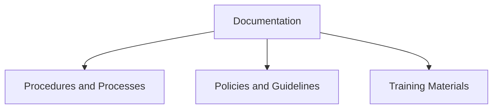
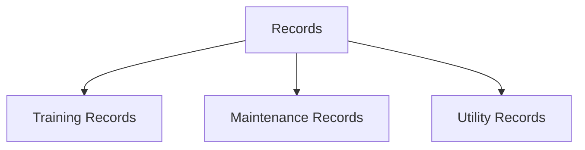
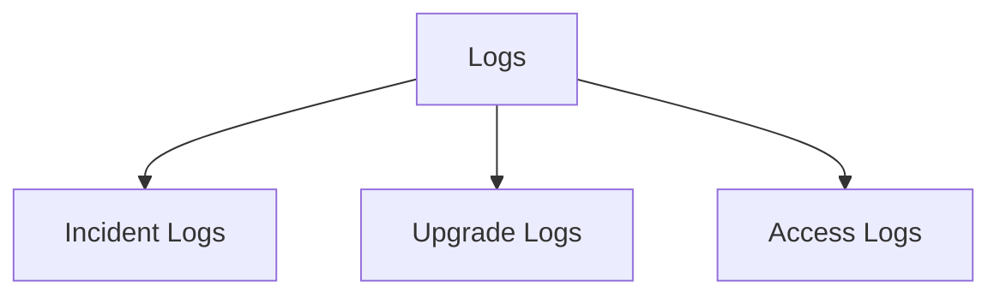
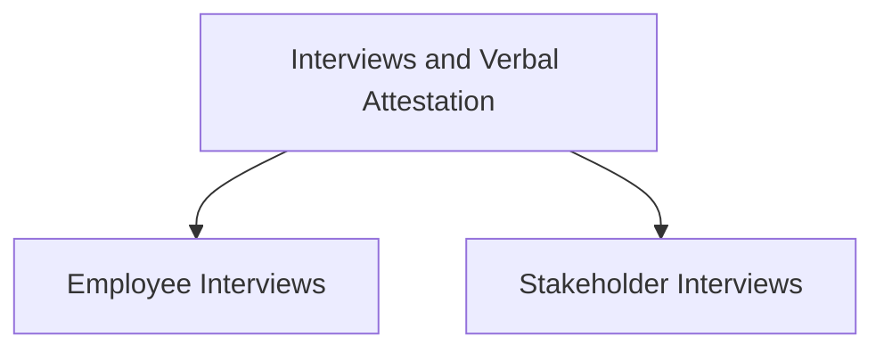

## Understanding the Need for Security Compliance

### Introduction to Security Compliance

Security compliance refers to the adherence to a set of predefined rules, regulations, and standards designed to protect sensitive information and maintain the integrity of an organization’s operations. These rules and regulations can come from various sources, including government bodies, industry-specific organizations, and internal policies. Demonstrating compliance is crucial because it ensures that an organization is meeting the necessary requirements to operate securely and legally.

### How to Demonstrate Good Security Compliance

Demonstrating good security compliance involves several key aspects, including documentation, records, logs, and interviews. Each of these elements plays a critical role in proving that an organization is adhering to the required standards.

#### Documentation

Documentation is one of the most fundamental aspects of demonstrating compliance. It includes detailed records of procedures and processes that the organization follows. This documentation serves as evidence that the organization is following defined good practices, which can be either industry-standard practices or internally defined practices.

**Why Documentation Matters**

Documentation is essential because it provides a clear and traceable record of what the organization does to maintain security. Without proper documentation, it would be difficult to prove that the organization is following the required practices. Documentation also helps in maintaining consistency across different teams and departments within the organization.

**What Should Be Documented**

- **Procedures and Processes**: Detailed steps for handling sensitive data, performing security audits, and managing access controls.
- **Policies and Guidelines**: Internal policies and guidelines that align with industry standards and regulatory requirements.
- **Training Materials**: Documentation of training sessions conducted for employees to ensure they understand their roles in maintaining security.

**Real-World Example**

Consider the case of a healthcare provider that must comply with HIPAA (Health Insurance Portability and Accountability Act). HIPAA requires detailed documentation of all procedures related to the handling of patient data. If the provider fails to maintain proper documentation, it could face severe penalties and legal consequences.



#### Records

Records are another critical component of demonstrating compliance. They include written records of activities undertaken within the organization. Examples of such records include training records, maintenance records of IT equipment, and utility records that support the IT infrastructure.

**Why Records Matter**

Records provide a historical account of activities performed within the organization. They serve as evidence that the organization is regularly conducting necessary tasks, such as training employees and maintaining IT equipment. Without proper records, it would be challenging to prove that these activities are being carried out consistently.

**Types of Records**

- **Training Records**: Documentation of training sessions conducted for employees.
- **Maintenance Records**: Records of routine maintenance performed on IT equipment.
- **Utility Records**: Records of utility services that support the IT infrastructure.

**Real-World Example**

A financial institution must comply with PCI DSS (Payment Card Industry Data Security Standard). One of the requirements is to maintain records of regular training sessions conducted for employees to ensure they understand the importance of securing payment card data. Failure to maintain these records could result in non-compliance and potential fines.



#### Logs

Logs are another key artifact that can be used to demonstrate compliance. They include incident logs, upgrade logs, and patching logs. These logs provide a detailed account of events that have occurred within the organization, such as security incidents and system upgrades.

**Why Logs Matter**

Logs are essential because they provide a chronological record of events that have taken place within the organization. They serve as evidence that the organization is actively monitoring and responding to security incidents and regularly updating its systems to address vulnerabilities.

**Types of Logs**

- **Incident Logs**: Records of security incidents that have occurred within the organization.
- **Upgrade Logs**: Records of system upgrades and patches applied to the organization’s systems.
- **Access Logs**: Records of user access to sensitive systems and data.

**Real-World Example**

In the case of a recent breach at a major retailer, the lack of proper logging was identified as a significant factor contributing to the breach. The retailer failed to maintain detailed logs of security incidents and system upgrades, making it difficult to identify and respond to the breach in a timely manner.



#### Interviews and Verbal Attestation

Interviews and verbal attestations are another method for demonstrating compliance. These involve discussions with employees and stakeholders to verify that the organization is following the required practices.

**Why Interviews Matter**

Interviews and verbal attestations provide a way to verify that the organization is actively following the required practices. They allow auditors to gain insights into the day-to-day operations of the organization and ensure that the documented procedures are being followed in practice.

**Types of Interviews**

- **Employee Interviews**: Discussions with employees to verify that they understand and follow the required procedures.
- **Stakeholder Interviews**: Discussions with stakeholders to verify that the organization is meeting the required standards.

**Real-World Example**

During an audit of a pharmaceutical company, auditors conducted interviews with employees to verify that they were following the required procedures for handling sensitive data. The interviews revealed that some employees were not following the procedures correctly, leading to recommendations for additional training and documentation.



### Common Pitfalls and How to Avoid Them

While demonstrating compliance is crucial, there are several common pitfalls that organizations should avoid. These include:

- **Incomplete Documentation**: Failing to document all procedures and processes can lead to gaps in compliance.
- **Lack of Regular Updates**: Not regularly updating documentation and records can result in outdated information.
- **Insufficient Logging**: Failing to maintain detailed logs can make it difficult to track events and respond to incidents.
- **Inadequate Training**: Not providing adequate training to employees can result in non-compliance.

**How to Avoid These Pitfalls**

- **Regular Audits**: Conduct regular internal and external audits to ensure that all procedures and processes are being followed.
- **Continuous Improvement**: Continuously update documentation and records to reflect changes in procedures and processes.
- **Detailed Logging**: Maintain detailed logs of all events and incidents to ensure that they can be tracked and responded to effectively.
- **Comprehensive Training**: Provide comprehensive training to employees to ensure that they understand their roles in maintaining security.

### Real-World Examples of Compliance Failures

Several high-profile breaches and compliance failures have highlighted the importance of demonstrating compliance. Here are a few recent examples:

- **Equifax Breach (2017)**: Equifax failed to properly patch a known vulnerability, leading to a massive data breach that affected millions of customers. The breach highlighted the importance of maintaining detailed logs of system upgrades and patches.
- **Capital One Breach (2019)**: Capital One failed to properly configure its web application firewall, leading to a breach that exposed sensitive customer data. The breach highlighted the importance of maintaining detailed records of system configurations and access controls.
- **Marriott Breach (2018)**: Marriott failed to properly encrypt sensitive customer data, leading to a breach that exposed millions of customer records. The breach highlighted the importance of maintaining detailed documentation of data encryption procedures.

### How to Prevent / Defend Against Non-Compliance

To prevent non-compliance, organizations should implement the following measures:

- **Regular Audits**: Conduct regular internal and external audits to ensure that all procedures and processes are being followed.
- **Continuous Improvement**: Continuously update documentation and records to reflect changes in procedures and processes.
- **Detailed Logging**: Maintain detailed logs of all events and incidents to ensure that they can be tracked and responded to effectively.
- **Comprehensive Training**: Provide comprehensive training to employees to ensure that they understand their roles in maintaining security.

**Secure Coding Fixes**

Here is an example of a secure coding fix for a common vulnerability:

**Vulnerable Code**

```python
import os
import sys

def read_file(filename):
    with open(filename, 'r') as f:
        return f.read()

filename = sys.argv[1]
print(read_file(filename))
```

**Fixed Code**

```python
import os
import sys

def read_file(filename):
    if not os.path.isfile(filename):
        raise ValueError("File does not exist")
    with open(filename, 'r') as f:
        return f.read()

filename = sys.argv[1]
if filename.startswith('/'):
    print("Invalid filename")
else:
    print(read_file(filename))
```

**Explanation**

The original code is vulnerable to directory traversal attacks because it allows the user to specify any file path. The fixed code checks if the file exists and ensures that the filename does not start with a slash, preventing directory traversal attacks.

### Conclusion

Demonstrating good security compliance is crucial for ensuring that an organization is operating securely and legally. By maintaining proper documentation, records, logs, and conducting interviews, organizations can provide evidence that they are following the required practices. Regular audits, continuous improvement, detailed logging, and comprehensive training are essential for preventing non-compliance and ensuring that the organization remains compliant.

### Practice Labs

For hands-on experience with security compliance, consider the following practice labs:

- **PortSwigger Web Security Academy**: Offers a wide range of exercises and challenges to learn about web security and compliance.
- **OWASP Juice Shop**: A deliberately insecure web application to practice finding and fixing security vulnerabilities.
- **DVWA (Damn Vulnerable Web Application)**: Another intentionally vulnerable web application to practice security testing and compliance.
- **WebGoat**: An interactive educational tool to learn about web application security and compliance.

These labs provide practical experience in identifying and addressing security vulnerabilities, which is essential for demonstrating compliance.

By following these guidelines and using the provided resources, organizations can ensure that they are demonstrating good security compliance and maintaining the necessary standards to operate securely and legally.

---
<!-- nav -->
[[DevSecOps/DevSecOps Bootcamp/01-DevSecOps Introduction/11-Understanding the Need for Security Compliance/03-How to Demonstrate Compliance/00-Overview|Overview]] | [[DevSecOps/DevSecOps Bootcamp/01-DevSecOps Introduction/11-Understanding the Need for Security Compliance/03-How to Demonstrate Compliance/02-Practice Questions & Answers|Practice Questions & Answers]]
