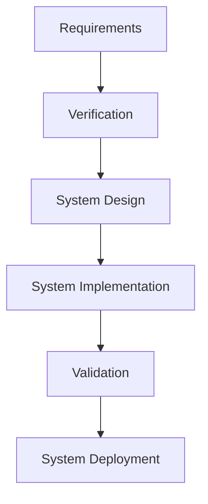
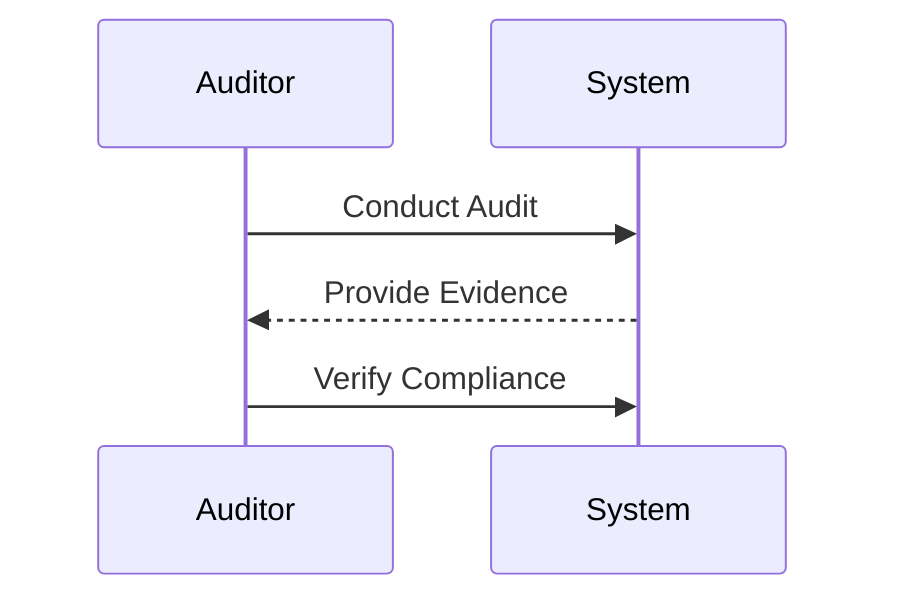
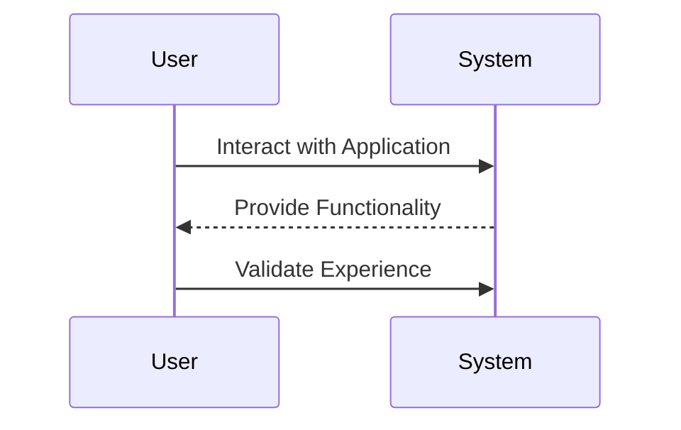

## Understanding the Need for Security Compliance

### Definition of Compliance

Compliance refers to the act of adhering to specified requirements, such as laws, regulations, contracts, strategies, and policies. In the context of security compliance, these requirements often include various legal mandates and industry-specific standards designed to ensure the protection of sensitive data and systems. For instance, the General Data Protection Regulation (GDPR) in the European Union imposes strict rules on how organizations handle personal data, while the Payment Card Industry Data Security Standard (PCI DSS) sets guidelines for securing credit card transactions.

#### Why Compliance Matters

Compliance is crucial because non-compliance can lead to severe consequences, including legal penalties, reputational damage, and loss of business. For example, in 2019, British Airways was fined £183 million by the UK Information Commissioner’s Office (ICO) for a data breach that exposed the personal and financial details of nearly half a million customers. This fine underscores the importance of adhering to regulatory requirements to avoid such costly repercussions.

### Distinction Between Compliance and Governance

While compliance focuses on meeting specific regulatory requirements, governance encompasses the broader framework of policies, processes, and practices that ensure an organization operates effectively and ethically. To illustrate this distinction, consider the analogy of filing taxes:

- **Compliance**: Ensuring that tax returns are submitted on time.
- **Governance**: Ensuring that the information provided in the tax returns is accurate and complete.

In the realm of security, compliance might involve adhering to specific security standards like ISO 27001, whereas governance would involve implementing robust security policies and procedures to manage risks effectively.

#### Real-World Example: Equifax Breach

The 2017 Equifax data breach, which exposed the personal information of approximately 147 million individuals, highlights the importance of both compliance and governance. Equifax failed to patch a known vulnerability in their system, leading to the breach. While Equifax was compliant with certain regulations, the lack of effective governance—such as timely patch management and robust security controls—resulted in a catastrophic failure.

### Verification vs. Validation

To further clarify the distinction between compliance and governance, let's delve into the concepts of verification and validation:

- **Verification**: This process evaluates whether a product, service, or system complies with a regulation, requirement, specification, or imposed condition. Verification ensures that the system meets the specified criteria.
- **Validation**: This process provides assurance that a product, service, or system meets the needs of the customer and other identified stakeholders. Validation ensures that the system fulfills its intended purpose.

#### Mermaid Diagram: Verification and Validation Process



### Practical Examples and Code

Let's explore a practical example using a hypothetical web application. Suppose the application must comply with GDPR and PCI DSS standards. We'll walk through the steps to ensure compliance and proper governance.

#### Step 1: Define Requirements

First, we need to define the requirements based on the relevant standards. For GDPR, this includes ensuring data protection, obtaining user consent, and providing transparency. For PCI DSS, this includes securing cardholder data, managing vulnerabilities, and maintaining an information security policy.

#### Step 2: Verification

Next, we verify that the system meets these requirements. This involves conducting audits and assessments to ensure that the application complies with the specified standards.



#### Step 3: Validation

After verification, we validate that the system meets the needs of the users and stakeholders. This involves testing the application to ensure it functions correctly and securely.



### How to Prevent / Defend

To ensure both compliance and governance, organizations should implement the following measures:

#### Secure Coding Practices

Secure coding practices are essential to prevent vulnerabilities. For example, consider the following insecure code snippet that is vulnerable to SQL injection:

```python
# Vulnerable Code
username = input("Enter username: ")
password = input("Enter password: ")

query = f"SELECT * FROM users WHERE username='{username}' AND password='{password}'"
cursor.execute(query)
```

To secure this code, we should use parameterized queries:

```python
# Secure Code
username = input("Enter username: ")
password = input("Enter password: ")

query = "SELECT * FROM users WHERE username=%s AND password=%s"
cursor.execute(query, (username, password))
```

#### Configuration Hardening

Configuration hardening involves securing system configurations to minimize vulnerabilities. For example, consider the following insecure Nginx configuration:

```nginx
# Insecure Configuration
server {
    listen 80;
    server_name example.com;

    location / {
        root /var/www/html;
        index index.html index.htm;
    }
}
```

To secure this configuration, we should enable SSL/TLS and restrict access:

```nginx
# Secure Configuration
server {
    listen 443 ssl;
    server_name example.com;

    ssl_certificate /etc/nginx/ssl/example.crt;
    ssl_certificate_key /etc/nginx/ssl/example.key;

    location / {
        root /var/www/html;
        index index.html index.htm;
        allow 192.168.1.0/24;
        deny all;
    }
}
```

### Detection and Prevention

To detect and prevent compliance and governance issues, organizations should implement continuous monitoring and regular audits. Tools like SonarQube for static code analysis and Nessus for vulnerability scanning can help identify potential issues.

#### Real-World Example: Capital One Breach

In 2019, Capital One suffered a data breach that exposed the personal information of over 100 million customers. The breach occurred due to a misconfigured web application firewall (WAF) that allowed unauthorized access to sensitive data. This incident highlights the importance of continuous monitoring and regular audits to detect and prevent such vulnerabilities.

### Conclusion

Understanding the need for security compliance and governance is crucial for organizations to operate effectively and ethically. By adhering to regulatory requirements and implementing robust security policies and practices, organizations can mitigate risks and protect sensitive data. Continuous monitoring and regular audits are essential to ensure ongoing compliance and governance.

### Practice Labs

For hands-on experience with security compliance and governance, consider the following practice labs:

- **PortSwigger Web Security Academy**: Offers interactive labs to learn about web application security.
- **OWASP Juice Shop**: Provides a deliberately insecure web application to practice security testing.
- **DVWA (Damn Vulnerable Web Application)**: Another intentionally vulnerable web application for security training.
- **WebGoat**: An interactive training application for learning about web application security.

By engaging with these labs, you can gain practical experience in ensuring compliance and governance in real-world scenarios.

---
<!-- nav -->
[[DevSecOps/DevSecOps Bootcamp/01-DevSecOps Introduction/11-Understanding the Need for Security Compliance/04-Recap on Compliance/00-Overview|Overview]] | [[DevSecOps/DevSecOps Bootcamp/01-DevSecOps Introduction/11-Understanding the Need for Security Compliance/04-Recap on Compliance/02-Practice Questions & Answers|Practice Questions & Answers]]
