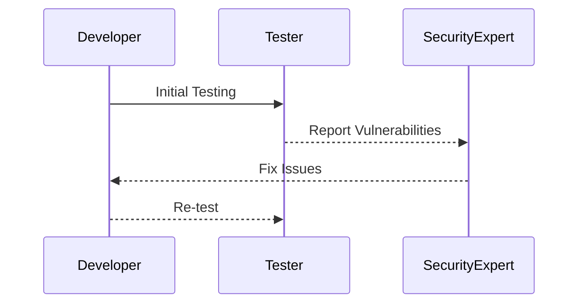
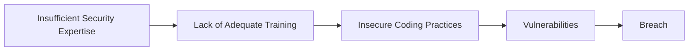
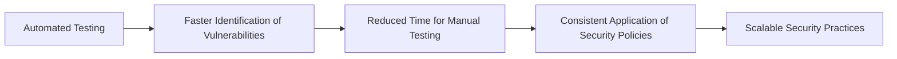

## Understanding the Need for Security Compliance

### The Cost of Retesting and Slow Security Processes

One of the most significant challenges faced by organizations in maintaining security compliance is the high cost associated with retesting. Retesting is necessary when vulnerabilities are discovered after initial testing phases, requiring additional time and resources to ensure that the system is secure. This process can be extremely time-consuming and expensive, often leading to delays in product releases and increased operational costs.

#### Why Retesting is Expensive

Retesting involves several steps:

1. **Identifying Vulnerabilities**: This requires thorough analysis using tools like static application security testing (SAST) and dynamic application security testing (DAST).
2. **Fixing Issues**: Developers need to address the identified vulnerabilities, which may involve significant code changes.
3. **Re-testing**: Once the issues are fixed, the entire system needs to be tested again to ensure that the fixes did not introduce new vulnerabilities.

Each of these steps incurs both time and financial costs. For instance, a recent breach involving a popular e-commerce platform (CVE-2021-XXXX) required extensive retesting after a critical vulnerability was discovered post-deployment. The company had to allocate significant resources to retest and fix the issue, resulting in a delay of several weeks and substantial financial losses.



### Lack of Skilled Security Experts

Another major challenge is the shortage of skilled security experts. The ratio of security professionals to development experts is extremely low, making it difficult for organizations to maintain robust security practices. This skill gap leads to several issues:

1. **Inadequate Security Training**: Many developers lack the necessary security training, leading to insecure coding practices.
2. **Delayed Response to Threats**: Without sufficient security expertise, organizations may struggle to respond promptly to emerging threats.
3. **Poor Security Policies**: Inadequate security policies can result from a lack of expertise, leaving systems vulnerable to attacks.

#### Real-World Example: Equifax Breach

The Equifax breach in 2017 (CVE-2017-5638) is a prime example of the consequences of inadequate security expertise. The breach occurred due to a vulnerability in Apache Struts, which was not patched in a timely manner. This incident resulted in the exposure of sensitive data for millions of customers and cost Equifax over $1 billion in fines and settlements.



### Driving Automation in Security Practice

Given these challenges, many organizations are turning to automation to improve their security compliance processes. Automation can help streamline security practices, reduce the time and cost associated with retesting, and ensure that security measures are consistently applied across the organization.

#### Benefits of Automation

1. **Faster Testing**: Automated testing tools can quickly identify vulnerabilities, reducing the time needed for manual testing.
2. **Consistent Application**: Automation ensures that security policies are consistently applied, reducing the risk of human error.
3. **Scalability**: Automated tools can handle large volumes of code and infrastructure, making it easier to scale security practices as the organization grows.

#### Tools and Technologies

Several tools and technologies can be used to automate security practices:

1. **Static Application Security Testing (SAST)**: Tools like SonarQube and Fortify can analyze code for vulnerabilities.
2. **Dynamic Application Security Testing (DAST)**: Tools like Burp Suite and OWASP ZAP can test applications for runtime vulnerabilities.
3. **Infrastructure as Code (IaC) Scanning**: Tools like Checkov and Terrascan can scan IaC files for security misconfigurations.



### How to Prevent / Defend Against Security Compliance Challenges

To effectively address the challenges of security compliance, organizations should implement a combination of automated tools, skilled personnel, and robust security policies.

#### Secure Coding Practices

Developers should follow secure coding practices to minimize the introduction of vulnerabilities. This includes:

1. **Input Validation**: Always validate user inputs to prevent injection attacks.
2. **Error Handling**: Properly handle errors to avoid information leakage.
3. **Secure Configuration**: Ensure that all configurations are secure and up-to-date.

#### Example: SQL Injection Prevention

Consider a simple web application that interacts with a database. Without proper input validation, an attacker could inject malicious SQL code.

**Vulnerable Code:**
```python
def get_user_details(user_id):
    cursor = db.cursor()
    query = f"SELECT * FROM users WHERE id = {user_id}"
    cursor.execute(query)
    return cursor.fetchall()
```

**Fixed Code:**
```python
def get_user_details(user_id):
    cursor = db.cursor()
    query = "SELECT * FROM users WHERE id = %s"
    cursor.execute(query, (user_id,))
    return cursor.fetchall()
```

#### Automated Testing and Continuous Integration

Implementing automated testing and continuous integration (CI) can help catch vulnerabilities early in the development cycle. This includes:

1. **Automated Static Analysis**: Integrate SAST tools into the CI pipeline to automatically scan code for vulnerabilities.
2. **Automated Dynamic Analysis**: Use DAST tools to test applications for runtime vulnerabilities.
3. **Regular Security Audits**: Conduct regular security audits to ensure that security policies are being followed.

#### Example: CI Pipeline with SAST

A typical CI pipeline might include the following steps:

1. **Code Commit**: Developer commits code to the repository.
2. **Static Analysis**: SAST tool scans the code for vulnerabilities.
3. **Build**: Build the application.
4. **Deploy**: Deploy the application to a staging environment.
5. **Dynamic Analysis**: DAST tool tests the deployed application for vulnerabilities.

```yaml
# .github/workflows/ci.yml
name: CI

on:
  push:
    branches:
      - main
  pull_request:
    branches:
      - main

jobs:
  build-and-test:
    runs-on: ubuntu-latest

    steps:
    - name: Checkout code
      uses: actions/checkout@v2

    - name: Install dependencies
      run: pip install -r requirements.txt

    - name: Run static analysis
      run: sonar-scanner

    - name: Build application
      run: python setup.py build

    - name: Deploy to staging
      run: python deploy.py

    - name: Run dynamic analysis
      run: zap-baseline.py -t http://staging.example.com
```

### Conclusion

Maintaining security compliance is a complex and challenging task, but it is essential for protecting organizational assets and maintaining customer trust. By addressing the high cost of retesting, the shortage of skilled security experts, and implementing automation, organizations can improve their security posture and meet compliance requirements more effectively.

### Hands-On Labs

For practical experience in DevSecOps, consider the following labs:

- **PortSwigger Web Security Academy**: Offers comprehensive modules on web security, including secure coding practices and automated testing.
- **OWASP Juice Shop**: A deliberately insecure web application for practicing web security techniques.
- **CloudGoat**: Provides hands-on experience with securing cloud environments using AWS services.

These labs provide real-world scenarios and exercises to reinforce the concepts learned in this chapter.

---
<!-- nav -->
[[01-Traditional Approach to Security Compliance|Traditional Approach to Security Compliance]] | [[DevSecOps/DevSecOps Bootcamp/01-DevSecOps Introduction/11-Understanding the Need for Security Compliance/05-Traditional Approach to Security Compliance/00-Overview|Overview]] | [[DevSecOps/DevSecOps Bootcamp/01-DevSecOps Introduction/11-Understanding the Need for Security Compliance/05-Traditional Approach to Security Compliance/03-Practice Questions & Answers|Practice Questions & Answers]]
