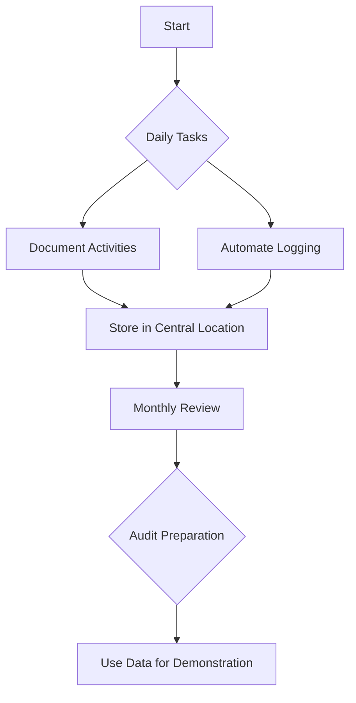
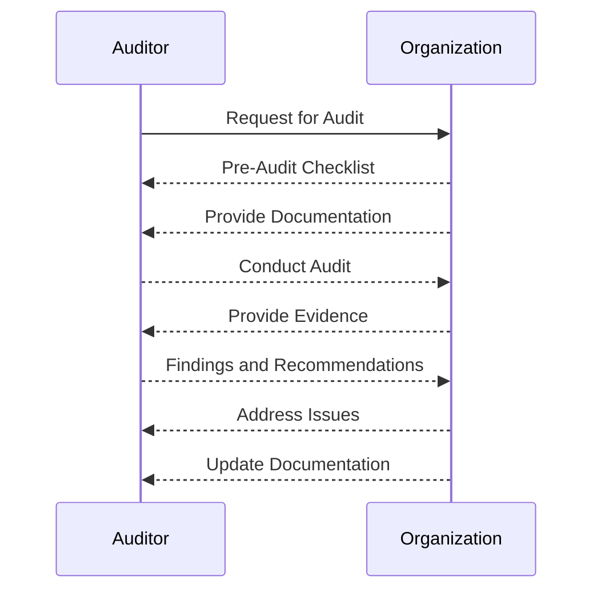
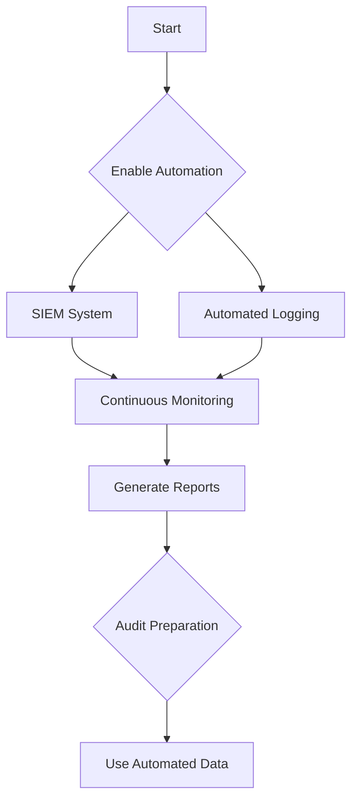

## Understanding the Need for Security Compliance

### Introduction to Security Compliance

Security compliance refers to the adherence to a set of standards, regulations, and policies designed to ensure the protection of sensitive information and the integrity of systems. Compliance is not merely about following rules; it is a critical component of maintaining trust and ensuring the reliability of operations. In essence, compliance is verification—a process that provides assurance that an organization is meeting specific criteria and adhering to established guidelines.

#### Why Compliance Matters

Compliance is crucial for several reasons:

1. **Legal Requirements**: Many industries are subject to strict regulatory frameworks such as GDPR, HIPAA, PCI-DSS, and others. Non-compliance can result in significant legal penalties and reputational damage.
   
2. **Customer Trust**: Demonstrating compliance helps build trust with customers, partners, and stakeholders. This trust is essential for maintaining business relationships and ensuring continued support.

3. **Operational Efficiency**: Compliance often leads to more efficient operations. By adhering to best practices and standards, organizations can streamline processes and reduce the likelihood of errors and security incidents.

### Gathering Evidence for Compliance

One of the key aspects of compliance is the collection and maintenance of evidence. This evidence serves as proof that an organization is adhering to the necessary standards and regulations. The traditional approach of gathering all evidence just before an audit is inefficient and risky. Instead, a continuous and systematic approach to evidence gathering should be adopted.

#### Best Practices for Evidence Collection

- **Regular Documentation**: Maintain detailed records of all security-related activities, including configurations, policies, and incident responses.
  
- **Automated Logging**: Implement automated logging mechanisms to capture relevant events and actions. This ensures that evidence is collected consistently and accurately.

- **Centralized Storage**: Store all evidence in a centralized location for easy access and retrieval during audits.



### Preparing for Security Audits

Security audits are a critical part of the compliance process. They involve a thorough examination of an organization’s security measures to ensure they meet the required standards. Proper preparation is essential to ensure a successful audit.

#### Audit Preparation Runbook

An audit preparation runbook is a comprehensive guide that outlines the steps and procedures to follow before, during, and after an audit. Here is an example of what such a runbook might include:

1. **Pre-Audit Checklist**:
   - Ensure all documentation is up-to-date.
   - Verify that all systems are configured according to the compliance standards.
   - Conduct a preliminary review to identify any potential issues.

2. **During the Audit**:
   - Provide timely and accurate responses to all questions.
   - Ensure that all requested evidence is readily available.
   - Document any findings and recommendations provided by the auditors.

3. **Post-Audit Actions**:
   - Address any identified issues promptly.
   - Update the compliance documentation to reflect any changes made.
   - Schedule regular reviews to ensure ongoing compliance.



### Traditional Approach to Security Compliance

The traditional approach to security compliance typically involves a reactive and manual process. While this approach can be effective, it often comes with several pitfalls and inefficiencies.

#### Pitfalls of the Traditional Approach

1. **Manual Processes**: Manual documentation and evidence collection can be time-consuming and prone to errors.
   
2. **Delayed Feedback**: Issues may not be identified until the audit, leading to delays in remediation.
   
3. **Resource Intensive**: The traditional approach requires significant resources, both in terms of time and personnel.

### Optimizing Security Compliance

To address the inefficiencies of the traditional approach, organizations can adopt more modern and efficient methods. These methods leverage automation, continuous monitoring, and integrated compliance tools.

#### Automation and Continuous Monitoring

Automation can significantly enhance the efficiency of compliance processes. Tools like SIEM (Security Information and Event Management) systems can continuously monitor systems and networks for compliance violations. Additionally, automated logging and reporting tools can streamline the evidence collection process.



### Real-World Examples of Compliance Failures

Several high-profile breaches and compliance failures highlight the importance of robust compliance practices. For instance, the Equifax breach in 2017 exposed the personal data of over 143 million individuals. The company was found to be non-compliant with basic security standards, leading to significant financial and reputational damage.

#### Equifax Breach

- **Cause**: Failure to patch a known vulnerability in Apache Struts.
- **Impact**: Exposure of sensitive personal data, resulting in legal penalties and loss of customer trust.
- **Lessons Learned**: Regular patch management and adherence to security standards are crucial for preventing such breaches.

### How to Prevent / Defend Against Compliance Failures

#### Detection and Prevention Strategies

1. **Regular Audits**: Conduct regular internal audits to identify and address compliance gaps.
   
2. **Patch Management**: Implement a robust patch management system to ensure all systems are up-to-date with the latest security patches.
   
3. **Employee Training**: Educate employees on compliance requirements and best practices to ensure they are aware of their responsibilities.

#### Secure Coding Fixes

Here is an example of a vulnerable code snippet and its secure counterpart:

**Vulnerable Code**:
```python
import os

def read_file(filename):
    with open(filename, 'r') as f:
        return f.read()
```

**Secure Code**:
```python
import os

def read_file(filename):
    if os.path.isfile(filename):
        with open(filename, 'r') as f:
            return f.read()
    else:
        raise FileNotFoundError("File does not exist")
```

In the secure version, the code checks if the file exists before attempting to read it, preventing potential errors and security vulnerabilities.

### Configuration Hardening

Configuration hardening involves securing system configurations to minimize vulnerabilities. This includes disabling unnecessary services, configuring firewalls, and implementing strong authentication mechanisms.

#### Example Configuration

Here is an example of a hardened Nginx configuration:

**Vulnerable Configuration**:
```nginx
server {
    listen 80;
    server_name example.com;

    location / {
        root /var/www/html;
        index index.html;
    }
}
```

**Hardened Configuration**:
```nginx
server {
    listen 80 default_server;
    server_name example.com;

    location / {
        root /var/www/html;
        index index.html;
        allow 192.168.1.0/24;
        deny all;
    }

    location ~ /\.ht {
        deny all;
    }
}
```

In the hardened configuration, access is restricted to a specific IP range, and hidden files are denied access, enhancing security.

### Conclusion

Security compliance is a critical aspect of maintaining trust and ensuring the reliability of operations. By adopting a continuous and systematic approach to evidence collection, leveraging automation and continuous monitoring, and implementing robust detection and prevention strategies, organizations can effectively manage compliance and mitigate risks.

### Practice Labs

For hands-on experience with DevSecOps and security compliance, consider the following well-known labs:

- **PortSwigger Web Security Academy**: Offers practical exercises and challenges related to web application security.
- **OWASP Juice Shop**: A deliberately insecure web application for practicing security testing and compliance.
- **DVWA (Damn Vulnerable Web Application)**: A PHP/MySQL web application that demonstrates various web application vulnerabilities.

These labs provide real-world scenarios and challenges that can help solidify your understanding of security compliance and DevSecOps principles.

---
<!-- nav -->
[[DevSecOps/DevSecOps Bootcamp/01-DevSecOps Introduction/11-Understanding the Need for Security Compliance/06-Module Summary/00-Overview|Overview]] | [[DevSecOps/DevSecOps Bootcamp/01-DevSecOps Introduction/11-Understanding the Need for Security Compliance/06-Module Summary/02-Practice Questions & Answers|Practice Questions & Answers]]
