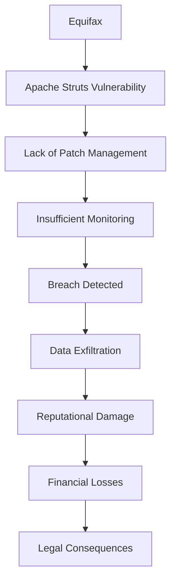
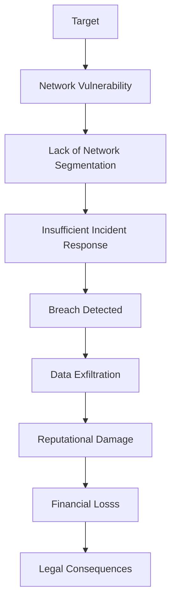
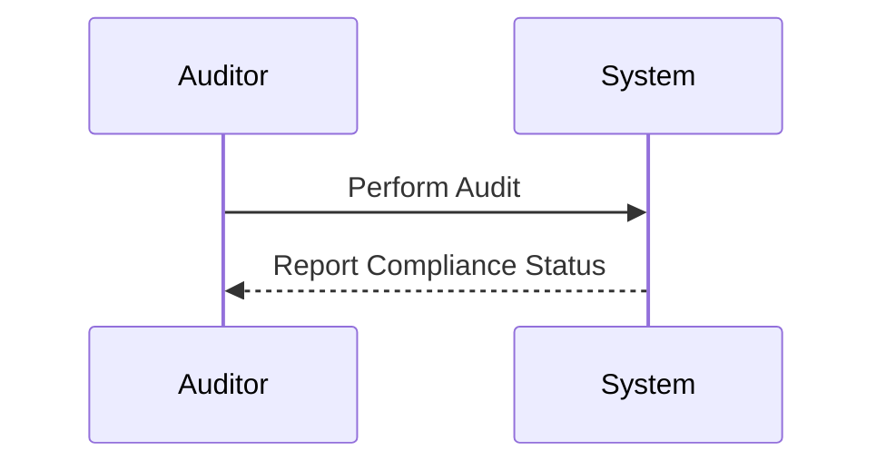
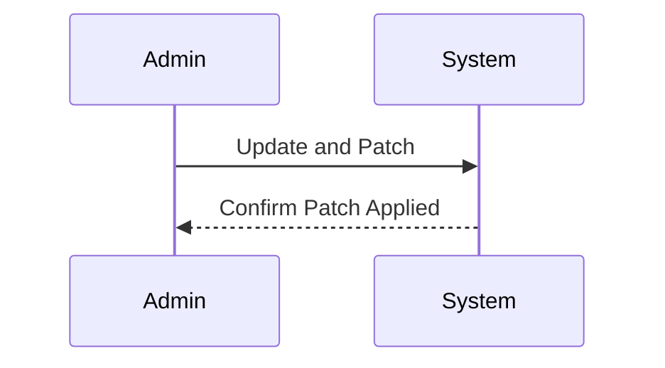

## Understanding the Need for Security Governance

### Compliance vs. Governance

In the realm of DevSecOps, one of the most critical distinctions to understand is the difference between compliance and governance. While both concepts are essential for ensuring the security and integrity of an organization's operations, they serve different purposes and have distinct focuses.

#### Compliance

**Definition:** Compliance refers to the adherence to a set of rules, regulations, or standards. In the context of DevSecOps, this often involves meeting specific criteria laid out by regulatory bodies such as PCI DSS (Payment Card Industry Data Security Standard), HIPAA (Health Insurance Portability and Accountability Act), GDPR (General Data Protection Regulation), and others.

**Purpose:** The primary goal of compliance is to ensure that an organization meets the minimum legal and regulatory requirements necessary to operate within a given industry. This includes reporting, documentation, and adherence to specific procedures.

**Example:** Consider the scenario of filing annual taxes. If an individual files their taxes on time and accurately each year, they are considered compliant with their tax obligations. This ensures that they meet the legal requirements set forth by the government.

**Real-World Example:** A major US retail organization was fully compliant with PCI DSS requirements for handling payment card data. Despite this, they suffered a significant data breach in 2014, resulting in the theft of millions of credit card numbers. This incident highlights that compliance alone does not guarantee security.

#### Governance

**Definition:** Governance encompasses the processes, structures, and practices used to manage and direct an organization. It involves setting policies, procedures, and guidelines to ensure that the organization operates effectively and securely.

**Purpose:** The primary goal of governance is to provide a framework for making decisions and managing risks. Good governance ensures that an organization has the necessary controls and oversight to maintain security and operational integrity.

**Example:** Continuing with the tax filing scenario, suppose an individual is diligent about filing their taxes on time but lacks proper record-keeping and financial management practices. This results in incorrect or incomplete tax filings, despite being compliant with the legal requirements. This situation illustrates poor governance.

**Real-World Example:** The Equifax data breach in 2017 is another example where compliance did not equate to security. Equifax was compliant with various regulations, yet their poor governance practices led to a massive breach affecting over 143 million individuals.

### The Importance of Both Compliance and Governance

While compliance ensures that an organization meets the minimum legal and regulatory requirements, governance provides the structure and oversight needed to manage risks effectively. Both are crucial for maintaining a secure and compliant environment.

#### Why Compliance Alone Is Not Enough

Compliance is necessary but not sufficient for ensuring security. As demonstrated by the Equifax and Target breaches, organizations can be fully compliant with regulations and still suffer significant security incidents due to poor governance.

**Example:** In the case of Equifax, the company had robust compliance measures in place, including regular audits and adherence to various data protection regulations. However, their lack of effective governance practices, such as inadequate patch management and insufficient monitoring, led to the breach.

#### Why Governance Alone Is Not Enough

Similarly, good governance is not a guarantee against security incidents. Effective governance helps mitigate risks but cannot eliminate them entirely. Organizations must balance both compliance and governance to achieve a comprehensive security posture.

**Example:** A healthcare provider might have excellent governance practices, including strong access controls, regular audits, and comprehensive training programs. However, if they fail to comply with HIPAA regulations, they could face significant legal and financial consequences.

### Real-World Examples and Case Studies

#### Equifax Data Breach (2017)

**Overview:** Equifax, one of the largest credit reporting agencies in the United States, suffered a massive data breach in 2017. The breach exposed sensitive personal information of over 143 million consumers, including Social Security numbers, birth dates, addresses, and more.

**Compliance:** Equifax was compliant with various data protection regulations, including GDPR and other industry-specific standards. They had regular audits and reported compliance to regulatory bodies.

**Governance:** Despite being compliant, Equifax's governance practices were lacking. The breach was caused by a vulnerability in their Apache Struts web application framework, which was not patched in a timely manner. Additionally, their monitoring and incident response capabilities were insufficient to detect and respond to the breach quickly.

**Impact:** The breach resulted in significant financial losses, reputational damage, and legal consequences for Equifax. The company faced numerous lawsuits and regulatory investigations, leading to substantial fines and settlements.

**Mermaid Diagram:**

#### Target Data Breach (2013)

**Overview:** Target Corporation, a major retail chain, experienced a significant data breach in 2013. The breach affected approximately 40 million customers, compromising their credit and debit card information.

**Compliance:** Target was compliant with PCI DSS requirements for handling payment card data. They had regular audits and reported compliance to regulatory bodies.

**Governance:** Despite being compliant, Target's governance practices were inadequate. The breach was caused by a vulnerability in their network infrastructure, which was exploited by hackers. Additionally, their incident response capabilities were insufficient to detect and respond to the breach promptly.

**Impact:** The breach resulted in significant financial losses, reputational damage, and legal consequences for Target. The company faced numerous lawsuits and regulatory investigations, leading to substantial fines and settlements.

**Mermaid Diagram:**

### How to Prevent / Defend

To minimize the risk of security incidents, organizations must implement both strong compliance and governance practices. Here are some key strategies:

#### Compliance

**Detection:**
- Regular audits and assessments to ensure compliance with regulatory requirements.
- Automated tools to monitor and report compliance status.

**Prevention:**
- Implementing robust compliance management systems.
- Training employees on compliance requirements and best practices.

**Secure Coding Fix:**

#### Governance

**Detection:**
- Regular risk assessments and vulnerability scans.
- Continuous monitoring of network and system activity.

**Prevention:**
- Implementing strong access controls and authentication mechanisms.
- Regularly updating and patching systems to address vulnerabilities.

**Secure Coding Fix:**

### Conclusion

Understanding the distinction between compliance and governance is crucial for maintaining a secure and compliant environment. While compliance ensures that an organization meets the minimum legal and regulatory requirements, governance provides the structure and oversight needed to manage risks effectively. By implementing both strong compliance and governance practices, organizations can minimize the risk of security incidents and protect their assets and reputation.

### Practice Labs

For hands-on experience with DevSecOps principles, consider the following practice labs:

- **PortSwigger Web Security Academy:** Focuses on web application security and provides practical exercises to understand and defend against various security threats.
- **OWASP Juice Shop:** An intentionally insecure web application designed to teach security concepts and practical skills.
- **DVWA (Damn Vulnerable Web Application):** Another intentionally insecure web application for learning and practicing web application security.
- **WebGoat:** A deliberately insecure Java web application maintained by OWASP, designed to teach web application security lessons.

These labs provide real-world scenarios and practical exercises to reinforce the concepts learned in this chapter.

---
<!-- nav -->
[[DevSecOps/DevSecOps Bootcamp/01-DevSecOps Introduction/12-Understanding the Need for Security Governance/01-Compliance without Governance/00-Overview|Overview]] | [[DevSecOps/DevSecOps Bootcamp/01-DevSecOps Introduction/12-Understanding the Need for Security Governance/01-Compliance without Governance/02-Practice Questions & Answers|Practice Questions & Answers]]
