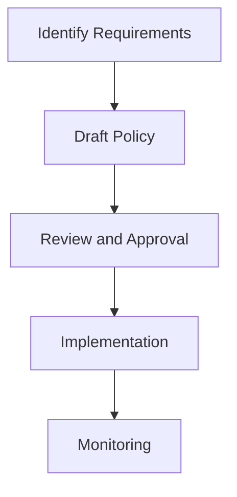
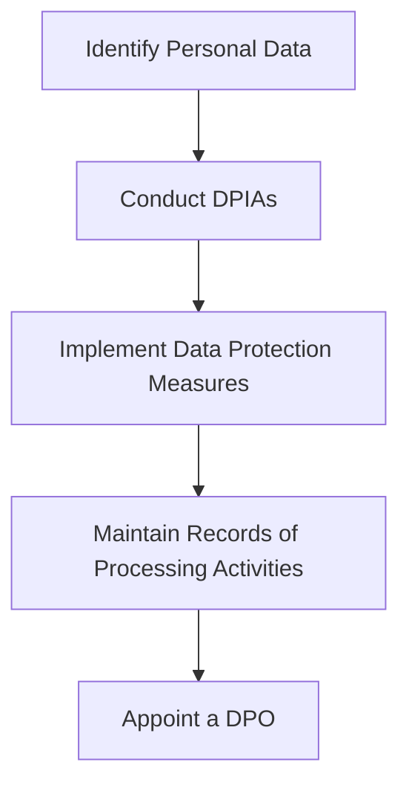
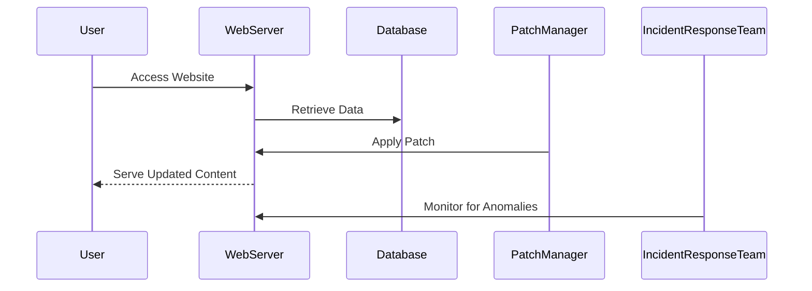

## Understanding the Need for Security Governance

### Introduction to Governance, Risk, and Compliance (GRC)

Governance, Risk, and Compliance (GRC) is a critical framework that helps organizations manage their operations effectively while ensuring adherence to legal, regulatory, and ethical standards. GRC encompasses three interrelated components:

1. **Governance**: The process of directing and controlling an organization to achieve its objectives.
2. **Risk Management**: Identifying, assessing, and prioritizing risks followed by coordinated application of resources to minimize, monitor, and control the probability and/or impact of unfortunate events.
3. **Compliance**: Ensuring that the organization adheres to applicable laws, regulations, and internal policies.

In this module, we will focus primarily on governance, with some discussion on compliance to highlight the differences and interdependencies between these concepts.

### What is Governance?

**Definition**: Governance refers to the overall management approach through which senior executives direct and control the entire organization. It includes setting strategic direction, establishing policies and procedures, and ensuring accountability and transparency.

#### Why Governance Matters

Governance is crucial for several reasons:

- **Strategic Direction**: It ensures that the organization aligns its activities with its strategic goals.
- **Accountability**: It holds individuals and teams accountable for their actions and decisions.
- **Transparency**: It promotes open communication and visibility into organizational processes.
- **Risk Management**: It helps identify and mitigate risks that could impact the organization’s objectives.

#### How Governance Works

Governance involves several key activities:

1. **Policy Development**: Creating and maintaining policies that guide organizational behavior.
2. **Decision-Making**: Establishing processes for making informed decisions at all levels.
3. **Monitoring and Evaluation**: Regularly assessing performance against established goals and metrics.
4. **Stakeholder Engagement**: Involving stakeholders in decision-making processes to ensure alignment and buy-in.

### Governance in the Context of Security

Security governance focuses on managing security-related activities within an organization. It involves:

- **Setting Security Policies**: Defining rules and guidelines for security practices.
- **Implementing Controls**: Deploying technical and administrative controls to enforce security policies.
- **Monitoring Compliance**: Ensuring that security policies are followed and that the organization remains compliant with relevant regulations.

#### Example: Security Policy Development

Let's consider the development of a security policy for handling sensitive data. The following steps outline the process:

1. **Identify Requirements**: Determine the types of sensitive data handled by the organization and the associated risks.
2. **Draft Policy**: Create a draft policy document that outlines the rules for handling sensitive data.
3. **Review and Approval**: Have the policy reviewed by relevant stakeholders and obtain approval from senior management.
4. **Implementation**: Roll out the policy across the organization and provide training to employees.
5. **Monitoring**: Regularly review compliance with the policy and take corrective action as needed.



### Compliance: Conforming to Standard Requirements

**Definition**: Compliance means conforming to standard requirements set forth by laws, regulations, and internal policies.

#### Why Compliance Matters

Compliance is essential because:

- **Legal Requirements**: Organizations must adhere to laws and regulations to avoid legal penalties.
- **Reputation**: Non-compliance can damage an organization’s reputation and lead to loss of customer trust.
- **Operational Efficiency**: Adhering to standards can improve operational efficiency and reduce risks.

#### How Compliance Works

Compliance involves:

1. **Identifying Relevant Standards**: Determining which laws, regulations, and internal policies apply to the organization.
2. **Assessment**: Evaluating the organization’s current state against the identified standards.
3. **Gap Analysis**: Identifying gaps between the current state and the required standards.
4. **Remediation**: Implementing measures to close the gaps and achieve compliance.
5. **Ongoing Monitoring**: Regularly reviewing compliance status to ensure continued adherence.

### Differences Between Governance and Compliance

While governance and compliance are related, they serve different purposes:

- **Governance**: Focuses on the overall management approach and strategic direction.
- **Compliance**: Focuses on adhering to specific laws, regulations, and internal policies.

#### Example: GDPR Compliance

The General Data Protection Regulation (GDPR) is a European Union regulation that sets strict rules for handling personal data. To comply with GDPR, an organization must:

1. **Identify Personal Data**: Determine what personal data is collected and processed.
2. **Conduct Data Protection Impact Assessments (DPIAs)**: Evaluate the impact of data processing activities on individuals.
3. **Implement Data Protection Measures**: Ensure that appropriate technical and organizational measures are in place to protect personal data.
4. **Maintain Records of Processing Activities**: Keep detailed records of data processing activities.
5. **Appoint a Data Protection Officer (DPO)**: Designate a person responsible for overseeing GDPR compliance.



### Real-World Examples

#### Example: Equifax Data Breach

In 2017, Equifax suffered a massive data breach that exposed the personal information of over 143 million people. The breach was caused by a vulnerability in Apache Struts, a web application framework. Equifax failed to patch the vulnerability in a timely manner, leading to the breach.

**Lessons Learned**:
- **Patch Management**: Regularly update and patch systems to address known vulnerabilities.
- **Incident Response**: Develop and maintain an incident response plan to quickly respond to security incidents.



### How to Prevent / Defend Against Governance and Compliance Risks

#### Secure Coding Practices

Secure coding practices help prevent vulnerabilities that could lead to security breaches. Here’s an example of a vulnerable code snippet and its secure counterpart:

**Vulnerable Code**:
```python
def login(username, password):
    if username == "admin" and password == "password":
        return True
    else:
        return False
```

**Secure Code**:
```python
import hashlib

def hash_password(password):
    return hashlib.sha256(password.encode()).hexdigest()

def login(username, hashed_password):
    stored_hash = get_stored_hash(username)
    if stored_hash == hashed_password:
        return True
    else:
        return False
```

#### Configuration Hardening

Configuration hardening involves securing system configurations to minimize vulnerabilities. Here’s an example of securing an Nginx server:

**Insecure Configuration**:
```nginx
server {
    listen 80;
    server_name example.com;

    location / {
        root /var/www/html;
        index index.html index.htm;
    }
}
```

**Secure Configuration**:
```nginx
server {
    listen 80 default_server;
    server_name example.com;

    location / {
        root /var/www/html;
        index index.html index.htm;
        try_files $uri $uri/ =404;
    }

    location ~ /\.ht {
        deny all;
    }
}
```

### Conclusion

Understanding the need for security governance is crucial for any organization. By implementing effective governance and compliance practices, organizations can ensure that they operate securely and efficiently while meeting legal and regulatory requirements.

### Practice Labs

For hands-on practice in web application security, consider the following labs:

- **PortSwigger Web Security Academy**: Offers interactive labs to learn and practice web security techniques.
- **OWASP Juice Shop**: A deliberately insecure web application for practicing web security skills.
- **DVWA (Damn Vulnerable Web Application)**: A PHP/MySQL web application that is riddled with vulnerabilities for educational purposes.
- **WebGoat**: An interactive, gamified training application for learning about web application security.

These labs provide practical experience in identifying and mitigating security risks, which is essential for mastering security governance and compliance.

---
<!-- nav -->
[[DevSecOps/DevSecOps Bootcamp/01-DevSecOps Introduction/12-Understanding the Need for Security Governance/02-Defining Governance and Compliance/00-Overview|Overview]] | [[DevSecOps/DevSecOps Bootcamp/01-DevSecOps Introduction/12-Understanding the Need for Security Governance/02-Defining Governance and Compliance/02-Practice Questions & Answers|Practice Questions & Answers]]
