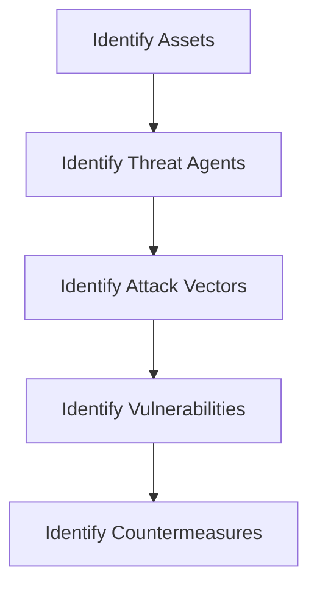
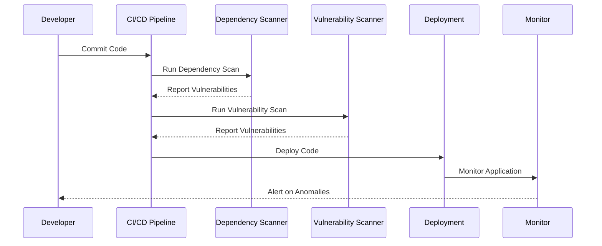
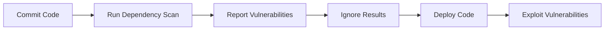
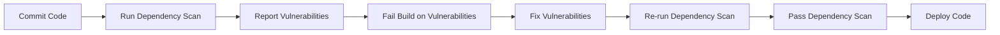

## Understanding the Need for Security Governance in DevSecOps

### Introduction to DevSecOps

DevSecOps is a set of practices that integrates security throughout the entire software development lifecycle, from initial planning through to deployment and maintenance. The goal is to ensure that security is not an afterthought but is embedded into every phase of the development process. This approach aligns with the principles of Continuous Integration and Continuous Deployment (CI/CD), which aim to streamline and automate the delivery of software.

### The Nature of CI/CD Pipelines

The CI/CD pipeline is a series of steps that a piece of code goes through from being written to being deployed. These steps typically include:

- **Planning**: Defining requirements and threat models.
- **Coding**: Writing the actual code.
- **Building**: Compiling and packaging the code.
- **Testing**: Running various tests to ensure quality and security.
- **Deployment**: Releasing the code to production.
- **Operate**: Monitoring and maintaining the deployed application.

Each of these stages presents opportunities to integrate security controls, ensuring that vulnerabilities are identified and mitigated as early as possible.

### Security Controls in DevSecOps

#### Planning Stage

In the planning stage, security is introduced through the definition of threat models and coding standards. Threat modeling helps identify potential security risks and vulnerabilities by analyzing the system architecture and identifying potential attack vectors. Coding standards ensure that developers follow secure coding practices, reducing the likelihood of introducing vulnerabilities.

**Threat Modeling Example**



**Coding Standards Example**

```markdown
1. **Input Validation**: Ensure all inputs are validated against expected formats.
2. **Error Handling**: Implement robust error handling to avoid information leakage.
3. **Secure Configuration Management**: Use tools like Ansible or Terraform to manage configurations securely.
```

#### Coding Stage

During the coding stage, static code analysis and software composition analysis (SCA) are performed. Static code analysis tools scan the codebase for potential security issues, such as SQL injection, cross-site scripting (XSS), and buffer overflows. SCA tools analyze the dependencies used in the project to ensure they are free from known vulnerabilities.

**Static Code Analysis Example**

```bash
# Using SonarQube for static code analysis
sonar-scanner -Dsonar.projectKey=my_project \
              -Dsonar.sources=src \
              -Dsonar.host.url=http://localhost:9000
```

**Software Composition Analysis Example**

```bash
# Using Snyk for SCA
snyk test --file=package.json
```

#### Build Stage

At the build stage, vulnerability scanning is performed to identify any known vulnerabilities in the compiled code. Tools like OWASP Dependency-Check and Trivy can be used to scan the built artifacts for vulnerabilities.

**Vulnerability Scanning Example**

```bash
# Using Trivy for vulnerability scanning
trivy image my_docker_image:latest
```

#### Release Stage

Before releasing the software, automated penetration testing is conducted to simulate real-world attacks and identify any weaknesses. Compliance validation ensures that the software meets regulatory requirements. Code signing and validation ensure the integrity of the code before deployment.

**Automated Penetration Testing Example**

```bash
# Using OWASP ZAP for automated penetration testing
zap-cli --target http://localhost:8080 --spider --scan --report
```

**Compliance Validation Example**

```bash
# Using OpenSCAP for compliance validation
oscap xccdf eval --profile xccdf_org.ssgproject.content_profile_standard /usr/share/xml/scap/ssg/content/ssg-centos8-ds.xml
```

#### Operate Stage

Once the software is deployed, automated approaches are used for security monitoring, detection, response, and recovery from security incidents. Tools like Splunk, ELK Stack, and Prometheus are commonly used for monitoring and alerting.

**Security Monitoring Example**

```bash
# Using Prometheus for monitoring
prometheus --config.file=prometheus.yml
```

### Automating Governance in DevSecOps

To ensure that governance is integrated into the CI/CD pipeline, automation is key. This involves setting up policies and controls that are automatically enforced throughout the pipeline. For example, security policies can be defined using Infrastructure as Code (IaC) tools like Terraform or Ansible.

**Terraform Example**

```hcl
resource "aws_security_group" "web_sg" {
  name        = "web_sg"
  description = "Security group for web servers"

  ingress {
    from_port   = 80
    to_port     = 80
    protocol    = "tcp"
    cidr_blocks = ["0.0.0.0/0"]
  }

  egress {
    from_port   = 0
    to_port     = 0
    protocol    = "-1"
    cidr_blocks = ["0.0.0.0/0"]
  }
}
```

### Real-World Examples and Breaches

Recent breaches highlight the importance of integrating security governance into DevSecOps. For instance, the SolarWinds breach in 2020 was a supply chain attack where malicious code was inserted into the SolarWinds Orion software. This underscores the need for thorough dependency scanning and supply chain security measures.

**SolarWinds Breach Example**



### Common Pitfalls and How to Prevent Them

One common pitfall is the lack of proper integration between security tools and the CI/CD pipeline. This can lead to security checks being skipped or ignored. To prevent this, it is crucial to ensure that security tools are tightly integrated into the pipeline and that their results are actionable.

**Pitfall Example**



**Prevention Strategy**



### Detection and Prevention Strategies

Detection involves monitoring the pipeline and the deployed application for signs of security issues. Prevention involves implementing secure coding practices, using security tools, and enforcing security policies.

**Detection Example**

```bash
# Using Splunk for security event detection
splunk search "index=main sourcetype=access_combined"
```

**Prevention Example**

```bash
# Using GitLab CI/CD for security enforcement
image: docker:stable

services:
  - docker:dind

stages:
  - build
  - test
  - deploy

build:
  stage: build
  script:
    - docker build -t $CI_REGISTRY_IMAGE:$CI_COMMIT_REF_SLUG .
    - docker push $CI_REGISTRY_IMAGE:$CI_COMMIT_REF_SLUG

test:
  stage: test
  script:
    - docker run --rm $CI_REGISTRY_IMAGE:$CI_COMMIT_REF_SLUG /bin/sh -c "npm install && npm test"

deploy:
  stage: deploy
  script:
    - echo "Deploying to production..."
```

### Secure Coding Fixes

It is essential to compare vulnerable code with secure code to understand the differences and implement secure coding practices.

**Vulnerable Code Example**

```python
import sqlite3

def login(username, password):
    conn = sqlite3.connect('database.db')
    cursor = conn.cursor()
    cursor.execute(f"SELECT * FROM users WHERE username='{username}' AND password='{password}'")
    result = cursor.fetchone()
    if result:
        return True
    else:
        return False
```

**Secure Code Example**

```python
import sqlite3

def login(username, password):
    conn = sqlite3.connect('database.db')
    cursor = conn.cursor()
    cursor.execute("SELECT * FROM users WHERE username=? AND password=?", (username, password))
    result = cursor.fetchone()
    if result:
        return True
    else:
        return False
```

### Hardening Configurations

Hardening configurations involve securing the environment in which the application runs. This includes securing the operating system, network, and infrastructure.

**OS Hardening Example**

```bash
# Using Ansible for OS hardening
---
- hosts: all
  become: yes
  tasks:
    - name: Disable root login
      lineinfile:
        path: /etc/ssh/sshd_config
        regexp: '^PermitRootLogin'
        line: 'PermitRootLogin no'
        state: present

    - name: Enable firewall
      firewalld:
        state: enabled
        permanent: true
        immediate: true
```

### Conclusion

Integrating security governance into DevSecOps is critical for ensuring the security of software throughout its lifecycle. By automating security controls and integrating them into the CI/CD pipeline, organizations can reduce the risk of security vulnerabilities and improve overall security posture. Real-world examples and recent breaches underscore the importance of this approach, and by following best practices and implementing secure coding practices, organizations can mitigate security risks effectively.

### Practice Labs

For hands-on practice in DevSecOps, consider the following labs:

- **PortSwigger Web Security Academy**: Offers interactive labs to learn about web application security.
- **OWASP Juice Shop**: A deliberately insecure web application for practicing web security skills.
- **DVWA (Damn Vulnerable Web Application)**: A PHP/MySQL web application that is riddled with vulnerabilities.
- **WebGoat**: An interactive, gamified training application for learning about web application security.

These labs provide practical experience in applying DevSecOps principles and techniques.

---
<!-- nav -->
[[DevSecOps/DevSecOps Bootcamp/01-DevSecOps Introduction/12-Understanding the Need for Security Governance/03-Impact of Governance on DevSecOps/00-Overview|Overview]] | [[DevSecOps/DevSecOps Bootcamp/01-DevSecOps Introduction/12-Understanding the Need for Security Governance/03-Impact of Governance on DevSecOps/02-Practice Questions & Answers|Practice Questions & Answers]]
