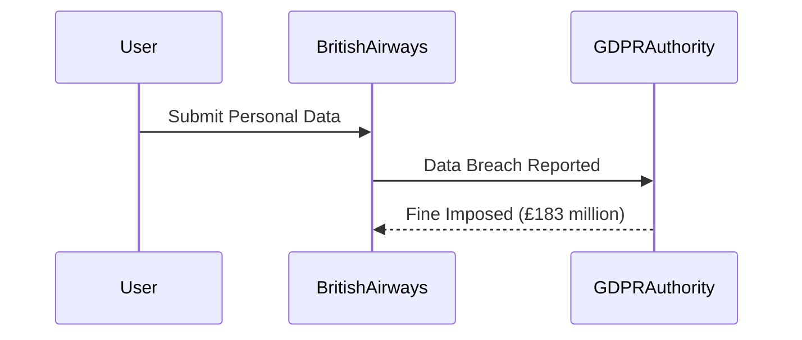
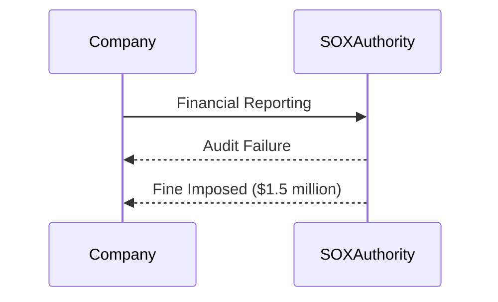

## Understanding the Need for Security Governance: Is Compliance Necessary?

### Introduction to Security Governance and Compliance

Security governance is the framework through which organizations manage their security risks and ensure compliance with legal, regulatory, and industry standards. This framework encompasses policies, procedures, and controls designed to protect the organization's assets and maintain trust with stakeholders. Compliance, a critical component of security governance, refers to the adherence to specific legal, regulatory, and industry standards.

### Mandatory vs. Voluntary Compliance

Compliance can be categorized into two main types: mandatory and voluntary.

#### Mandatory Compliance

Mandatory compliance refers to the legal and regulatory requirements that organizations must adhere to. These requirements are enforced by governmental bodies and are non-negotiable. Failure to comply with these regulations can result in severe penalties, including fines, legal action, and reputational damage.

**Examples of Mandatory Compliance:**

1. **General Data Protection Regulation (GDPR):**
   - **What:** GDPR is a regulation in EU law on data protection and privacy for all individuals within the European Union (EU) and the European Economic Area (EEA).
   - **Why:** It aims to give control back to citizens and residents over their personal data and to simplify the regulatory environment for international business by unifying the regulation within the EU.
   - **How:** Organizations must implement measures to protect personal data, provide transparency to users about how their data is used, and report data breaches within 72 hours.
   - **Real-World Example:** In 2019, British Airways was fined £183 million for a data breach that exposed customer data. This fine was imposed under GDPR, highlighting the significant financial implications of non-compliance.

2. **Sarbanes-Oxley Act (SOX):**
   - **What:** SOX is a US federal law that sets strict standards for all US public company boards, management, and public accounting firms.
   - **Why:** It was enacted in response to major corporate and accounting scandals, such as Enron and WorldCom, to improve transparency and accountability in financial reporting.
   - **How:** Public companies must establish internal controls and conduct regular audits to ensure accurate financial reporting.
   - **Real-World Example:** In 2/2023, a company was fined $1.5 million for failing to comply with SOX requirements, demonstrating the ongoing importance of adhering to these regulations.

#### Voluntary Compliance

Voluntary compliance refers to standards and practices that organizations adopt on their own initiative. These standards are not legally mandated but can provide competitive advantages and enhance organizational reputation.

**Examples of Voluntary Compliance:**

1. **International ISO 27001 Information Security Standard:**
   - **What:** ISO 27001 is an internationally recognized standard for information security management systems (ISMS).
   - **Why:** It provides a framework for establishing, implementing, maintaining, and continually improving an organization’s information security management system.
   - **How:** Organizations must document their information security policies, procedures, and controls, and undergo periodic audits to maintain certification.
   - **Real-World Example:** Many tech companies, such as Google and Microsoft, have achieved ISO 27001 certification, enhancing their credibility and trustworthiness among customers.

2. **UK's Cyber Essentials Standard:**
   - **What:** Cyber Essentials is a government-backed scheme to help organizations protect themselves against common cyber threats.
   - **Why:** It provides a basic level of cybersecurity and can be a requirement for certain contracts and tenders.
   - **How:** Organizations must demonstrate compliance with five key controls: boundary firewalls and internet gateways, secure configuration, access control, malware protection, and patch management.
   - **Real-World Example:** Many UK-based organizations, especially those in the public sector, require suppliers to meet Cyber Essentials standards, ensuring a baseline level of cybersecurity.

### Reasons for Voluntary Compliance

Even though some compliance requirements are optional, there are several compelling reasons why organizations might choose to comply:

1. **Legal Requirements:**
   - **Explanation:** Some compliance requirements are legally mandated, and failure to comply can result in significant penalties.
   - **Example:** GDPR and SOX are examples of legally mandated compliance requirements.

2. **Market Forces:**
   - **Explanation:** Entering certain markets may require compliance with specific standards. For instance, healthcare providers must comply with HIPAA regulations to operate in the US.
   - **Example:** In the healthcare industry, HIPAA compliance is essential for protecting patient data and maintaining trust with patients.

3. **Organizational Improvement:**
   - **Explanation:** Voluntary compliance can help organizations improve their internal processes and standards, leading to better operational efficiency and security.
   - **Example:** Achieving ISO 27001 certification can help organizations identify and mitigate information security risks, leading to improved overall security posture.

### How to Prevent / Defend Against Non-Compliance

Non-compliance can lead to significant financial and reputational damage. Here are some strategies to prevent and defend against non-compliance:

1. **Regular Audits and Assessments:**
   - **Explanation:** Conduct regular internal and external audits to ensure compliance with relevant standards and regulations.
   - **Example:** Implement automated tools like Qualys or Tenable to perform continuous monitoring and assessment of compliance status.

2. **Employee Training and Awareness:**
   - **Explanation:** Educate employees on the importance of compliance and the specific requirements they need to adhere to.
   - **Example:** Conduct regular training sessions using platforms like SANS Institute or Coursera to ensure employees understand their roles in maintaining compliance.

3. **Documentation and Record Keeping:**
   - **Explanation:** Maintain detailed documentation of all compliance-related activities, including policies, procedures, and audit results.
   - **Example:** Use tools like ServiceNow or Jira to manage and track compliance-related tasks and documentation.

4. **Incident Response Plan:**
   - **Explanation:** Develop and maintain an incident response plan to quickly address and mitigate any compliance-related issues.
   - **Example:** Create a detailed incident response plan using frameworks like NIST SP 800-61 to ensure rapid and effective response to incidents.

### Real-World Examples and Case Studies

#### British Airways GDPR Fine

In 2019, British Airways was fined £183 million for a data breach that exposed customer data. This fine was imposed under GDPR, highlighting the significant financial implications of non-compliance.

#### Sarbanes-Oxley Act Enforcement

In 2023, a company was fined $1.5 million for failing to comply with SOX requirements, demonstrating the ongoing importance of adhering to these regulations.

### Conclusion

Understanding the need for security governance and compliance is crucial for any organization. By adhering to both mandatory and voluntary compliance requirements, organizations can protect their assets, maintain trust with stakeholders, and avoid significant financial and reputational damage.

### Practice Labs

For hands-on experience with security governance and compliance, consider the following labs:

- **PortSwigger Web Security Academy:** Offers practical exercises on various aspects of web security, including compliance and governance.
- **OWASP Juice Shop:** Provides a vulnerable web application for practicing security testing and compliance checks.
- **CloudGoat:** Focuses on cloud security and compliance, offering scenarios to test and improve cloud security practices.

By engaging with these labs, you can gain practical experience and deepen your understanding of security governance and compliance.

---
<!-- nav -->
[[DevSecOps/DevSecOps Bootcamp/01-DevSecOps Introduction/12-Understanding the Need for Security Governance/04-Is Compliance Necessary/00-Overview|Overview]] | [[DevSecOps/DevSecOps Bootcamp/01-DevSecOps Introduction/12-Understanding the Need for Security Governance/04-Is Compliance Necessary/02-Practice Questions & Answers|Practice Questions & Answers]]
