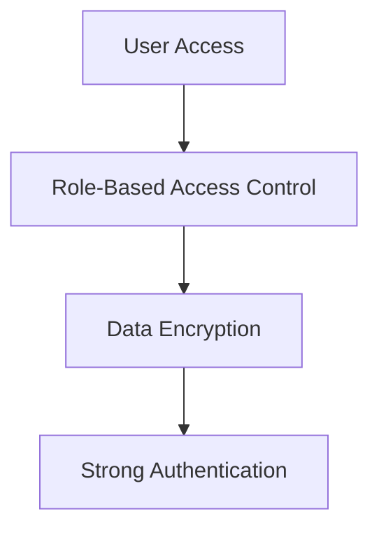
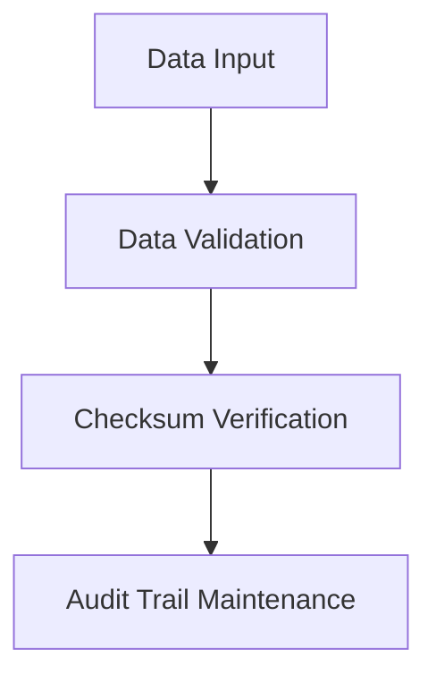
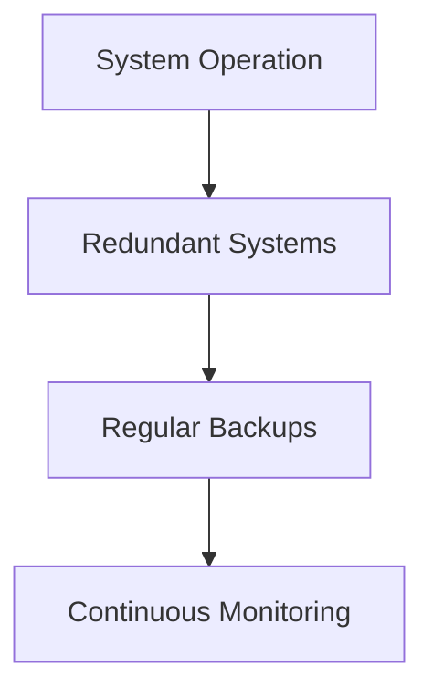
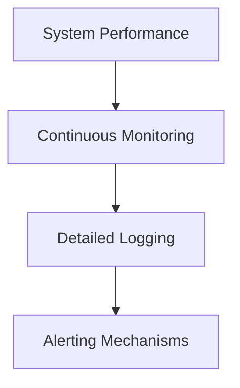
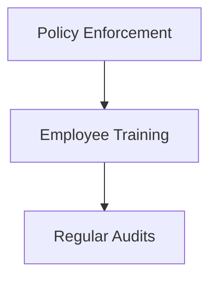
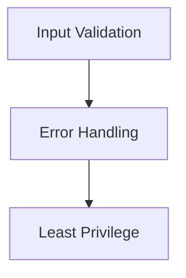
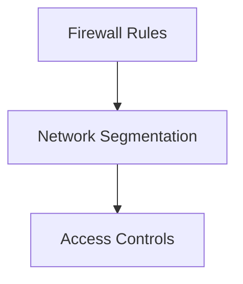

## Understanding the Need for Security Governance: Ensuring Compliance

### Introduction to Security Governance and Compliance

Security governance and compliance are critical components of an organization’s overall security strategy. They ensure that all users adhere to established standards and regulations, thereby safeguarding both individual and organizational data. This chapter delves into the importance of compliance, the roles it plays in protecting individuals and organizations, and the core principles of confidentiality, integrity, and availability (CIA).

### What is Security Governance?

Security governance refers to the framework of policies, processes, and practices that an organization implements to manage its information security risks. It encompasses the following key elements:

- **Policies**: Formal statements of rules that guide behavior.
- **Processes**: Standardized procedures for performing tasks.
- **Practices**: Specific actions taken to implement policies and processes.

#### Why Security Governance Matters

Security governance is essential because it provides a structured approach to managing security risks. Without it, organizations are more susceptible to breaches and non-compliance issues, which can lead to significant financial and reputational damage.

### What is Compliance?

Compliance refers to the adherence to laws, regulations, standards, and guidelines that govern an organization’s operations. It ensures that the organization meets external requirements set by regulatory bodies and internal policies.

#### Why Compliance Matters

Compliance is crucial for several reasons:

- **Legal Requirements**: Organizations must comply with laws such as GDPR, HIPAA, and PCI-DSS to avoid legal penalties.
- **Data Privacy**: Ensures that personal data is protected and handled appropriately.
- **Brand Protection**: Non-compliance can lead to negative publicity, damaging the organization’s reputation.
- **Risk Management**: Helps in identifying and mitigating risks associated with non-compliance.

### Core Principles of Security Governance and Compliance

The core principles of security governance and compliance revolve around the CIA triad:

- **Confidentiality**: Ensuring that data is accessible only to those authorized to access it.
- **Integrity**: Ensuring that data is accurate and trustworthy.
- **Availability**: Ensuring that data is accessible to authorized users when needed.

#### Confidentiality

**What is Confidentiality?**

Confidentiality ensures that sensitive information is protected from unauthorized access. This includes personal data, trade secrets, and other confidential business information.

**Why is Confidentiality Important?**

Confidentiality is important because unauthorized access to sensitive information can lead to data breaches, identity theft, and other security incidents. For example, the Equifax breach in 2017 exposed the personal data of over 147 million people, leading to significant financial and reputational damage.

**How to Ensure Confidentiality**

To ensure confidentiality, organizations should implement the following measures:

- **Access Controls**: Limit access to sensitive data based on user roles and permissions.
- **Encryption**: Encrypt sensitive data both at rest and in transit.
- **Authentication**: Implement strong authentication mechanisms to verify user identities.

#### Integrity

**What is Integrity?**

Integrity ensures that data remains accurate and unaltered. This includes preventing unauthorized modifications and ensuring that data is consistent across different systems.

**Why is Integrity Important?**

Integrity is important because unauthorized modifications to data can lead to incorrect decisions and loss of trust. For example, the Target breach in 2013 involved the theft of customer data, including credit card information, leading to significant financial losses and loss of customer trust.

**How to Ensure Integrity**

To ensure integrity, organizations should implement the following measures:

- **Data Validation**: Validate data inputs to ensure they meet specified criteria.
- **Checksums**: Use checksums to detect unauthorized modifications.
- **Audit Trails**: Maintain audit trails to track changes to data.

#### Availability

**What is Availability?**

Availability ensures that data is accessible to authorized users when needed. This includes maintaining system uptime and ensuring that data is recoverable in case of failures.

**Why is Availability Important?**

Availability is important because downtime can lead to significant financial losses and loss of customer trust. For example, the Amazon S3 outage in 2017 caused widespread disruptions, affecting numerous businesses and services.

**How to Ensure Availability**

To ensure availability, organizations should implement the following measures:

- **Redundancy**: Implement redundant systems to ensure continuous operation.
- **Backup and Recovery**: Regularly back up data and test recovery procedures.
- **Monitoring**: Continuously monitor system performance to detect and address issues promptly.

### Real-World Examples of Compliance Failures

#### Equifax Breach (2017)

The Equifax breach exposed the personal data of over 147 million people. This breach occurred due to a vulnerability in the Apache Struts web application framework, which was not patched in a timely manner.

**Impact:**
- Financial losses due to legal settlements and remediation efforts.
- Reputational damage due to loss of customer trust.

**Lessons Learned:**
- Regularly patch and update software to address known vulnerabilities.
- Implement robust access controls and encryption to protect sensitive data.

#### Target Breach (2013)

The Target breach involved the theft of customer data, including credit card information. This breach occurred due to a vulnerability in Target’s payment system, which was exploited by attackers.

**Impact:**
- Financial losses due to legal settlements and remediation efforts.
- Loss of customer trust due to exposure of sensitive data.

**Lessons Learned:**
- Implement strong data validation and checksum verification to detect unauthorized modifications.
- Maintain audit trails to track changes to data and identify potential breaches.

### How to Prevent and Defend Against Compliance Failures

#### Detection

To detect compliance failures, organizations should implement the following measures:

- **Monitoring**: Continuously monitor system performance and user activities to detect anomalies.
- **Logging**: Maintain detailed logs of system events and user activities.
- **Alerting**: Set up alerts to notify administrators of potential compliance violations.

#### Prevention

To prevent compliance failures, organizations should implement the following measures:

- **Policy Enforcement**: Enforce security policies and procedures to ensure compliance.
- **Training**: Provide regular training to employees on security best practices and compliance requirements.
- **Audits**: Conduct regular audits to assess compliance and identify areas for improvement.

#### Secure Coding Practices

Secure coding practices are essential for ensuring compliance and preventing security vulnerabilities. Here are some examples of secure coding practices:

- **Input Validation**: Validate user inputs to ensure they meet specified criteria.
- **Error Handling**: Handle errors gracefully to prevent information leakage.
- **Least Privilege**: Grant users the minimum privileges necessary to perform their tasks.

#### Configuration Hardening

Configuration hardening involves securing system configurations to prevent unauthorized access and ensure compliance. Here are some examples of configuration hardening:

- **Firewall Rules**: Configure firewalls to allow only necessary traffic.
- **Network Segmentation**: Segment networks to isolate sensitive data.
- **Access Controls**: Implement access controls to restrict access to sensitive data.

### Conclusion

Security governance and compliance are critical for ensuring the confidentiality, integrity, and availability of data. By implementing robust security policies, processes, and practices, organizations can protect themselves from compliance failures and security breaches. Regular monitoring, auditing, and training are essential for maintaining compliance and preventing security incidents.

### Practice Labs

For hands-on practice in security governance and compliance, consider the following labs:

- **PortSwigger Web Security Academy**: Offers interactive labs to learn about web security and compliance.
- **OWASP Juice Shop**: Provides a vulnerable web application to practice security testing and compliance.
- **DVWA (Damn Vulnerable Web Application)**: Offers a vulnerable web application to practice security testing and compliance.
- **WebGoat**: Provides a vulnerable web application to practice security testing and compliance.

By engaging in these labs, you can gain practical experience in implementing security governance and compliance measures.

---
<!-- nav -->
[[01-Understanding the Need for Security Governance Compliance|Understanding the Need for Security Governance Compliance]] | [[DevSecOps/DevSecOps Bootcamp/01-DevSecOps Introduction/12-Understanding the Need for Security Governance/07-Understanding Compliance/00-Overview|Overview]] | [[DevSecOps/DevSecOps Bootcamp/01-DevSecOps Introduction/12-Understanding the Need for Security Governance/07-Understanding Compliance/03-Practice Questions & Answers|Practice Questions & Answers]]
