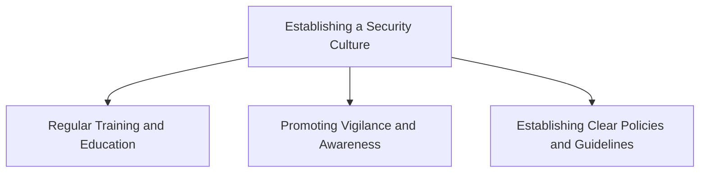
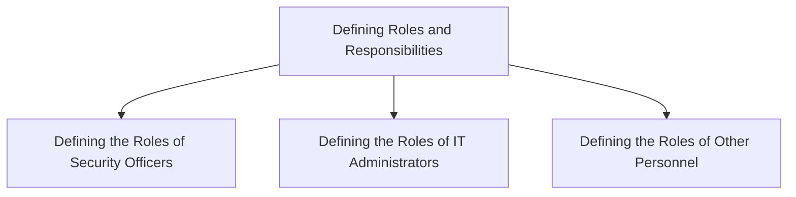

## Introduction to Security Governance

Security governance is a critical component of any organization's overall strategy, particularly in the realm of DevSecOps. It encompasses the policies, procedures, and structures that ensure the security of an organization’s information assets and operations. In essence, security governance aims to align security practices with the broader goals and objectives of the organization. This alignment ensures that security measures are not only effective but also integrated seamlessly into the day-to-day operations of the business.

### Types of Governance

Before diving into security governance specifically, it's important to understand the various types of governance that exist:

1. **Corporate Governance**: This type of governance focuses on how a corporation or business is managed. It includes the structure of the board of directors, the roles and responsibilities of executives, and the mechanisms for ensuring accountability and transparency.
   
2. **Financial Governance**: This involves the management of financial matters within an organization. It includes budgeting, financial reporting, and compliance with financial regulations.
   
3. **Project Governance**: This type of governance is concerned with how projects are managed. It includes defining project scope, timelines, budgets, and ensuring that projects are completed on time and within budget.
   
4. **IT Governance**: This focuses on the management of IT resources within an organization. It includes the planning, implementation, and monitoring of IT systems and services to support business objectives.
   
5. **Public Governance**: This type of governance deals with how public bodies, such as governments, manage their business. It includes the formulation and implementation of public policies and the management of public resources.

### Security Governance

Security governance is the specific subset of governance that focuses on the security of an organization's information assets and operations. It involves the development and implementation of policies, procedures, and controls to protect these assets from unauthorized access, misuse, or damage.

#### Key Areas of Focus

Some of the key areas of focus for security governance include:

1. **Setting Out an Approach for Doing Business**: This involves defining the culture and integrity of the organization in relation to securing data and systems. It includes establishing a set of principles and guidelines that govern how the organization approaches security.
   
2. **Culture and Integrity**: The culture of an organization plays a crucial role in its security posture. A strong security culture emphasizes the importance of security and encourages employees to take responsibility for protecting the organization's assets. Integrity refers to the ethical standards and principles that guide the behavior of individuals within the organization.
   
3. **Authority and Decision-Making**: Security governance also involves defining who has the authority to carry out certain actions within the organization and make decisions related to security. This includes establishing roles and responsibilities, as well as processes for decision-making.

### Importance of Security Governance

The importance of security governance cannot be overstated. In today's digital age, organizations face numerous threats to their information assets, including cyber attacks, data breaches, and insider threats. Without proper security governance, these threats can have severe consequences, including financial losses, reputational damage, and legal liabilities.

#### Recent Real-World Examples

Several high-profile breaches and vulnerabilities highlight the importance of robust security governance:

1. **Equifax Data Breach (2017)**: Equifax, a major credit reporting agency, suffered a massive data breach that exposed sensitive personal information of over 147 million consumers. The breach was caused by a vulnerability in the Apache Struts web application framework, which Equifax failed to patch in a timely manner. This incident underscores the importance of regular security assessments and timely patch management.
   
2. **Capital One Data Breach (2019)**: Capital One, a major financial institution, experienced a data breach that exposed the personal information of over 100 million customers and potential customers. The breach was caused by a misconfigured web application firewall, which allowed an attacker to gain unauthorized access to the company's servers. This incident highlights the importance of proper configuration management and regular security audits.
   
3. **SolarWinds Supply Chain Attack (2020)**: The SolarWinds supply chain attack involved the compromise of the SolarWinds Orion software, which was used by numerous government agencies and private companies. The attackers inserted malicious code into the software updates, allowing them to gain unauthorized access to the networks of affected organizations. This incident underscores the importance of supply chain security and the need for robust security controls throughout the software development lifecycle.

### Components of Security Governance

Security governance consists of several key components that work together to ensure the security of an organization's information assets and operations. These components include:

1. **Policies and Procedures**: Policies and procedures provide the framework for how security is managed within the organization. They define the rules and guidelines that govern the behavior of individuals and the operation of systems.
   
2. **Roles and Responsibilities**: Roles and responsibilities define who is responsible for carrying out specific security-related tasks and making decisions related to security. This includes defining the roles of security officers, IT administrators, and other personnel.
   
3. **Controls and Measures**: Controls and measures are the specific mechanisms that are put in place to protect information assets and operations. This includes technical controls, such as firewalls and encryption, as well as administrative controls, such as access controls and incident response plans.
   
4. **Monitoring and Auditing**: Monitoring and auditing involve the continuous assessment of the effectiveness of security controls and measures. This includes regular security assessments, vulnerability scans, and penetration testing.

### Setting Out an Approach for Doing Business

One of the key areas of focus for security governance is setting out an approach for doing business. This involves defining the culture and integrity of the organization in relation to securing data and systems. It includes establishing a set of principles and guidelines that govern how the organization approaches security.

#### Culture and Integrity

A strong security culture emphasizes the importance of security and encourages employees to take responsibility for protecting the organization's assets. This includes promoting a mindset of vigilance and awareness among employees, as well as providing regular training and education on security best practices.

Integrity refers to the ethical standards and principles that guide the behavior of individuals within the organization. This includes ensuring that all actions taken by employees are in line with the organization's values and principles, and that they are conducted with honesty and transparency.

#### Example: Establishing a Security Culture

To establish a strong security culture, an organization might implement the following measures:

1. **Regular Training and Education**: Providing regular training and education on security best practices helps to ensure that employees are aware of the risks and are equipped with the knowledge and skills needed to protect the organization's assets.
   
2. **Promoting Vigilance and Awareness**: Encouraging employees to be vigilant and aware of potential security threats helps to create a culture of security. This includes promoting the use of security tools and technologies, as well as encouraging employees to report any suspicious activity.
   
3. **Establishing Clear Policies and Guidelines**: Establishing clear policies and guidelines that govern the behavior of employees helps to ensure that everyone is on the same page when it comes to security. This includes defining the roles and responsibilities of employees, as well as the rules and guidelines that govern their behavior.

### Authority and Decision-Making

Another key area of focus for security governance is defining who has the authority to carry out certain actions within the organization and make decisions related to security. This includes establishing roles and responsibilities, as well as processes for decision-making.

#### Roles and Responsibilities

Roles and responsibilities define who is responsible for carrying out specific security-related tasks and making decisions related to security. This includes defining the roles of security officers, IT administrators, and other personnel.

#### Example: Defining Roles and Responsibilities

To define roles and responsibilities, an organization might implement the following measures:

1. **Defining the Roles of Security Officers**: Security officers are responsible for overseeing the security of the organization's information assets and operations. This includes conducting regular security assessments, implementing security controls, and responding to security incidents.
   
2. **Defining the Roles of IT Administrators**: IT administrators are responsible for managing the organization's IT infrastructure and systems. This includes configuring and maintaining security controls, as well as monitoring and auditing the performance of systems.
   
3. **Defining the Roles of Other Personnel**: Other personnel, such as developers and testers, are responsible for ensuring that security is integrated into the development and testing processes. This includes conducting regular security assessments, implementing security controls, and responding to security incidents.

### How to Prevent / Defend

To prevent and defend against security threats, an organization must implement robust security governance measures. This includes establishing clear policies and procedures, defining roles and responsibilities, implementing controls and measures, and conducting regular monitoring and auditing.

#### Detection

Detection involves identifying potential security threats and vulnerabilities. This includes conducting regular security assessments, vulnerability scans, and penetration testing.

#### Prevention

Prevention involves implementing controls and measures to protect information assets and operations. This includes technical controls, such as firewalls and encryption, as well as administrative controls, such as access controls and incident response plans.

#### Secure-Coding Fixes

Secure-coding fixes involve implementing security best practices in the development and testing processes. This includes conducting regular security assessments, implementing security controls, and responding to security incidents.

#### Configuration Hardening

Configuration hardening involves securing the configuration of systems and applications. This includes implementing secure configurations, disabling unnecessary services and features, and applying security patches and updates.

#### Mitigations

Mitigations involve implementing measures to reduce the impact of security threats and vulnerabilities. This includes implementing backup and recovery plans, conducting regular security training and education, and establishing incident response plans.

### Conclusion

Security governance is a critical component of any organization's overall strategy, particularly in the realm of DevSecOps. It encompasses the policies, procedures, and structures that ensure the security of an organization’s information assets and operations. By establishing a strong security culture, defining roles and responsibilities, implementing controls and measures, and conducting regular monitoring and auditing, organizations can effectively protect their information assets and operations from potential threats and vulnerabilities.

### Practice Labs

For hands-on experience with security governance, consider the following practice labs:

- **PortSwigger Web Security Academy**: Offers a comprehensive set of labs for learning web security concepts and techniques.
- **OWASP Juice Shop**: Provides a vulnerable web application for practicing web security skills.
- **DVWA (Damn Vulnerable Web Application)**: Offers a vulnerable web application for practicing web security skills.
- **WebGoat**: Provides a vulnerable web application for practicing web security skills.

These labs provide practical experience with security governance concepts and techniques, helping to reinforce the theoretical knowledge gained from this chapter.

---
<!-- nav -->
[[DevSecOps/DevSecOps Bootcamp/01-DevSecOps Introduction/12-Understanding the Need for Security Governance/08-Understanding Governance/00-Overview|Overview]] | [[02-Understanding the Need for Security Governance|Understanding the Need for Security Governance]]
