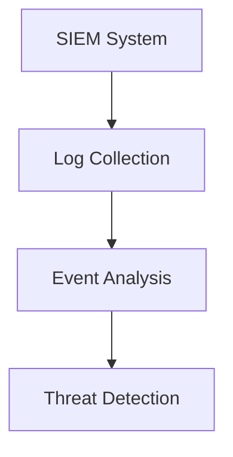
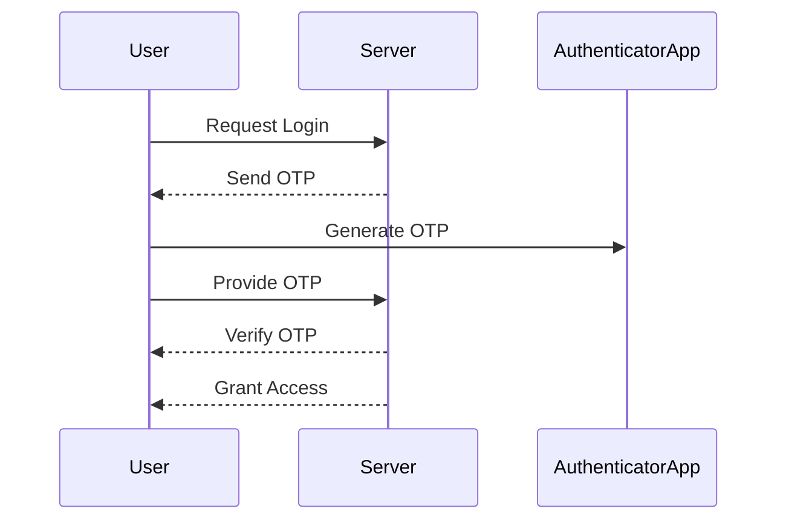

## Understanding the Need for Security Governance

### Introduction to Security Governance

Security governance is a critical aspect of modern organizations, particularly in the context of DevSecOps. It encompasses the policies, procedures, and structures that guide an organization's approach to managing security risks. Unlike security compliance, which focuses on meeting specific regulatory requirements, security governance operates at a higher strategic level, aligning security efforts with broader business objectives.

### Key Stakeholders in Security Governance

#### Board of Directors

The Board of Directors plays a pivotal role in security governance. They have a legal and fiduciary duty to ensure that the company operates in compliance with all relevant laws and regulations, including data protection laws. This responsibility extends to ensuring that robust security practices are in place to protect the organization's assets and data.

**Legal Requirements:**
In many countries, directors are legally required to ensure that their companies comply with data protection laws. For example, in the European Union, the General Data Protection Regulation (GDPR) mandates that companies must implement appropriate technical and organizational measures to ensure the security of personal data. Failure to comply can result in significant fines and reputational damage.

**Real-World Example:**
Consider the case of British Airways, which was fined £183 million by the UK Information Commissioner’s Office (ICO) for a data breach that affected approximately 500,000 customers. The breach occurred due to inadequate security measures, leading to the exposure of sensitive customer data. This incident highlights the importance of robust security governance and the severe consequences of failing to meet legal obligations.

#### Executive Management

Executive management is another key stakeholder in security governance. They are responsible for implementing and enforcing security policies across the organization. This includes ensuring that security is integrated into the development lifecycle, particularly in the context of DevSecOps.

**Role in DevSecOps:**
In DevSecOps, executive management must champion the integration of security into the continuous integration and continuous deployment (CI/CD) pipeline. This involves setting clear security goals, allocating resources, and fostering a culture of security awareness among employees.

**Real-World Example:**
A notable example is the implementation of DevSecOps at Capital One. The financial institution faced a significant data breach in 2019, which exposed the personal information of over 100 million customers. Following this incident, Capital One invested heavily in improving its security posture, including the adoption of DevSecOps principles. This involved integrating security checks into the CI/CD pipeline, conducting regular security audits, and training employees on security best practices.

#### Customers

Customers are also key stakeholders in security governance. They have a vested interest in ensuring that the organizations they interact with have robust security processes in place to protect their data and privacy.

**Impact on Trust:**
Strong security governance can enhance customer trust and loyalty. Conversely, security breaches can lead to loss of trust, negative publicity, and potential legal action. Therefore, organizations must prioritize security governance to maintain customer confidence.

**Real-World Example:**
Equifax, a consumer credit reporting agency, suffered a massive data breach in 2017, affecting approximately 147 million consumers. The breach exposed sensitive personal information, including Social Security numbers, birth dates, and addresses. This incident severely damaged Equifax's reputation and led to numerous lawsuits and regulatory investigations. It underscores the importance of robust security governance to protect customer data and maintain trust.

### Security Governance vs. Security Compliance

While security governance and security compliance are related, they serve different purposes and operate at different levels within an organization.

#### Security Governance

Security governance focuses on the overall strategy and framework for managing security risks. It involves defining roles and responsibilities, establishing policies and procedures, and ensuring alignment with business objectives.

**Key Components:**
- **Policy Development:** Creating comprehensive security policies that cover various aspects such as data protection, access control, and incident response.
- **Risk Management:** Identifying, assessing, and mitigating security risks to protect the organization's assets.
- **Stakeholder Engagement:** Involving key stakeholders, including the Board of Directors and executive management, in decision-making processes related to security.

#### Security Compliance

Security compliance, on the other hand, focuses on meeting specific regulatory requirements. It involves adhering to standards and guidelines set by regulatory bodies, such/including GDPR, HIPAA, and PCI DSS.

**Key Components:**
- **Regulatory Adherence:** Ensuring that the organization complies with relevant laws and regulations.
- **Audit and Reporting:** Conducting regular audits to verify compliance and preparing reports for regulatory bodies.
- **Training and Awareness:** Educating employees on compliance requirements and best practices.

### Real-World Examples of Security Governance Failures

#### Target Data Breach (2013)

Target, a major retail corporation, suffered a significant data breach in 2013, affecting approximately 40 million customers. The breach exposed sensitive payment card information, leading to substantial financial losses and reputational damage.

**Root Cause:**
The breach was attributed to weak security governance, including inadequate monitoring of network traffic and failure to implement basic security controls such as two-factor authentication.

**Lessons Learned:**
This incident highlighted the importance of robust security governance, including regular security assessments, strong access controls, and effective incident response plans.

#### Yahoo Data Breaches (2013-2014)

Yahoo experienced a series of data breaches between 2013 and 2014, affecting up to 3 billion user accounts. The breaches exposed sensitive user information, including email addresses, phone numbers, and security questions.

**Root Cause:**
The breaches were attributed to poor security governance, including failure to implement basic security measures such as encryption and inadequate monitoring of network activity.

**Lessons Learned:**
These incidents underscore the importance of strong security governance, including regular security audits, robust access controls, and effective incident response plans.

### How to Prevent / Defend Against Security Governance Failures

#### Detection

Effective detection mechanisms are crucial for identifying security governance failures before they result in significant damage. This involves implementing comprehensive monitoring and logging capabilities to track security events and anomalies.

**Example:**
Implementing a Security Information and Event Management (SIEM) system can help in detecting security incidents in real-time. SIEM systems collect and analyze log data from various sources, providing insights into potential security threats.



#### Prevention

Prevention involves implementing robust security controls and policies to mitigate risks. This includes:

- **Access Controls:** Implementing strong access controls, such as multi-factor authentication (MFA) and least privilege principles.
- **Encryption:** Encrypting sensitive data both at rest and in transit to protect against unauthorized access.
- **Regular Audits:** Conducting regular security audits to identify and address vulnerabilities.

**Example:**
Implementing MFA can significantly reduce the risk of unauthorized access. Here is an example of how MFA can be configured using Google Authenticator:



#### Secure Coding Practices

Secure coding practices are essential for preventing security governance failures. This involves:

- **Input Validation:** Validating all input data to prevent injection attacks.
- **Error Handling:** Properly handling errors to avoid exposing sensitive information.
- **Code Reviews:** Conducting regular code reviews to identify and address security vulnerabilities.

**Example:**
Here is an example of secure coding practices in Python:

```python
# Vulnerable Code
def login(username, password):
    if username == "admin" and password == "password":
        return True
    else:
        return False

# Secure Code
import hashlib

def login(username, password):
    hashed_password = hashlib.sha256(password.encode()).hexdigest()
    if username == "admin" and hashed_password == "hashed_password":
        return True
    else:
        return False
```

#### Configuration Hardening

Configuration hardening involves securing system configurations to minimize vulnerabilities. This includes:

- **Disabling Unnecessary Services:** Disabling unnecessary services and ports to reduce the attack surface.
- **Firewall Configuration:** Configuring firewalls to restrict unauthorized access.
- **Patch Management:** Regularly applying security patches and updates to address known vulnerabilities.

**Example:**
Here is an example of firewall configuration using iptables:

```bash
# Flush existing rules
iptables -F

# Set default policies
iptables -P INPUT DROP
iptables -P FORWARD DROP
iptables -P OUTPUT ACCEPT

# Allow established connections
iptables -A INPUT -m conntrack --ctstate ESTABLISHED,RELATED -j ACCEPT

# Allow SSH connections
iptables -A INPUT -p tcp --dport 22 -j ACCEPT

# Save rules
iptables-save > /etc/iptables/rules.v4
```

### Conclusion

Security governance is a critical component of modern organizations, particularly in the context of DevSecOps. It involves defining policies, procedures, and structures to manage security risks and align security efforts with broader business objectives. By understanding the roles of key stakeholders, distinguishing between security governance and compliance, and learning from real-world examples, organizations can improve their security posture and protect their assets and data.

### Practice Labs

For hands-on experience with security governance concepts, consider the following practice labs:

- **PortSwigger Web Security Academy:** Offers interactive labs to learn about web application security, including secure coding practices and vulnerability assessments.
- **OWASP Juice Shop:** A deliberately insecure web application for practicing web security skills, including security governance and compliance.
- **DVWA (Damn Vulnerable Web Application):** A PHP/MySQL web application that is riddled with vulnerabilities for educational purposes, helping to understand security governance in web applications.

By engaging in these practice labs, you can gain practical experience in implementing security governance principles and improving your organization's security posture.

---
<!-- nav -->
[[01-Introduction to Security Governance|Introduction to Security Governance]] | [[DevSecOps/DevSecOps Bootcamp/01-DevSecOps Introduction/12-Understanding the Need for Security Governance/08-Understanding Governance/00-Overview|Overview]] | [[DevSecOps/DevSecOps Bootcamp/01-DevSecOps Introduction/12-Understanding the Need for Security Governance/08-Understanding Governance/03-Practice Questions & Answers|Practice Questions & Answers]]
