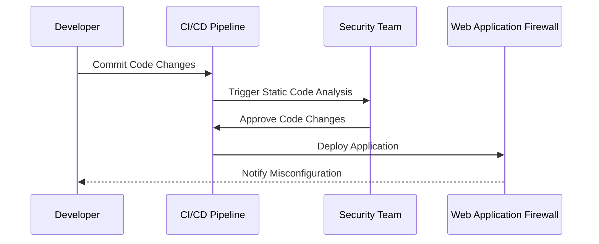
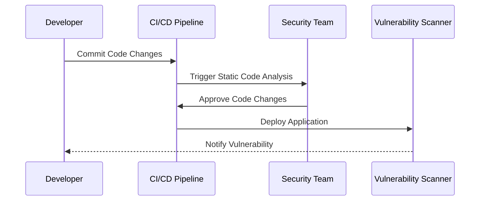
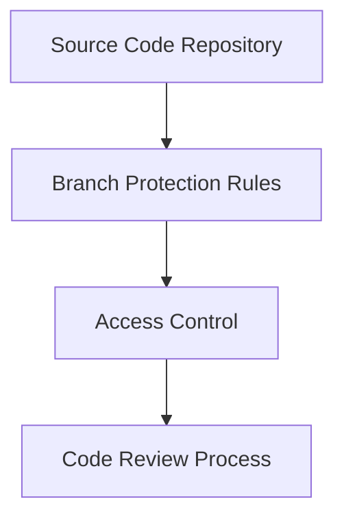
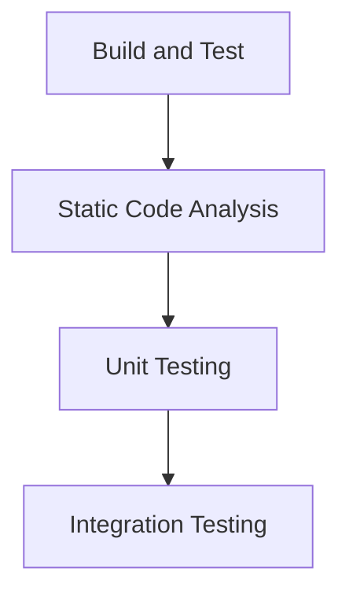
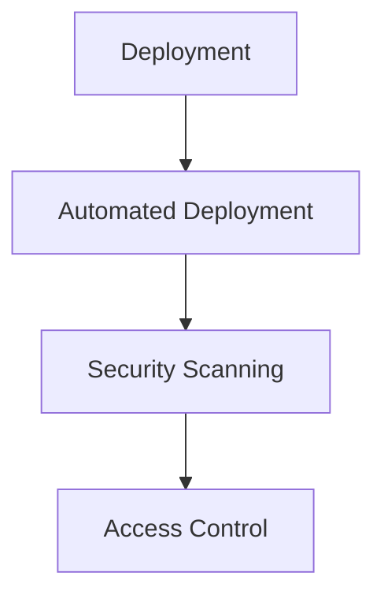
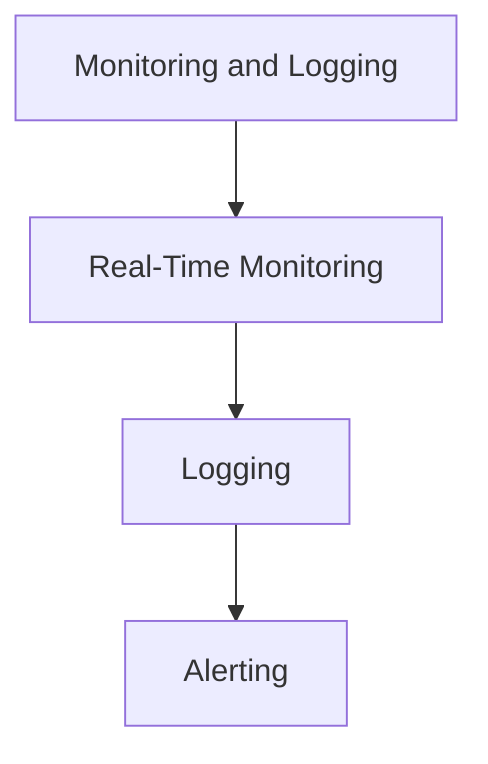

## Understanding the Need for Security Governance

### Introduction to Security Governance

Security governance is a critical component of modern organizational operations, especially in the context of DevSecOps. It encompasses the policies, processes, and practices that ensure the security of an organization's assets, data, and operations. In essence, security governance provides a framework for managing risks and ensuring that security measures are integrated into the overall business strategy.

#### What is Security Governance?

Security governance is the process of establishing and maintaining a comprehensive set of policies, procedures, and controls to manage security-related risks. It involves defining roles and responsibilities, setting standards, and ensuring compliance with internal and external regulations. Security governance is not just about implementing security measures but also about ensuring that these measures are effective and aligned with the organization's objectives.

#### Why is Security Governance Important?

In today’s fast-paced digital environment, organizations face numerous security threats, including cyber attacks, data breaches, and compliance violations. Security governance helps mitigate these risks by providing a structured approach to managing security. It ensures that security is not an afterthought but an integral part of the organization's operations.

### Drivers for Security Governance

There are several key drivers for security governance:

1. **Legal Requirements**: Organizations must comply with various laws and regulations, such as GDPR, HIPAA, and CCPA. Failure to comply can result in significant fines and reputational damage.
   
2. **Regulatory Compliance**: Many industries have specific regulatory requirements that must be met. For example, financial institutions must comply with regulations like PCI DSS and SOX.

3. **Business Goals**: Security governance helps align security efforts with the organization's strategic goals. By integrating security into the business process, organizations can reduce risks and improve operational efficiency.

4. **Risk Management**: Effective security governance helps identify, assess, and mitigate risks. It ensures that security measures are in place to protect against potential threats.

### Differences Between Compliance and Governance

While compliance and governance are related concepts, they serve different purposes:

- **Compliance**: Compliance refers to the adherence to specific standards, regulations, or requirements. It is about following the rules set by external authorities. For example, a company might need to comply with GDPR to protect personal data.

- **Governance**: Governance is broader and encompasses the overall management of security within an organization. It includes defining how the organization operates, setting goals, and establishing clear lines of authority and responsibility.

### Security Governance in DevSecOps

In the context of DevSecOps, security governance becomes even more crucial due to the rapid pace of development and deployment. DevSecOps aims to integrate security throughout the software development lifecycle (SDLC) to ensure that security is not an afterthought but a continuous process.

#### Challenges in DevSecOps

The DevSecOps model presents unique challenges:

- **Speed of Delivery**: With the ability to release software quickly and frequently, there is a higher risk of introducing vulnerabilities. Multiple contributors working on the same codebase can lead to inconsistencies and errors.

- **Complexity**: Modern applications often involve multiple components, services, and third-party libraries, increasing the complexity of the system and the potential attack surface.

- **Automation**: While automation can improve efficiency, it also requires robust security controls to prevent misuse or misconfiguration.

### Implementing Security Governance in DevSecOps

To effectively implement security governance in a DevSecOps environment, organizations need to establish clear policies, processes, and controls. Here are some key steps:

1. **Define Security Policies**: Develop comprehensive security policies that cover all aspects of the SDLC. These policies should outline the security requirements, roles, and responsibilities.

2. **Integrate Security into CI/CD Pipeline**: Ensure that security checks are integrated into the continuous integration and continuous deployment (CI/CD) pipeline. This includes static code analysis, dynamic application security testing (DAST), and security scanning tools.

3. **Implement Access Controls**: Establish strict access controls to ensure that only authorized personnel can make changes to the codebase and infrastructure. This includes using role-based access control (RBAC) and least privilege principles.

4. **Monitor and Audit**: Regularly monitor and audit the system to detect any security issues or compliance violations. This includes logging and analyzing security events, conducting regular security assessments, and performing penetration testing.

### Real-World Examples

Let's consider some recent real-world examples to illustrate the importance of security governance in DevSecOps:

#### Example 1: Capital One Data Breach (CVE-2019-11510)

In 2019, Capital One suffered a major data breach that exposed sensitive information of over 100 million customers. The breach was caused by a misconfigured web application firewall (WAF) that allowed unauthorized access to the data.

**What Went Wrong?**
- Lack of proper security governance: The WAF was not properly configured, and there were no adequate controls in place to detect and prevent unauthorized access.
- Insufficient monitoring: The breach went undetected for several months due to inadequate monitoring and logging.

**How to Prevent / Defend**
- **Secure Configuration**: Ensure that all security controls, such as WAFs, are properly configured and regularly reviewed.
- **Monitoring and Logging**: Implement robust monitoring and logging mechanisms to detect and respond to security incidents in real-time.
- **Regular Audits**: Conduct regular security audits and penetration testing to identify and mitigate vulnerabilities.

#### Example 2: Equifax Data Breach (CVE-2017-5638)

In 2017, Equifax suffered a massive data breach that exposed sensitive information of over 143 million consumers. The breach was caused by a vulnerability in the Apache Struts framework that was not patched in a timely manner.

**What Went Wrong?**
- Lack of proper security governance: The vulnerability was known, but Equifax failed to patch it in a timely manner.
- Insufficient patch management: There were delays in applying security patches, leading to the exploitation of the vulnerability.

**How to Prevent / Defend**
- **Patch Management**: Implement a robust patch management process to ensure that all known vulnerabilities are patched in a timely manner.
- **Vulnerability Scanning**: Regularly scan the system for vulnerabilities using tools like Nessus or OpenVAS.
- **Incident Response Plan**: Develop and maintain an incident response plan to quickly respond to security incidents.

### Complete Example: Secure CI/CD Pipeline

Let's walk through a complete example of a secure CI/CD pipeline:

#### Step 1: Source Code Repository

- **Repository Setup**: Use a secure repository like GitHub or GitLab to store the source code.
- **Access Control**: Implement RBAC to ensure that only authorized personnel can access the repository.

#### Step 2: Build and Test

- **Static Code Analysis**: Use tools like SonarQube or Fortify to perform static code analysis.
- **Unit Testing**: Write unit tests to ensure that the code functions as intended.
- **Integration Testing**: Perform integration testing to ensure that the components work together correctly.

#### Step 3: Deployment

- **Automated Deployment**: Use tools like Jenkins or CircleCI to automate the deployment process.
- **Security Scanning**: Use tools like Trivy or Clair to scan the deployed application for vulnerabilities.
- **Access Control**: Ensure that only authorized personnel can deploy the application.

#### Step 4: Monitoring and Logging

- **Real-Time Monitoring**: Use tools like Splunk or ELK Stack to monitor the system in real-time.
- **Logging**: Implement logging to capture security events and audit trails.
- **Alerting**: Set up alerts to notify the security team of any suspicious activity.

### Common Pitfalls and How to Avoid Them

#### Pitfall 1: Lack of Proper Documentation

**Problem**: Without proper documentation, it is difficult to understand the security policies and procedures.

**Solution**: Maintain detailed documentation of all security policies, procedures, and controls. Use tools like Confluence or Google Docs to create and maintain the documentation.

#### Pitfall 2: Insufficient Training

**Problem**: Without proper training, employees may not understand the security policies and procedures.

**Solution**: Provide regular training to employees on security policies and procedures. Use tools like Udemy or Coursera to provide online training.

#### Pitfall 3: Inadequate Testing

**Problem**: Without proper testing, vulnerabilities may go undetected.

**Solution**: Implement a robust testing process that includes static code analysis, dynamic application security testing, and penetration testing. Use tools like Burp Suite or Metasploit to perform penetration testing.

### Conclusion

Security governance is a critical component of modern organizational operations, especially in the context of DevSecOps. By establishing clear policies, processes, and controls, organizations can effectively manage security risks and ensure that security is integrated into the overall business strategy. Through real-world examples and complete code examples, we have demonstrated the importance of security governance and provided practical guidance on how to implement it in a DevSecOps environment.

### Hands-On Labs

For hands-on practice, consider the following labs:

- **PortSwigger Web Security Academy**: Offers a wide range of web security labs, including those focused on security governance and DevSecOps.
- **OWASP Juice Shop**: A deliberately insecure web application that can be used to practice security testing and governance.
- **DVWA (Damn Vulnerable Web Application)**: Another intentionally vulnerable web application that can be used to practice security testing and governance.

These labs provide practical experience in implementing security governance in a DevSecOps environment.

---
<!-- nav -->
[[DevSecOps/DevSecOps Bootcamp/01-DevSecOps Introduction/12-Understanding the Need for Security Governance/09-Module Summary/00-Overview|Overview]] | [[DevSecOps/DevSecOps Bootcamp/01-DevSecOps Introduction/12-Understanding the Need for Security Governance/09-Module Summary/02-Practice Questions & Answers|Practice Questions & Answers]]
