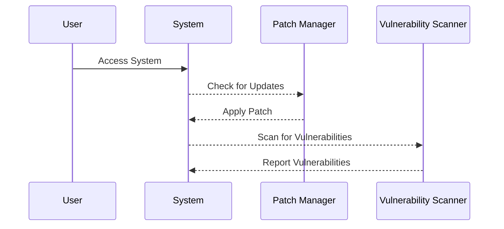
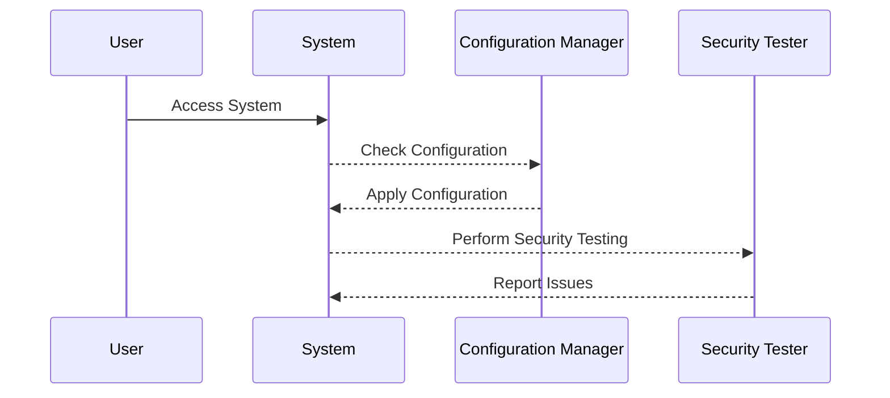

## Understanding the Need for Security Governance in DevSecOps

### Introduction to Security Governance

Security governance in DevSecOps is a critical aspect of ensuring that an organization's IT infrastructure and applications are secure throughout their lifecycle. Security governance encompasses the policies, processes, and practices that guide how an organization manages and protects its information assets. It is essential because it provides a framework for making informed decisions about security, aligning security efforts with business objectives, and ensuring compliance with legal and regulatory requirements.

### Importance of Security Governance

The importance of security governance cannot be overstated. In today's digital landscape, organizations face numerous threats, including cyber attacks, data breaches, and compliance violations. Poor security governance can lead to significant financial losses, reputational damage, and legal consequences. Effective security governance helps organizations mitigate these risks by establishing a robust security posture.

### Real-World Examples of Poor Security Governance

To illustrate the importance of security governance, let's examine two real-world examples where inadequate security governance led to major security incidents.

#### Example 1: Telco Data Breach

In the first example, the Information Commissioner's Office (ICO), based in the UK, published a report following a data breach involving a prominent telecommunications company (telco). The ICO found that the telco had failed to implement basic cybersecurity measures, which allowed hackers to penetrate the systems with ease.

**Extract from the BBC News Website:**

> "The Information Commissioner stated that the telco's failure to implement the most basic cyber security measures allowed hackers to penetrate the systems with ease."

This quote highlights several key points:

1. **Basic Cybersecurity Measures**: These include fundamental security practices such as strong password policies, regular software updates, and network segmentation. The failure to implement these measures indicates a lack of basic security hygiene.
   
2. **Ease of Penetration**: The hackers were able to easily penetrate the system and infiltrate data. This suggests that the telco's security controls were insufficient to prevent unauthorized access.

**Question:**
Do you think that this telco was operating good security governance, given that the Information Commissioner upon their investigation, found that the telco had failed to implement basic cybersecurity measures?

**Answer:**
No, the telco was not operating good security governance. The failure to implement basic cybersecurity measures indicates a lack of proper security governance. Good security governance would have ensured that the organization followed best practices and implemented necessary security controls to protect its data.

#### Example 2: Credit Reporting Agency Data Breach

In the second example, a major data breach occurred within a credit reporting agency. An investigation revealed that the data breach was entirely preventable.

**Headline from CBS News Website:**

> "After investigation into a major data breach within a credit reporting agency, this quote, which is from the Congressional report, finds that the data breach was entirely preventable."

This quote underscores the following points:

1. **Preventability**: The data breach could have been prevented with better security practices and governance. This implies that the organization lacked effective security controls and oversight.

2. **Investigation**: A thorough investigation was conducted to determine the cause of the breach. Such investigations are crucial for identifying weaknesses and implementing corrective measures.

### Background Theory of Security Governance

Security governance is a comprehensive approach to managing security risks across an organization. It involves several key components:

1. **Policies and Procedures**: Establishing clear policies and procedures that define how security should be managed and enforced.
   
2. **Risk Management**: Identifying, assessing, and mitigating security risks to protect the organization's assets.
   
3. **Compliance**: Ensuring that the organization complies with relevant laws, regulations, and industry standards.
   
4. **Monitoring and Auditing**: Regularly monitoring and auditing security controls to ensure they are effective and up-to-date.

### Recent Real-World Examples

Let's explore some recent real-world examples of security incidents that highlight the importance of security governance.

#### Example 1: Equifax Data Breach (CVE-2017-5638)

In 2017, Equifax, a major credit reporting agency, suffered a massive data breach that exposed sensitive personal information of approximately 147 million consumers. The breach was caused by a vulnerability in Apache Struts, a widely used open-source web application framework.

**CVE-2017-5638**: This Common Vulnerabilities and Exposures (CVE) identifier refers to a remote code execution vulnerability in Apache Struts. The vulnerability was exploited by attackers to gain unauthorized access to Equifax's systems.

**Impact**: The breach resulted in significant financial losses, reputational damage, and legal consequences for Equifax. The company faced numerous lawsuits and regulatory investigations.

**Root Cause**: The root cause of the breach was the failure to apply a security patch for the Apache Struts vulnerability. This indicates a lack of proper security governance, specifically in terms of software patch management and vulnerability management.

**How to Prevent / Defend:**

1. **Patch Management**: Implement a robust patch management process to ensure that all software vulnerabilities are promptly addressed.
   
2. **Vulnerability Scanning**: Regularly scan systems for vulnerabilities using tools like Nessus or OpenVAS.
   
3. **Secure Coding Practices**: Follow secure coding practices to minimize the introduction of vulnerabilities in custom-developed software.



#### Example 2: Capital One Data Breach (CVE-2019-11510)

In 2019, Capital One, a major financial services company, suffered a data breach that exposed the personal information of approximately 100 million customers and potential customers. The breach was caused by a misconfiguration in a web application firewall (WAF).

**CVE-2019-11510**: This CVE identifier refers to a vulnerability in the WAF configuration that allowed unauthorized access to sensitive data.

**Impact**: The breach resulted in significant financial losses, reputational damage, and legal consequences for Capital One. The company faced numerous lawsuits and regulatory investigations.

**Root Cause**: The root cause of the breach was the misconfiguration of the WAF. This indicates a lack of proper security governance, specifically in terms of configuration management and security testing.

**How to Prevent / Defend:**

1. **Configuration Management**: Implement a robust configuration management process to ensure that all systems are properly configured and secured.
   
2. **Security Testing**: Regularly perform security testing, including penetration testing and vulnerability assessments, to identify and address configuration issues.
   
3. **Access Controls**: Implement strict access controls to limit access to sensitive data and systems.



### Detailed Explanation of Security Governance Components

#### Policies and Procedures

Policies and procedures are the foundation of security governance. They define how security should be managed and enforced within an organization. Key aspects include:

1. **Information Security Policy**: A high-level document that outlines the organization's overall approach to information security.
   
2. **Incident Response Plan**: A plan that defines how the organization will respond to security incidents, including steps for containment, eradication, and recovery.
   
3. **Access Control Policy**: A policy that defines how access to systems and data should be controlled, including authentication, authorization, and least privilege principles.

**Example: Information Security Policy**

```markdown
# Information Security Policy

---
<!-- nav -->
[[14-Scope|Scope]] | [[DevSecOps/DevSecOps Bootcamp/01-DevSecOps Introduction/12-Understanding the Need for Security Governance/Real World Examples/00-Overview|Overview]] | [[16-Understanding the Need for Security Governance|Understanding the Need for Security Governance]]
