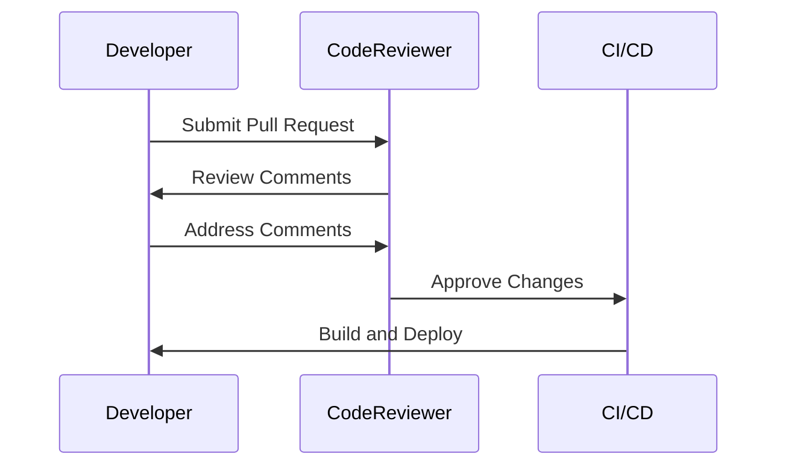
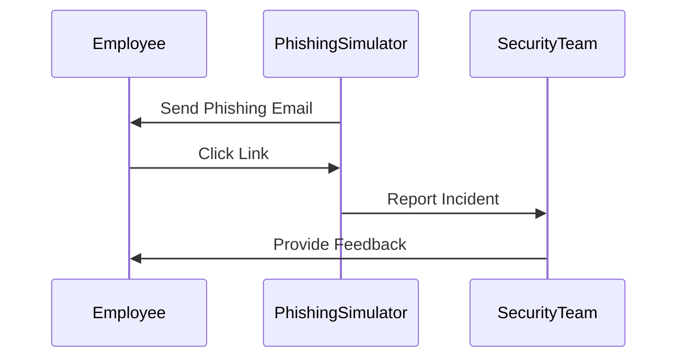

## Understanding the Need for Security Governance

### Introduction to Security Governance

Security governance is a critical component of any organization's cybersecurity strategy. It encompasses the policies, processes, and procedures that ensure the protection of an organization’s assets, data, and infrastructure. Security governance is not just about implementing technical controls; it also involves creating a culture of security awareness and responsibility across all levels of the organization.

#### What is Security Governance?

Security governance refers to the framework and set of practices that guide an organization in managing its information security risks. This includes defining roles and responsibilities, establishing policies and procedures, and ensuring compliance with regulatory requirements. The goal of security governance is to create a structured approach to security management that integrates security into the fabric of the organization.

#### Why is Security Governance Important?

Security governance is crucial because it helps organizations maintain a consistent and effective approach to managing security risks. Without proper governance, organizations may overlook basic cybersecurity hygiene measures, leading to vulnerabilities that can be exploited by attackers. The lack of security governance was a significant factor in many recent breaches, highlighting the importance of having robust governance practices in place.

### Real-World Examples of Security Governance Failures

To understand the importance of security governance, let's look at some real-world examples where the lack of governance led to significant breaches.

#### Example 1: Capital One Data Breach (CVE-2019-11510)

In July 2019, Capital One announced a data breach that exposed sensitive personal information of approximately 100 million customers and applicants. The breach occurred due to a misconfigured web application firewall (WAF) that allowed unauthorized access to the company's Amazon Web Services (AWS) environment.

**What Happened?**
The attacker exploited a misconfiguration in the WAF, which should have been properly configured and monitored as part of the organization's security governance practices. The lack of proper governance led to a significant oversight in securing the AWS environment.

**Impact:**
The breach resulted in the exposure of sensitive customer data, including names, addresses, phone numbers, credit scores, and in some cases, Social Security numbers and bank account numbers. This incident cost Capital One millions of dollars in fines and legal settlements.

**Full HTTP Request and Response:**

```http
GET /api/v1/data HTTP/1.1
Host: api.capitalone.com
User-Agent: Mozilla/5.0 (Windows NT 10.0; Win64; x64) AppleWebKit/537.36 (KHTML, like Gecko) Chrome/85.0.4183.121 Safari/537.36
Accept: */*
```

```http
HTTP/1.1 200 OK
Date: Tue, 16 Jul 2019 12:00:00 GMT
Server: Apache/2.4.41 (Ubuntu)
Content-Type: application/json
Content-Length: 12345

{
  "data": [
    {
      "name": "John Doe",
      "address": "123 Main St",
      "phone": "555-1234",
      "ssn": "123-45-6789",
      "credit_score": 750,
      "bank_account": "123456789"
    },
    ...
  ]
}
```

**How to Prevent / Defend:**
- **Secure Configuration Management:** Ensure that all configurations are reviewed and validated before deployment. Use tools like AWS Config to monitor and enforce compliance with security best practices.
- **Regular Audits:** Conduct regular security audits to identify and remediate misconfigurations. Use automated tools like AWS Trusted Advisor to help with this process.
- **Monitoring and Logging:** Implement comprehensive logging and monitoring to detect unusual activities. Use AWS CloudTrail to log API calls and AWS CloudWatch to monitor system performance.

**Secure Configuration Example:**

```json
{
  "Version": "2012-10-17",
  "Statement": [
    {
      "Sid": "AllowAccessToData",
      "Effect": "Allow",
      "Principal": {
        "AWS": "arn:aws:iam::123456789012:user/admin"
      },
      "Action": "s3:GetObject",
      "Resource": "arn:aws:s3:::capitalone-data/*"
    }
  ]
}
```

### Technical Teams and Security Governance

Many technical teams believe that security governance is not their responsibility. They focus solely on writing code, building deployments, and releasing products. However, this mindset can lead to significant security gaps. Security governance is everyone's responsibility, and technical teams play a crucial role in ensuring that security is integrated into the development lifecycle.

#### Role of Developers and Operations Engineers

Developers and operations engineers are responsible for building and operating technology systems. They must be aware of the obligations of information security and incorporate good governance practices into their workflows. This includes:

- **Code Reviews:** Regularly reviewing code for security vulnerabilities.
- **Dependency Management:** Ensuring that all dependencies are up-to-date and free from known vulnerabilities.
- **Testing:** Incorporating security testing into the continuous integration/continuous deployment (CI/CD) pipeline.

#### Example: Code Review Process

A code review process is essential for identifying and fixing security vulnerabilities. Here’s an example of how a code review process can be implemented:



**Vulnerable Code Example:**

```python
# Vulnerable code
def login(username, password):
    if username == "admin" and password == "password":
        return True
    else:
        return False
```

**Secure Code Example:**

```python
# Secure code
import hashlib

def hash_password(password):
    return hashlib.sha256(password.encode()).hexdigest()

def login(username, password):
    stored_password = get_stored_password(username)
    if hash_password(password) == stored_password:
        return True
    else:
        return False
```

### Creating a Culture of Security Awareness

Creating a culture of security awareness is essential for effective security governance. This involves educating all employees about the importance of security and their role in maintaining it.

#### Training Programs

Organizations should implement regular training programs to educate employees about security best practices. These programs should cover topics such as:

- **Phishing Awareness:** Educating employees on how to recognize and avoid phishing attempts.
- **Password Management:** Teaching employees how to create and manage strong passwords.
- **Incident Reporting:** Encouraging employees to report any suspicious activities.

#### Example: Phishing Simulation

Phishing simulations are a common method used to train employees on recognizing phishing attempts. Here’s an example of how a phishing simulation might work:



### Conclusion

Security governance is a critical aspect of any organization's cybersecurity strategy. It ensures that basic cybersecurity hygiene measures are not overlooked and that all employees are aware of their responsibilities in maintaining security. By incorporating security governance into the development lifecycle and creating a culture of security awareness, organizations can significantly reduce the risk of information security incidents.

### Practice Labs

For hands-on experience with security governance, consider the following practice labs:

- **PortSwigger Web Security Academy:** Offers interactive labs to learn about various web security concepts, including security governance.
- **OWASP Juice Shop:** A deliberately insecure web application for practicing web security skills.
- **DVWA (Damn Vulnerable Web Application):** Another intentionally vulnerable web application for learning web security.

These labs provide practical experience in implementing security governance practices and identifying security vulnerabilities.

### Summary

Security governance is not just about implementing technical controls; it involves creating a culture of security awareness and responsibility across all levels of the organization. By understanding the importance of security governance and incorporating it into the development lifecycle, organizations can significantly reduce the risk of information security incidents.

---
<!-- nav -->
[[15-Understanding the Need for Security Governance in DevSecOps|Understanding the Need for Security Governance in DevSecOps]] | [[DevSecOps/DevSecOps Bootcamp/01-DevSecOps Introduction/12-Understanding the Need for Security Governance/Real World Examples/00-Overview|Overview]] | [[DevSecOps/DevSecOps Bootcamp/01-DevSecOps Introduction/12-Understanding the Need for Security Governance/Real World Examples/17-Practice Questions & Answers|Practice Questions & Answers]]
