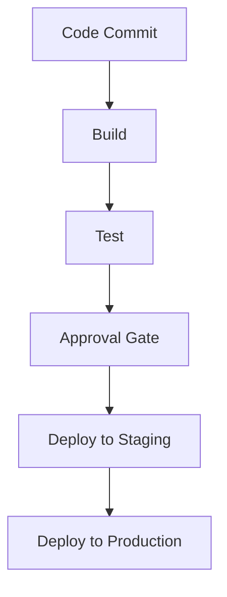
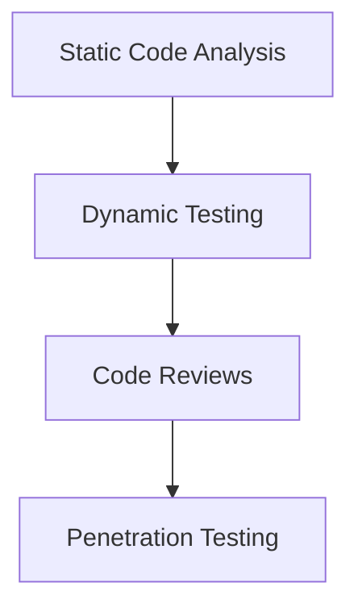
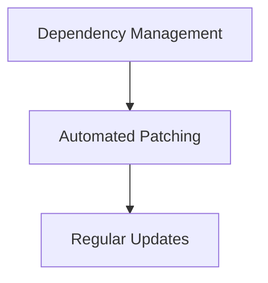

## Understanding the Need for Security Governance in DevSecOps

### Introduction to Security Governance in DevSecOps

Security governance in DevSecOps is a critical framework that ensures the integration of security practices throughout the entire software development lifecycle. This includes continuous integration and delivery (CI/CD) pipelines, code management, and deployment processes. Effective security governance helps organizations maintain compliance with regulatory requirements, protect sensitive data, and mitigate risks associated with software vulnerabilities.

### Difference Between Compliance and Governance

Before diving into the practical aspects of security governance in DevSecOps, it is essential to understand the distinction between compliance and governance:

- **Compliance**: This refers to adherence to specific regulations, standards, or policies. Compliance is often driven by external factors such as legal requirements or industry standards. For example, HIPAA compliance is mandatory for healthcare organizations handling patient data.

- **Governance**: This encompasses the overall structure and processes that guide decision-making and ensure accountability within an organization. Governance includes policies, procedures, and controls that support compliance but also extend to broader organizational goals and risk management.

### Practical Example: Cloud Governance in DevSecOps

Let's consider a scenario where Alice, a manager, assigns Bob a task to demonstrate good governance and compliance in their DevSecOps practice. Here’s how Bob might approach this task:

#### Questions to Assess Governance and Compliance

Bob would start by asking several key questions to assess the current state of governance and compliance:

1. **Who can make changes to the CI/CD pipeline?**
2. **How is code released to production?**
3. **Who ensures code is vulnerability-free?**
4. **Who is responsible for patching software libraries used by the development team?**

These questions help identify the roles and responsibilities involved in maintaining a secure DevSecOps environment.

### Detailed Analysis of Each Question

#### 1. Who Can Make Changes to the CI/CD Pipeline?

**What:** The CI/CD pipeline is a series of automated steps that build, test, and deploy code. Ensuring that only authorized personnel can modify this pipeline is crucial for maintaining security.

**Why:** Unauthorized modifications can introduce vulnerabilities or disrupt the deployment process. Proper governance ensures that only trusted individuals have access to make changes.

**How:** Implement role-based access control (RBAC) to restrict pipeline modifications to specific roles. Use tools like GitLab, Jenkins, or CircleCI to manage access permissions.

```mermaid
graph TD
    A[CI/CD Pipeline] --> B[Access Control]
    B --> C[Role-Based Access Control (RBAC)]
    C --> D[Authorized Users]
```

**Pitfalls:** Without proper access control, anyone could potentially modify the pipeline, leading to security breaches or operational issues.

**How to Prevent / Defend:**
- **Detection:** Monitor access logs and alert on unauthorized attempts to modify the pipeline.
- **Prevention:** Configure RBAC to limit access to specific roles.
- **Secure Code Fix:**
  ```yaml
  # Example of RBAC configuration in GitLab
  rules:
    - if: '$CI_COMMIT_BRANCH == "main"'
      changes:
        - '**/*.yml'
      allow:
        - run
        - deploy
  ```

#### 2. How Is Code Released to Production?

**What:** The release process involves deploying code from development to production environments. Ensuring a secure and controlled release process is vital.

**Why:** Uncontrolled releases can lead to bugs, security vulnerabilities, or service disruptions. Proper governance ensures that releases are tested and validated before going live.

**How:** Implement a multi-stage deployment pipeline with automated testing and approval gates. Use tools like Spinnaker, Helm, or Kubernetes for orchestration.



**Pitfalls:** Without proper validation, code can be deployed with vulnerabilities, leading to security incidents.

**How to Prevent / Defend:**
- **Detection:** Use continuous monitoring tools like Datadog or New Relic to track deployment success rates and performance metrics.
- **Prevention:** Implement automated testing and approval gates before production deployment.
- **Secure Code Fix:**
  ```yaml
  # Example of a deployment pipeline in Spinnaker
  stages:
    - type: build
      name: Build Docker Image
    - type: test
      name: Run Unit Tests
    - type: approve
      name: Manual Approval
    - type: deploy
      name: Deploy to Staging
    - type: deploy
      name: Deploy to Production
  ```

#### 3. Who Ensures Code Is Vulnerability-Free?

**What:** Ensuring code is free from vulnerabilities involves static code analysis, dynamic testing, and manual reviews.

**Why:** Vulnerable code can be exploited by attackers, leading to data breaches or service disruptions. Proper governance ensures that code is thoroughly tested and reviewed.

**How:** Use tools like SonarQube, Fortify, or Veracode for static code analysis. Implement dynamic testing using tools like OWASP ZAP or Burp Suite. Conduct regular code reviews and penetration testing.



**Pitfalls:** Without thorough testing and review, vulnerabilities can remain undetected, leading to security incidents.

**How to Prevent / Defend:**
- **Detection:** Use continuous integration tools to automatically scan code for vulnerabilities.
- **Prevention:** Implement a comprehensive testing strategy including static analysis, dynamic testing, and code reviews.
- **Secure Code Fix:**
  ```yaml
  # Example of a static code analysis pipeline in SonarQube
  stages:
    - type: build
      name: Build Project
    - type: analyze
      name: Static Code Analysis
    - type: report
      name: Generate Reports
  ```

#### 4. Who Is Responsible for Patching Software Libraries Used by the Development Team?

**What:** Patching software libraries involves keeping dependencies up-to-date to address known vulnerabilities.

**Why:** Outdated libraries can contain known vulnerabilities that can be exploited by attackers. Proper governance ensures that dependencies are regularly updated and patched.

**How:** Use tools like Dependabot, Snyk, or WhiteSource to automate dependency management and patching. Implement a regular schedule for updating dependencies.



**Pitfalls:** Without regular updates, outdated libraries can introduce vulnerabilities into the codebase.

**How to Prevent / Defend:**
- **Detection:** Use tools like Snyk to continuously monitor dependencies for vulnerabilities.
- **Prevention:** Automate dependency updates and patching using tools like Dependabot.
- **Secure Code Fix:**
  ```yaml
  # Example of a dependency management pipeline in Dependabot
  stages:
    - type: build
      name: Build Project
    - type: update
      name: Update Dependencies
    - type: test
      name: Run Tests
  ```

### Cloud Governance Challenges

In addition to the above questions, cloud governance presents unique challenges due to the dynamic nature of cloud environments. Some key considerations include:

- **Authority to Create Cloud Services:** Ensure that only authorized personnel can create new cloud resources.
- **Location of Cloud Services:** Track the geographical location of cloud services to comply with data residency laws.
- **Budget Management:** Monitor and control costs associated with cloud services.
- **Responsibility for Securing Cloud Services:** Define roles and responsibilities for securing cloud resources.
- **Patching and Updating Vulnerable Systems:** Ensure that cloud-hosted systems are regularly patched and updated.
- **Access Control for Cloud Services:** Restrict access to cloud services based on roles and responsibilities.

### Real-World Examples and Recent Breaches

Recent breaches highlight the importance of robust security governance in DevSecOps. For example:

- **Capital One Data Breach (2019):** A misconfigured firewall allowed an attacker to access sensitive customer data. This breach underscores the need for strict access controls and regular audits.
- **Equifax Data Breach (2017):** An unpatched Apache Struts vulnerability led to the exposure of personal data for millions of customers. This incident highlights the importance of timely patch management and dependency updates.

### Hands-On Labs for Practice

To gain practical experience with DevSecOps governance, consider the following labs:

- **PortSwigger Web Security Academy:** Offers interactive labs to practice secure coding and vulnerability management.
- **OWASP Juice Shop:** Provides a vulnerable web application for practicing security testing and remediation.
- **DVWA (Damn Vulnerable Web Application):** A deliberately insecure web application for learning about web application security.

### Conclusion

Effective security governance in DevSecOps is essential for maintaining compliance, protecting sensitive data, and mitigating risks. By addressing key questions related to access control, release processes, vulnerability management, and dependency updates, organizations can establish a robust security framework. Regular monitoring, testing, and patching are critical components of this framework. Real-world examples and hands-on labs provide valuable insights and practical experience in implementing DevSecOps governance.

---
<!-- nav -->
[[DevSecOps/DevSecOps Bootcamp/01-DevSecOps Introduction/12-Understanding the Need for Security Governance/Scenario for Cloud Governance/08-Scope|Scope]] | [[DevSecOps/DevSecOps Bootcamp/01-DevSecOps Introduction/12-Understanding the Need for Security Governance/Scenario for Cloud Governance/00-Overview|Overview]] | [[DevSecOps/DevSecOps Bootcamp/01-DevSecOps Introduction/12-Understanding the Need for Security Governance/Scenario for Cloud Governance/10-Practice Questions & Answers|Practice Questions & Answers]]
