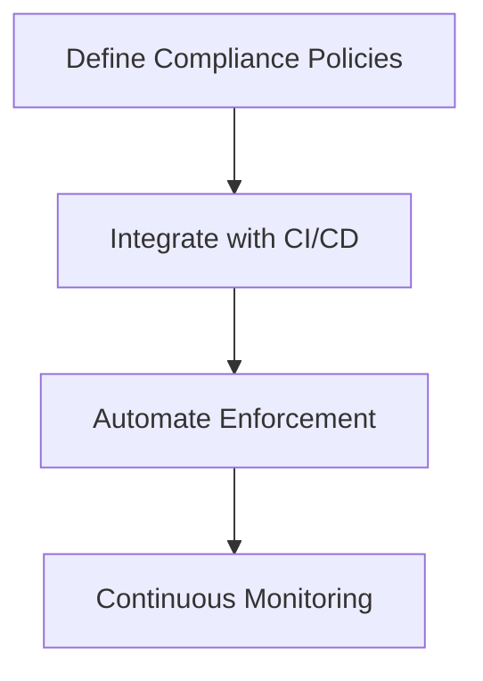

## Introduction to Compliance as Code in DevSecOps

### What is Compliance as Code?

Compliance as Code is a practice within DevSecOps that aims to automate the enforcement of regulatory and organizational compliance requirements throughout the software development lifecycle. This approach leverages infrastructure as code (IaC) principles to ensure that compliance policies are defined, implemented, and enforced consistently across all environments. By treating compliance rules as code, organizations can leverage version control systems, continuous integration/continuous deployment (CI/CD) pipelines, and automated testing to maintain compliance continuously.

### Why is Compliance as Code Important?

Compliance as Code is crucial for several reasons:

1. **Consistency**: Ensures that compliance policies are applied uniformly across all environments, reducing the risk of human error.
2. **Automation**: Automates the enforcement of compliance policies, making it easier to scale and maintain compliance as the organization grows.
3. **Traceability**: Provides a clear audit trail of compliance changes and enforcement, facilitating compliance audits and reporting.
4. **Speed**: Integrates compliance checks into the CI/CD pipeline, allowing issues to be identified and resolved early in the development process.

### How Does Compliance as Code Work?

Compliance as Code works by defining compliance policies as code and integrating them into the CI/CD pipeline. This involves:

1. **Defining Policies**: Writing compliance policies in a machine-readable format (e.g., JSON, YAML).
2. **Integrating with CI/CD**: Incorporating compliance checks into the CI/CD pipeline to automatically validate compliance during the build and deployment phases.
3. **Automated Enforcement**: Using tools to enforce compliance policies and alert developers when violations occur.
4. **Continuous Monitoring**: Continuously monitoring the environment to ensure ongoing compliance.

### Real-World Example: Recent Breaches and Compliance Failures

One notable example of compliance failure leading to a breach is the Capital One data breach in 2019 (CVE-2019-11510). The breach exposed sensitive customer data due to misconfigured AWS S3 buckets. This incident highlights the importance of maintaining strict compliance policies and automating their enforcement to prevent such vulnerabilities.

---
<!-- nav -->
[[DevSecOps/DevSecOps Bootcamp/02-Security Governance & Compliance/01-Applying Compliance as Code in DevSecOps/02-Native CSP Tools/00-Overview|Overview]] | [[02-Applying Compliance as Code in DevSecOps Using Native CSP Tools|Applying Compliance as Code in DevSecOps Using Native CSP Tools]]
