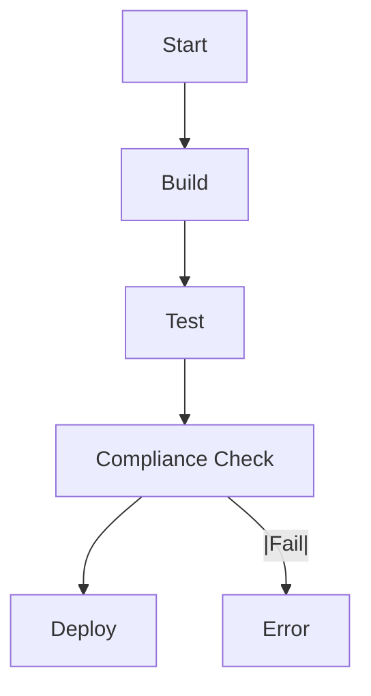

## Introduction to Compliance as Code in DevSecOps

### Background Theory

Compliance as Code (CaC) is a practice that integrates compliance requirements into the software development lifecycle (SDLC) through automated checks and policies. This approach ensures that applications and infrastructure adhere to regulatory standards such as PCI DSS, HIPAA, GDPR, and ISO 27001. By embedding compliance checks into the CI/CD pipeline, organizations can maintain consistent adherence to these standards throughout the development process.

### Key Concepts

#### Governance, Risk, and Compliance (GRC)

Governance, Risk, and Compliance (GRC) refers to the integrated collection of processes, frameworks, methodologies, and technologies that organizations use to ensure they operate effectively, efficiently, and in accordance with laws, regulations, and internal policies. In the context of Wired Brain Coffee, Bob is responsible for ensuring that the company adheres to PCI DSS and ISO 27001 standards.

#### PCI DSS

The Payment Card Industry Data Security Standard (PCI DSS) is a set of security standards designed to ensure that all companies that accept, process, store, or transmit credit card information maintain a secure environment. PCI DSS includes requirements such as:

- **Requirement 1**: Install and maintain a firewall configuration to protect cardholder data.
- **Requirement 2**: Do not use vendor-supplied defaults for system passwords and other security parameters.
- **Requirement 3**: Protect stored cardholder data.
- **Requirement 4**: Encrypt transmission of cardholder data across open, public networks.
- **Requirement 5**: Use and regularly update anti-virus software or programs.
- **Requirement 6**: Develop and maintain secure systems and applications.
- **Requirement 7**: Restrict access to cardholder data by business need-to-know.
- **Requirement 8**: Assign a unique ID to each person with computer access.
- **Requirement 9**: Restrict physical access to cardholder data.
- **Requirement 10**: Track and monitor all access to network resources and cardholder data.
- **Requirement 11**: Regularly test security systems and processes.
- **Requirement 12**: Maintain a policy that addresses information security.

#### ISO 27001

ISO 27001 is an international standard that outlines the requirements for establishing, implementing, maintaining, and continually improving an Information Security Management System (ISMS). It provides a framework for managing sensitive company information such as financial data, intellectual property, employee details, and customer data. Key components of ISO 27001 include:

- **Risk Assessment**: Identifying and assessing risks to information assets.
- **Control Implementation**: Implementing controls to mitigate identified risks.
- **Policy Development**: Developing and maintaining information security policies.
- **Training and Awareness**: Ensuring employees are trained and aware of their roles in information security.

### Scenario Analysis

Wired Brain Coffee is an online coffee retailer that uses a combination of Microsoft Office 365 and Azure for its IT resources. Additionally, the company has a small in-house development team that uses AWS as its cloud service provider. Bob, part of the GRC team, must ensure that all systems are fully compliant with PCI DSS and ISO 27001 standards.

### Challenges

Bob faces several challenges in ensuring compliance:

1. **Manual Checks**: Manually checking every release and configuration is impractical given his limited resources.
2. **Consistency**: Ensuring that compliance checks are performed consistently across different teams and environments.
3. **Scalability**: As the company grows, the number of systems and configurations increases, making manual compliance checks more difficult.

### Solution: Compliance as Code

To address these challenges, Bob can leverage Compliance as Code (CaC) practices within the DevSecOps framework. CaC involves automating compliance checks and integrating them into the CI/CD pipeline. This ensures that compliance requirements are checked automatically and consistently with every change.

### Implementation Steps

#### Step 1: Define Compliance Requirements

First, Bob needs to define the compliance requirements based on PCI DSS and ISO 27001 standards. These requirements should be translated into specific policies and checks that can be automated.

```yaml
# Example Compliance Policy (PCI DSS)
compliance_policy:
  name: PCI_DSS
  requirements:
    - requirement_1: "Install and maintain a firewall configuration to protect cardholder data."
    - requirement_2: "Do not use vendor-supplied defaults for system passwords and other security parameters."
    - requirement_3: "Protect stored cardholder data."
    - requirement_4: "Encrypt transmission of cardholder data across open, public networks."
    - requirement_5: "Use and regularly update anti-virus software or programs."
    - requirement_6: "Develop and maintain secure systems and applications."
    - requirement_7: "Restrict access to cardholder data by business need-to-know."
    - requirement_8: "Assign a unique ID to each person with computer access."
    - requirement_9: "Restrict physical access to cardholder data."
    - requirement_10: "Track and monitor all access to network resources and cardholder data."
    - requirement_11: "Regularly test security systems and processes."
    - requirement_12: "Maintain a policy that addresses information security."
```

#### Step 2: Automate Compliance Checks

Next, Bob needs to automate these compliance checks using tools like Ansible, Terraform, and Open Policy Agent (OPA).

##### Example: Firewall Configuration Check

```ansible
---
- name: Ensure firewall is configured correctly
  hosts: all
  tasks:
    - name: Check firewall rules
      command: iptables -L
      register: firewall_rules
    - name: Fail if firewall rules are not as expected
      fail:
        msg: "Firewall rules are not configured correctly"
      when: "'ACCEPT' not in firewall_rules.stdout"
```

##### Example: Password Policy Check

```ansible
---
- name: Ensure password policy is enforced
  hosts: all
  tasks:
    - name: Check password complexity
      command: grep -i "password_requisite" /etc/pam.d/system-auth
      register: password_complexity
    - name: Fail if password complexity is not enforced
      fail:
        msg: "Password complexity is not enforced"
      when: "'password_requisite' not in password_complexity.stdout"
```

#### Step 3: Integrate Compliance Checks into CI/CD Pipeline

Bob needs to integrate these compliance checks into the CI/CD pipeline using tools like Jenkins, GitLab CI, or CircleCI.

##### Example: Jenkins Pipeline

```groovy
pipeline {
    agent any
    stages {
        stage('Build') {
            steps {
                sh 'make build'
            }
        }
        stage('Test') {
            steps {
                sh 'make test'
            }
        }
        stage('Compliance Check') {
            steps {
                script {
                    def compliance_result = sh(script: 'ansible-playbook compliance-check.yml', returnStatus: true)
                    if (compliance_result != 0) {
                        error 'Compliance check failed'
                    }
                }
            }
        }
        stage('Deploy') {
            steps {
                sh 'make deploy'
            }
        }
    }
}
```

### Mermaid Diagrams

#### Compliance Check Flow



### Pitfalls and Common Mistakes

1. **Overlooking Manual Processes**: Automated compliance checks may miss manual processes that are not captured in the CI/CD pipeline.
2. **Inconsistent Policies**: Different teams may have different interpretations of compliance requirements, leading to inconsistent enforcement.
3. **False Positives/Negatives**: Automated checks may generate false positives or negatives, requiring human intervention to verify results.

### How to Prevent / Defend

#### Detection

1. **Logging and Monitoring**: Implement comprehensive logging and monitoring to detect compliance violations.
2. **Audit Trails**: Maintain audit trails to track changes and identify potential compliance issues.

#### Prevention

1. **Secure Coding Practices**: Train developers in secure coding practices to prevent common vulnerabilities.
2. **Configuration Management**: Use configuration management tools like Ansible and Terraform to enforce consistent configurations.

#### Secure-Coding Fixes

##### Vulnerable Code

```python
# Vulnerable Code: Hardcoded Password
def authenticate(user, password):
    if user == 'admin' and password == 'password':
        return True
    return False
```

##### Fixed Code

```python
# Fixed Code: Environment Variable for Password
import os

def authenticate(user, password):
    if user == 'admin' and password == os.getenv('ADMIN_PASSWORD'):
        return True
    return False
```

#### Configuration Hardening

##### Vulnerable Configuration

```yaml
# Vulnerable Configuration: Default SSH Port
ssh_port: 22
```

##### Hardened Configuration

```yaml
# Hardened Configuration: Non-default SSH Port
ssh_port: 2222
```

### Real-World Examples

#### Recent Breaches

1. **Equifax Breach (2017)**: Equifax suffered a massive data breach due to unpatched vulnerabilities in Apache Struts. This breach highlights the importance of regular patch management and compliance checks.
2. **Capital One Breach (2019)**: Capital One experienced a data breach due to misconfigured AWS S3 buckets. This breach underscores the need for proper configuration management and compliance checks.

### Practice Labs

For hands-on experience with Compliance as Code in DevSecOps, consider the following labs:

- **PortSwigger Web Security Academy**: Offers a variety of labs focused on web application security, including compliance checks.
- **OWASP Juice Shop**: Provides a vulnerable web application for practicing security testing and compliance checks.
- **DVWA (Damn Vulnerable Web Application)**: Another vulnerable web application for practicing security testing and compliance checks.
- **CloudGoat**: Focuses on cloud security and compliance checks in AWS.
- **flaws.cloud**: Provides a cloud-based platform for practicing security testing and compliance checks in various cloud environments.

By leveraging Compliance as Code practices within the DevSecOps framework, Bob can ensure that Wired Brain Coffee maintains consistent adherence to PCI DSS and ISO 27001 standards, even as the company grows and evolves.

---
<!-- nav -->
[[DevSecOps/DevSecOps Bootcamp/02-Security Governance & Compliance/01-Applying Compliance as Code in DevSecOps/03-Scenario/00-Overview|Overview]] | [[02-Multi-Cloud Environment and Compliance as Code in DevSecOps|Multi-Cloud Environment and Compliance as Code in DevSecOps]]
