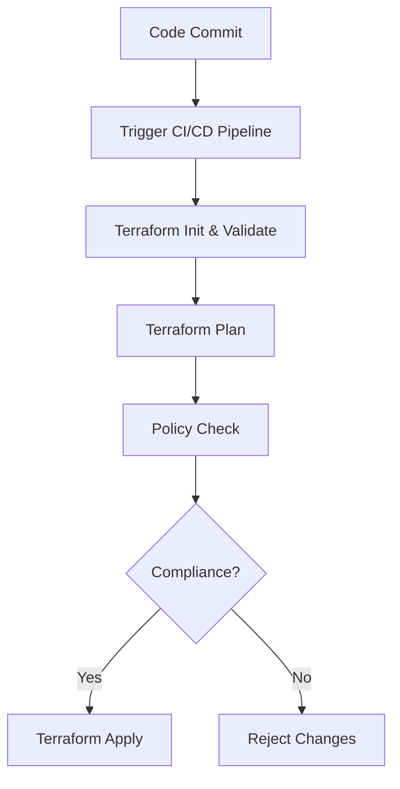

## Multi-Cloud Environment and Compliance as Code in DevSecOps

### Background Theory

In today’s digital landscape, organizations often operate across multiple cloud environments to leverage the strengths of different providers. A common scenario involves using both Microsoft Azure and Amazon Web Services (AWS). This multi-cloud strategy allows businesses to take advantage of specific services, pricing models, and geographic locations offered by each provider.

#### Why Multi-Cloud?

1. **Cost Optimization**: Different cloud providers may offer better pricing for certain services or regions.
2. **Service Availability**: Providers may excel in specific areas such as machine learning, database services, or networking.
3. **Avoid Vendor Lock-In**: Using multiple clouds reduces dependency on a single provider, providing flexibility and reducing risks associated with vendor lock-in.

### Development Team and DevOps Practices

The scenario describes a small development team already using DevOps practices. DevOps emphasizes collaboration between development and operations teams to improve the speed and quality of software delivery. Key principles include:

1. **Continuous Integration (CI)**: Regularly integrating code changes into a shared repository.
2. **Continuous Delivery (CD)**: Automating the deployment process to ensure that code can be released to production at any time.
3. **Infrastructure as Code (IaC)**: Managing and provisioning infrastructure through code, enabling version control and automation.

### Compliance Requirements

Compliance is critical for ensuring that an organization adheres to legal, regulatory, and industry standards. In this scenario, compliance is essential for maintaining cash flow and sales operations. Non-compliance can lead to severe financial penalties, loss of customer trust, and operational disruptions.

#### Recent Real-World Examples

1. **GDPR Violations**: Companies like British Airways and Marriott International faced significant fines for GDPR violations. These incidents highlight the importance of compliance in protecting sensitive data.
2. **HIPAA Breaches**: Healthcare organizations must comply with HIPAA regulations to protect patient data. A breach can result in substantial fines and reputational damage.

### Scaling Compliance Without Adding Headcount

Given the growth plans and limited team size, Bob needs to implement scalable compliance and governance solutions. Compliance as Code (CaC) is a key approach to achieving this goal.

#### What is Compliance as Code?

Compliance as Code involves automating compliance checks and enforcement through code. This ensures that compliance requirements are integrated into the development lifecycle, making it easier to maintain and scale.

### Implementing Compliance as Code

To implement CaC effectively, several steps and tools are necessary:

1. **Define Compliance Policies**: Clearly define the compliance policies that need to be enforced.
2. **Automate Policy Enforcement**: Use tools to automate the enforcement of these policies.
3. **Integrate with CI/CD Pipeline**: Ensure that compliance checks are integrated into the CI/CD pipeline to catch issues early.

#### Tools and Technologies

1. **Terraform**: For managing infrastructure as code.
2. **Pulumi**: Another IaC tool that supports multiple languages.
3. **Open Policy Agent (OPA)**: For defining and enforcing policies.
4. **SonarQube**: For static code analysis and security scanning.
5. **AWS Config and Azure Policy**: For managing compliance in cloud environments.

### Example: Enforcing Compliance Policies in AWS and Azure

Let's walk through an example of how to enforce compliance policies in both AWS and Azure using IaC and policy enforcement tools.

#### Step 1: Define Compliance Policies

For this example, let's assume we need to ensure that all EC2 instances in AWS and VMs in Azure have a specific tag (`Environment` set to `Production`).

```yaml
# AWS Policy Definition
policy:
  name: "tag-enforcement"
  description: "Ensure all EC2 instances have the Environment tag set to Production."
  mode:
    type: "gcp"
    role: "roles/compute.admin"
  rules:
    - if:
        resource.type: "aws_ec2_instance"
        resource.data.tags.Environment != "Production"
      then:
        deny: true
```

```json
// Azure Policy Definition
{
  "if": {
    "allOf": [
      {
        "field": "type",
        "equals": "Microsoft.Compute/virtualMachines"
      },
      {
        "field": "tags['Environment']",
        "notEquals": "Production"
      }
    ]
  },
  "then": {
    "effect": "deny"
  }
}
```

#### Step 2: Integrate with CI/CD Pipeline

We need to integrate these policies into our CI/CD pipeline to ensure that any non-compliant changes are caught early.

```yaml
# Jenkinsfile Example
pipeline {
    agent any
    stages {
        stage('Build') {
            steps {
                sh 'terraform init'
                sh 'terraform validate'
            }
        }
        stage('Test') {
            steps {
                sh 'terraform plan -out=tfplan'
                sh 'terraform show tfplan | grep "Environment = Production"'
            }
        }
        stage('Deploy') {
            steps {
                sh 'terraform apply -auto-approve'
            }
        }
    }
}
```

### Mermaid Diagram: Compliance as Code Workflow



### Common Pitfalls and How to Prevent Them

1. **Incomplete Policy Definitions**: Ensure that policies cover all necessary aspects of compliance.
2. **Manual Overrides**: Avoid manual overrides of compliance checks. Use automated enforcement mechanisms.
3. **False Positives/Negatives**: Regularly review and update policies to minimize false positives/negatives.

### Secure Coding Fixes

#### Vulnerable Code Example

```yaml
# Vulnerable Terraform Configuration
resource "aws_instance" "example" {
  ami           = "ami-0c55b159cbfafe1f0"
  instance_type = "t2.micro"
}
```

#### Secure Code Example

```yaml
# Secure Terraform Configuration
resource "aws_instance" "example" {
  ami           = "ami-0c55b159cbfafe1f0"
  instance_type = "t2.micro"
  tags = {
    Environment = "Production"
  }
}
```

### Detection and Prevention

1. **Regular Audits**: Conduct regular audits to ensure compliance.
2. **Monitoring Tools**: Use monitoring tools to detect non-compliant changes in real-time.
3. **Training and Awareness**: Train the development team on compliance requirements and best practices.

### Hands-On Labs

For practical experience, consider the following labs:

1. **PortSwigger Web Security Academy**: Focuses on web application security but also covers compliance-related topics.
2. **OWASP Juice Shop**: A deliberately insecure web application for practicing security testing.
3. **CloudGoat**: Provides scenarios for practicing cloud security and compliance in AWS.
4. **Pacu**: A framework for AWS security assessments, useful for understanding compliance in AWS.

By implementing Compliance as Code and integrating it into your CI/CD pipeline, you can ensure that your multi-cloud environment remains compliant and secure, even as your organization grows.

---
<!-- nav -->
[[DevSecOps/DevSecOps Bootcamp/02-Security Governance & Compliance/01-Applying Compliance as Code in DevSecOps/03-Scenario/01-Introduction to Compliance as Code in DevSecOps|Introduction to Compliance as Code in DevSecOps]] | [[DevSecOps/DevSecOps Bootcamp/02-Security Governance & Compliance/01-Applying Compliance as Code in DevSecOps/03-Scenario/00-Overview|Overview]] | [[DevSecOps/DevSecOps Bootcamp/02-Security Governance & Compliance/01-Applying Compliance as Code in DevSecOps/03-Scenario/03-Practice Questions & Answers|Practice Questions & Answers]]
