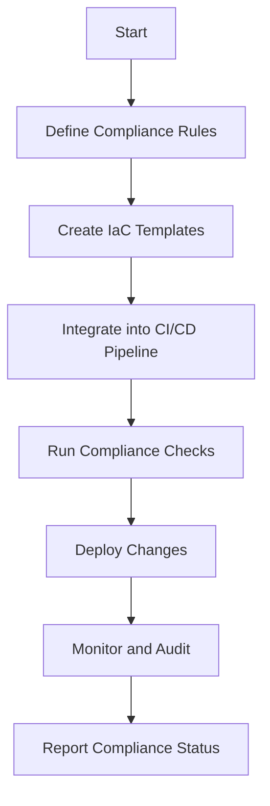
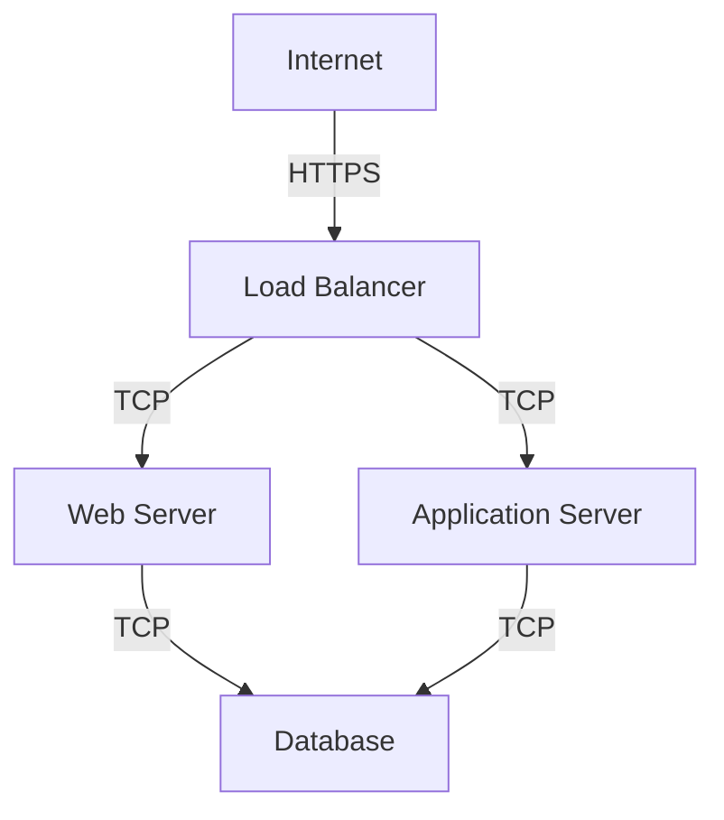

## Introduction to Compliance as Code in DevSecOps

### What is Compliance as Code?

Compliance as Code (CaC) is an approach to ensuring that systems and applications comply with regulatory requirements and internal policies through automation and continuous integration. In essence, CaC treats compliance rules and regulations as code that can be version-controlled, tested, and deployed alongside application code. This ensures that compliance is not an afterthought but an integral part of the development lifecycle.

### Why is Compliance as Code Important?

Compliance is critical for organizations to avoid legal penalties, maintain trust with customers, and ensure data privacy. Traditional compliance approaches often involve manual processes, which can be error-prone and time-consuming. By treating compliance as code, organizations can automate these processes, making them more efficient and less prone to human error.

### How Does Compliance as Code Work?

The core idea behind CaC is to define compliance rules in a machine-readable format, such as YAML or JSON, and then integrate these rules into the CI/CD pipeline. This allows compliance checks to be performed automatically whenever changes are made to the codebase. If a change violates a compliance rule, the pipeline can be halted, preventing non-compliant code from being deployed.

### Example Scenario: Wired Brain Coffee Company

Let's consider the scenario of the Wired Brain Coffee Company, a fictional company that wants to implement CaC to ensure compliance with various regulations, such as GDPR and HIPAA. The company uses AWS as its cloud service provider and wants to leverage both native AWS controls and open-source tools to enforce compliance.

### Using Native Controls from Cloud Service Providers

Cloud service providers like AWS offer a variety of native controls that can be used to enforce compliance. These controls include:

- **IAM Policies**: Define who can access what resources within the cloud environment.
- **Security Groups**: Control inbound and outbound traffic to instances.
- **Network ACLs**: Provide additional control over network traffic at the subnet level.
- **Encryption**: Ensure data is encrypted both at rest and in transit.

#### Example: IAM Policy for AWS

```json
{
    "Version": "2012-10-17",
    "Statement": [
        {
            "Effect": "Allow",
            "Action": [
                "s3:GetObject",
                "s3:PutObject"
            ],
            "Resource": "arn:aws:s3:::wired-brain-coffee/*"
        }
    ]
}
```

This IAM policy allows users to read and write objects to the `wired-brain-coffee` S3 bucket. By defining such policies, the company can ensure that only authorized users can access sensitive data.

### Open Source Tools for Compliance Enforcement

Open-source tools can be used to enforce compliance across different cloud environments. Some popular tools include:

- **Terraform**: Infrastructure as Code (IaC) tool that can enforce compliance rules.
- **Ansible**: Configuration management tool that can enforce compliance policies.
- **Puppet**: Another configuration management tool that supports compliance enforcement.
- **SonarQube**: Static code analysis tool that can identify security vulnerabilities.

#### Example: Terraform Configuration for AWS

```hcl
provider "aws" {
  region = "us-west-2"
}

resource "aws_s3_bucket" "wired_brain_coffee" {
  bucket = "wired-brain-coffee"
  acl    = "private"

  server_side_encryption_configuration {
    rule {
      apply_server_side_encryption_by_default {
        sse_algorithm = "AES256"
      }
    }
  }
}
```

This Terraform configuration creates an S3 bucket with server-side encryption enabled. By using Terraform, the company can ensure that all S3 buckets are created with encryption enabled, thus complying with data protection regulations.

### Starting Small and Expanding Continuously

Implementing CaC can be a complex process, especially for large organizations. Therefore, it is recommended to start small and gradually expand the scope of compliance enforcement. Here’s a step-by-step approach:

1. **Identify Key Compliance Requirements**: Determine the most critical compliance requirements that need to be enforced.
2. **Choose Initial Tools and Controls**: Select the tools and controls that will be used to enforce these requirements.
3. **Automate Compliance Checks**: Integrate compliance checks into the CI/CD pipeline.
4. **Monitor and Audit**: Regularly monitor and audit the compliance status to ensure ongoing compliance.
5. **Expand Scope Gradually**: As the initial implementation proves successful, gradually expand the scope to cover more compliance requirements.

### Real-World Examples and Breaches

#### Example: Equifax Data Breach (CVE-2017-5638)

In 2017, Equifax suffered a massive data breach that exposed the personal information of over 143 million people. One of the key factors contributing to this breach was the lack of proper compliance enforcement. Equifax failed to patch a known vulnerability in Apache Struts, which allowed attackers to gain unauthorized access to their systems.

#### Example: Capital One Data Breach (CVE-2019-11510)

In 2019, Capital One suffered a data breach that exposed the personal information of over 100 million customers. The breach occurred due to a misconfigured web application firewall (WAF) that allowed an attacker to access sensitive data. This breach highlights the importance of proper configuration management and compliance enforcement.

### How to Prevent / Defend Against Compliance Violations

#### Detection

To detect compliance violations, organizations should implement continuous monitoring and auditing mechanisms. This includes:

- **Logging and Monitoring**: Implement centralized logging and monitoring solutions to track compliance-related events.
- **Automated Audits**: Use automated tools to perform regular audits of compliance status.

#### Prevention

To prevent compliance violations, organizations should:

- **Enforce Strong Access Controls**: Use IAM policies, security groups, and network ACLs to enforce strong access controls.
- **Encrypt Data**: Ensure that data is encrypted both at rest and in transit.
- **Patch Management**: Regularly update and patch systems to address known vulnerabilities.

#### Secure Coding Fixes

Here’s an example of a vulnerable code snippet and its secure counterpart:

**Vulnerable Code:**

```python
import boto3

def upload_file(file_name, bucket):
    s3_client = boto3.client('s3')
    s3_client.upload_file(file_name, bucket, file_name)
```

**Secure Code:**

```python
import boto3

def upload_file(file_name, bucket):
    s3_client = boto3.client('s3', config=boto3.session.Config(signature_version='s3v4'))
    s3_client.upload_file(file_name, bucket, file_name, ExtraArgs={'ServerSideEncryption': 'AES256'})
```

In the secure code, the `upload_file` function now specifies server-side encryption using AES256, ensuring that the uploaded files are encrypted.

### Complete Example: Full HTTP Request and Response

Here’s an example of a full HTTP request and response for a compliance check:

**HTTP Request:**

```http
POST /api/compliance/check HTTP/1.1
Host: wired-brain-coffee.com
Content-Type: application/json
Authorization: Bearer <access_token>

{
    "resource": "arn:aws:s3:::wired-brain-coffee",
    "policy": {
        "Version": "2012-10-17",
        "Statement": [
            {
                "Effect": "Allow",
                "Action": [
                    "s3:GetObject",
                    "s3:PutObject"
                ],
                "Resource": "arn:aws:s3:::wired-brain-coffee/*"
            }
        ]
    }
}
```

**HTTP Response:**

```http
HTTP/1.1 200 OK
Content-Type: application/json

{
    "status": "compliant",
    "message": "The resource is compliant with the specified policy."
}
```

### Mermaid Diagrams

#### Compliance as Code Workflow



#### Network Topology



### Hands-On Labs

For hands-on practice with Compliance as Code, consider the following labs:

- **PortSwigger Web Security Academy**: Offers a wide range of labs covering various aspects of web security, including compliance.
- **OWASP Juice Shop**: A deliberately insecure web application for security training.
- **DVWA (Damn Vulnerable Web Application)**: A PHP/MySQL web application that is riddled with vulnerabilities.
- **WebGoat**: An interactive, gamified training application for learning about web application security.

These labs provide practical experience in implementing and enforcing compliance rules in a controlled environment.

### Conclusion

By treating compliance as code, organizations can automate compliance enforcement, making it more efficient and less prone to human error. The Wired Brain Coffee Company scenario demonstrates how native cloud controls and open-source tools can be used to enforce compliance. Starting small and expanding continuously is a recommended approach to implementing CaC. Real-world examples and breaches highlight the importance of proper compliance enforcement. By following the steps outlined in this chapter, organizations can ensure that their systems and applications remain compliant with regulatory requirements and internal policies.

---
<!-- nav -->
[[DevSecOps/DevSecOps Bootcamp/02-Security Governance & Compliance/01-Applying Compliance as Code in DevSecOps/05-Module Summary and Further Learning/00-Overview|Overview]] | [[02-Applying Compliance as Code in DevSecOps|Applying Compliance as Code in DevSecOps]]
