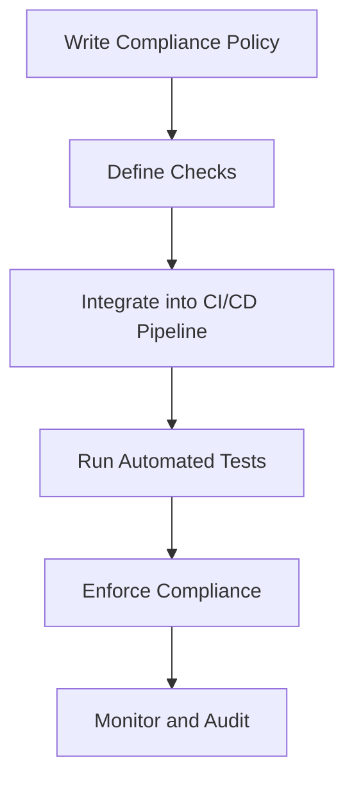

## Applying Compliance as Code in DevSecOps

### Introduction to Compliance as Code

Compliance as Code is an approach to ensuring that your infrastructure and applications adhere to regulatory requirements and internal policies through automated checks and enforcement mechanisms. This method leverages Infrastructure as Code (IaC) practices to define compliance rules and continuously validate them against the actual state of your systems.

#### What is Compliance as Code?

Compliance as Code involves using code to define and enforce compliance policies. Instead of manually checking configurations and settings, you can automate these checks using tools and scripts. This ensures that your systems remain compliant throughout their lifecycle, reducing the risk of non-compliance and associated penalties.

#### Why is Compliance as Code Important?

In today’s fast-paced DevOps environment, manual compliance checks are often impractical and error-prone. Compliance as Code allows you to integrate compliance checks into your continuous integration and delivery (CI/CD) pipelines, ensuring that compliance is maintained at every stage of development and deployment.

#### How Does Compliance as Code Work?

Compliance as Code typically involves the following steps:

1. **Define Policies**: Write compliance policies in code using a declarative language.
2. **Automate Checks**: Integrate these policies into your CI/CD pipeline to automatically check compliance during builds and deployments.
3. **Enforce Policies**: Automatically enforce compliance by failing builds or deployments if policies are not met.
4. **Monitor and Audit**: Continuously monitor and audit your systems to ensure ongoing compliance.

### Background Theory

To understand Compliance as Code, it’s essential to grasp the underlying principles of Infrastructure as Code (IaC) and Continuous Integration/Continuous Delivery (CI/CD).

#### Infrastructure as Code (IaC)

IaC is the practice of managing and provisioning infrastructure through machine-readable definition files, rather than physical hardware configuration or interactive configuration tools. This approach allows you to treat infrastructure like software, enabling version control, testing, and automation.

#### Continuous Integration/Continuous Delivery (CI/CD)

CI/CD is a set of practices for the reliable release of software. Continuous Integration involves regularly merging code changes into a shared repository and running automated tests to catch integration issues early. Continuous Delivery extends this by ensuring that the software can be released to production at any time through automated deployment processes.

### Real-World Examples

Recent real-world examples highlight the importance of Compliance as Code:

#### Example 1: GDPR Compliance

The General Data Protection Regulation (GDPR) requires organizations to implement robust data protection measures. Compliance as Code can help ensure that data handling practices meet GDPR requirements by automating compliance checks and enforcing policies.

```yaml
# Example of a compliance policy in YAML
policies:
  - name: gdpr_compliance
    description: Ensure GDPR compliance for data handling
    checks:
      - type: data_encryption
        parameters:
          encryption_algorithm: AES-256
      - type: access_control
        parameters:
          allowed_users: ["admin", "data_manager"]
```

#### Example 2: PCI DSS Compliance

Payment Card Industry Data Security Standard (PCI DSS) mandates specific security controls for organizations handling credit card information. Compliance as Code can help ensure that these controls are implemented and maintained.

```json
{
  "policy": {
    "name": "pci_dss_compliance",
    "description": "Ensure PCI DSS compliance for payment processing",
    "checks": [
      {
        "type": "encryption",
        "parameters": {
          "algorithm": "AES-256"
        }
      },
      {
        "type": "access_control",
        "parameters": {
          "allowed_users": ["payment_processor"]
        }
      }
    ]
  }
}
```

### Complete Code Examples

Let’s look at a complete example of how Compliance as Code can be implemented using a tool like `Terraform` and `InSpec`.

#### Terraform Configuration

```hcl
provider "aws" {
  region = "us-west-2"
}

resource "aws_security_group" "example" {
  name        = "example"
  description = "Example security group"

  ingress {
    from_port   = 22
    to_port     = 22
    protocol    = "tcp"
    cidr_blocks = ["0.0.0.0/0"]
  }

  egress {
    from_port   = 0
    to_port     = 0
    protocol    = "-1"
    cidr_blocks = ["0.0.0.0/0"]
  }
}
```

#### InSpec Compliance Check

```ruby
control 'sg-01' do
  title 'Security Group should not allow SSH from anywhere'
  describe aws_security_groups do
    its('security_groups') { should_not include('sg-01') }
  end
end
```

### Mermaid Diagrams

#### Compliance as Code Workflow



### Pitfalls and Common Mistakes

#### Overlooking Policy Updates

One common mistake is failing to update compliance policies as regulations change. It’s crucial to keep your policies up-to-date and revalidate them regularly.

#### Incomplete Coverage

Another pitfall is having incomplete coverage in your compliance checks. Ensure that all relevant aspects of your infrastructure are covered by your policies.

### How to Prevent / Defend

#### Detection

Use automated tools to continuously monitor your systems for compliance violations. Tools like `InSpec`, `Puppet`, and `Ansible` can help detect non-compliance issues.

#### Prevention

Integrate compliance checks into your CI/CD pipeline to fail builds or deployments if policies are not met. This ensures that compliance is maintained at every stage of development and deployment.

#### Secure Coding Fixes

Compare the vulnerable and secure versions of a compliance policy:

**Vulnerable Version**

```yaml
policies:
  - name: data_protection
    description: Ensure data is protected
    checks:
      - type: data_encryption
        parameters:
          encryption_algorithm: AES-128
```

**Secure Version**

```yaml
policies:
  - name: data_protection
    description: Ensure data is protected
    checks:
      - type: data_encryption
        parameters:
          encryption_algorithm: AES-256
```

#### Configuration Hardening

Harden your system configurations to ensure compliance. For example, configure your security groups to restrict access to necessary ports only.

### Conclusion

Compliance as Code is a powerful approach to ensuring that your infrastructure and applications adhere to regulatory requirements and internal policies. By integrating compliance checks into your CI/CD pipeline, you can maintain compliance throughout the development and deployment lifecycle. This reduces the risk of non-compliance and associated penalties, ensuring that your systems remain secure and compliant.

### Practice Labs

For hands-on experience with Compliance as Code, consider the following labs:

- **PortSwigger Web Security Academy**: Focuses on web application security but includes modules on compliance and regulatory requirements.
- **OWASP Juice Shop**: A deliberately insecure web application for security training. It includes challenges related to compliance and regulatory requirements.
- **CloudGoat**: A series of labs designed to teach cloud security concepts, including compliance as code practices.

These labs provide practical experience in applying Compliance as Code principles to real-world scenarios, helping you master this critical aspect of DevSecOps.

---
<!-- nav -->
[[DevSecOps/DevSecOps Bootcamp/02-Security Governance & Compliance/01-Applying Compliance as Code in DevSecOps/05-Module Summary and Further Learning/01-Introduction to Compliance as Code in DevSecOps|Introduction to Compliance as Code in DevSecOps]] | [[DevSecOps/DevSecOps Bootcamp/02-Security Governance & Compliance/01-Applying Compliance as Code in DevSecOps/05-Module Summary and Further Learning/00-Overview|Overview]] | [[DevSecOps/DevSecOps Bootcamp/02-Security Governance & Compliance/01-Applying Compliance as Code in DevSecOps/05-Module Summary and Further Learning/03-Practice Questions & Answers|Practice Questions & Answers]]
