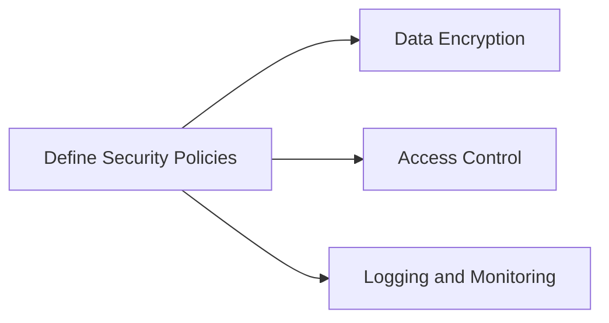

## Security Governance and Compliance in DevSecOps

### Introduction to Security Governance

Security governance is the overall management approach through which senior executives direct and control the entire organization. This encompasses the strategic planning, decision-making processes, and oversight mechanisms that ensure the organization operates securely and meets its security objectives. The primary goal of security governance is to establish a framework that guides the organization’s security posture, ensuring that security is integrated into all aspects of business operations.

#### What is Security Governance?

Security governance involves setting policies, procedures, and guidelines that dictate how an organization should manage its security risks. It includes:

- **Strategic Planning:** Defining the security goals and objectives that align with the organization’s overall strategy.
- **Policy Development:** Creating comprehensive security policies that cover various aspects such as data protection, access control, incident response, etc.
- **Risk Management:** Identifying, assessing, and mitigating security risks to protect the organization’s assets.
- **Compliance Monitoring:** Ensuring that the organization adheres to relevant laws, regulations, and industry standards.

#### Why is Security Governance Important?

Security governance is crucial because it provides a structured approach to managing security risks. Without proper governance, organizations may face significant vulnerabilities that can lead to data breaches, financial losses, and reputational damage. Effective governance ensures that security is not treated as an afterthought but is integrated into the core operations of the organization.

#### How Does Security Governance Work?

Security governance typically involves several key components:

- **Governance Framework:** A set of principles, policies, and procedures that guide the organization’s security practices.
- **Risk Assessment:** Regularly evaluating potential security threats and vulnerabilities.
- **Compliance Monitoring:** Ensuring adherence to relevant laws, regulations, and industry standards.
- **Incident Response:** Having a plan in place to respond to security incidents effectively.

### Compliance: Conforming to Stated Requirements

Compliance refers to the act of conforming to stated requirements, such as laws, regulations, contracts, and policies. While governance sets the overall direction and framework for security, compliance ensures that the organization adheres to specific rules and standards.

#### What is Compliance?

Compliance involves following established rules and regulations that govern how an organization should operate. These rules can come from various sources, including:

- **Laws and Regulations:** Government-imposed laws and regulations that organizations must follow.
- **Industry Standards:** Best practices and standards set by industry bodies.
- **Internal Policies:** Internal policies and procedures developed by the organization itself.

#### Why is Compliance Important?

Compliance is essential because it helps organizations avoid legal penalties, fines, and reputational damage. By adhering to relevant laws and regulations, organizations can ensure that they are operating within the bounds of the law and maintaining trust with their stakeholders.

#### How Does Compliance Work?

Compliance typically involves:

- **Identifying Relevant Laws and Regulations:** Understanding which laws and regulations apply to the organization.
- **Developing Compliance Programs:** Creating programs and procedures to ensure compliance.
- **Regular Audits:** Conducting regular audits to verify compliance.
- **Corrective Actions:** Taking corrective actions to address any non-compliance issues.

### Distinguishing Between Governance and Compliance

While governance and compliance are related, they serve different purposes. Governance provides the overarching framework for managing security risks, whereas compliance ensures that the organization adheres to specific rules and standards.

#### Example: Tax Compliance vs. Financial Governance

Consider the example of tax compliance. An organization can be fully compliant with filing its taxes each year, but the quality or integrity of those tax returns may be poor due to inadequate financial governance. In other words, compliance alone does not guarantee good governance.

### My Approach to Security Audits

To ensure effective security governance and compliance, it is essential to have a structured approach to security audits. Here is a runbook that outlines the steps involved in preparing for and conducting a security audit:

#### Step-by-Step Runbook for Security Audits

1. **Preparation:**
   - **Identify Audit Scope:** Determine the scope of the audit, including the systems, processes, and data to be audited.
   - **Gather Documentation:** Collect all relevant documentation, such as policies, procedures, and system configurations.
   - **Prepare Evidence:** Gather evidence that demonstrates compliance with security policies and procedures.

2. **Conducting the Audit:**
   - **Perform Risk Assessments:** Evaluate potential security risks and vulnerabilities.
   - **Review Policies and Procedures:** Ensure that policies and procedures are up-to-date and aligned with organizational goals.
   - **Test Controls:** Verify that security controls are functioning as intended.

3. **Post-Audit Activities:**
   - **Document Findings:** Document all findings, including any non-compliance issues.
   - **Develop Action Plan:** Create an action plan to address any identified issues.
   - **Follow-Up:** Conduct follow-up audits to ensure that corrective actions have been implemented.

### Automating Compliance in DevSecOps

Automating compliance is a critical aspect of DevSecOps. By integrating security governance and compliance into the development lifecycle, organizations can ensure that security is not an afterthought but is built into the fabric of their operations.

#### Benefits of Automating Compliance

- **Scalability:** Automation allows organizations to scale their compliance efforts efficiently.
- **Consistency:** Automated processes ensure consistent application of security policies and procedures.
- **Legal Obligations:** Automation helps ensure that organizations meet their legal obligations by automating compliance checks.

#### How to Integrate Security Governance and Compliance into DevSecOps

Integrating security governance and compliance into DevSecOps involves several key steps:

1. **Define Security Policies:** Develop comprehensive security policies that align with organizational goals.
2. **Implement Automated Checks:** Use tools and scripts to automate compliance checks during the development process.
3. **Continuous Monitoring:** Implement continuous monitoring to detect and address security issues in real-time.
4. **Automate Remediation:** Automate the remediation process to address any identified issues quickly.

### Real-World Examples of Compliance and Governance

#### Recent Breaches and CVEs

Several recent breaches and CVEs highlight the importance of effective security governance and compliance:

- **Equifax Data Breach (2017):** Equifax suffered a massive data breach that exposed sensitive information of millions of customers. The breach was attributed to a failure to patch a known vulnerability, highlighting the importance of compliance with security patches and updates.
- **Capital One Data Breach (2019):** Capital One experienced a data breach that exposed the personal information of over 100 million customers. The breach was caused by a misconfigured firewall, emphasizing the need for robust governance and compliance practices.

### Complete Example: Automating Compliance Checks

Let’s walk through a complete example of automating compliance checks using a hypothetical scenario involving a web application.

#### Scenario: Web Application Compliance Check

Suppose we have a web application that needs to comply with the Payment Card Industry Data Security Standard (PCI DSS). We want to automate compliance checks to ensure that the application meets the required standards.

##### Step 1: Define Security Policies

First, we define the security policies that the application must adhere to. For PCI DSS compliance, the policies might include:

- **Data Encryption:** All sensitive data must be encrypted both in transit and at rest.
- **Access Control:** Access to sensitive data must be restricted to authorized personnel only.
- **Logging and Monitoring:** All access to sensitive data must be logged and monitored.



##### Step 2: Implement Automated Checks

Next, we implement automated checks to verify compliance with the defined policies. We can use tools like `Trivy` and `tfsec` to perform static analysis on the application code and infrastructure as code (IaC) files.

```bash
# Install Trivy
curl -sfL https://raw.githubusercontent.com/aquasecurity/trivy/main/install.sh | sh -s -- -b /usr/local/bin

# Scan application code for vulnerabilities
trivy image my-webapp:latest

# Install tfsec
go install github.com/aquasecurity/tfsec/cmd/tfsec@latest

# Scan IaC files for compliance issues
tfsec ./infrastructure
```

##### Step 3: Continuous Monitoring

We set up continuous monitoring to detect and address any compliance issues in real-time. We can use tools like `Prometheus` and `Grafana` to monitor the application and alert on any deviations from the defined policies.

```yaml
# Prometheus configuration
scrape_configs:
  - job_name: 'webapp'
    static_configs:
      - targets: ['localhost:8080']

# Grafana dashboard
{
  "title": "WebApp Compliance Dashboard",
  "panels": [
    {
      "type": "stat",
      "title": "Encryption Compliance",
      "datasource": "Prometheus",
      "targets": [
        { "expr": 'encryption_compliance' }
      ]
    },
    {
      "type": "stat",
      "title": "Access Control Compliance",
      "datasource": "Prometheus",
      "targets": [
        { "expr": 'access_control_compliance' }
      ]
    },
    {
      "type": "stat",
      "title": "Logging and Monitoring Compliance",
       "datasource": "Prometheus",
      "targets": [
        { "expr": 'logging_monitoring_compliance' }
      ]
    }
  ]
}
```

##### Step 4: Automate Remediation

Finally, we automate the remediation process to address any identified issues quickly. We can use tools like `Ansible` to automate the deployment of security patches and updates.

```yaml
# Ansible playbook
---
- name: Apply security patches
  hosts: all
  tasks:
    - name: Update package lists
      apt:
        update_cache: yes
    - name: Upgrade installed packages
      apt:
        upgrade: dist
    - name: Apply security patches
      apt:
        name: "{{ item }}"
        state: latest
      loop:
        - openssl
        - libssl-dev
```

### How to Prevent / Defend Against Compliance Issues

To prevent and defend against compliance issues, organizations should implement the following measures:

#### Detection

- **Regular Audits:** Conduct regular audits to identify any compliance issues.
- **Continuous Monitoring:** Implement continuous monitoring to detect deviations from defined policies in real-time.

#### Prevention

- **Policy Development:** Develop comprehensive security policies that align with organizational goals.
- **Automated Checks:** Implement automated checks to verify compliance with defined policies.
- **Training and Awareness:** Provide training and awareness programs to ensure that employees understand their roles in maintaining compliance.

#### Secure Coding Fixes

Here is an example of a vulnerable code snippet and its secure counterpart:

##### Vulnerable Code: Insecure Data Storage

```python
# Vulnerable code
import json

data = {"username": "admin", "password": "password123"}
with open("data.json", "w") as f:
    json.dump(data, f)
```

##### Secure Code: Encrypted Data Storage

```python
# Secure code
import json
from cryptography.fernet import Fernet

key = Fernet.generate_key()
cipher_suite = Fernet(key)

data = {"username": "admin", "password": "password123"}
encrypted_data = cipher_suite.encrypt(json.dumps(data).encode())

with open("data.json", "wb") as f:
    f.write(encrypted_data)
```

#### Configuration Hardening

Here is an example of a vulnerable configuration and its hardened counterpart:

##### Vulnerable Configuration: Open Firewall Rules

```json
{
  "firewall": {
    "rules": [
      {
        "source": "0.0.0.0/0",
        "destination": "192.168.1.0/24",
        "action": "allow"
      }
    ]
  }
}
```

##### Hardened Configuration: Restricted Firewall Rules

```json
{
  "firewall": {
    "rules": [
      {
        "source": "192.168.0.0/16",
        "destination": "192.168.1.0/24",
        "action": "allow"
      }
    ]
  }
}
```

### Conclusion

In conclusion, applying compliance as code in DevSecOps is essential for ensuring that organizations maintain a strong security posture. By integrating security governance and compliance into the development lifecycle, organizations can achieve scalability, consistency, and legal compliance. Through automation, continuous monitoring, and secure coding practices, organizations can effectively prevent and defend against compliance issues.

### Practice Labs

For hands-on experience with applying compliance as code in DevSecOps, consider the following practice labs:

- **PortSwigger Web Security Academy:** Focuses on web application security and includes modules on compliance and governance.
- **OWASP Juice Shop:** A deliberately insecure web application for practicing security testing and compliance.
- **DVWA (Damn Vulnerable Web Application):** Another intentionally vulnerable web application for learning security concepts.
- **CloudGoat:** A cloud security training platform that covers compliance and governance in cloud environments.
- **flaws.cloud:** A cloud security training platform that includes modules on compliance and governance.

By engaging with these practice labs, you can gain practical experience in applying compliance as code in DevSecOps and enhance your skills in securing modern applications.

---
<!-- nav -->
[[DevSecOps/DevSecOps Bootcamp/02-Security Governance & Compliance/01-Applying Compliance as Code in DevSecOps/Course Summary/07-Practice Labs|Practice Labs]] | [[DevSecOps/DevSecOps Bootcamp/02-Security Governance & Compliance/01-Applying Compliance as Code in DevSecOps/Course Summary/00-Overview|Overview]] | [[DevSecOps/DevSecOps Bootcamp/02-Security Governance & Compliance/01-Applying Compliance as Code in DevSecOps/Course Summary/09-Testing Phase|Testing Phase]]
